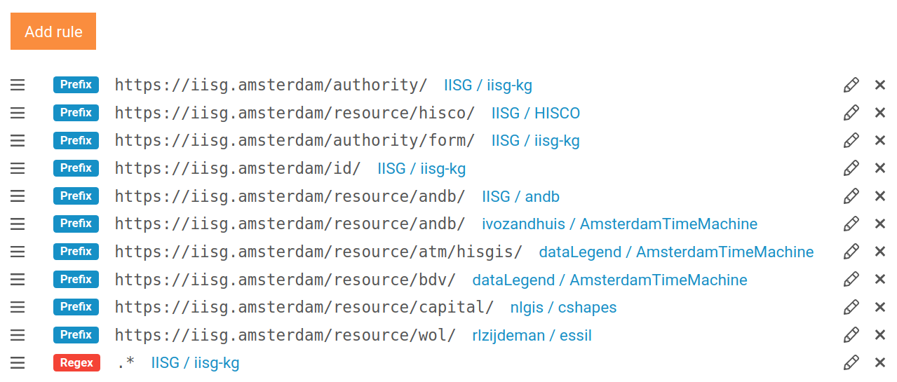

In our first blog post we look back at some of the core features that were added to TriplyDB over the last couple of months.  TriplyDB is a new and fast-moving Linked Data Knowledge Graph product.  Read more about TriplyDB over at <https://triply.cc>.  Many of the here described features were developed in collaboration with our great customers.

## §1 Metadata for all!

Metadata is where Linked Data shines.  Unfortunately, many Linked Data products make it difficult to enter and maintain up-to-date metadata information.  TriplyDB now automatically generates metadata for every entity that is stored in the database.  See Figure 1 for an example.  Besides automatically generated metadata, TriplyDB also offers an easy-to-use web UI where users can specify additional metadata at the dataset, user, organization, and data catalog level.

TriplyDB metadata is automatically exposed in a standards-compliant format ([DCAT2](https://www.w3.org/TR/vocab-dcat-2)) that implements several of the [FAIR](https://www.go-fair.org) principles.  At the same time, TriplyDB exposes metadata that is interpreted by popular search engines and social media platforms ([Schema.org](https://schema.org), [Open Graph Protocol](https://ogp.me)), which allows data to be easily found on the web.  For example, Figure 2 shows how a TriplyDB dataset is indexed by Google.

## §2 Better browsing

Browsing Knowledge Graphs now looks better and is more snappy than ever before: TriplyDB comes with a Graph Browser that has been proven to scale to **very large graphs** (billions of edges).  By implementing Semantic Intelligence, the Triply Graph Browser is able to understand the meaning of the data, and apply appropriate visualizations.  For example, <code>foaf:depiction</code> can be shown as a picture, <code>geo:hasGeometry</code> can be displayed on a map (see Figure 3).

## §3 Up to speed

TriplyDB has a very snappy web UI.  Gone are the performance issues that are common in other Linked Data products.  Over the last couple of months we have increased TriplyDB performance in the following ways:

  - Images are now served over a **built-in image proxy**.  This reduces page loads for datasets that contain high-resolution images with up to 90%.
  - By adopting [Node.js Cluster](), TriplyDB is able to process user requests **in parallel**, resulting in better browsing performance overall.
  - By adopting [WebPack]() for **server-side rendering**, TriplyDB is able to reduce the time it takes to display pages in the web browser.
  - By re-engineered its database model, TriplyDB now needs to perform **fewer database lookups** for common tasks, resulting in better performance overall.
  - The JavaScript bundle size for TriplyDB was reduced by 30%, resulting a **faster time-to-first-paint**.

## §4 More Fun With SPARQL

SPARQL is the standardized query language for Linked Data Knowledge Graphs.  With every new release, TriplyDB makes working with SPARQL queries more efficient:

  - Triply introduces Saved Queries, a feature that allows users to store graph queries together with their visualization and metadata.
  - It is now possible to store different versions of the same query.  Like code, queries can now be improved over time.
  - Queries with temporal results can now be visualized on an interactive timeline (see Figure 4; [run query](https://triplydb.com/wikimedia/dbpedia/queries/timeline-cars)).
  - Queries with statistical results can now be visualized in an interactive Pivot Table.
  - The ability to add metadata to a query.
  - The SPARQL IDE now allows developers to inspected and downloaded raw result sets in JSON.

## §5 Dereferencing

One of the crucial features of Linked Data is that entities in the database are identified by URLs that can be entered in a web browser for easy lookup.  TriplyDB now includes an easy-to-use web UI that allows administrators to define rules for dereferencing URLs.  These rules determine which URLs dereference to which dataset in TriplyDB (see Figure 5).

## §6 In control

TriplyDB keeps adding more advanced tools that put the data administrator in the driver's seat.  In our newest release, administrators are given a ‘God's eye view’ of all Knowledge Graph processes and services that are running within an organization.  Administrators are also able to tweak the amount of memory that is administered to each individual Knowledge Graph service.

## §7 Small Pleasantries

Those were the big ones!  There are also 100+ smaller features that have been added at the same time.  Here we lift out some of our favorite smaller features:

  - Users and organizations can now ‘pin’ their most important datasets, so that they are more visible to visitors.
  - SPARQL services are now able to efficiently synchronize to changes in the underlying dataset.
  - The UI for setting API token access levels was completely redesigned.
  - Descriptions for datasets, users, organizations, and data catalogs now supports [Markdown](https://github.com/adam-p/markdown-here/wiki/Markdown-Cheatsheet) headings, links, lists, and textual markup.
  - It is now possible to upload data in the RDF/XML serialization format.
  - It is now possible to upload data in more encodings (e.g., UTF-16 with Byte Order Mark), and in more compression formats (e.g., Bzip2).

## §8 Closing remarks

That was a long list for a first blog post!  Have you grown tired of your current triple store, or are you just getting started in the world of Linked Data?  Take a look at TriplyDB over at <https://triply.cc> or contact us at <mailto:info@triply.cc>.
