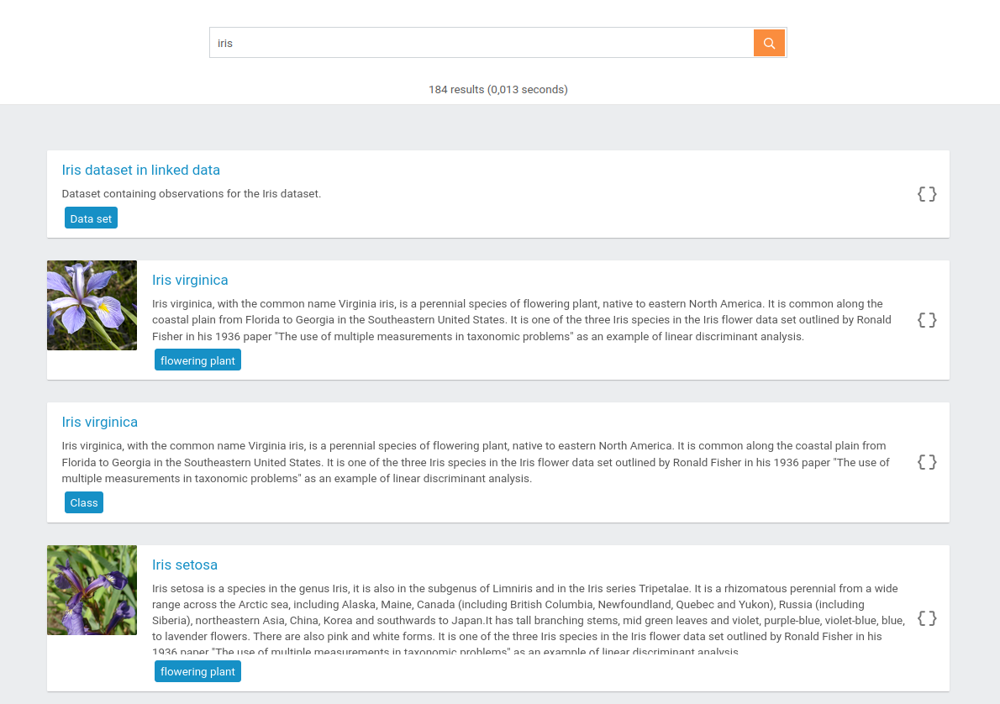

Hello everybody! It’s been quite a while since we described new TriplyDB features, and you may wonder what we have been up to in the meantime. TriplyDB is a groundbreaking and fast-moving linked data product and we are continuously improving user experience by developing new features in close collaboration with our customers. Let us introduce some of our coolest new features that we recently released: 

## Faster data uploading and a progress bar 

Uploading data to TriplyDB was already quite fast in the past, but we saw some room for improvement because the previous procedure took several processing steps. As efficiency is at the very top of our priority list, we have worked hard to make data uploading even faster by redesigning our pipelines, which resulted in a substantial performance boost. Additionally, our new progress bar provides you with even better visual feedback of the procedure than before! 

## Slicker ElasticSearch results 

When searching through a dataset with an ElasticSearch service, the results look better than ever. Several components are now automatically displayed to give you a clear overview of the search results. Each component contains a readable label with a link to the TriplyDB browser, followed by the description and the type of the result. Also, whenever available, an image or a video accompanies the component to provide you with a complete overview of what you might be looking for.

Below, there is an [example](https://triplydb.com/Triply/iris/search/iris-1?q=iris) of our [Iris](https://triplydb.com/Triply/iris/) dataset, using “iris” as the search term. Easy searching and beautiful results, no? 

## Show your datastories anywhere on the web

Although creating your own datastories can be fun on its own, they are also a great tool for showcasing your work. Previously, it was only possible to show a datastory on TriplyDB. But as always, we wanted to make more things possible! So, you can now embed a datastory on any website. Just scroll to the end of the story you want to embed and click the “&lt;/&gt; Embed” button for a copy-pasteable code snippet (see an example below). Why don’t you [try it out yourself][]?

## Improved API design

Each TriplyDB instance has a fully RESTful API. All functionality, from managing the TriplyDB instance to working with your data, is done through the API. Therefore, it is crucial for us to continuously improve its design. One of our latest improvements was to add pagination for saved SPARQL queries. While previously you had to change the query manually, you can now get more results automatically! For example, visit this [URL](https://api.triplydb.com/queries/academy/pokemon-color/run?page=3&pageSize=100) and check out the link header: it shows what page comes next, as always in full accordance with [the W3C](https://www.w3.org/TR/html401/types.html#type-links) and [WHATWG](https://html.spec.whatwg.org/multipage/links.html#sequential-link-types) standards. You can play around by changing the ‘page’ or ‘pageSize’ arguments yourself! 

## Final Notes

These features are just some of our favourites! There are many more, big and small, that have been added. Check them out yourself over at [TriplyDB](https://triplydb.com) or contact us at [info@triply.cc](mailto:info@triply.cc).

[try it out yourself]: https://triplydb.com/RosalinedeHaan/-/stories/DBpedia-Story
