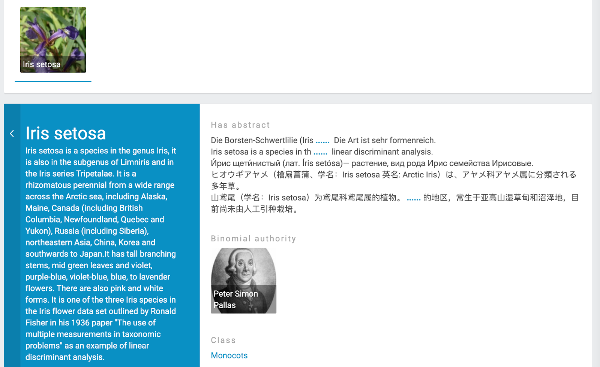

We are proud to announce that Triply is going public, by giving away a limited number of free accounts for TriplyDB. This is the first time that individual users can store, explore and share their own linked data on the web, without the need to install anything. You can link your data to other datasets, reuse open data and publish your own knowledge graphs, queries and data stories.

## The deal

The number of free accounts we are giving away is limited. So whether you are a student, a researcher, a business owner, a linked open data enthusiast or a data geek, head over to [triplydb.com][] and create your own, free account now! You can register easily via Google or GitHub. Our free accounts are restricted to open data and a maximum of one million triples.

## The features
### Add datasets
On TriplyDB, you can add several datasets which can each contain several linked open data graphs. If you do not yet possess any linked data ready for upload, you can import our demo dataset ([the famous Iris dataset](https://en.wikipedia.org/wiki/Iris_flower_data_set)) with just a single click. [Our Iris dataset](https://triplydb.com/Triply/iris) contains an easy-to-follow tutorial to get you started. You can also add a new dataset, and then add data from an existing dataset, from a URL or from a file.

### Reuse datasets
We make the reuse of datasets that are already available in TriplyDB easy. Interesting datasets include [DBpedia][], [GoodRelations][], [Smithsonian][], [The World Factbook][] or the [Time Ontology][]. With this option, you can add other users’ datasets to your own datasets and thereby integrate several datasets, for example the Iris dataset and DBpedia. Adding existing datasets does not affect your limit of one million triples.

### Query datasets
Now that you have linked data, it is time to use it! With a free user account, you can start one single service over one of your datasets. Currently, we offer SPARQL, JENA, and ElasticSearch services. Once your service is created, you can start to query your dataset. For SPARQL queries we offer an advanced SPARQL editor with many helpful features. SPARQL query results can be displayed in a table view and raw view. TriplyDB also offers additional features to visualise geographies, timelines and images. You can also save and share (several versions of) your queries. With a free user account, all your queries will be public by default.

### Create data stories
TriplyDB lets you create beautiful data stories. Data stories are collections of SPARQL queries accompanied by markdown texts and images. With your free user account, you can use all functionalities to create public data stories.

### Explore insights
Each dataset has an insights page which shows the hierarchical structure of the instances of that dataset. This view has been developed for large hierarchical datasets. To get your dataset to look like the DBpedia dataset, check out our [documentation about insights](https://triply.cc/docs/triply-db-getting-started#insights).

### Use our REST-API
Finally, you can also make use of the REST-API that TriplyDB supports. All functionality, from managing the Triply instance to working with your data, can be done through the REST-API. To read more about the TriplyDB API, please consult our [documentation](https://triply.cc/docs/triply-api).

## About TriplyDB
TriplyDB is a user-friendly, performant and stable platform, designed for potentially very large knowledge graphs. Until now, TriplyDB was only accessible for organizations via a [subscription](https://triply.cc/subscriptions), either as software as a service or a self-hosted installation.

Have you grown tired of your current triple store, or are you just getting started in the world of linked data? Create your free user account over at [triplydb.com][], or contact us at [info@triply.cc](mailto:info@triply.cc).

[triplydb.com]: https://triplydb.com
[DBpedia]: https://triplydb.com/DBpedia-association/dbpedia
[GoodRelations]: https://triplydb.com/gr/gr
[Smithsonian]: https://triplydb.com/smithsonian/american-art-museum
[The World Factbook]: https://triplydb.com/cia/wfb
[Time Ontology]: https://triplydb.com/w3c/time
