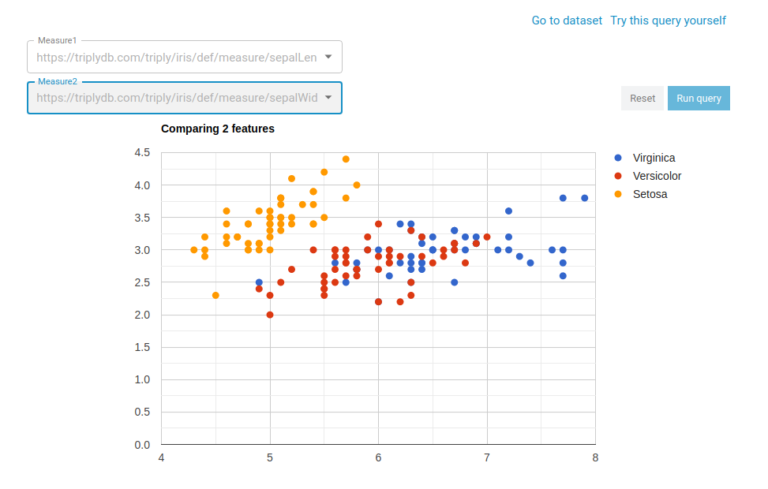

Stories have been with us longer than history. Where they were first part of oral tradition, stories evolved over time from the spoken word to writing: on walls, on paper and now on electronic screens. The transition to newer forms of communication means that the requirements of stories have changed as well. 

The goal of stories, however, hasn’t changed: we still create stories to transform information into narratives that guide and persuade. Nowadays, however, creating stories has become more complex than ever: we want stories that are both understandable and trustworthy, where the underlying data is just one click away and supports the narrative. But just displaying information in bare tables doesn’t do the job. The story should be charming and draw the reader in: inform *and* engage them.

The best way to tell a whole story is, well, with a data story!

## But, what is a data story?

Data stories are stories that incorporate interactive visualisations of the underlying data. In TriplyDB, our implementation enables you to orchestrate several SPARQL queries into a single story, along with explanatory text, to convey a powerful and data-driven message. Writing a story and using SPARQL to serve the data in a presentable way, improves the reader's understanding of the story. Readers can even examine the data themselves, allowing them to verify the narrative. 

Additionally, in a data story, you can make all data interactive. Readers can browse through business reports, scientific papers, articles and interact with the data. Combining great written content with interactive visualizations will make your audience even more interested in your work!

Finally, data stories could add significant value to scientific papers. For most papers, their published data is hard to find, access and process, if it is published at all. Having your data easily findable in an open and standard format lets your paper stand out of the crowd. Not only that, but placing your data on the web makes the experiments reproducible, which improves your credibility. 

## Why use TriplyDB data stories?

- Avoid data duplication: you no longer need to create your own copy of the data to create a custom story. Instead, you can select any dataset from TriplyDB and create interactive visualizations for your audience. 

- Data stories are always available online and accessible to the people you want to share them with. This not only saves you the hassle of sharing documents and code, but your data is also stored in the same place as your story, making it easier to point your readers to the information used.

- Your data story is always up to date: whenever your data is updated, your visualizations reflect the changes.

- No need to worry about dependencies, programming languages, versions and incompatibility between operating systems when creating your story; TriplyDB supports all major browsers so everybody can access and read your stories.

- TriplyDB makes your data stories [FAIR](https://www.go-fair.org/fair-principles/). FAIR data is data which meet principles of findability, accessibility, interoperability, and reusability. More specifically, FAIR principles emphasize on machine - actionability, i.e. the capacity of computational systems to find, access, interoperate, and reuse data with none or minimal human intervention.

## Examples of great data stories

But the best way to talk about data stories and to demonstrate their versatility is to show them! We have created two data stories for you, based on the [DBpedia][] and [Iris][] datasets.

### DBpedia

The [DBpedia data story](https://triplydb.com/Triply/-/stories/DBpedia-Story) showcases powerful and interactive visualizations such as a tree hierarchy and a timeline. All visualizations use the underlying data from the DBpedia dataset, and use multimedia references from this dataset to create a visually pleasant data story.

Taking a closer look at the queries and the underlying dataset is simple:

Select “Go to dataset”, to explore the data, or select “Try this query yourself” to examine or change the underlying SPARQL query.

### Iris

The [Iris data story](https://triplydb.com/Triply/-/stories/the-iris-dataset) presents information about the three different species of the Iris flower. It showcases that data analytics and storytelling interact well within a data story, and how rendering the underlying data via charts helps in communicating your message:

In this chart, your audience can not only explore the patterns of the data, but also interact with the visualization, by explicitly choosing the x and y axis measurements out of predefined options. 

## About TriplyDB

TriplyDB is a user-friendly, performant and stable platform, designed for potentially very large knowledge graphs. It does not only allow you to store and manage your data, but also provides various methods for story telling. First of all, the TriplyDB data stories discussed in this blog post. Next to that, the *[Insights][]* page can provide an overview of your data by presenting the class hierarchies and frequencies that occur in your data. With [LD-Browser][], you can explore your data thoroughly and navigate through your knowledge graph. Finally, TriplyDB also supports Elastic search and SPARQL querying.

Are you just getting started in the world of data stories? Create your free user account over at [triplydb.com][]. If you have any questions, feel free to contact us at [info@triply.cc][].

[triplydb.com]: https://triplydb.com
[info@triply.cc]: mailto:info@triply.cc
[Insights]: https://triplydb.com/DBpedia-association/dbpedia/insights/classHierarchy?type=bubbles
[LD-Browser]: https://triplydb.com/DBpedia-association/dbpedia/browser?resource=http%3A%2F%2Fdbpedia.org%2Fresource%2FAnchiano&focus=forward
[DBpedia]: https://triplydb.com/DBpedia-association/dbpedia
[Iris]: https://triplydb.com/Triply/iris
