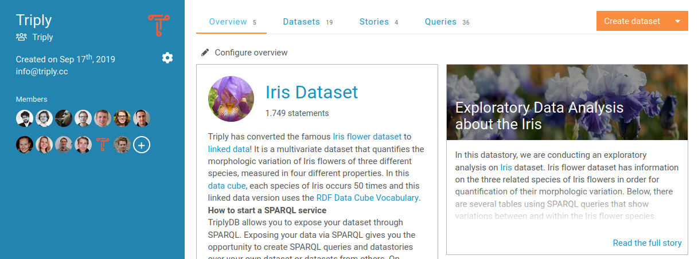
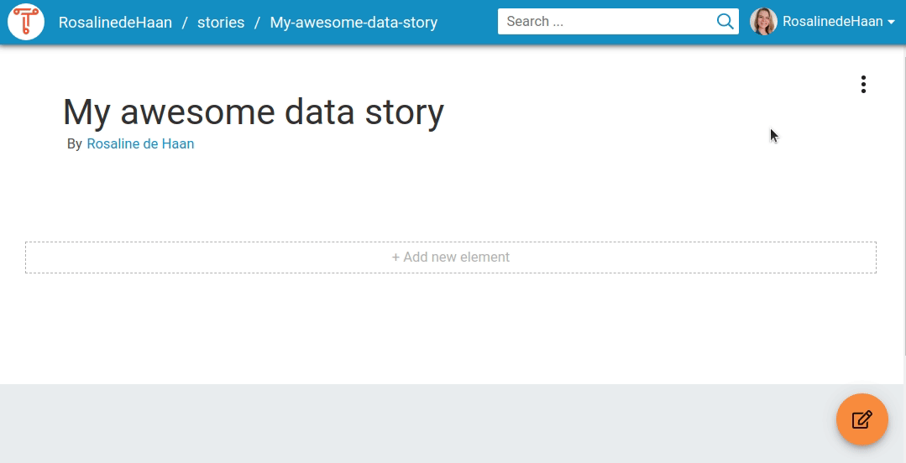

Hello all, three months have passed since the last TriplyDB feature blog and since then we have already created several new features for you to enjoy. TriplyDB is a fast moving linked data platform and we are continuously looking for ways to improve your experience with our software. Let us show you some of the new features we developed recently:

## CSV/TSV uploads
One of the most popular data formats is CSV, as it is easy to create and import into many programs. We expect that quite a few of you have CSV files lying around that you want available in TriplyDB. For this reason, we added a new method to upload CSV files to TriplyDB and get linked data as output (see image below). Importantly, these files are automatically transformed to linked data during upload!

This method is perfect for anybody wanting to get their hands dirty with linked data for the first time: You will get linked data directly out of your CSV files. Of course this procedure will generally not create perfect linked data, but you can further enrich your data in TriplyDB by e.g. importing a vocabulary or by creating additional triples through a SPARQL CONSTRUCT query (more about that in a later blog...).

## Account page redesign
We have taken a good look at the account page, and saw a new and better way to design it! We have moved your personal information to the left, leaving even more space to showcase your datasets, data stories and queries. We’ve also improved the user experience by adding a dropdown menu making it easier to create datasets, queries or data stories from your account page.

It is now possible to configure your entire account page and customize it to your liking. Do you want to showcase the new data story that you created? You can just add it to your page! Or maybe the dataset that you spent ages curating? Add it to your page! Did you write an awesome query that can’t be missed? You may have guessed: you can add it to your page! See the image below for an example of the Triply account page with the new design.

## Updated data story UI
The account page is not the only redesign we did these three months: we also improved the data story page. The creation of data stories has now been made easier. All the action buttons have been moved to the right side, making all actions now available in a single dropdown menu. The toggle for switching between edit mode and view mode has been moved, and is now visible in the lower right corner together with possible warning messages, as you can see in the gif below.

## Compact table & Ellipses 
As another step towards improving your user experience, we focused on ways to improve the table view and we are confident that when you use the SPARQL table in a SPARQL query, you will find that the results will look better than ever!

A checkbox for turning compact mode on and off has been added. This causes the information in the cells of the table to be more compact: IRI indicators (“<”, “>”), the data type and language annotations were removed. To further reduce the space that long text strings take up on the screen, we have added ellipses (“...”). Clicking on an ellipsis will show all underlying text.

## Documentation page redesign + search
We are continuously working on our [documentation pages][] to help people find the information they need to use our products to the full extent. For this reason, we improved the documentation pages to give people a better overview of the documentation. If this overview is not sufficient, a search bar can be used to search through all available documentation.

## Final Notes
These features are just some of our favourites! There are many more, big and small, that have been added. Check them out yourself over at [TriplyDB][] or contact us at [info@triply.cc][]. 

[documentation pages]: https://triply.cc/docs
[TriplyDB]: https://triplydb.com
[info@triply.cc]: mailto:info@triply.cc
