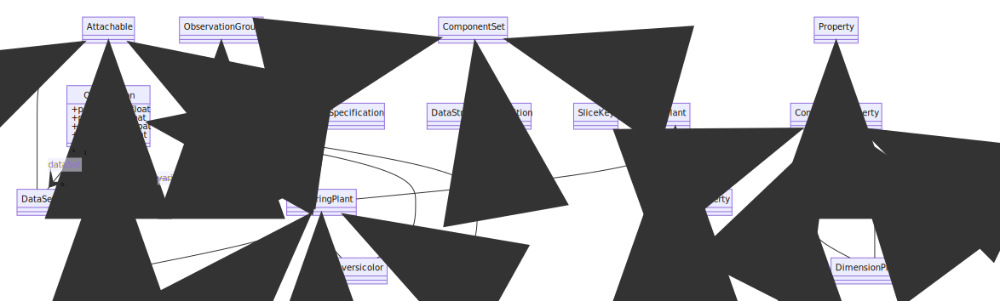

Hello everybody! It has been a long time since we have published a feature list.
We have been very busy developing new features for our users and,  in this blog, we will showcase several of the more noticeable changes in TriplyDB.

## SPARQL IDE additions and improvements

We constantly want to help people retrieve more and more knowledge out of their datasets. To this end we have the extensive [Yasgui editor](https://triply.cc/docs/yasgui). With this editor you can easily query and visualize your results in different ways: a map for geodata, a pivot table for statistical data, or a timeline for historic data. Recently, we added two new visualization formats: network view and markup view. We are also committed to improving the existing plugins. For example, IRI prefixes are now handled better in the charts and pivot tables and we have added a toggle for the table view, with which you can switch between technical view and simple view of the data.

### NEW: SPARQL Network View

You can now visualize your data as a network. This is part of the SPARQL IDE, so you have full control over which data you want to visualize in this view.

The network view can visualize up to 1,000 connections, which is ideal for visualizing data models or concept schemes. It is also possible to visualize instance data.

More information about the network view can be found in the Triply [documentation](https://triply.cc/docs/yasgui#network), and you can also play around with this through our [Pokémon query](https://triplydb.com/JD/-/queries/pokemonNetwork/2) yourself.

### NEW: SPARQL Markup View

Markup view is an improvement of the gallery view. The gallery view allows the user to create HTML blocks with SPARQL, and even add populated HTML elements. Nevertheless, we noticed users going all out with the gallery view and (miss-)using the gallery view with a lot of HTML elements. To help them out we have added in the markup view as a new tool.

The markup view can visualize two different types of markup languages: mermaid and HTML. [Mermaid](https://mermaid-js.github.io/mermaid/#/) is a library with tools to visualize diagrams and charts. The second language is HTML. Now you can create HTML elements that are populated with information from a dataset and combined into HTML elements with SPARQL. In our [documentation](https://triply.cc/docs/yasgui#markup), you can read how you can go about implementing the markup view, and you can also play around with this through our [mermaid query](https://triplydb.com/JD/-/queries/markup-visualization) yourself.

## The improved UI

TriplyDB has undergone a lot of changes both internally and externally, but one of the most visible changes is the improved user interface:

- We have worked on making TriplyDB more accessible for all users. This has led to e.g. a change in the color scheme of the buttons to make them more visible on the screen.
- Saved queries have been redesigned, to reduce the amount of URLs visible for the user,  and to bring the RESTful API URL better in view, making it easier for you to copy this URL. You can learn more about how to use our RESTful API in our [documentation](https://triply.cc/docs/triply-db-getting-started#using-a-saved-query) pages.

## Closing Notes

These features are just some of the changes we made during the last few months. There are many more, big and small, that have been added. Join us on our free-to-use Triple Store over at [TriplyDB](https://triplydb.com/) or contact us for any inquiries at [info@triply.cc](mailto:info@triply.cc).
