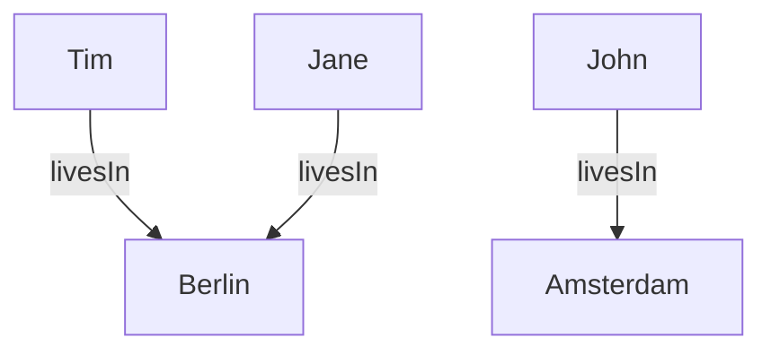
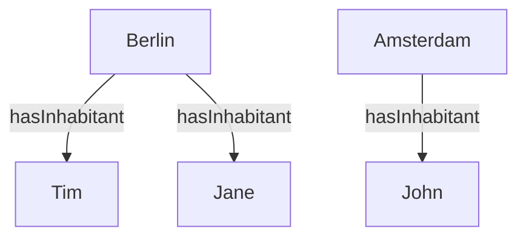
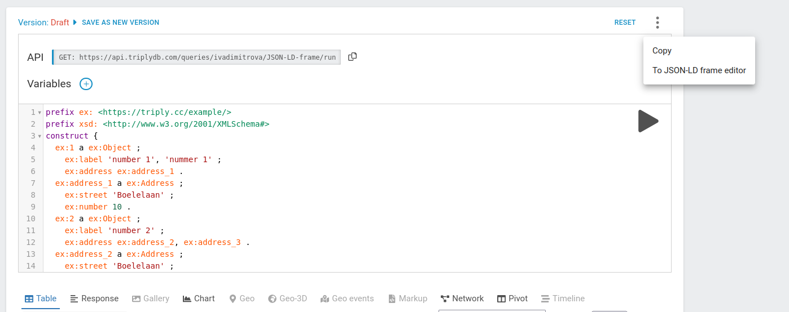
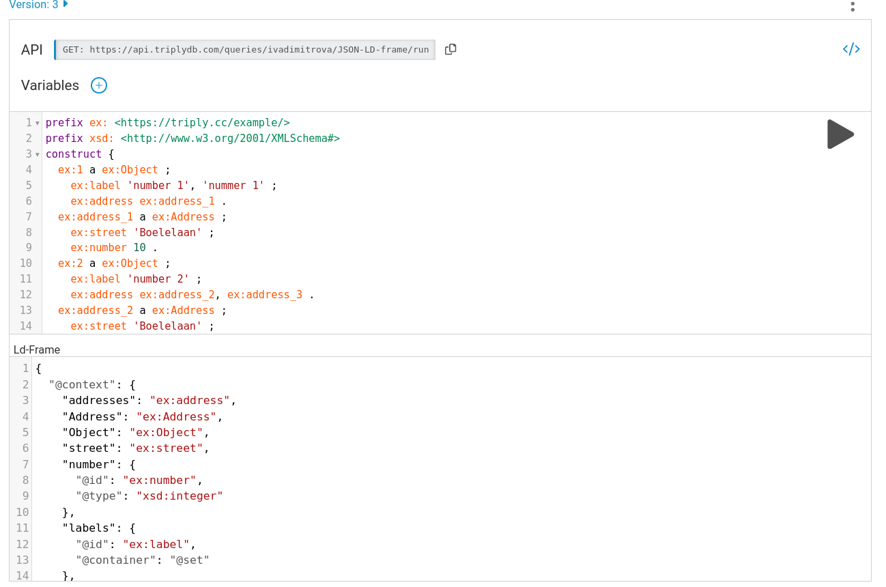
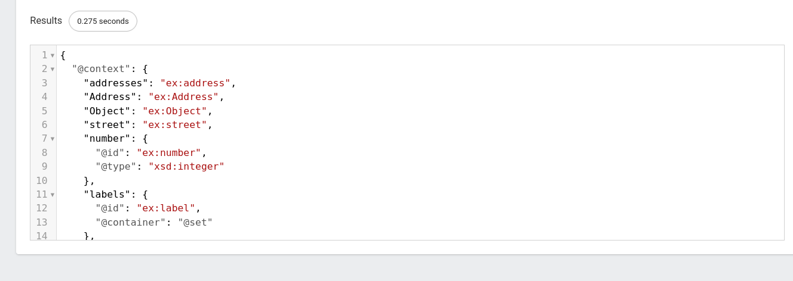
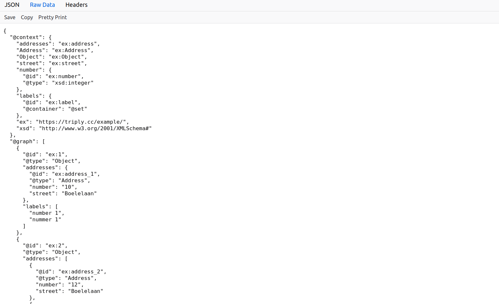

[TOC]

<!-- PROVENANCE KEY (delete this block before publishing)
     <!- - SOURCE: x - ->  text recycled from an existing page or deck, origin given
     <!- - NEW: x - ->     written for this page, with the reason
     <!- - LINK-TODO - ->  link points at a current path that will move in the restructure

     RESCUED PAGE. This is generics/JSON-LD-frames.md, which exists in the
     repository but is not in mkdocs.yml, so it has a live URL that nothing links
     to. Content is substantially unchanged; edits are house style, one filled gap,
     and the Academy footer. A redirect is required — see the review block. -->

# Tutorial: JSON-LD framing

A graph has no beginning. A REST API response does. This tutorial closes that gap:
you will take a SPARQL `construct` query and turn its output into predictable,
tree-shaped JSON that any application can consume — without writing a service in
between.

It assumes [SPARQL: the basics](../sparql.md) and
[construct queries](../sparql-construct-and-federation.md).

## Why framing is needed

<!-- SOURCE: generics/JSON-LD-frames.md — the whole of this section, lightly edited
     for house style. -->

`construct` and `describe` queries can return results as JSON-LD. Here is what
that looks like:

```json
[
  {
    "@id": "john",
    "livesIn": { "@id": "amsterdam" }
  },
  {
    "@id": "jane",
    "livesIn": { "@id": "berlin" }
  },
  {
    "@id": "tim",
    "livesIn": { "@id": "berlin" }
  }
]
```

JSON-LD is a serialisation of RDF, so what it encodes is a graph:



Triples in a graph have no order. Tim appears first above, but that is arbitrary
— a graph is a set, so there is no first or last triple. There is also no primary
element. People happen to be drawn on the left and cities on the right, but the
same information is equally well expressed the other way round:



<!-- NEW: this second diagram. The source page says "the same information can be
     expressed with the following graph" and then shows nothing — the diagram is
     missing from the published page. This fills that gap. Check that the inverse
     predicate name suits; the source does not name one. -->

Most REST APIs, on the other hand, return something with a definite shape, and
usually a tree:

```json
{
  "amsterdam": {
    "inhabitants": [
      "john"
    ]
  },
  "berlin": {
    "inhabitants": [
      "jane",
      "tim"
    ]
  }
}
```

**JSON-LD framing** is the standard that gets you from the first to the second. A
frame is a deterministic translation from a graph — an unordered set of triples
with no special node — into a tree, with ordered branches and exactly one root.

You need two things: a `construct` query, and a frame. TriplyDB's saved query API
includes a JSON-LD profiler that applies the frame to the query result and returns
plain JSON.

## Step 1: Write the construct query

<!-- SOURCE: generics/JSON-LD-frames.md — "The SPARQL Query" section, including all
     three caveats. -->

The query has to produce a graph that stands on its own: self-contained, and
carrying the vocabulary and data the response needs. Save it, and it gets an API
URL — typically starting with `api` and ending in `run`:

```none
https://api.triplydb.com/queries/JD/JSON-LD-frame/run
```

The query can take API variables, appended as `?variable=value`.

Three behaviours catch people out, and all three are worth knowing before you
debug them:

- **`optional` and API variables interact badly.** An API variable used inside an
  `optional` does not filter the results, so the query returns false positives.
- **`union` can split the result set.** The engine exhausts the first branch
  before starting the second, so the two halves may be disconnected. With a small
  limit, the result can end up split across two JSON-LD documents and data goes
  missing from the response.
- **A page may hold fewer results than `pageSize`.** The limit applies to the
  `where` clause, not the `construct` clause, so two rows of the `where` result can
  condense into a single result. The response size can differ from the page size
  even when the next page is not empty.

## Step 2: Write the frame

<!-- SOURCE: generics/JSON-LD-frames.md — "The Frame" section and its example. -->

A frame has two parts: a `@context` and a structure.

**The `@context`** maps linked data to JSON names. Each key is the name the IRI
will take in the response; each value is the IRI itself. Usually that is a
one-to-one mapping to a string. When the value is an object it must contain at
least `@id`, and may carry modifiers — `@type` to set the datatype of the value,
or `@container` to say what kind of container it lands in. The context can also
hold prefixes and vocabulary references.

**The structure** defines the shape of the response. It normally starts with
`@type`, which is the most direct way to choose the root node, and is built
outwards from there. An empty pair of braces marks a leaf. To nest a node, name
the property that points to another IRI, then describe that node's properties
inside it.

```json
{
  "@context": {
    "addresses": "ex:address",
    "Address": "ex:Address",
    "Object": "ex:Object",
    "street": "ex:street",
    "number": {
      "@id": "ex:number",
      "@type": "xsd:integer"
    },
    "labels": {
      "@id": "ex:label",
      "@container": "@set"
    },
    "ex": "https://triply.cc/example/",
    "xsd": "http://www.w3.org/2001/XMLSchema#"
  },
  "@type": "Object",
  "labels": {},
  "addresses": {
    "street": {},
    "number": {}
  }
}
```

The full specification is at
[w3c.github.io/json-ld-framing](https://w3c.github.io/json-ld-framing/).

## Step 3: Call the API

<!-- SOURCE: generics/JSON-LD-frames.md — the cURL command and the four
     requirements attached to it. -->

Send the frame as the body of a request to the saved query URL:

```bash
curl -X POST https://api.triplydb.com/queries/JD/JSON-LD-frame/run \
  -H 'Accept: application/ld+json;profile=http://www.w3.org/ns/json-ld#framed' \
  -H 'Content-type: application/json' \
  -d '[YOUR_FRAME]'
```

Four details matter, and each one produces a different failure when wrong:

- It must be a **`POST`**. Only a `POST` carries a frame in its body.
- The **`Accept`** header needs both the content type and the framing profile:
  `application/ld+json;profile=http://www.w3.org/ns/json-ld#framed`.
- The **`Content-type`** describes the body, which is the frame, so it is
  `application/json`.
- An **`Authorization: Bearer [TOKEN]`** header is required for internal or private
  queries.
  <!-- LINK-TODO: repoint to access-security/api-tokens.md once the orphan page moves -->
  See [API token](../../generics/api-token.md).

<!-- NEW: "each one produces a different failure when wrong". The source lists the
     four requirements as prose; making them a list of failure causes is what a
     reader debugging a 400 actually needs. -->

## Building the frame in the browser instead

<!-- SOURCE: generics/JSON-LD-frames.md — "Using SPARQL to create a frame", with all
     four screenshots recycled. -->

You do not have to write the frame blind. TriplyDB has a frame editor beside the
query editor.

Open the three-dot menu next to the SPARQL editor and choose **To JSON-LD frame
editor**.



Paste the frame into the editor.



Run it, and the framed result appears.



The API link above the SPARQL editor gives you the same result as a URL you can
share or call from an application.



## What you now have

A SPARQL query that behaves like a REST endpoint: a stable URL, plain JSON out,
and a shape that will not change because the underlying triples came back in a
different order.

The next tutorial builds a full API on this foundation.

## Continue in the Academy

- [Building a RESTful API](restful-api.md) — the same technique, applied end to end
- [Construct, ask, describe and federation](../sparql-construct-and-federation.md) —
  the query form this tutorial depends on
- [All tutorials](index.md)
- [Glossary](../glossary.md) — every term on this page, in one place

[← Back to the Triply Academy](../index.md)

---

## ⚠ Needs input before publishing

- **This is a rescued page.** `generics/JSON-LD-frames.md` is in the repository but
  not in `mkdocs.yml`, so it has a live URL that nothing links to. Moving it
  **requires a redirect**: add
  `'generics/JSON-LD-frames.md': 'academy/tutorials/json-ld-framing.md'`
  to `redirect_maps`.
- **The original YAML front matter was dropped** (`title` and `path`). No other page
  in the repository carries it and MkDocs does not use it here. Confirm nothing
  external depends on the `/docs/jsonld-frames` path.
- **A missing diagram has been supplied.** The source says "the same information can
  be expressed with the following graph" and then shows nothing — the second
  diagram is absent from the published page. I have drawn it. The inverse predicate
  is called `hasInhabitant`, which the source does not name; change it if there is
  a house preference.
- **A bug in the original has been fixed.** The first diagram placed Jane in
  Amsterdam while the JSON above it placed her in Berlin. The diagram now says
  Berlin, which matches both the JSON and the tree example further down.
- **Verify the example query still resolves**: `api.triplydb.com/queries/JD/JSON-LD-frame/run`.
  It belongs to a personal account, which makes it a fragile thing to build a
  tutorial on. A query under an official account would be better.
- **One addition is marked in the source**: the framing of the four cURL
  requirements as four distinct failure causes.
- **Add to `mkdocs.yml`** under a Tutorials group:
  `- JSON-LD framing: academy/tutorials/json-ld-framing.md`