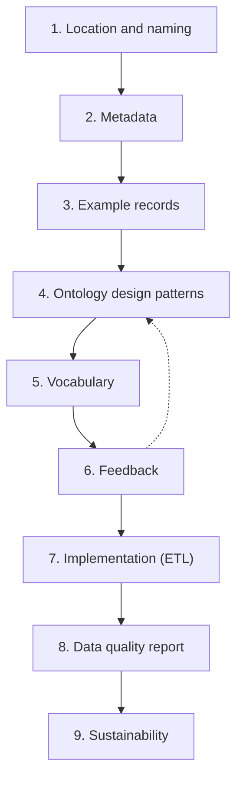

[TOC]

<!-- PROVENANCE KEY (delete this block before publishing)
     <!- - SOURCE: x - ->  text recycled from an existing page or deck, origin given
     <!- - NEW: x - ->     written for this page, with the reason
     <!- - LINK-TODO - ->  link points at a current path that will move in the restructure
-->

# Knowledge graphs

"Knowledge graph" is a term people use confidently and define differently. This
page gives it a working definition, sets it against the alternatives, and
describes how one actually gets built, because the building is where most of the
effort goes, and it is rarely what people expect.

When reading this chapter we assume you know about [Linked data](linked-data.md).

## What a knowledge graph is

<!-- SOURCE: June 2026 documentation prototype, "What is a knowledge graph?" —
     definition and the dataset/knowledge-graph equivalence. -->

A knowledge graph stores facts as a network of connected nodes and edges. Nodes
are things: a product, a person, a building. Edges are relationships between
them *made by*, *located in*, *broader than*. Both nodes and edges have types,
drawn from a shared vocabulary rather than invented per system.

That last clause carries the weight. A diagram of boxes and arrows is a graph. It
becomes a *knowledge* graph when the boxes and arrows mean something that another
system can also read.

In practice, and certainly at Triply, "knowledge graph" and "linked data dataset"
describe the same thing from two angles. *Knowledge graph* emphasises the
connected, meaningful nature of the data. *Dataset* emphasises it as a unit you
can manage: with an owner, an access level, services and metadata.

## Why connecting is the point

<!-- SOURCE: presentations.triply.cc/triplydb — the network effect framing and the
     benefits list. Visuals from that deck are not reused. -->

The argument for a knowledge graph is an argument about networks. The value of a
network grows faster than the number of things in it, because what grows is the
number of possible *connections*. Adding a dataset to a graph that already holds
ten does not add one dataset's worth of value; it adds every question that can
now be asked across the eleven.

That is the theory. In practice, organisations report a fairly consistent set of
gains:

- Lower cost of exchanging data, because the data carries its own meaning
- Lower cost of integrating data, because merging is loading rather than mapping
- Faster adaptation when requirements change, since there is no schema to migrate
- Better visibility of data quality, because the model states what was expected
- Questions that cross silos, which were previously projects in their own right
- A workable foundation for machine learning, which needs context to be useful
- Less vendor lock-in, since the formats and query language are open standards

<!-- NEW: the last clause on each of the seven bullets. The deck lists the benefits
     as bare phrases; a phrase like "lowering the cost of data integration" means
     nothing to a reader who does not already agree. Each clause says why. -->

## Knowledge graph versus the alternatives

<!-- SOURCE: June 2026 documentation prototype — comparison table, recycled with
     light edits. -->

No approach wins everywhere. The question is which mismatch you can live with.

| Approach | Suits | Struggles with |
| --- | --- | --- |
| **Relational database** | Stable schemas, transactional workloads | Evolving schemas, uneven data, cross-source integration |
| **Document store** | Semi-structured data, nested objects | Traversing relationships, querying across documents |
| **Spreadsheet** | Small datasets, human editing, quick analysis | Scale, consistency, machine-to-machine exchange |
| **Knowledge graph** | Connected data, evolving models, integration across sources | High-volume transactional writes, plain tabular reporting |

The bottom-right cell is the one to take seriously. If your workload is thousands
of small writes per second, or your output is a monthly report from one clean
source, a knowledge graph is the wrong tool and no amount of modelling will fix
that.

<!-- NEW: the closing paragraph. The prototype table states the limitation in a cell
     and moves on. Saying it in prose is more honest and, in our experience,
     makes the rest of the page more credible rather than less. -->

## How a knowledge graph gets built

<!-- SOURCE: presentations.triply.cc/triplydb — the nine-step knowledge graph
     construction sequence. The one-line glosses under the diagram are mine. -->

Knowledge graph construction has a shape, and it is not "load the data and see
what happens". Triply's method runs in nine steps:

1. **Location and naming** — where the data will live and how its IRIs are formed.
   Decided first, because everything else refers to it.
2. **Metadata** — what this dataset is, who owns it, under what licence.
3. **Example records** — a handful of real records, not a specification. They
   surface the exceptions that a specification hides.
4. **Ontology design patterns** — recognising which modelling problems you have,
   and which are already solved.
5. **Vocabulary** — choosing the terms. Reuse before you invent.
6. **Feedback** — domain experts read the model back. This step loops; it is
   normal to return to step 4.
7. **Implementation** — the ETL that turns sources into triples, repeatably.
8. **Data quality report** — the model made testable, so quality is measured
   rather than asserted.
9. **Sustainability** — who maintains this, on what schedule, when the project ends.

<!-- NEW: the nine one-line glosses, and the dotted feedback arrow in the diagram.
     The deck lists the nine step names without explanation. Anyone who teaches
     this should check the glosses say what they mean. -->

<!-- NEW: this paragraph is an observation about the nine steps, not something the
     deck says. It is the practical point of the section. -->

Note where the effort sits. Six of the nine steps happen before any data is
converted, and the last one happens long after. Treating knowledge graph
construction as an import job is the most common way it goes wrong.

## Where this appears in Triply products

- **TriplyDB** stores knowledge graphs as datasets, with services on top for
  querying and searching.
  <!-- LINK-TODO: repoint to triplydb/overview.md -->
  See [TriplyDB](../triply-db-getting-started/index.md).
- **TriplyETL** is step 7 — the repeatable conversion from sources to triples.
  See [TriplyETL](../triply-etl/index.md).
- **Validation** is step 8, expressed as SHACL constraints.
  See [Validate](../triply-etl/validate/index.md).
- Triply's public-sector work — cadastral, statistical, cultural heritage and
  archival knowledge graphs — follows this method.

## Continue in the Academy

- [OWL and ontologies](owl-ontologies.md) — the model layer, in detail
- [SHACL](shacl.md) — stating what your data must look like, and checking it
- [SPARQL: the basics](sparql.md) — asking questions of a knowledge graph
- [Linked data](linked-data.md) — the triples underneath all of this
- [Glossary](glossary.md) — every term on this page, in one place

[← Back to the Triply Academy](index.md)