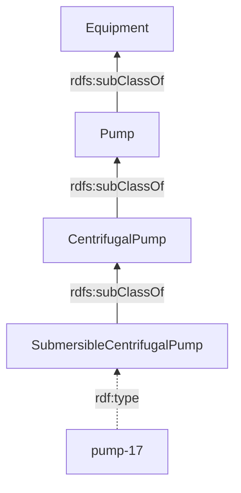

[TOC]

<!-- PROVENANCE KEY (delete this block before publishing)
     <!- - SOURCE: x - ->  text recycled from an existing page or deck, origin given
     <!- - NEW: x - ->     written for this page, with the reason
     <!- - LINK-TODO - ->  link points at a current path that will move in the restructure
-->

# OWL and ontologies

An ontology says what the terms in your data mean. Without one you have triples
that a machine can read and cannot interpret — it knows that `ex:pump-17` is
related to `ex:factory-3`, and nothing about what either of them is.

This page covers what an ontology contains, what OWL adds on top of plain linked
data, and the question that comes up on every project: which of this do you have
to write yourself?

It assumes [Linked data](linked-data.md).

## What an ontology is

<!-- SOURCE: June 2026 documentation prototype, "OWL & ontologies" — the three-part
     definition and the interoperability argument. -->

An ontology is a formal description of the concepts and relationships in a
domain. It defines three things:

- **Classes** — the kinds of thing that exist: *Product*, *Manufacturer*,
  *Material*.
- **Properties** — the relationships and attributes those things can have:
  *hasManufacturer*, *madeOf*, *weight*.
- **Constraints** — what is allowed: a product has exactly one manufacturer.

The reason to write this down is interoperability. Two systems that use the same
ontology exchange data and interpret it identically, because they are working
from the same definitions. This is what makes shared ontologies valuable out of
proportion to their size: an organisation adopting IFC for construction, PROV-O
for provenance or Schema.org for web content gains automatic compatibility with
everyone else who has done the same.

## Three words people use interchangeably

<!-- NEW: this section. Vocabulary, ontology and shapes are treated as synonyms in
     most conversations, and the distinction matters as soon as someone asks
     "should this rule be in the ontology or in SHACL?" — a question that comes
     up on every project and currently has nowhere to point. -->

Three terms circulate, and the differences are real:

| Term | What it does |
| --- | --- |
| **Vocabulary** | Supplies terms: a list of classes and properties with IRIs |
| **Ontology** | Supplies terms *and* logic: what follows from using them |
| **Shapes** | State what data must look like, so it can be checked |

The line between an ontology and a set of shapes is the one that matters in
practice. An ontology says what is *true* — if something is a centrifugal pump,
it is a pump. SHACL shapes say what is *required* — every pump in this dataset
must have a manufacturer. The first draws conclusions; the second raises
violations. See [SHACL](shacl.md).

The line between a vocabulary and an ontology is softer, and in daily use the
words are interchangeable. Nobody will misunderstand you.

## What OWL adds

<!-- SOURCE: June 2026 documentation prototype — the three example axioms, the
     reasoner and inference, and where OWL surfaces in Triply products. -->

**OWL**, the Web Ontology Language, is a W3C standard built on top of RDF. Where
RDF lets you state facts, OWL lets you define what those facts *imply*.

With OWL you can say:

- If X *isMarriedTo* Y, then Y *isMarriedTo* X — a symmetric property.
- If X is a *CentrifugalPump*, then X is also a *Pump* — a class hierarchy.
- No two people share a passport number — a functional property.

<!-- NEW: this diagram. The prototype states the class-hierarchy example in prose;
     drawing it also shows the difference between rdf:type and rdfs:subClassOf,
     which is the confusion underneath most modelling questions. -->

Read the diagram upwards. `pump-17` is an *instance* of a class, which is
`rdf:type`. Each class is a *subclass* of a broader one, which is
`rdfs:subClassOf`. Those two are not the same relation, and mixing them is the
most common modelling mistake in linked data.

A **reasoner** uses these axioms to derive facts nobody stated. That is
**inference**: ask for every *Pump* in the dataset and get `pump-17` back, even
though the data only ever said it was a submersible centrifugal one.

## Inference or property paths?

<!-- SOURCE: Triply Academy course deck "Querying Knowledge Graphs" — the mapping
     between OWL property characteristics and SPARQL property paths. -->

Inference is one way to traverse a hierarchy. A property path is the other, and
it needs no reasoner at all:

| If a property is | Navigate it with |
| --- | --- |
| `owl:TransitiveProperty` | `P+` |
| `owl:ReflexiveProperty` | `P*` |
| `owl:SymmetricProperty` | `P\|(^P)` |

Both get you the answer. Inference materialises the extra triples once and makes
every later query simpler; property paths leave the data alone and put the work
in the query. Which suits you depends on how often the data changes and how much
you mind storing derived facts.

<!-- NEW: the closing sentence. The deck shows the correspondence without saying
     that it presents a choice, which is what a reader is actually facing. -->

See [graph patterns](sparql-graph-patterns.md#property-paths-following-a-chain).

## Reuse before you invent

<!-- SOURCE: triply-etl/generic/declarations.md#external-vocabularies — "in linked
     data, it is common to reuse existing vocabularies" — and the full supported
     vocabulary table in triply-etl/generic/vocabularies.md, from which the
     selection below is drawn. -->

Most modelling problems are not new. Before defining a class, check whether a
published vocabulary already has one, because reusing a term means your data
links to everyone else's without further effort.

TriplyETL ships with a large library of external vocabularies for exactly this
reason. A selection, to show the range:

| Domain | Vocabulary | Covers |
| --- | --- | --- |
| People | FOAF | People and their relationships |
| Metadata | Dublin Core Terms | General-purpose descriptive metadata |
| Data catalogues | DCAT | Datasets and the catalogues that list them |
| Cultural heritage | CIDOC CRM, Linked Art | Objects, events and museum practice |
| Geospatial | GeoSPARQL | Features, geometries and spatial relations |
| Provenance | PROV-O | Who produced what, when, from what |
| Statistics | Data Cube | Observations, dimensions and measures |
| Units | QUDT | Quantities, units and dimensions |
| Buildings | BOT, Brick | Building topology and building assets |
| Government | MDTO | Sustainably accessible government information |
| Digital preservation | PREMIS | Metadata about preserving digital objects |
| Railways | ERA | European rail infrastructure and vehicles |

See [Supported vocabularies](../triply-etl/generic/vocabularies.md) for the full
table with versions and descriptions.

What is left after reuse is the part that is genuinely yours: the concepts
specific to your organisation and your domain. That is usually a much smaller
ontology than people expect at the start of a project.

<!-- NEW: the closing paragraph. Worth saying, because the fear of ontology work is
     usually a fear of writing the whole thing from nothing. -->

## Where this appears in Triply products

- **TriplyETL** imports external vocabularies directly, so terms come with
  autocompletion rather than copied IRIs.
  See [Declarations](../triply-etl/generic/declarations.md#external-vocabularies).
- **TriplyDB's Insights page** builds a class hierarchy out of `rdfs:subClassOf`,
  which is your ontology made visible.
  <!-- LINK-TODO: repoint to triplydb/how-to/view-data.md -->
  See [Viewing data](../triply-db-getting-started/viewing-data/index.md#class-hierarchy).
- **The Editor** generates its forms from a shapes graph rather than from an
  ontology — the distinction described above, in working form.
  <!-- LINK-TODO: repoint to data-apps/editor/ once written -->
  See [Editing data](../triply-db-getting-started/editing-data/index.md).

## Continue in the Academy

- [SHACL](shacl.md) — stating what data must look like, and checking it
- [SKOS](skos.md) — for concepts and terminology rather than classes and logic
- [Knowledge graphs](knowledge-graph.md) — where an ontology fits in the whole
- [Linked data](linked-data.md) — the triples an ontology describes
- [Glossary](glossary.md) — every term on this page, in one place

[← Back to the Triply Academy](index.md)
