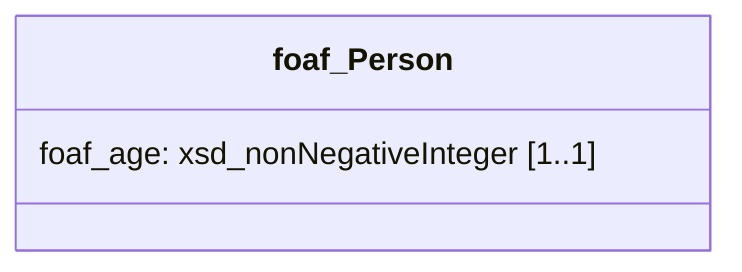

[TOC]

<!-- PROVENANCE KEY (delete this block before publishing)
     <!- - SOURCE: x - ->  text recycled from an existing page or deck, origin given
     <!- - NEW: x - ->     written for this page, with the reason
     <!- - LINK-TODO - ->  link points at a current path that will move in the restructure
-->

# SHACL

Linked data is permissive by design. Nothing stops you asserting that a person's
age is the word "twelve", or that a building has four manufacturers. That
permissiveness is what makes the data easy to extend — and it is why you need a
separate way to say what your data is *supposed* to look like.

SHACL is that way. This page covers what a SHACL model contains, what happens when
data does not conform, and the second thing SHACL does that most introductions
leave out.

It assumes [Linked data](linked-data.md), and reads best after
[OWL and ontologies](owl-ontologies.md).

## An information model

<!-- SOURCE: triply-etl/validate/shacl.md — the Information Model definition and the
     worked foaf:Person example, which this page follows throughout. -->

Triply's documentation uses a term worth borrowing:

> An **information model** is a generic specification of the requirements for
> your data.

Generic is the important word. It is not a statement about one person's age; it
is a statement about every person there will ever be.

Suppose you are publishing people and their ages. Informally, the requirement is:
every `foaf:Person` has exactly one `foaf:age`, and that value is a non-negative
integer. Drawn out, it is a very small diagram:



<!-- SOURCE: this mermaid diagram is recycled verbatim from
     triply-etl/validate/shacl.md, where it illustrates the same example. -->

The `[1..1]` says exactly one — no more, no fewer.

## The same model, formally

<!-- SOURCE: triply-etl/validate/shacl.md — the SHACL encoding of the model above. -->

SHACL expresses that diagram in linked data. The model is itself triples, which
means you can store it, query it and version it exactly like everything else.

```turtle
prefix foaf: <http://xmlns.com/foaf/0.1/>
prefix rdf:  <http://www.w3.org/1999/02/22-rdf-syntax-ns#>
prefix sh:   <http://www.w3.org/ns/shacl#>
prefix shp:  <https://triplydb.com/Triply/example/model/shp/>
prefix xsd:  <http://www.w3.org/2001/XMLSchema#>

shp:Person
  a sh:NodeShape;
  sh:closed true;
  sh:ignoredProperties ( rdf:type );
  sh:property shp:Person_age;
  sh:targetClass foaf:Person.

shp:Person_age
  a sh:PropertyShape;
  sh:datatype xsd:nonNegativeInteger;
  sh:maxCount 1;
  sh:minCount 1;
  sh:path foaf:age.
```

Three conventions in that snippet are worth carrying into your own models.

**Shapes come in two kinds.** A **node shape** describes a kind of thing;
`shp:Person` targets the class `foaf:Person`. A **property shape** describes one
property of it; `shp:Person_age` describes `foaf:age`. The correspondence is
one-to-one: one node shape per class, one property shape per property.

**Shapes get their own namespace.** The `shp:` prefix keeps the model separate
from the data it describes, so you can always tell which is which.

**`sh:closed true` closes the world.** With it, any property not named in the
model is not allowed. Without it, undeclared properties pass silently. Closing
the model is the stricter choice and generally the right one — `sh:ignoredProperties`
exists for the handful of exceptions, such as `rdf:type`.

## What a violation looks like

<!-- SOURCE: triply-etl/validate/shacl.md — the validation error, verbatim. -->

Now feed it data that says a person's age is `'twelve'`. The value is a string,
not a non-negative integer, so validation reports:

```none
ERROR (Record #1) SHACL Violation on node id:1 for path
                  foaf:age, source shape shp:Person_age:
                    1. Value does not have datatype xsd:nonNegativeInteger
```

Read the three coordinates in that message, because every SHACL report gives you
the same three. **The node** (`id:1`) is where in the data. **The path**
(`foaf:age`) is which property. **The source shape** (`shp:Person_age`) is which
requirement. Look up the source shape to learn what was expected; look up the
node to see what actually happened.

<!-- NEW: the "three coordinates" framing. The source page walks through this
     particular message; naming the three parts makes every future report
     readable without a walkthrough. -->

## Three ways to fix it

<!-- SOURCE: triply-etl/validate/shacl.md — "as in any ETL error, there are 3
     possible solutions". -->

A violation means the data and the model disagree. It does not say which one is
wrong. There are always three options:

1. **Change the source data.** Here, record ages as numbers rather than words.
   Usually the right answer, because it fixes the problem for everyone
   downstream.
2. **Change the transformation.** Translate the words to numbers on the way
   through.
3. **Change the model.** Sometimes the requirement really was wrong.

Deciding between them is a modelling conversation, not a technical one. What
SHACL guarantees is that you are having it deliberately rather than discovering
the mismatch months later.

<!-- NEW: the closing paragraph. The source lists the three options without saying
     that choosing between them is the actual work. -->

## Validate everything, including the small things

<!-- SOURCE: triply-etl/validate/shacl.md — "Triply considers having an automated
     validation step best practice for *any* ETL", including the reasoning. -->

Triply's position is that every ETL should have an automated validation step,
including small and simple ones, because small and simple ETLs tend to become
large and complex ones.

The argument is about scale. One class with one property is easy to check by eye.
A model with fifty classes, each with a dozen properties, some required and some
optional, spread over several files, is not checkable by eye at all — and it got
that way one property at a time.

## The report is data too

<!-- SOURCE: triply-etl/validate/shacl.md — validation report written to a named
     graph and published to TriplyDB. -->

A SHACL validation report is itself linked data. It can be written into a named
graph, stored alongside the data it describes, and published.

That has a consequence worth drawing out: data quality becomes queryable. You can
count violations by shape, track them over time, or drive a dashboard from them —
using the same query language you use for everything else. Quality stops being a
log file that someone reads once.

<!-- NEW: the consequence paragraph. The source documents the option; it does not
     say why you would take it. -->

## SHACL also derives data

<!-- SOURCE: triply-etl/enrich/shacl/index.md and triple-rules.md — SHACL Rules,
     their two kinds, and the fatherhood example. -->

Most introductions stop at checking. SHACL does a second thing: **rules** that
add new triples based on triples already present.

The classic example is deduction. If John is male and has a child, then John is a
father. Nobody stated that fact, and a rule can derive it.

This matters more than it sounds. Because rules are written in SHACL, they live
in the same model as the constraints — so business rules in a complex domain are
maintained in one place, in a standard format, and can themselves be queried as
data. TriplyETL supports two kinds: **triple rules**, which assert a single
triple each and need no SPARQL, and **SPARQL rules**, which are more expressive.
Rules can run in a defined order and can run repeatedly, each pass unlocking the
next.

## SHACL and OWL

<!-- NEW: this section. The two are constantly confused and no existing page
     contrasts them. Grounded in the OWL material in the prototype and the SHACL
     material here. -->

Both describe your model. They answer different questions.

| | States | Produces |
| --- | --- | --- |
| **OWL** | What is true | Inferred facts |
| **SHACL** | What is required | Violations |

If a centrifugal pump is necessarily a pump, that is OWL. If every pump in this
dataset must record a manufacturer, that is SHACL. Most projects need both, and
the mistake to avoid is expressing a requirement as an axiom — OWL will not
complain about missing data, it will simply conclude less.

See [OWL and ontologies](owl-ontologies.md).

## Where this appears in Triply products

- **TriplyETL** validates against a SHACL model with `validate()`, and applies
  SHACL rules with `executeRules()`.
  See [SHACL validation](../triply-etl/validate/shacl.md) and
  [SHACL rules](../triply-etl/enrich/shacl/index.md).
- **GraphQL endpoints** in TriplyDB derive their schema from user-provided SHACL
  shapes — the model doing a third job.
  <!-- LINK-TODO: repoint to triplydb/reference/graphql.md once the orphan page moves -->
  See [GraphQL](../generics/Graphql.md).

## Continue in the Academy

- [OWL and ontologies](owl-ontologies.md) — the other half of modelling
- [SKOS](skos.md) — a model you rarely have to write yourself
- [SPARQL: the basics](sparql.md) — querying a report, or the model itself
- [Knowledge graphs](knowledge-graph.md) — where validation sits in the method
- [Glossary](glossary.md) — every term on this page, in one place

[← Back to the Triply Academy](index.md)
