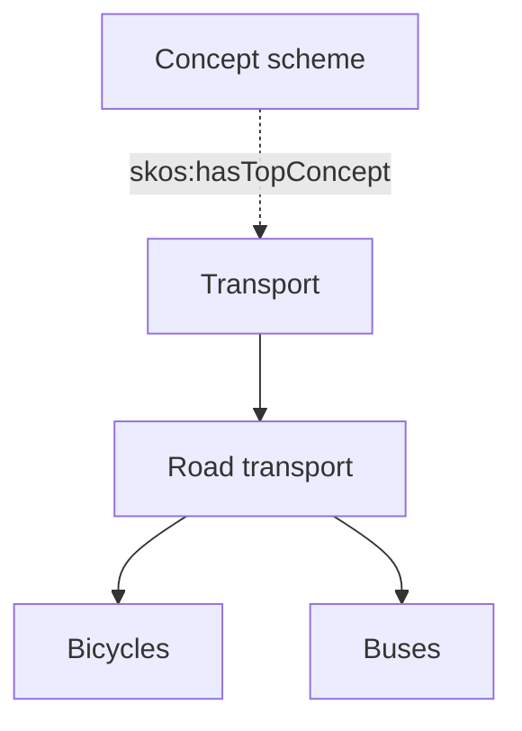

[TOC]

<!-- PROVENANCE KEY (delete this block before publishing)
     <!- - SOURCE: x - ->  text recycled from an existing page or deck, origin given
     <!- - NEW: x - ->     written for this page, with the reason
     <!- - LINK-TODO - ->  link points at a current path that will move in the restructure
-->

# SKOS

Every organisation has lists of agreed terms: subject headings, product
categories, document types, place names. They are maintained by people who know
the domain, they change slowly, and everything else refers to them.

SKOS — the Simple Knowledge Organization System — is the W3C standard for
publishing exactly those lists as linked data. If you work with libraries,
archives, museums or government information, it is probably the standard you will
meet first.

It assumes [Linked data](linked-data.md).

## Concepts, not classes

<!-- NEW: this section. The distinction is the single thing people get wrong about
     SKOS, and nothing in the existing documentation addresses it. -->

The first question is why SKOS exists at all, when [OWL](owl-ontologies.md)
already describes classes and hierarchies.

A **class** is a set of things. *Building* as an OWL class means every building
in the world, and saying something is a `CentrifugalPump` licenses a machine to
conclude it is also a `Pump`.

A **concept** is an idea people agreed to name. *Building* as a SKOS concept is
an entry in a terminology — something you can tag a record with, translate,
deprecate, or place under a broader heading, without asserting anything logical
about the world.

That difference is deliberate. SKOS is designed to be **light on logic**, because
real vocabularies are full of relationships that are useful without being
strictly true. A thesaurus can put *Bicycles* under *Transport* without committing
to the claim that every bicycle is a transport. SKOS lets you say that; OWL would
draw conclusions from it.

The practical rule: use OWL when a machine should reason, SKOS when people need
to agree on words.

## Schemes hold concepts

<!-- SOURCE: triply-db-getting-started/editing-data/index.md — concept schemes and
     the concept hierarchy, described there through the Editor's SKOS view. -->

A **concept scheme** is one vocabulary: one thesaurus, one classification, one
controlled list. Concepts belong to a scheme, and a scheme has one or more **top
concepts** where the hierarchy starts.

<!-- NEW: this diagram. The arrows point downwards for readability, but note that
     the SKOS property points the other way — see the warning below. Check that
     this does not confuse more than it clarifies. -->

Displayed, that is a tree. The concept hierarchy below comes from a real scheme:

<!-- SOURCE: this screenshot is recycled from
     triply-db-getting-started/editing-data/index.md, where it illustrates the
     same hierarchy. -->

A `>` in front of a concept means it has narrower concepts and can be expanded. A
dot means it is a leaf.

## The direction that trips everyone up

<!-- SOURCE: Triply Academy course deck — skos:broader, skos:narrower and
     skos:broaderTransitive as the predicates behind hierarchy queries. -->

Two properties carry the hierarchy, and their direction is the opposite of what
most people expect the first time:

- `skos:broader` points from a concept **to its parent**. *Bicycles*
  `skos:broader` *Road transport*.
- `skos:narrower` points from a concept **to its children**.

So a query for "everything under *Transport*" follows `skos:broader` **backwards**,
or follows `skos:narrower` forwards. Getting this wrong returns an empty result
rather than an error, which is why it costs people an afternoon.

Alongside these sit `skos:broaderTransitive` and `skos:narrowerTransitive`, which
express the full chain rather than a single step. Whether those chained triples
actually exist depends on whether anyone generated them — which is why hierarchy
queries usually use a property path instead. See
[querying real-world data](sparql-real-world-data.md#hierarchies).

`skos:related` connects concepts that are associated without one being above the
other.

## Labels

A concept is identified by its IRI, not by its name, which is what makes SKOS
multilingual without effort. Names are attached as labels:

- `skos:prefLabel` — the preferred name. **At most one per language.**
- `skos:altLabel` — synonyms, abbreviations, older names, spelling variants.
- `skos:hiddenLabel` — names you want search to match but never display, such as
  common misspellings.
- `skos:notation` — a code from a classification system, where one exists.

Alternative labels are worth more effort than they usually get. They are what
makes a search for "bike" find the concept called *Bicycles*, and they cost one
triple each.

<!-- NEW: the closing paragraph on altLabel. Not in the sources, but under-used
     altLabels are a recurring cause of "search does not find anything". -->

## Linking one vocabulary to another

<!-- SOURCE: triply-db-getting-started/editing-data/index.md — chained concept
     schemes, linked with skos:narrowMatch and skos:broadMatch. -->

Vocabularies rarely stand alone. Your subject headings may need to line up with a
national standard, or a partner's list. SKOS has a separate set of properties for
crossing that boundary:

| Property | Says |
| --- | --- |
| `skos:exactMatch` | These two concepts are interchangeable |
| `skos:closeMatch` | Close enough for most purposes, but not identical |
| `skos:broadMatch` | The other concept is broader than this one |
| `skos:narrowMatch` | The other concept is narrower than this one |
| `skos:relatedMatch` | Associated, without a hierarchy between them |

Two schemes chained with `skos:broadMatch` and `skos:narrowMatch` behave as one
hierarchy for browsing, while each remains separately maintained and separately
owned. That is usually the point: nobody has to give up control of their own
vocabulary to connect it to someone else's.

<!-- NEW: the closing sentence. The source describes the chaining as a feature; the
     governance consequence is the reason organisations care. -->

## Retiring a concept

<!-- SOURCE: triply-db-getting-started/editing-data/index.md — deprecated terms
     marked with owl:deprecated. -->

Concepts should not simply disappear. Anything already tagged with a concept
would be left pointing at nothing, and in a published vocabulary those references
are outside your control.

The convention is to mark the concept with `owl:deprecated` set to `true`. It
stays resolvable and stays visible, flagged as deprecated, so existing references
survive while nobody uses it for anything new.

## Where this appears in Triply products

- **The Editor** has a SKOS view for creating and editing concept schemes,
  including chained schemes and deprecated terms.
  <!-- LINK-TODO: repoint to data-apps/editor/ once written -->
  See [Editing data](../triply-db-getting-started/editing-data/index.md).
- **TriplyDB's linked data browser** uses `skos:prefLabel` as one of the properties
  it reads to give a resource a readable name.
  <!-- LINK-TODO: repoint to triplydb/how-to/view-data.md -->
  See [Viewing data](../triply-db-getting-started/viewing-data/index.md#labels).
- **TriplyETL** ships SKOS as one of its supported vocabularies, so the terms are
  available without declaring them.
  See [Supported vocabularies](../triply-etl/generic/vocabularies.md).
- SKOS is the backbone of Triply's work with libraries, archives, museums and
  government terminology.

## Continue in the Academy

- [OWL and ontologies](owl-ontologies.md) — for when a machine should reason
- [Querying real-world data](sparql-real-world-data.md#hierarchies) — walking a
  concept hierarchy in SPARQL
- [SHACL](shacl.md) — checking that a vocabulary is well formed
- [Linked data](linked-data.md) — the triples underneath
- [Glossary](glossary.md) — every term on this page, in one place

[← Back to the Triply Academy](index.md)

