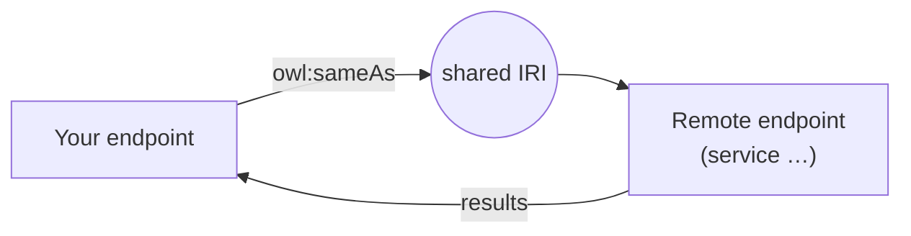

[TOC]

<!-- PROVENANCE KEY (delete this block before publishing)
     <!- - SOURCE: x - ->  text recycled from an existing page or deck, origin given
     <!- - NEW: x - ->     written for this page, with the reason
     <!- - LINK-TODO - ->  link points at a current path that will move in the restructure
-->

# SPARQL: construct, ask, describe and federation

Three chapters of this track have used `select`, which returns a table. The other
three query forms return something else, and one of them — `construct` — is the
reason SPARQL is a transformation language and not only a query language.

This chapter also covers federation: querying data that lives on someone else's
server as if it were your own.

It assumes [SPARQL: the basics](sparql.md) and
[graph patterns](sparql-graph-patterns.md).

## construct: a query that returns triples

<!-- SOURCE: Triply Academy course deck "Querying Knowledge Graphs" — the two kinds of
     construct query, and the Pikachu examples. -->

`construct` matches a pattern like any other query, but instead of filling a
table it builds triples. Because its output is a graph, that output can be loaded
straight back into a dataset. Matching and writing use the same language.

There are two kinds.

**`construct where`** returns exactly what it matched. The graph that comes out
has the same shape as the graph that went in:

```sparql
prefix pokemon: <https://triplydb.com/academy/pokemon/id/pokemon/>

construct where {
  pokemon:pikachu ?p ?o.
}
```

That returns every direct property of Pikachu. Reach deeper by adding patterns —
here, following into the audio resource as well:

```sparql
prefix pokemon: <https://triplydb.com/academy/pokemon/id/pokemon/>
prefix schema:  <http://schema.org/>

construct where {
  pokemon:pikachu
    ?p ?o;
    schema:audio ?audio.
  ?audio ?y ?z.
}
```

**A templated `construct`** separates the two graphs. The `where` clause says
what to match; the `construct` clause says what to build. They need not look
alike, which is what makes this a translation:

```sparql
prefix species: <https://triplydb.com/academy/pokemon/id/species/>
prefix vocab:   <https://triplydb.com/academy/pokemon/vocab/>

construct {
  ?pokemon a ?species.
}
where {
  ?pokemon vocab:species ?species.
  filter(?species in (species:dragon, species:mouse))
}
```

The source data relates a Pokémon to its species through `vocab:species`. The
output states the same fact as a class membership. Nothing was edited; a new
shape was derived from an old one.

This is the mechanism behind most data migration in linked data. When a model
changes, you write a `construct` that reads the old shape and emits the new one.

<!-- NEW: the closing paragraph. Neither source says out loud why construct matters,
     and readers otherwise file it as a curiosity. -->

## ask: a yes or no

<!-- SOURCE: course deck — ask as Graph → Y/N. -->

`ask` returns `true` or `false`: does anything match this pattern? It does not
return the matches themselves, which makes it cheap.

Use it for checks. "Does any product lack a manufacturer?" is an `ask` query, and
a scheduled `ask` is a serviceable data quality alarm.

<!-- NEW: the use-case sentence. The deck states what ask does but not what it is
     for; framing it as a check connects it to SHACL later in the Academy. -->

For structural quality checking at scale, [SHACL](shacl.md) is the better tool.

## describe: triples about a resource

<!-- SOURCE: course deck — the describe slides.
     NOTE: the deck's explicit advice ("do not use describe in production
     systems") was removed on review. Do not reinstate it from the deck without
     checking first. -->

`describe` takes an IRI and returns triples about it. It is the quickest way to
find out what a dataset holds about something.

The catch is that **what `describe` returns is not standardised**. Every
implementation decides how much of the surrounding graph to include, and that is
intentional — the form exists as a lookup for IRIs you cannot otherwise resolve.

That matters as soon as you build on it. When you need to be certain which
triples come back, use `construct`, which states exactly that.

And if you are reaching for `describe` to resolve an IRI, note that a plain HTTP
request already does that when the IRI is set up properly:

```bash
curl -H "Accept: application/n-triples" -L https://triplydb.com/academy/pokemon/id/pokemon/pikachu
```

Which is a reason to make your own IRIs resolvable.

## Changing stored data: SPARQL Update

<!-- SOURCE: triply-etl/enrich/sparql/update.md -->

`construct` returns a graph; it does not change one. **SPARQL Update** is the
separate language for that, with `insert data`, `delete data` and
`delete/insert … where`.

```sparql
base <https://triplydb.com/>

insert data { <john> <knows> <mary>. }
```

Keep the distinction clear: `construct` derives, Update mutates. In TriplyETL both
are available in the Enrich step, and `construct` is usually the safer of the two
because it leaves the source untouched.

<!-- NEW: the "derives versus mutates" framing. The two source pages document the
     functions separately and never contrast them, which is where the confusion
     starts. -->

## Federation: querying someone else's data

<!-- SOURCE: course deck — the federation section, the sameAs requirement, and the
     federated construct example. -->

A federated query runs partly on your endpoint and partly on another. The
`service` keyword marks the part that travels:

```sparql
prefix owl:     <http://www.w3.org/2002/07/owl#>
prefix pokemon: <https://triplydb.com/academy/pokemon/id/pokemon/>

construct {
  pokemon:pikachu ?p ?o.
}
where {
  pokemon:pikachu owl:sameAs ?dbpediaResource.
  service <https://dbpedia.org/sparql> {
    ?dbpediaResource ?p ?o.
    filter(isLiteral(?o))
  }
}
```



<!-- NEW: this diagram, replacing the deck's Linked Open Data Cloud slide. That image
     belongs to lod-cloud.net and is five years old, so we link to it instead of
     reproducing it. -->

The precondition is easy to miss: **the two endpoints must share at least one
term.** Without an IRI or literal in common there is nothing to join on. In
practice you create that overlap deliberately with `owl:sameAs`, which is exactly
the "link" in linked data.

For a sense of what is reachable this way, see the
[Linked Open Data Cloud](https://lod-cloud.net) — every dot is a queryable
dataset.

Two cautions before you build on federation. A federated query is only as
available as the slowest endpoint in it, and remote endpoints impose their own
result limits. Treat it as a way to explore and to prototype integrations, not as
a substitute for loading data you depend on.

<!-- NEW: the two cautions. Nothing in the sources mentions the failure mode, and it
     is the one that bites in production. -->

## Where this appears in Triply products

- **TriplyETL** runs `construct` and Update queries in its Enrich step.
  See [SPARQL Construct](../triply-etl/enrich/sparql/construct.md) and
  [SPARQL Update](../triply-etl/enrich/sparql/update.md).
- **TriplyETL validation** compares graphs, which is `construct` thinking applied
  to testing. See [Graph comparison](../triply-etl/validate/graph-comparison.md).
- **Saved queries** turn a `construct` query into an API that returns triples
  rather than a table.
  <!-- LINK-TODO: repoint to triplydb/how-to/saved-queries.md -->
  See [Saved queries](../triply-db-getting-started/saved-queries/index.md).

## Continue in the Academy

- [Querying real-world data](sparql-real-world-data.md) — hierarchies, geodata and
  statistics
- [SHACL](shacl.md) — checking data quality properly
- [Aggregation](sparql-aggregation.md) — back one chapter
- [SPARQL: the basics](sparql.md) — back to the start of the track
- [Glossary](glossary.md) — every term on this page, in one place

[← Back to the Triply Academy](index.md)