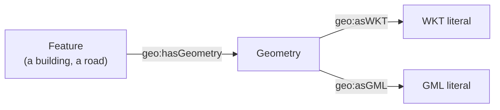

[TOC]

<!-- PROVENANCE KEY (delete this block before publishing)
     <!- - SOURCE: x - ->  text recycled from an existing page or deck, origin given
     <!- - NEW: x - ->     written for this page, with the reason
     <!- - LINK-TODO - ->  link points at a current path that will move in the restructure
-->

# SPARQL: querying real-world data

The first four chapters used a toy dataset, which is the right way to learn the
language. Actual datasets have shapes of their own, and three of them come back
so often in Dutch practice that they are worth knowing in advance: **hierarchies**,
**geometries** and **statistics**.

Each has a standard model behind it, and each becomes straightforward once you
recognise the model. This chapter is a field guide rather than a reference.

It assumes the first four chapters of the track, and
[property paths](sparql-graph-patterns.md#property-paths-following-a-chain) in
particular.

## Hierarchies

<!-- SOURCE: Triply Academy course deck "Querying Knowledge Graphs" — transitive
     predicates and the parent/child query behind the org chart and treemap. -->

Taxonomies, classification schemes, organisational structures and asset
breakdowns are all the same shape: things pointing at their parents. Four
predicates cover most of what you will meet:

| Predicate | Relates |
| --- | --- |
| `rdfs:subClassOf` | A class to a broader class |
| `rdfs:subPropertyOf` | A property to a broader property |
| `skos:broader` | A concept to a broader concept |
| `skos:narrower` | A concept to a narrower concept |

All four are transitive in intent: if A is under B and B is under C, then A is
under C. Whether those indirect links exist *as triples* depends on whether
anyone inferred them. This is why property paths matter here — `skos:broader+`
walks the chain whether or not the shortcuts were materialised.

SKOS distinguishes the two explicitly: `skos:broader` is the direct step, and
`skos:broaderTransitive` is the closure. Querying with
`skos:broaderTransitive*/skos:notation "88"` finds everything at or beneath the
concept numbered 88, however deep.

The query that drives most hierarchy visualisations returns pairs — one row per
child with its parent:

<!-- TODO — REPLACE WITH A TRIPLY-HOSTED DATASET
     This query is generic SKOS and matches nothing in particular. Repoint it at a
     concept scheme we host, so the reader can run it. A cultural-heritage or
     government thesaurus would suit this chapter best. Once chosen, add the
     prefix declarations and a one-line note saying which scheme is being queried. -->

```sparql
prefix skos: <http://www.w3.org/2004/02/skos/core#>

select distinct ?childLabel ?parentLabel
where {
  ?child
    skos:broaderTransitive ?parent;
    skos:prefLabel ?childLabel.
  ?parent skos:prefLabel ?parentLabel.
}
```

A tree, a treemap and a sunburst are all the same two columns drawn differently.

<!-- TODO — SCREENSHOT NEEDED
     A hierarchy visualisation from the TriplyDB Insights page — treemap or
     sunburst — placed directly after the sentence above. Purpose: show that one
     parent/child result set can be drawn three ways. This is far easier to show
     than to describe.
     Save as docs/assets/ and reference as ../assets/<filename>.png -->

See [SKOS](skos.md) for the model itself.

## Geometries

<!-- SOURCE: course deck — the GeoSPARQL model, asWKT, anonymous-node compaction and
     the BAG examples; viewing-data/index.md for the predicates the LD browser reads. -->

Geospatial linked data follows **GeoSPARQL**, and its structure trips people up
because there are three levels, not two:



A **feature** is the thing in the world. A **geometry** is its shape. A
**serialisation** is that shape written down, in Well-Known Text (WKT) or GML. The
split exists because one feature can have several shapes — a 2D footprint and a
3D model — and each shape can be written in more than one format.

So a query for shapes goes through the middle step:

<!-- TODO — REPLACE WITH A TRIPLY-HOSTED DATASET
     Both geo examples below come from a 2020 lecture and use
     bag.basisregistraties.overheid.nl, which may no longer resolve. Repoint them
     at a geodataset we host — triplydb.com/osm/osm is one candidate, the Kadaster
     work is another — and rerun both queries before publishing. The GeoSPARQL
     pattern itself (feature -> geometry -> asWKT) stays the same whichever
     dataset we pick; only the prefixes and the class change. -->

```sparql
prefix bag: <http://bag.basisregistraties.overheid.nl/def/bag#>
prefix geo: <http://www.opengis.net/ont/geosparql#>

select ?feature ?shape
where {
  ?feature
    a bag:Pand;
    geo:hasGeometry ?geometry.
  ?geometry geo:asWKT ?shape.
}
limit 1
```

The `?geometry` variable is never used in the output, which is precisely the case
for a property path and an anonymous node:

```sparql
prefix bag: <http://bag.basisregistraties.overheid.nl/def/bag#>
prefix geo: <http://www.opengis.net/ont/geosparql#>

select ?shape
where {
  [ a bag:Pand;
    geo:hasGeometry/geo:asWKT ?shape ].
}
limit 1
```

Same query, two fewer moving parts.

<!-- TODO — SCREENSHOT NEEDED
     A WKT geometry rendered on a map, placed here. Purpose: close the loop
     between "the query returns a text literal" and "a shape appears on a map",
     which is the step readers do not expect. A Dutch example (a BAG building or
     a street) is preferable to a generic one.
     Save as docs/assets/ and reference as ../assets/<filename>.png -->

A simpler predicate exists for point locations: `geo:location` carries
coordinates directly, without the geometry step. Use it when a single point is
all you have.

What happens to a WKT literal after it is returned — whether it lands on a map,
gets a colour or a height — is a property of the tool displaying it, not of
SPARQL.
<!-- LINK-TODO: repoint to triplydb/how-to/view-data.md -->
See [Viewing data](../triply-db-getting-started/viewing-data/index.md#geo).

## Statistics

<!-- SOURCE: course deck — the RDF Data Cube section, using the Gapminder-style
     life expectancy example. -->

Statistical data uses the **RDF Data Cube** vocabulary, which is a linked data
expression of the same model behind SDMX. Three concepts carry it:

| Term | What it is |
| --- | --- |
| **Observation** | One measured value — the equivalent of a single cell |
| **Dimension** | What identifies that value: place, year, age group |
| **Measure** | What was actually measured: life expectancy, population |

An observation states its dimensions and its measure together:

<!-- TODO — REPLACE WITH A TRIPLY-HOSTED DATASET
     This is the chapter's biggest gap. The Turtle snippet and the query below use
     placeholder prefixes (<...>) because the lecture's cube lived on a Kadaster
     labs endpoint. Pick a data cube we host and fill them in — the Gapminder life
     expectancy data used in Triply's own demos is one candidate, a CBS or
     statistical dataset another. This is also the best page in the Academy to
     show a cube we are proud of, so it is worth choosing deliberately rather than
     taking whatever is nearest.
     Once chosen: fill the three prefixes, verify the query runs, and check that
     the observation snippet matches the real structure definition. -->

```turtle
observation:0007ddade4
  a qb:Observation;
  qb:dataSet dataset:countries;
  dimension:location country:Netherlands;
  dimension:year "2002"^^xsd:gYear;
  measure:lifeExpectancy 7.9696e1.
```

A fourth piece, the **data structure definition**, declares which dimensions and
measures a dataset uses. Read it first when you meet an unfamiliar cube — it is
the table of contents.

Querying a cube is nearly always the same move: **fix the dimensions you are not
interested in, vary the one you are, and return the measure.** Fix the year and
vary the country to compare places; fix the country and vary the year to see a
trend.

```sparql
prefix dimension: <...>
prefix measure:   <...>
prefix qb:        <http://purl.org/linked-data/cube#>
prefix rdfs:      <http://www.w3.org/2000/01/rdf-schema#>
prefix xsd:       <http://www.w3.org/2001/XMLSchema#>

select ?countryName ?value
where {
  ?observation
    a qb:Observation;
    dimension:year "2007"^^xsd:gYear;
    dimension:location ?country;
    measure:lifeExpectancy ?value.
  ?country rdfs:label ?countryName.
}
```

That is a chart: one column of labels, one column of numbers.

<!-- NEW: the "fix, vary, return" formulation. The deck demonstrates it across
     several slides without naming it, and named, it is the whole technique. -->

## Where this appears in Triply products

- **TriplyETL ships the vocabularies** for all three shapes — GeoSPARQL, the Data
  Cube vocabulary, SKOS and more — so you do not declare them yourself.
  See [Supported vocabularies](../triply-etl/generic/vocabularies.md).
- **TriplyDB's Insights page** builds its class hierarchy from `rdfs:subClassOf`,
  which is the first pattern on this page.
  <!-- LINK-TODO: repoint to triplydb/how-to/view-data.md -->
  See [Viewing data](../triply-db-getting-started/viewing-data/index.md#class-hierarchy).
- These three shapes are the backbone of Triply's public-sector work: cadastral
  and building data, national statistics, and controlled vocabularies in the
  cultural heritage sector.

## Continue in the Academy

- [SKOS](skos.md) — the model behind the hierarchies on this page
- [OWL and ontologies](owl-ontologies.md) — where `rdfs:subClassOf` comes from
- [Construct, ask, describe and federation](sparql-construct-and-federation.md) —
  back one chapter
- [SPARQL: the basics](sparql.md) — back to the start of the track
- [Glossary](glossary.md) — every term on this page, in one place

[← Back to the Triply Academy](index.md)