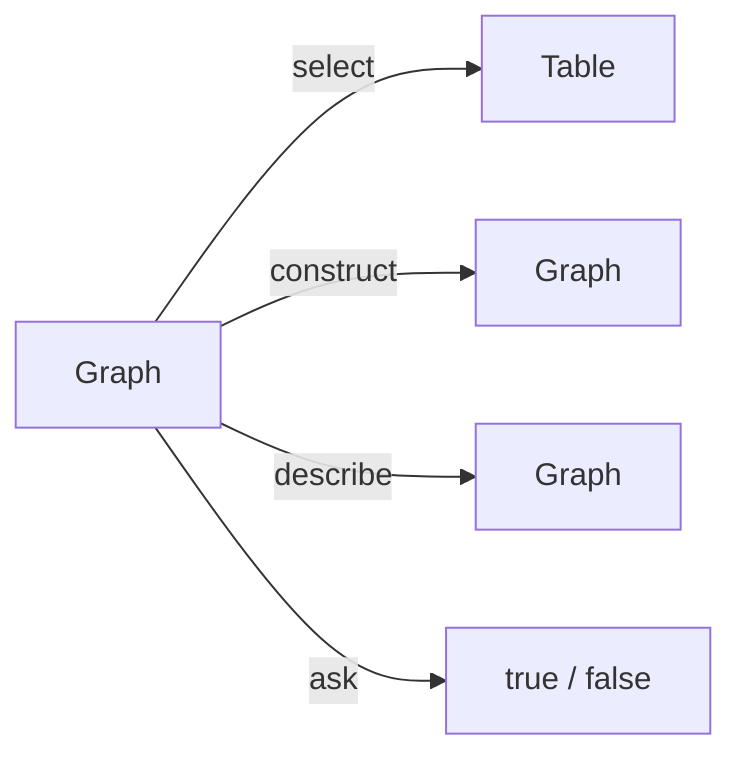

[TOC]

<!-- PROVENANCE KEY (delete this block before publishing)
     <!- - SOURCE: x - ->  text recycled from an existing page or deck, origin given
     <!- - NEW: x - ->     written for this page, with the reason
     <!- - LINK-TODO - ->  link points at a current path that will move in the restructure
-->

# SPARQL: the basics

SPARQL is the standard query language for linked data. It is to a knowledge graph
what SQL is to a relational database, with one difference that shapes everything
else: you do not query rows and columns, you query patterns of triples.

This is the first of five chapters on SPARQL. By the end of it you can read a
query, write one yourself, and run it against a public dataset.

If triples, IRIs and literals are new to you, read [Linked data](linked-data.md)
first.

## A query turns a graph into something else

<!-- SOURCE: Triply Academy course deck "Querying Knowledge Graphs" (Beek & De Groot),
     which frames the four forms as transformations. Clearer than the four-row
     "what it does" table I drafted first, so that version is replaced. -->

Every query starts with one of four keywords. They share the same way of
matching data and differ only in what comes back.



| Form | Returns | Use it when |
| --- | --- | --- |
| `select` | A table of bindings | You want data for a report, a chart or an export |
| `construct` | A new set of triples | You want to reshape or merge data |
| `ask` | `true` or `false` | You want to check whether something exists |
| `describe` | Triples about a resource | You are exploring something unfamiliar |

This chapter uses `select`. The other three are covered in
[construct, ask, describe and federation](sparql-construct-and-federation.md).

## Reading a table as a graph query

<!-- SOURCE: course deck — the table/SPARQL vocabulary mapping. Recycled as-is
     because it is the fastest way to make a SQL-shaped mental model transfer. -->

A `select` query builds a table out of a graph. Three words do most of the work,
and they line up with things you already know:

| In the table | In SPARQL |
| --- | --- |
| A column | A variable |
| A cell | A binding |
| A row | A result |

You write the pattern; the engine fills the cells.

## The anatomy of a select query

<!-- SOURCE: course deck — prologue / projection / pattern / modifier. -->

Every `select` has up to four parts, always in this order.

```sparql
prefix vocab: <https://triplydb.com/academy/pokemon/vocab/>   # prologue

select ?pokemon ?colour                                       # projection
where {
  ?pokemon vocab:colour ?colour.                              # pattern
}
limit 10                                                      # modifier
```

- The **prologue** declares abbreviations used later in the query.
- The **projection** names the columns.
- The **pattern** decides which cells get filled.
- The **modifier** operates on the finished rows.

Learn these four names now. Every SPARQL error message and every later chapter
refers to one of them.

## Triple patterns and variables

The pattern is built from **triple patterns**: a subject, a predicate and an
object, where any of the three can be a **variable**. Variables start with a
question mark.

Read `?pokemon vocab:colour ?colour.` as a sentence with two blanks: *something
has a colour, which is something*. The engine finds every triple that fits and
records what the variables took. That recording is the binding.

Two conventions save you time later. Name variables after what they hold —
`?pokemon`, not `?x`. And end every triple pattern with a full stop.

`select *` returns a column for every variable in the pattern. It is convenient
while exploring and a poor idea in anything you save, because the column order is
not guaranteed.

<!-- NEW: the last sentence. The deck notes that "columns appear in unspecified
     order" but does not draw the conclusion. It is a real source of broken
     downstream scripts. -->

## Writing IRIs short

<!-- SOURCE: course deck — IRI abbreviation overview and datatype abbreviations. -->

Full IRIs make queries unreadable. There are three shorter forms:

| Notation | Example |
| --- | --- |
| Absolute IRI | `<http://www.w3.org/1999/02/22-rdf-syntax-ns#type>` |
| Prefixed IRI | `rdf:type`, after declaring the prefix in the prologue |
| `a` | Shorthand for `rdf:type`, and only in the predicate position |

Literals abbreviate too. Write the value and SPARQL infers the datatype:

| You write | Datatype |
| --- | --- |
| `false` | `xsd:boolean` |
| `11` | `xsd:integer` |
| `1.1` | `xsd:decimal` |
| `1.1e0` | `xsd:double` |
| `"abc"` | `xsd:string` |

When you need a datatype that has no shorthand, write it out:
`"2026-08-26"^^xsd:date`.

## Adding a column that is not in the data

<!-- SOURCE: course deck — bind, including the unit-conversion example. -->

`bind` creates a column from a calculation rather than from a match. The form is
`bind(VALUE as ?VARIABLE)`.

```sparql
prefix vocab: <https://triplydb.com/academy/pokemon/vocab/>
prefix xsd:   <http://www.w3.org/2001/XMLSchema#>

select ?pokemon ?weightKilograms ?weightPounds
where {
  ?pokemon vocab:weight ?weightKilograms.
  bind(?weightKilograms * "2.20462"^^xsd:float as ?weightPounds)
}
limit 10
```

The dataset holds kilograms. The query returns pounds as well, without anything
being written back.

## Modifiers: fewer rows, better order

<!-- SOURCE: course deck — limit, offset, order by, desc, multiple sort criteria. -->

Modifiers act on the finished table.

- `limit 25` returns at most 25 rows.
- `offset 250` skips the first 250 rows. With `limit`, this walks through results
  in pages.
- `order by ?weight` sorts ascending; `order by desc(?weight)` reverses it.
- `order by ?type ?weight` sorts by several criteria in turn.

Always put a `limit` on an exploratory query. Without one you will wait for a
result you were not going to read.

<!-- NEW: the advice sentence. Not in any source, but it is the single most useful
     habit for a new user of a large dataset. -->

## Running a query

<!-- SOURCE: triply-api/index.md#sparql (endpoint pattern, service types, access rules)
     and viewing-data/index.md#sparql-ide, both condensed hard. Detail deliberately
     left in the product documentation. -->

A dataset can be queried once it has a running SPARQL service. TriplyDB offers
two: **Sparql**, for large amounts of instance data with a small data model, and
**Jena**, for smaller amounts of data with a richer data model.

From there you can query in a browser editor, send the query to the endpoint from
your own code, or save it so that it gets a persistent URL and becomes a REST
API. See
<!-- LINK-TODO: repoint to triplydb/how-to/view-data.md and triplydb/how-to/saved-queries.md -->
[Viewing data](../triply-db-getting-started/viewing-data/index.md) and
[Saved queries](../triply-db-getting-started/saved-queries/index.md) for how each
of those works.

Access follows the dataset: anyone can query a public dataset, while internal and
private datasets require a login and, for private datasets, membership of the
owning account.

To practise without setting anything up, use the Pokémon dataset published by the
Triply Academy account. Every example in these five chapters runs against it:

```none
https://api.triplydb.com/datasets/academy/pokemon/services/pokemon/sparql
```

## One limit worth knowing early

<!-- SOURCE: generics/sparql-pagination.md -->

A SPARQL query returns at most **10,000 results**. If your query matches more, you
get the first 10,000 and no warning that there were more. Before concluding that
data is missing, check whether you have hit the ceiling.

Two routes get past it, both requiring a saved query: the saved query API takes
`page` and `pageSize` parameters, and TriplyDB.js pages for you.

<!-- NEW: "and no warning that there were more". The source states the limit
     neutrally; in practice this arrives as a support question. Confirm the
     behaviour is still silent. -->

## Where this appears in Triply products

- **TriplyDB** — the query editor, saved queries and result visualisations.
  <!-- LINK-TODO: repoint to triplydb/how-to/ -->
  See [Viewing data](../triply-db-getting-started/viewing-data/index.md).
- **The API** — endpoints, request methods and result formats.
  <!-- LINK-TODO: repoint to triplydb/reference/api.md -->
  See [Triply API](../triply-api/index.md).
- **TriplyETL** — queries that transform data, in the Enrich step.
  See [Enrich](../triply-etl/enrich/index.md).

## Continue in the Academy

- [Graph patterns](sparql-graph-patterns.md) — combining patterns, filters and
  property paths
- [Aggregation](sparql-aggregation.md) — counting and grouping results
- [Construct, ask, describe and federation](sparql-construct-and-federation.md) —
  the other three query forms
- [Querying real-world data](sparql-real-world-data.md) — hierarchies, geodata and
  statistics
- [Linked data](linked-data.md) — the triples these queries match against
- [Glossary](glossary.md) — every term on this page, in one place

[← Back to the Triply Academy](index.md)