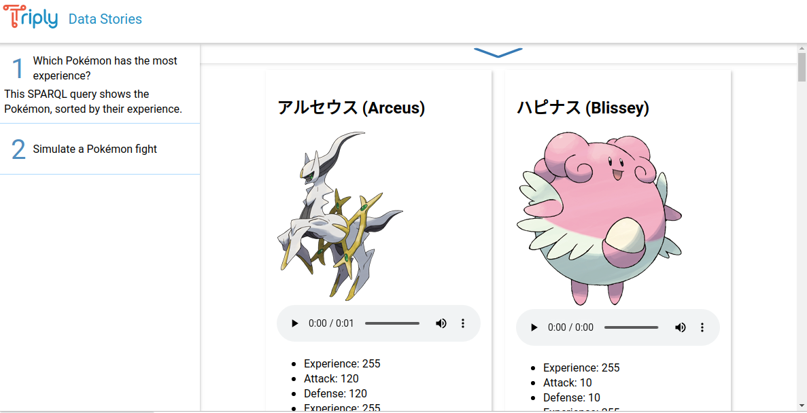

Data Stories allows a sequence of SPARQL queries to be published
within an HTML document.
Examples of such stories can be found [here](https://stories.triply.cc)

## Getting Started

To get started with Data Stories contact us at [info@triply.cc](info@triply.cc).

### Minimal working example

```html
<!DOCTYPE html>
<html lang="en-us">
  <head>
    <meta charset="utf-8" />
    <meta name="author" content="{{FIRST-AUTHOR}}, {{SECOND-AUTHOR}}, …" />
    <meta
      name="description"
      content="{{INSTANCE}} Data Stories ― {{STORY-TITLE}}"
    />
    <title>{{INSTANCE}} Data Stories ― {{STORY-TITLE}}</title>
    <link rel="stylesheet" href="{{LINK-TO-STORIES-CSS}}" />
  </head>
  <body>
    <query
      data-config-ref="https://triplydb.com/academy/sparql/queries/sparql-query"
      data-endpoint="https://triplydb.com/academy/sparql/sparql/sparql"
    >
    </query>
    <script src="{{LINK-TO-STORIES-JS}}"></script>
    <script type="text/javascript">
      window.onload = function() {
        window.stories();
      };
    </script>
  </body>
</html>
```

## Components

Data Stories defines the following two HTML elements:

- `<div class="story">` :: The tag that contains zero or more
  `<query>` tags and that implements the Data Story.

- `<query>` :: The tag that implements one query within the Data
  Story.

### Story {#story}

The following attributes are defined on a `<div class="story">`
element:

- `data-endpoint`: The URI of the SPARQL endpoint against which all queries in the Data Story are executed.

- `data-output`: The output format that is used to display SPARQL
  result sets in. The following values are
  supported:

  <dl>
    <dt>raw</dt>
    <dd>The textual content of the HTTP reply body. For
      example, the SPARQL result set serialized in XML, JSON,
      or CSV.</dd>

    <dt>table</dt>
    <dd>Shows the results in rows of an HTML table. This is
      the default value.</dd>
    <dt>boolean</dt>
    <dd>Shows the result of an `ask` query.</dd>
    <dt>error</dt>
    <dd>Display the error value.</dd>
    <dt>gallery</dt>
    <dd>Shows HTML widgets in card rows.</dd>
    <dt>gchart</dt>
    <dd>Shows a UI for selecting numeric properties in order
      to generate various diagrams.</dd>
    <dt>geo</dt>
    <dd>Shows GeoSPARQL results on a 2D map.</dd>
    <dt>geo3d</dt>
    <dd>Shows GeoSPARQL results on a 3D map.</dd>
    <dt>geo-events</dt>
    <dd>Shows events with a geospatial component on a timeline/map.</dd>
    <dt>pivot</dt>
    <dd>Shows a UI for selecting numeric properties in order
      to generate various diagrams and pivot tables.</dd>
    <dt>timeline<dt>
    <dd>Shows events on a timeline.</dd>
  </dl>

### Query {#query}

The following attributes are defined on the `query` element:

- `data-config-ref="URI"`: The URI of a saved query in TriplyDB.

- `data-config="URI"`: A URI that encodes a query together with
  the configuration of a specific view. These URIs can be
  created within the SPARQL IDE.

- `data-endpoint="URI"`: The URI of the SPARQL endpoint against
  which a particular query is evaluated. When absent, the value
  of this attribute on the `<div class="story">` tag is used.

- `data-query-ref="URI"`: An absolute or relative URI to a file
  that stores a SPARQL query.

- `data-output="VALUE"`: The output format that is used to display
  the SPARQL result set. When absent, the value of this
  attribute on the `<div class="story">` tag is used. See the
  documentation of the Story element for the supported values.

- `data-show-query`: By default, the query editor is hidden. When
  this attribute is present, the query editor is shown.

### Stacked story {#stacked}

Stacked stories (see [here](https://stories.triply.cc/pok%C3%A9mon/) for an example) render the story using tabbed UI, contrary to the regular stories that draw queries below each other.



A stacked story is initialized by an article tag with the following attributes

```html
<article data-stacked="true"></article>
```

Each item of the stacked story is a section with therein a header and a [query](#query) element

```html
<article data-stacked="true">
  <section data-title="Which Pokémon has the most experience?">
    <header>
      This SPARQL query shows the Pokémon, sorted by their experience.
    </header>
    <query data-query-ref="./query/gallery.rq" data-output="gallery"></query>
    <section></section>
  </section>
</article>
```

The title of the section is set by the `data-title` attribute in the `section` element
