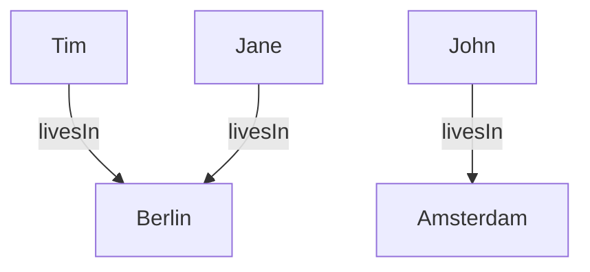

[TOC]

# JSON-LD Framing
## Why JSON-LD Framing?

SPARQL Construct and SPARQL Describe queries can return results in the JSON-LD format. Here is an example:

```json
[
  {
    "@id": "john",
    "livesIn": { "@id": "amsterdam" }
  },
  {
    "@id": "jane",
    "livesIn": { "@id": "berlin" }
  },
  {
    "@id": "tim",
    "livesIn": { "@id": "berlin" }
  }
]
```

JSON-LD is one of the serialization formats for RDF, and encodes a graph structure. For example, the JSON-LD snippet above encodes the following graph:



The triples in a graphs do not have any specific order. In our graph picture, the triple about Tim is mentioned first, but this is arbitrary. A graph is a set of triples, so there is no 'first' or 'last' triple. Similarly, there is no 'primary' or 'secondary' element in a graph structure either. In our graph picture, persons occur on the left hand-side and cities occur on the right hand-side. In fact, the same information can be expressed with the following graph:

Most REST APIs return data with a specific, often tree-shaped structure. For example:

```json
{
  "amsterdam": {
    "inhabitants": [
      "john"
    ]
  },
  "berlin": {
    "inhabitants": [
      "jane",
      "tim"
    ]
  }
}
```

JSON-LD Framing is a standard that is used to assign additional structure to JSON-LD. With JSON-LD Framing, we can configure the extra structure that is needed to create REST APIs over SPARQL queries.

JSON-LD Framing are a deterministic translation from a graph, which has an unordered set of triples where no node is "first" or "special", into a tree, which has ordered branches and exactly one "root" node. In other words, JSON-LD framing allows one to force a specific tree layout to a JSON-LD document. This makes it possible to translate SPARQL queries to REST-APIs.

The TriplyDB API for saved queries has been equipped with a JSON-LD profiler which can apply a JSON-LD profile to a JSON-LD result, transforming the plain JSON-LD to framed JSON. To do this you need two things. A SPARQL construct query and a JSON-LD frame. When you have both of these, you can retrieve plain JSON from a SPARQL query. The revelant cURL command when both the SPARQL query and JSON-LD frame are available is:

```bash
curl -X POST [SAVED-QUERY-URL] \
  -H 'Accept: application/ld+json;profile=http://www.w3.org/ns/json-ld#framed' \
  -H 'Authorization: Bearer [YOUR_TOKEN]' \
  -H 'Content-type: application/json' \
  -d '[YOUR_FRAME]'
```

When sending a curl request, a few things are important. First, the request needs to be a `POST` request. Only a `POST` request can accept a frame as a body. The `Accept` header needs to be set to a specific value. The `Accept` header needs to have both the expected returned content-type and the JSON-LD profile, e.g. `application/ld+json;profile=http://www.w3.org/ns/json-ld#framed`. When querying an internal or private query you need to add an authorization token. Finally, it is important to set the `Content-type`. It refers to the content-type of the input body and needs to be `application/json`, as the frame is of type `application/json`.

## The SPARQL Query

Let's start with the SPARQL query. A JSON-LD frame query needs a SPARQL `CONSTRUCT` query to create an RDF graph that is self contained and populated with relevant vocabulary and data. The graph in JSON-LD is used as input for the REST API call. The SPARQL `CONSTRUCT` query can be designed with API variables.

Do note that API variables with `OPTIONAL`s can sometimes behave a bit different than regular API variables. This is due to how SPARQL interprets `OPTIONAL`s. If an API variable is used in an `OPTIONAL`, the query will return false positives, as the `OPTIONAL` does not filter out results matching the API-variable.

Also note that the use of `UNION`s can have unexpected effects on the SPARQL query. A union could split up the result set of the SPARQL query. Meaning that the SPARQL engine first exhausts the top part of the `UNION` and then starts with the second part of the `UNION`. This means that the first part of the result set can be disconnected from the second part. If the limit is set too small the result set is separated in two different JSON-LD documents. This could result in missing data in the response.

Finally, please note that it can happen that you set a `pageSize` of `10` but the response contains less than `10` results, while the next page is not empty. This is possible as the result set of the `WHERE` clause is limited with a limit and not the `CONSTRUCT` clause. This means that two rows of the resulting `WHERE` clause are condensed into a single result in the `CONSTRUCT` clause. Thus the response of the API can differ from the `pageSize`.

The result is a set of triples according to the query. Saving the SPARQL query will resolve in a saved query. The saved query has an API URL that we can now use in our cURL command. The URL most of the time starts with `api` and ends with `run`.

The saved query url of an example query is:

```bash
https://api.triplydb.com/queries/JD/JSON-LD-frame/run
```

You could use API variables with a `?` e.g. `?[queryVariable]=[value]`

## The Frame

The SPARQL query is not enough to provide the RDF data in a JSON serialization format. It requires additional syntactic conformities that cannot be defined in a SPARQL query. Thus the SPARQL query that was created needs a frame to restructure JSON-LD objects into JSON. The JSON-LD 1.1 standard allows for restructuring JSON-LD objects with a frame to JSON.

A JSON-LD frame consists out of 2 parts. The `@context` of the response, and the structure of the response. The complete specification on JSON-LD frames can be found [online](https://w3c.github.io/json-ld-framing/)

The `@context` is the translation of the linked data to the JSON naming. In the `@context` all the IRIs that occur in the JSON-LD response are documented, with key-value pairs, where the key corresponds to a name the IRI will take in the REST-API response and the value corresponds to the IRI in the JSON-LD response. Most of the time the key-value pairs are one-to-one relations, where one key is mapped to a single string. Sometimes the value is an object. The object contains at least the `@id`, which is the IRI in the JSON-LD response. The object can also contain other modifiers, that change the REST-API response. Examples are, `@type` to define the datatype of the object value, or `@container` to define the container where the value in the REST-API response is stored in. The context can also hold references to vocabularies or prefixes.

The second part of the JSON-LD frame is the structure of the data. The structure defines how the REST-API response will look like. Most of the time the structure starts with `@type` to denote the type that the rootnode should have. Setting the `@type` is the most straightforward way of selecting your rootnode. The structure is built outward from the rootnode. You can define a leafnode in the structure by adding an opening and closing bracket, as shown in the example. To define a nested node you first need to define the key that is a object property in the JSON-LD response that points to another IRI. Then from that IRI the node is created filling in the properties of that node.

```json
{
  "@context": {
    "addresses": "ex:address",
    "Address": "ex:Address",
    "Object": "ex:Object",
    "street": "ex:street",
    "number": {
      "@id": "ex:number",
      "@type": "xsd:integer"
    },
    "labels": {
      "@id": "ex:label",
      "@container": "@set"
    },
    "ex": "https://triply.cc/example/",
    "xsd": "http://www.w3.org/2001/XMLSchema#"
  },
  "@type": "Object",
  "labels": {},
  "addresses": {
    "street": {},
    "number": {}
  }
}
```

The JSON-LD frame together with the SPARQL query will now result in a REST-API result:

```bash
curl -X POST https://api.triplydb.com/queries/JD/JSON-LD-frame/run \
  -H 'Accept: application/ld+json;profile=http://www.w3.org/ns/json-ld#framed' \
  -H 'Content-type: application/json' \
  -d '{
    "@context": {
      "addresses": "ex:address",
      "Address": "ex:Address",
      "Object": "ex:Object",
      "street": "ex:street",
      "number": {
        "@id": "ex:number",
        "@type": "xsd:integer"
      },
      "labels": {
        "@id": "ex:label",
        "@container": "@set"
      },
      "ex": "https://triply.cc/example/",
      "xsd": "http://www.w3.org/2001/XMLSchema#"
    },
    "@type": "Object",
    "labels": {},
    "addresses": {
      "street": {},
      "number": {}
    }
  }'
```

The JSON-LD frame turns SPARQL results for the query in step 1 into a format that is accepted as plain REST API request.


## Using SPARQL to create a frame

Another way to create a frame is by using the SPARQL editor in TriplyDB. 

You can access the JSON-LD editor by clicking the three dots next to the SPARQL editor, and then selecting "To JSON-LD frame editor".


Afterwards, the JSON script from above should be added to the JSON-LD Frame editor.


Running the script results in the following REST-API result: 


This can also be accessed by the generated API Link above the SPARQL editor. 
Copying and pasting the generated link will direct you to a page where you can view the script:


