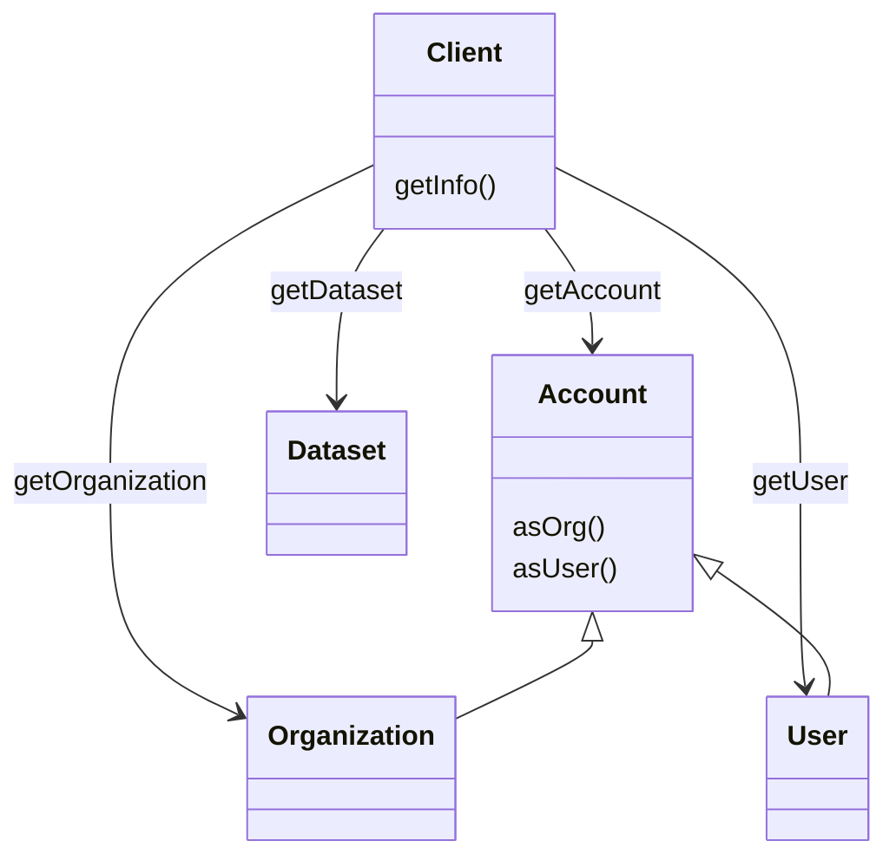

**TriplyDB.js** is the official programming library for interacting with [TriplyDB](https://triply.cc/docs/triply-db-getting-started).  TriplyDB.js allows you to automate most operations that can be performed through the TriplyDB GUI.  TriplyDB.js is implemented in [TypeScript](https://www.typescriptlang.org).

Please contact [support@triply.cc](mailto:support@triply.cc) for questions and suggestions.

# 1. Getting started

In this section we set up a simple project that uses TriplyDB.js.  Most of these steps are generic for setting up a Yarn-based TypeScript project.

1. Install [Node.js](https://nodejs.org) and [Yarn](https://yarnpkg.com) on your system.

2. Create a directory for your project:

   ```sh
   mkdir my_project
   cd my_project
   ```

3. Inside your newly created directory, initialize a standard [Yarn project](https://classic.yarnpkg.com/en/docs/creating-a-project/):

   ```sh
   yarn init -y
   ```

   This will create a `package.json` file.

4. Add TypeScript and TriplyDB.js as dependencies:

   ```sh
   yarn add typescript @triply/triplydb
   ```

5. Initialize a default TypeScript project:

   ```sh
   ./node_modules/.bin/tsc --init
   ```

   This create a [tsconfig.json](https://www.typescriptlang.org/docs/handbook/tsconfig-json.html) file.

6. Create an API token through the TriplyDB GUI: log into your TriplyDB account, go to your user settings page, and select the “API tokens” tab.

   See [this video](https://youtu.be/ACfOY2a_VVM) for instructions on how to create an API token.

7. Create a file called `main.ts` in your favorite text editor.  Add the following content, where `"API_TOKEN"` is your API token created in the previous step.

   ```typescript
   import Client from "@triply/triplydb"
   const client = Client.get({ token: "API_TOKEN" })
   async function run() {
     console.log(await client.getAccount())
   }
   run().catch(e => {
     console.error(e)
     process.exit(1)
   })
   ```

8. Transpile the TypeScript file (`main.ts`) into a JavaScript file (`main.js`):

   ```sh
   ./node_modules/.bin/tsc
   ```

9. Run the JavaScript file (`main.js`):

   ```sh
   node main.js
   ```

   This should print your user name.

## 1.1 Securing your API token

Notice that your API token was included in your script (step 7).  This was done to have a working script quickly, but is not a good practice!

For example, if you would publish you script on the web, or share it in some other way, people would be able to see your API token and obtain access to your TriplyDB account.

This is why it is advised to load the API token from your development environment instead.  TriplyDB.js uses the environment variable `TRIPLY_API_TOKEN` to this effect.

### 1.1.1 Setting an environment variable in macOS or Linux

In macOS and Linux, the environment varialbe is set as follows:

```sh
export TRIPLY_API_TOKEN=<my-token>
```

Make sure that no whitespace appears around the `=` character.  This is a common mistake.

On Linux, you can add the `export` command to your `.profile` file.  This is file is typically present in your home directory (`~/.profile`).  This will automatically run the `export` command whenever a new terminal session starts.

Once the API token is configured as an environment variable, you can read it from your script in the following way:

```typescript
const client = Client.get({ token: process.env.TRIPLY_API_TOKEN })
```

### 1.1.2 Setting an environment variable in Windows

## 1.2 Using the Atom text editor

The [Atom](https://atom.io) text editor provides advanced support for programming in TypeScript.  This will make it easier to use TriplyDB.js, since the editor will provide various forms of feedback.  You can set-up Atom in the following way:

1. Install the [Atom](https://atom.io) text editor on your system.

2. Open file `tsconfig.json`, and make sure the following settings are included:

   ```json
   "target": "es2020",
   "lib": ["es2020"],
   ```

   This will ensure that you use the latest version of TypeScript.

3. From within the Atom preferences page, install the [`atom-typescript`](https://atom.io/packages/atom-typescript) package.  You can use the `Crtl+,` key combination in order to open the preferences page.  Then navigate to “Install”.

4. Start Atom from your project directory:

   ```sh
   cd my_project
   atom .
   ```

5. You can also install package [Script](https://atom.io/packages/script) to run your script from within the editor environment.

## 1.3 Improved error handling

The script that was shown earlier in this section includes minimal error handling:

```typescript
run().catch(e => {
  console.error(e)
  process.exit(1)
})
```

The following code can be added to the end of the script to use more advanced error handling:

```typescript
process.on("uncaughtException", function (err) {
  console.error("Uncaught exception", err)
  process.exit(1)
})
process.on("unhandledRejection", (reason, p) => {
  console.error("Unhandled Rejection at: Promise", p, "reason:", reason)
  process.exit(1)
})
```

# 2. Common use cases

## 2.1 Creating a new dataset

## 2.2 Updating an existing dataset

## 2.3 Starting a service

## 2.4 Running a query

## 2.5 Uploading query results

## 2.6 Creating an organization with members

# 3. Reference

This section documents all object types and methods in TriplyDB.js.

Every method in this reference section comes with at least one code example.  These code examples can be run by inserting them into the following code snippet.  See the [Getting started](#getting-started) section on how to get this script up and running on your system.

```typescript
import Client from "@triply/triplydb"
const client = Client.get({token: process.env.TRIPLY_API_TOKEN})
async function run() {
  // This is where the code examples in this reference should be placed.
}
run().catch(e => {
  console.error(e)
  process.exit(1)
})
```

The following subsections document the various TriplyDB.js object types.  Each object type comes with its own methods.



## 3.1 Client

Instances of the `Client` object type are specific client connections that are set-up with a TriplyDB instance.  Client connections can be created with and with setting an API Token.

Without setting an API Token the client object can be used to perform read-only operations over public data.  The following creates a client object without setting an API Token:

```typescript
import Client from "@triply/triplydb"
const client = Client.get({url: "https://api.triplydb.com"})
```

When an API Token is specified, the access level of the token and the credentials of the user account for which the token was created determine the operations that can be performened.  This may include read operations over private data, write operations, and management operations.  The following create a client object with a specific API Token:

```typescript
import Client from "@triply/triplydb"
const client = Client.get({token: process.env.TRIPLY_API_TOKEN})
```

It is typical for one TriplyDB.js script to have exactly one client object.

### Client.getAccount()

Returns the account object that is associated with the current API token.

See [`Client.getAccount(name: string)`](#clientgetaccountname-string) for more information.

### Client.getAccount(name: string)

Returns the TriplyDB account with the given `name`.

There are two kinds of accounts:
  - When `name` is the name of a user, a [User](#user) object is returned.
  - When `name` is the name of an organization, an [Organization](#organization) object is returned.

The following example retrieves an organization called `acme`:

```typescript
const account = await client.getAccount("acme")
```

See section [`Account`](#account) for an overview of the methods that can be used with account objects.

### Client.getApiInfo()

Returns information about the TriplyDB instance for which a client connection was established.

The TriplyDB instance for which a client connection was established is either identified by setting the API token or by setting the URL property when creating the client object.

The following example returns an object that describes the current TriplyDB instance:

```typescript
console.log(await client.getInfo())
```

### Client.getDataset(accountName: string, datasetName: string)

Returns the dataset with name `datasetName` that is published by the account with name `accountName`.

The following example returns the dataset called `animals` published by the user called `john-doe`:

```typescript
console.log(client.getDataset("john-doe", "animals"))
```

This function is a shorthand for a combination of the [`Client.getAccount(name: string)`](#clientgetaccountname-string) function and [`Account.getDataset(name: string)`](#accountgetdatasetname-string) function.  The following example returns the same result as the previous example:

```typescript
console.log((await client.getUser("john-doe"))
                         .getDataset("animals"))

console.log((await
  client.getUser("john-doe"))
    .getDataset("animals"))
```

### Client.getOrganization(name: string)

Returns the organization with the given `name`.

This is identical to method `Client.getAccount(name: string)`, but only works for *organization* accounts.

The following example returns the organization called `acme`:

```typescript
console.log(await client.getOrganization("acme"))
```

See section [`Organization`](#organization) for an overview of the methods for organization objects.

### Client.getUser()

Returns the current user.

The current user is the one that is associated with the current API token.  This only works if an API Token was specified when creating the client object.

This method is identical to [`Client.getAccount()`](#clientgetaccount).

This function has the same behavior as [`Client.getUser(name: string)`](#clientgetusername-string) if `name` is identical to the account name of the current user.

The following example code retrieves to the current user:

```typescript
console.log(await client.getUser())
```

See section [`User`](#user) for an overview of the methods for user objects.

### Client.getUser(name: string)

Returns the user with the given `name`.

The following example returns the user with name `john-doe`:

```typescript
console.log(await client.getUser("john-doe"))
```

See section [`User`](#user) for an overview of the methods for user objects.

## 3.2 Account

The `Account` class denotes a TriplyDB account.

Accounts can be either organizations ([`Organization`](#organization)) or users ([`User`](#user)).

Account objects can be obtained from the following methods:

  - [`Client.getAccount()`](#clientgetaccount)
  - [`Client.getAccount(name: string)`](#clientgetaccountname-string)

### Account.asOrg()

Succeeds if the account is an organization ([`Organization`](#organization)).

If the account is an organization, returns information about the account. TODO

If the account is not an organization but a user, calling this methid results in the following error:

```
This is a user. Cannot fetch this as an organization.
```

The following example succeeds, because `"acme"` is an organization.

```typescript
console.log(await client.getAccount("acme")
                        .asOrg())
```

### Account.asUser()

If the account is a user, returns information about the account. Otherwise,results in the error: "This is an organization. Cannot fetch this as a user."

Best used as the following:

```typescript
console.log(await client.getAccount()
                        .asUser())
```

### Account.exists()

If the account exists, returns true. Otherwise, returns false.

Best used as the following:

```typescript
console.log(await client.getAccount()
                        .exists())
```

### Account.getInfo()

Returns an overview of the account in the form of a JSON object.

The following example code prints an overview of account that is
associated with the used API token:

```typescript
console.log(await client.getAccount()
                        .getInfo())
```

Example output for running the above code:

```json
{
  "accountName": "wouter",
  "authMethod": "password",
  "avatarUrl": "https://www.gravatar.com/avatar/9bc28997dd1074e405e1c66196d5e117?d=mm",
  "createdAt": "Mon Mar 19 2018 14:39:18 GMT+0000 (Coordinated Universal Time)",
  "disabled": false,
  "email": "wouter@triply.cc",
  "name": "Wouter Beek",
  "siteAdmin": true,
  "superAdmin": true,
  "type": "user",
  "uid": "5aafcb9639b170025c5e4b99",
  "updatedAt": "Tue Nov 27 2018 09:29:38 GMT+0000 (Coordinated Universal Time)",
  "verified": true
}
```

### Account.getName()

Returns the name of the account.

The following example code prints the name of the current account:

```typescript
console.log(await client.getAccount()
                        .getName())
```

## 3.3 Organization

The `Organization` class denotes a TriplyDB organization.

Organizations can be obtained via the following methods:

  - [`Client.getOrganization()`](#clientgetorganization)
  - [`Client.getOrganization(name: string)`](#clientgetorganizationname-string)

### 3.3.1 Organization.addDataset(metadata: object)

Adds a new dataset to the organization.

This only succeed if the current API token gives write access to the
organization.

Argument `metadata` is a JSON object that specifies the dataset metadata.  It has the following keys:

<dl>
  <dt><code>accessLevel</code> (optional)</dt>
  <dd>
    <p>The access level of the dataset. The following values are supported:</p>
    <dl>
      <dt><code>"private"</code> (default)</dt>
      <dd>The dataset can only be accessed by organization members.</dd>
      <dt><code>"internal"</code></dt>
      <dd>The dataset can only be accessed by users that are logged into the TriplyDB instance.
      <dt><code>"public"</code></dt>
      <dd>The dataset can be accessed by everybody.</dd>
    </dl>
    <p>When no access level is specified, the most restrictive access level (<code>private</code>) is used.</p>
  </dd>
  <dt><code>description</code> (optional)</dt>
  <dd>The description of the dataset.  This description can make use of Markdown (see the <a href="/docs/triply-db-getting-started/#markdown-support">Markdown reference</a>) for details.</dd>
  <dt><code>displayName</code> (optional)</dt>
  <dd>The human-readable name of the dataset.  This name may contain spaces and other non-alphanumeric characters.</dd>
  <dt><code>license</code> (optional)</dt>
  <dd>
    <p>The license of the dataset.  The following license strings are currently supported:</p>
    <ul>
      <li><code>"CC-BY-SA"</code></li>
      <li><code>"CC0 1.0"</code></li>
      <li><code>"GFDL"</code></li>
      <li><code>"ODC-By"</code></li>
      <li><code>"ODC-ODbL"</code></li>
      <li><code>"PDDL"</code></li>
      <li><code>"Node"</code> (default)</li>
    </ul>
    <p>If no license is provided, the value <code>"None"</code> is used.</p>
  </dd>
  <dt><code>name</code> (required)</dt>
  <dd>The name of the dataset.  This name must only contain alphanumeric characters and hyphens (<code>[A-Za-z0-9-]</code>).</dd>
</dl>

The following code example creates a new dataset called `dogs` under the `acme` organization, with private access, a description, a display name, and a license:

```typescript
console.log(await client.getOrganization("acme")
                        .addDataset({accessLevel: "private",
                                     description:"A dataset about dogs.",
                                     displayName:"Doggos",
                                     license:"PDDL",
                                     name:"dogs"}));
```

### 3.3.2 Organization.addMembers([{user: string, role: string}])

Adds one or more members to the given organization.

For each member a role must be specified:

DEFAULT?

<dl>
  <dt><code>"member"</code></dt>
  <dd>A regular member that is allowed to read and write the datasets that are published under the organization.</dd>
  <dt><code>"owner"</code></dt>
  <dd>An owner of the organization.  Owners have all the rights of regular users, plus the ability to add/remove users to/from the organization, the ability to change the roles of existing users, and the ability to delete the organization.</dd>
</dl>

The following example adds a user with name name `"bugs-bunny"` to the organization `"acme"`:

```typescript
console.log(await client.getOrganization("acme")
                        .addMembers({user:"bugs-bunny",
                                     role:"member"}))
```

### 3.3.3 Organization.delete()

Deletes the given organization.

The only succeeds if the current API token includes ownership rights for the given organization.

The following example deletes the organization called `"acme"`:

```typescript
console.log(await client.getOrganization("acme")
                        .delete())
```

### Organization.exists()

Returns whether the organization still exists.

The following example code prints `true` in case the account (still) exists, and prints `false` otherwise:

```typescript
const organization = await client.getOrganization("acme");
// Some code in between.  The organization could have been deleted in the
// meantime.
console.log(await (organization).exists());
```

#### Organization.getDataset(name: string)

Returns the dataset with the given `name` that is published by the given `Organization`.

This function returns an object of type [`Dataset`](#dataset).  See that section for an overview of the methods that can be called on dataset objects.

The following example prints a specific dataset object:

```typescript
console.log(client.getOrganization("acme")
                  .getDataset("dogs"));
```

#### Organization.getDatasets()

Returns the list of datasets for the `Organization`.  This only includes datasets that are accessible under the used API token.

The following example prints the list of datasets that belong to the organization named `acme`:

```typescript
console.log(await client.getOrganization("acme")
                        .getDatasets())
```

#### Organization.getMembers()

Returns the list of members for the given organization.

Members of organization are TriplyDB [users](#user).

```typescript
console.log(await client.getOrganization("acme")
                        .getMembers())
```

#### Organization.getPinnedDatasets()

Returns the list of datasets that are pinned by the given Organization.

A pinned dataset is a dataset that is displayed in a more prominent way than other datasets.

The order in which the pinned datasets are returned reflects the order in which they appear on the organization homepage.

The following example prints the list of pinned datasets for the organization named `"acme"`:

```typescript
console.log(await client.getOrganization("acme")
                        .getPinnedDatasets())
```

#### Organization.removeMembers([User | string])

Removes one or more users.

The array may include names of users (`string`) or user objects ([`User`](#user)).

The following example removes two users: one user is removed by name and another is removed by object:

```typescript
const acme = await client.getOrganization("acme")
const bunny = await acme.getMember("bugs-bunny")
await acme.removeMembers([bunny, "daffy-duck"])
```


### User

The [`User`](#user) class represents a TriplyDB user.

Users can be obtained with the following methods:

  - [`Client.getUser()`](#clientgetuser)
  - [`Client.getUser(name: string)`](#clientgetusername-string)

Users cannot be created or deleted through the TriplyDB.js library.  See the [Triply Console documentation](/docs/triply-db-getting-started) for how to create and delete users through the web-based GUI.

#### User.addDataset(metadata: object)

Adds a new dataset for the given `User`.

This only works if the used API token gives write access to the user account.

Argument `metadata` is a JSON object that specifies the dataset's metadata.  It has the following keys:

<dl>
  <dt><code>accessLevel</code> (optional)</dt>
  <dd>
    <p>The access level of the dataset. The following values are supported:</p>
    <dl>
      <dt><code>"private"</code> (default)</dt>
      <dd>The dataset can only be accessed by the user for whom this dataset is created.</dd>
      <dt><code>"internal"</code></dt>
      <dd>The dataset can only be accessed by users that are logged into the TriplyDB instance.
      <dt><code>"public"</code></dt>
      <dd>The dataset can be accessed by everybody.</dd>
    </dl>
    <p>When no access level is specified, the most conservative access level (<code>private</code>) is used.</p>
  </dd>
  <dt><code>description</code> (optional)</dt>
  <dd>The description of the dataset.  This description can make use of Markdown layout (see the <a href="/docs/triply-db-getting-started/#markdown-support">Markdown reference</a>) for details.</dd>
  <dt><code>displayName</code> (optional)</dt>
  <dd>The human-readable name of the dataset.  This name may contain spaces and other non-alphanumeric characters.</dd>
  <dt><code>license</code> (optional)</dt>
  <dd>
    <p>The license of the dataset. The following license strings are currently supported:</p>
    <ul>
      <li><code>"CC-BY-SA"</code></li>
      <li><code>"CC0 1.0"</code></li>
      <li><code>"GFDL"</code></li>
      <li><code>"ODC-By"</code></li>
      <li><code>"ODC-ODbL"</code></li>
      <li><code>"PDDL"</code></li>
    </ul>
    <p>If no license is provided, the license is given value <code>"None"</code>.</p>
  </dd>
  <dt><code>name</code> (required)</dt>
  <dd>The internal name of the dataset.  This name can only contain alphanumeric characters and hyphens.</dd>
</dl>

The following code example creates a new dataset (called `animals`) for the user with name `john-doe`, with private access, a description, display name, and a license:

```typescript
console.log(await client.getUser("john-doe")
                        .addDataset({accessLevel: "private",
                                     description:"A dataset about animals.",
                                     displayName: "animals",
                                     license:"PDDL",
                                     name: "animals"})));
```

#### User.createOrganization(metadata: object)

Creates a new organization for which `User` will be the owner. This only works if the used API token includes write access for the `User`.

Argument `metadata` is a JSON object that specifies the organization metadata.  It has the following keys:

<dl>
  <dt><code>accountName</code> (required)</dt>
  <dd>The internal name of the organization.  This name can only contain alphanumeric characters and hyphens.</dd>
  <dt><code>description</code> (optional)</dt>
  <dd>The description of the organization.  This description can make use of Markdown layout (see the <a href="/docs/triply-db-getting-started/#markdown-support">Markdown reference</a>) for details.</dd>
  <dt><code>email</code> (optional)</dt>
  <dd>The email address at which the organization can be reached.</dd>
  <dt><code>name</code> (optional)</dt>
  <dd>The human-readable name of the organization.  This name may contain spaces and other non-alphanumeric characters.</dd>
</dl>

The following example creates an organization with name `acme` for which the user with name `john-doe` will be the owner.  Notice that in addition to the required internal name (`"accountName": "acme"`), an optional display name (`"name": "Acme Corporation"`) is specified as well.

```typescript
console.log(await client.getUser("john-doe")
                        .createOrganization({
                          accountName: "acme",
                          name: "Acme Corporation"}));
```

#### User.exists()

Returns whether the `User` still exists.

While it is not possible to delete users with TriplyDB.js, they can be deleted ― possibly by somebody else ― through the Triply Console.

The following example code prints `true` in case the account (still) exists, and prints `false` otherwise:

```typescript
console.log(await client.getUser("john-doe")
                        .exists());
```

#### User.getDataset(name: string)

Returns the dataset with the given `name` that is published by the given `User`.

This function returns an object of type [`Dataset`](#dataset).  See that section for an overview of the methods that can be called on those dataset objects.

The following example prints a specific dataset object:

```typescript
console.log(await client.getUser("john-doe")
                        .getDataset("animals"));
```

#### User.getDatasets()

Returns the list of datasets for this `User`.  This only includes
datasets that are accessible under the API token.

The following example prints the list of datasets that belong to the user named
`john-doe`:

```typescript
console.log(await client.getUser("john-doe")
                        .getDatasets());
```

#### User.getOrganizations()

Returns the list of organizations for which the `User` is a member.

The order in the list reflects the order in which the organizations appear on the user page in the Triply GUI.

The following example prints the list of organizationo for which the user named `"john-doe"` is a member:

```typescript
const user = await client.getuser("john-doe");
console.log(await user.getOrganizations());
```

#### User.getPinnedDatasets()

Returns the list of datasets that are pinned for the given `User`.

The order in the list reflects the order in which the datasets appear on the user page in the Triply GUI.

The following example prints the list of pinned datasets for the user named `"john-doe"`:

```typescript
const user = await client.getUser("john-doe");
console.log(await user.getPinnedDatasets());
```


### Dataset

The [`Dataset`](#dataset) class represents a TriplyDB dataset.

#### Dataset.addPrefixes(prefixes: {[key: string]: string})

```typescript

```

#### Dataset.addService(type: string, name: string)

Creates a new service for this dataset.

The service type is specified with the `type` parameter, which
supports the following values:

  - `"sparql"` :: Starts a SPARQL service.
  - `"sparql-jena"` :: Starts a SPARQL JENA service.
  - `"elasticsearch"` :: Starts an Elastic Search service.

The `name` argument can be used to distinguish between different endpoints over the same dataset that are used for different tasks.

See section [`Service`](#service) for an overview of the methods that can be used with service objects.

The following example code starts two SPARQL endpoints over a specific dataset.  One endpoint will be used in the acceptance environment while the other endpoint will be used in the production system.

```typescript
const dataset = await (await client.getAccount()).getDataset("dataset name");
const acceptance = dataset.addService("sparql", "acceptance");
const production = dataset.addService("sparql", "production");
```

#### Dataset.copy(account: string, dataset: string)

Creates a copy of the current dataset.  The owner (user or organization) of the copy is specified with parameter `account`.  The name of the copy is specified with parameter `dataset`.

```typescript
  console.log(await (await client
      .getAccount())
      .getDataset("original dataset name")
      .copy("account name","copy dataset name"));
```

This operation does not overwrite existing datasets: if the copied-to dataset already exists, a new dataset with suffix `-1` will be created.

#### Dataset.delete()

Deletes the dataset. This includes deleting the dataset metadata, all of its graphs, and all of its assets.

Use the following functions in order to delete graphs while retaining dataset metadata and assets:

- [Dataset.deleteGraph(graphName: string)](#datasetdeletegraphname-string)
- [Dataset.removeAllGraphs()](#datasetremoveallgraphs)

The following example code deletes a specific dataset that is part of
the account associated with the current API token:

```typescript
await client.getAccount())
            .getDataset("some-dataset")
            .delete()
```

#### Dataset.deleteGraph(name: string)

Deletes the graph that has the given `name` and that belongs to this dataset.

In linked data, graph names (`name`) are IRIs.

The following example deletes the cats graph from the animals
dataset:

```typescript
await client.getAccount()
            .getDataset("animals")
            .deleteGraph("https://example.org/cats")
```

#### Dataset.exists()

Returns whether or not the dataset still exists in the TriplyDB instance.

Datasets can still be considered to not exist when the [`Dataset.delete()`](#datasetdelete) function is called or when somebody deletes the dataset from the [Triply GUI](/docs/triply-db-getting-started).

The following example code prints `true` in case the dataset still exists, and `false` otherwise:

```typescript
console.log(
  await (await client
    .getUser())
    .getDataset("animals")
    .exists());
```

#### Dataset.getAsset(name: string, version: number)

Returns the asset with the given `name` for this dataset.

Optionally allows the version number (`version`) of the asset to be specified.  If the version number is abscent, the latest version of the assert with the given `name` is returned.

The following example returns the original version of an image of a dog from the animals dataset:

```typescript
console.log(
  await client.getUser()
              .getDataset("animals")
              .getAsset("dog.png", 1))
```

#### Dataset.getAssets()

Returns zero or more assets that belong to this dataset.

Assets are binary files that can be stored along with the graph-based data.  Common examples include documents, images and videos.

The following example retrieves the assets for a specific dataset:

```typescript
console.log(
  await (await client
    .getUser())
    .getDataset("animals")
    .getAssets());
```

#### Dataset.getGraph(name: string)

Returns the graph with the given `name` that belongs to this dataset.

In linked data, graph names (`name`) are IRIs.

The following example retrieves the graph about cats from the dataset about animals:

```typescript
console.log(
  await (await client
    .getUser()
    .getDataset("animals")
    .getGraph("https://example.com/cats"))
```

#### Dataset.getGraphs()

Returns zero or more graphs that belong to the dataset.

The following example code retrieves the graphs for the `animals`
dataset:

```typescript
console.log(
  await (await client
    .getUser())
    .getDataset("animals")
    .getGraphs());
```

#### Dataset.getInfo()

Returns an overview of the dataset in the form of a JSON object.

The following example prints the information from the `animals` dataset of the current user:

```typescript
console.log(
  await (await client
    .getUser())
    .getDataset("animals")
    .getInfo());
```

#### Dataset.getPrefixes()

Returns zero or more prefix declarations that hold for this dataset.

This contains prefix declarations that are generic and configured for this TriplyDB instance, and prefix declarations that are defined for this specific dataset.

The following example prints the prefix declarations that hold for the animals dataset:

```typescript
console.log(
  await (await client
    .getUser())
    .getDataset("animals")
    .getPrefixes());
```

#### Dataset.getServices()

Returns zero or more objects that represent TriplyDB services.

See section [`Service`](#service) for an overview of the methods for service objects.

The following example code returns the services for the `animals` dataset of the current user:

```typescript
console.log(
await (await client
  .getUser())
  .getDataset("animals")
  .getServices()); //ERROR
```

#### Dataset.importFromDataset(from: Dataset, graphs: mapping)

`graphs:mapping` is a JSON object taking existing graph names (graphs) in the `from` dataset, and mapping them into a new named graph in the Dateset into which they are imported.

The following code example creates a new dataset “d2” and imports one graph from the existing dataset “d1”. Notice that the graph can be renamed as part of the import.

```typescript
  const dataset1 = (await client
    .getAccount())
    .getDataset("some-dataset");
  const dataset2 = await (await client
    .getAccount())
    .addDataset({accessLevel: "private",
                 name: "other-dataset"});
  await dataset1
    .importFromDataset(dataset2,
            {"https://example.org/dataset2/graph":
             "https://example.org/dataset1/graph"});
```

#### Dataset.importFromUrls(urls: list(string))

Note that you can also import from URLs with:

```typescript
dataset1.importFromUrls(["url", "url", "url"])
```

#### Dataset.importFromFiles(files: list(string))

And you can also import from files with:
(The files must contain RDF data and must be encoded in one of the
following standardized RDF serialization formats: N-Quads, N-Triples,
TriG, Turtle.)

```typescript
dataset1.importFromFiles(["direction to file", "direction to file"])
```

```
const app = App.get({token: token})
const account = await app.getAccount("laurensrietveld")
await account.getDataset("test").importFromFiles("./test.nt")
```

#### Dataset.query()

Retrieves the query object for this dataset.

See section [Query](#query) for an overview of the methods that can be
used with query objects.

The following code example retrieves the query object of a specific
dataset:

```typescript
  const query = (await client
    .getAccount("some-account"))
    .getDataset("some-dataset")
    .query();
```

#### Dataset.removeAllGraphs()

Removes all graphs from the dataset.

The following code example removes all graphs from the `animals` dataset:

```typescript
  await (await client
    .getUser())
    .getDataset("animals")
    .removeAllGraphs();
```

#### Dataset.renameGraph(from: string, to: string)

Renames a graph of this dataset, where `from` is the current graph
name and `to` is the new graph name.  The string arguments for `from`
and `to` must be valid IRIs.

The following example code renames a specific graph of a specific
dataset:

```typescript
  const dataset = (await client
    .getAccount())
    .getDataset("some-dataset");
  await dataset.renameGraph(
    "https://example.org/old-graph",
    "https://example.org/new-graph"
  );
```

#### Dataset.update(metadata: object)

Updates the `metadata` for a specific dataset.

The following keys are supported:

<dl>
  <dt><code>accessLevel</code> (required)</dt>
  <dd>
    The access level of the dataset. The following values are supported:
    <dl>
      <dt><code>"private"</code></dt>
      <dd>The dataset can only be accessed by the <a href="#account"><code>Account</code></a> object for which it is created.</dd>
      <dt><code>"internal"</code></dt>
      <dd>The dataset can only be accessed by people who are logged into the TriplyDB instance (denoted by the value of environment variable <code>TRIPLY_API_URL</code>).
      <dt><code>"public"</code></dt>
      <dd>The dataset can be accessed by everybody.</dd>
    </dl>
  </dd>
  <dt><code>description</code> (optional)</dt>
  <dd>The description of the dataset.  This description can make use of Markdown layout (see the <a href="/docs/triply-db-getting-started/#markdown-support">Markdown reference</a>) for details.</dd>
  <dt><code>displayName</code> (optional)</dt>
  <dd>The human-readable name of the dataset.  This name may contain spaces and other non-alphanumeric characters.</dd>
  <dd></dd>
  <dt><code>license</code> (optional)</dt>
  <dd>
    The license of the dataset. The following license strings are currently supported:
    <ul>
      <li><code>"CC-BY-SA"</code></li>
      <li><code>"CC0 1.0"</code></li>
      <li><code>"GFDL"</code></li>
      <li><code>"ODC-By"</code></li>
      <li><code>"ODC-ODbL"</code></li>
      <li><code>"PDDL"</code></li>
    </ul>
  </dd>
  <dt><code>name</code> (required)</dt>
  <dd>The internal name of the dataset.  This name is restricted to alphanumeric characters and hyphens.</dd>
  <dd></dd>
</dl>

Example: updating the dataset's access level, description, display name, license, and name.

```typescript
  const dataset = (await client
    .getAccount())
    .getDataset("original dataset name");
dataset.update({accessLevel:"private",description:"desc", displayName:"disp", license:"PDDL", name:"updated name"})

```

#### Dataset.uploadAsset(name: string, file: string)

Uploads a binary file (asset). that does not contain RDF data as an asset.

If you want to upload RDF data into one or more graphs, use [Dataset.upload]

Assets can be source data files prior to running an ETL process,
documentation files describing the dataset, or media files
(audio/image/video) that are referenced by the RDF graph.

The following example code uploads a PDF file documenting the
corresponding dataset:

```typescript
  (await client
    .getAccount())
    .getDataset("some-dataset")
    .uploadAsset(
      "source.csv.gz", // Upload source data,
      "documentation.pdf" // and documentation.
    );
```

### Query

The query object allows Quad Queries to be performed.  Quad Queries
allow statements to be matched by setting a combination of a subject,
predicate, object, and/or graph term.

Quad Queries are an extension of the Triple Pattern queries that are
defined in the [SPARQL 1.1
Query](https://www.w3.org/TR/sparql11-query/#QSynTriples)
specification.

The following example code retrieves (at most) 100 triples that have
term `rdfs:subClassOf` in the predicate position:

```typescript
  (await client
    .getAccount())
    .getDataset("some-dataset")
    .query()
    .subject("sub")
    .predicate("http://www.w3.org/2000/01/rdf-schema#subClassOf")
    .object("obj")
    .limit(100) // Sets the maximum number of results obtained
    .exec(); // executes the query
```


#### Query.object(name: string)

Sets the object term for this query.  If the object term is set, then
only triples with that object term are returned by the query.

#### Query.predicate(iri: string)

Sets the predicate term for this query.  If the predicate term is set,
then only triples with that predicate term are returned by the query.

#### Query.subject(iri: string)

Sets the subject term for this query.  If the subject term is set,
then only triples with that subject term are returned by the query.

#### Query.count()

Returns the number of results for the current query. Example:
```typescript
  (await client
    .getAccount())
    .getDataset("some-dataset")
    .query()
    .count();
```

#### Query.graph(graph iri: string)

Sets the graph term for this query.  If the graph term is set, then
only triples in that graph are returned by the query. Example:

```typescript
  (await client
    .getAccount())
    .getDataset("some-dataset")
    .query()
    .graph("graph iri")
    .exec();
```

### Service

Service objects describe specific functionalities that can be started,
stopped, and restarted over datasets in TriplyDB.

Service objects are obtained through the
[`Dataset.addService`](datasetaddserviceservicetype-string-name-string)
and [`Dataset.getServices`](#datasetgetservices) functions.

The following code example starts a specific service:

```typescript
  (await (await client
    .getAccount("some-account"))
    .getDataset("some-dataset")
    .addService("sparql", "new-service"));
```

The following service statuses are defined:

- removing
- running
- starting
- stopped
- stopping

#### Service.delete()

Deletes a service. Example:

```typescript
  const service = await (await client
      .getAccount("some-account"))
      .getDataset("some-dataset")
      .addService("sparql", "new-service");
service.delete()
```

#### Service.getInfo()

Returns an overview of the service in the form of a JSON object.

The following example code prints information about the newly created
service (named `new-service`):

```typescript
  const service = await (await client
    .getAccount("some-account"))
    .getDataset("some-dataset")
    .addService("sparql", "new-service");
  console.log(service.getInfo());
```

Another way to get information about existing services:
```typescript
  console.log(await (await client
    .getAccount())
    .getDataset("dataset")
    .getServices());
```


#### Service.isUpToDate()

Returns whether this service is synchronized with the dataset
contents.

Because services must be explicitly synchonized in TriplyDB, it is
possible to have services that expose an older version of the dataset
and services that expose a newer version of the dataset running next
to one another. There are two very common use cases for this:

- The production version of an application or website runs on an
  older service. The data does not change, so the application keeps
  working. The acceptance version of the same application or
  website runs on a newer service. Once the acceptance version is
  finished, it becomes the production version and a new services for
  the new acceptance version is created, etc.

- An old service is used by legacy software. New users are using
  the newer endpoint over the current version of the data, but a
  limited number of older users wants to use the legacy version.

The following example code checks whether a specific service is
synchonized:

```typescript
  const service = await (await client
    .getAccount("some-account"))
    .getDataset("some-dataset")
    .addService("sparql", "new-service");
  console.log(service.isUpToDate());
```

## FAQ

This section includes answers to frequently asked questions. Please
contact [info@triply.cc](mailto:info@triply.cc) if you have a question
that does not appear in this list.

### How to perform a SPARQL query?

The SPARQL 1.1 Protocol standard specifies a native HTTP API for
perfoming SPARQL requests. Such requests can be performed with
regular HTTP libraries. Here we give an example using such an HTTP
library:

```typescript
import * as SuperAgent from "superagent";
const reply = await SuperAgent.post("URL-OF-SOME-SPARQL-ENDPOINT")
  .set("Accept", "application/sparql-results+json")
  .set("Authorization", "Bearer " + process.env.TRIPLY_API_TOKEN)
  .buffer(true)
  .send({query: "select * { ?s ?p ?o } limit 1"});
```

### What is the latests version of TriplyDB.js?

The latest version of TriplyDB.js can be found in [the NPM
repository](https://www.npmjs.com/package/@triply/triplydb).

### What to do when the following error appears?

#### Error: Unauthorized

This error appears whenever an operation is performed for which the
user denoted by the current API token is not authorized.

One common appearance of this error is when the environment variable
`TRIPLY_API_TOKEN` is not set to an API token.

The current value of the environment variable can be tested by running
the following command in the terminal:

```sh
echo $TRIPLY_API_TOKEN
```
