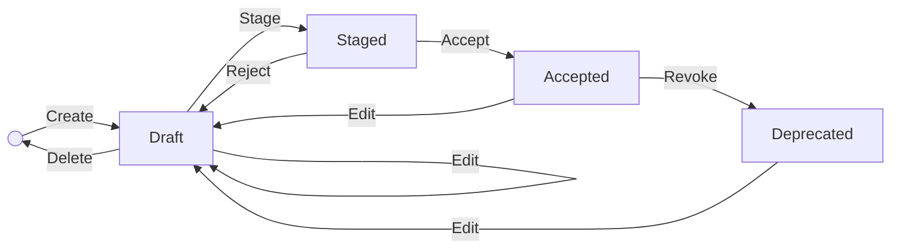

[TOC]

# Editing Data

The Editor is available in specific instances of TriplyDB. It allows creating, updating or deleting data that have a structure that is defined in a [SHACL](https://www.w3.org/TR/shacl/) shapes graph. For example, a shapes graph could define the structure of a concept scheme based on [SKOS](https://www.w3.org/TR/skos-primer/), or it could define the structure of a data catalogue based on [DCAT](https://www.w3.org/TR/vocab-dcat-3/). 

This section describes using the Editor to edit SKOS concept schemes. The Editor works in a similar way for other views.

In order to open the Editor, select the Dataset that you want to work with. If your instance provides the feature, you will see "Editor" on the left-hand side. Pressing there will open the Editor pane.

## About Editor forms

The Editor uses forms to create or edit instances of a class. The image below shows elements of a form.

In Editor forms, an asterisk (*) is used to mark mandatory properties of an instance. It is not possible to save resources that do not have a value for all mandatory properties.

In order to add a property, press the  plus symbol (+). Some properties can occur multiple times, with different values.

In order to remove a property, press the waste basket symbol.

Input fields for values support dropdown lists where possible. Alternatively, it is possible to start typing to bring up a list of matching values. The availabilty of dropdown lists is indicated by a small downward facing triangle on the right of the input field.

## Choosing an Editor view

In the top left corner of the Editor pane, the _view_ button can be used to select a different view, if multiple views are configured. The image below shows the SKOS view being selected.

## Creating a new instance
In the top right corner of the Editor pane you can find the _create_ button. It can be used to create a new instance of a class that is defined in the shapes graph.

Clicking the _create_ button will open a form that allows picking the class for the new instance, and setting other properties. By default, each resource needs to have an IRI (Internationalized Resource Identifier). The Editor generates an IRI, which can be changed, if needed.

## Finding an instance

Next to the _create_ button there is an input box that can be used to find an instance based on its label. All data that are configured to be used by the Editor are included in the search. You can start typing to populate a dropdown list with resources that have a matching sequence of characters somewhere. The matching characters are displayed in boldface.

## SKOS: selecting concept schemes

In the SKOS view, it is possible to select a concept scheme to work with. Press the _concept scheme(s)_ input field to choose a concept scheme from a dropdown list. Alternatively, start typing to find a concept scheme with a matching character sequence.

SKOS concept schemes are allowed to be chained, by means of [skos:narrowMatch](https://www.w3.org/2009/08/skos-reference/skos.html#narrowMatch) and [skos:broadMatch](https://www.w3.org/2009/08/skos-reference/skos.html#broadMatch) relations between concepts. Once a concept scheme is found, you can press in the space behind its name to find and select nested concept schemes. Concept schemes in the chain will be assigned different colours, as shown in the image below.

## SKOS: navigating concept schemes

Once one or more concept schemes have been selected, 

## Workflow

The workflow provides a structured process for data entry and review, enabling seamless transitions between stages.

The workflow consists of the following stages:

### Editing (Draft)

The initial phase where data can be created or modified in draft form.

### Submit for Review (Staged)

After drafting, the data can be submitted for review to ensure accuracy and completeness.

### Accept (Accepted)

Once reviewed and approved, the data entry moves to the accepted stage, making it an official part of the dataset. Content status is set to `active`. *Note: the reviewer must be a different person than the one who made the last edit.*

### Revoke (Deprecated)

If data becomes outdated or invalid, it can be moved to the deprecated status, effectively removing it from active use. Content status is set to `inactive`.

## SKOS Support

Support for SKOS (Simple Knowledge Organization System) allows for hierarchical and conceptual data organization.

### SKOS Hierarchy

Define and manage hierarchical relationships between data entries within SKOS.

### SKOS Concept Schemas

This section allows for the creation and use of SKOS concept schemas, aiding in the classification and linking of related data concepts.
