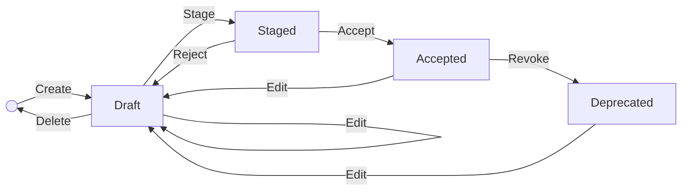

[TOC]

# Editing Data

In specific instances of TriplyDB, a SKOS editor is available that enables the editing of SKOS instance data based on a specified Data Model. The Editing Data section provides basic instructions for using the SKOS Editor to create and adapt new data instances. Although the Data Editor is currently limited to SKOS, future editions will enable more types of editing. 

In order to open the Editor, select the Dataset that you want to work with. If your instance provides the feature, you will see `Editor` on the left-hand side.

## Choosing a Class

When searching for a class, you can type any unique character combination contained in the name into the search box. You don't need to press return in order to see all the class names that contain the pattern anywhere in the class name.

## IRI Naming

When you create a class, you can define the IRI (Internationalized Resource Identifier) naming conventions to uniquely identify the class.

## Input Fields

Fields can be added by clicking on the plus symbol on the right side of the list of fields. Required fields are marked by an asterisk. In the image, you can see a drop-down choice menu for the *required* value of the `heeft contentstatus` field. When you click on the downward pointing triangle on the right side of the search field, it points upwards and a list unfolds to reveal a set of choices for possible values. If you want free-form entry, you can click on the `x` that is revealed when the mouse is over the arrow. You can remove a field by clicking on the garbage can symbol on the right.

It is also possible to search such menus with pattern search.

## Groups and Order

Once you've selected a Dataset, you can go to the Data Model editor on the left side of the screen.

When adding a new property, you are able to specify groups of properties and set the order in which properties should appear.

The group choice menu can be used or the `+` can be used to add a new property group.

An integer assigned to the property in the `Order` field will be used to order it against the value of `order` in other properties in the SKOS Editor. In the image, you can see the `heeft voorkeurslabel` has Order of 1 and `heeft creatiedatum` has Order of 2, so it will come after the first one in the Property sheets of the editor.

## Workflow

The workflow provides a structured process for data entry and review, enabling seamless transitions between stages.

The workflow consists of the following stages:

### Editing (Draft)

The initial phase where data can be created or modified in draft form.

### Submit for Review (Staged)

After drafting, the data can be submitted for review to ensure accuracy and completeness.

### Accept (Accepted)

Once reviewed and approved, the data entry moves to the accepted stage, making it an official part of the dataset. Content status is set to `active`. *Note: the reviewer must be a different person than the one who made the last edit.*

### Revoke (Deprecated)

If data becomes outdated or invalid, it can be moved to the deprecated status, effectively removing it from active use. Content status is set to `inactive`.

## SKOS Support

Support for SKOS (Simple Knowledge Organization System) allows for hierarchical and conceptual data organization.

### SKOS Hierarchy

Define and manage hierarchical relationships between data entries within SKOS.

### SKOS Concept Schemas

This section allows for the creation and use of SKOS concept schemas, aiding in the classification and linking of related data concepts.
