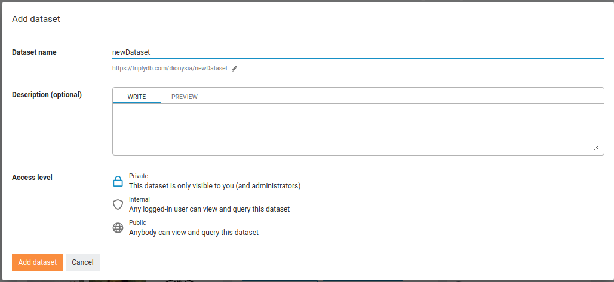
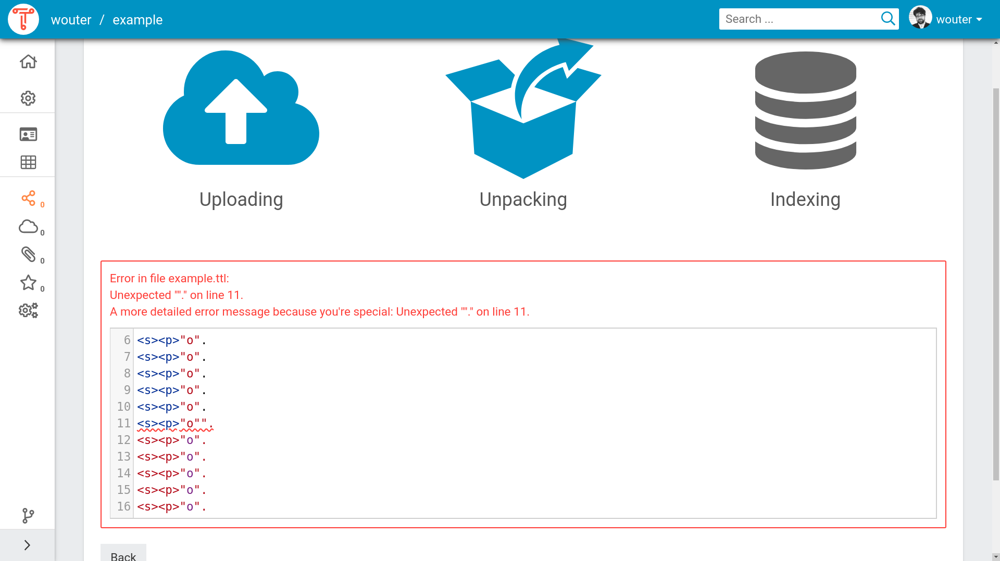
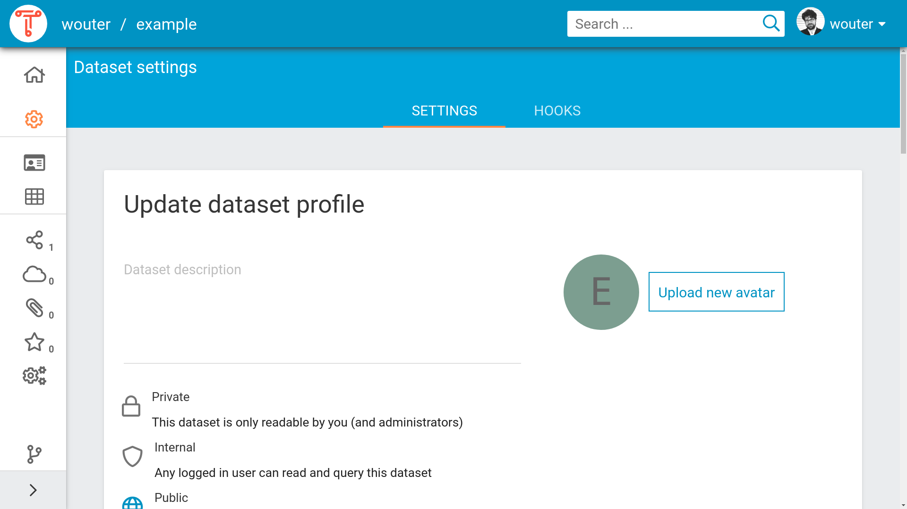
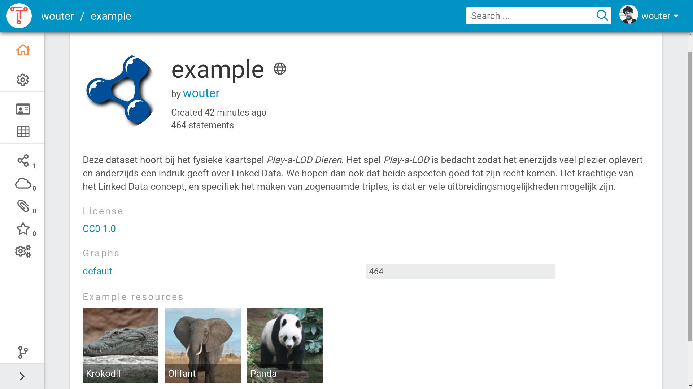
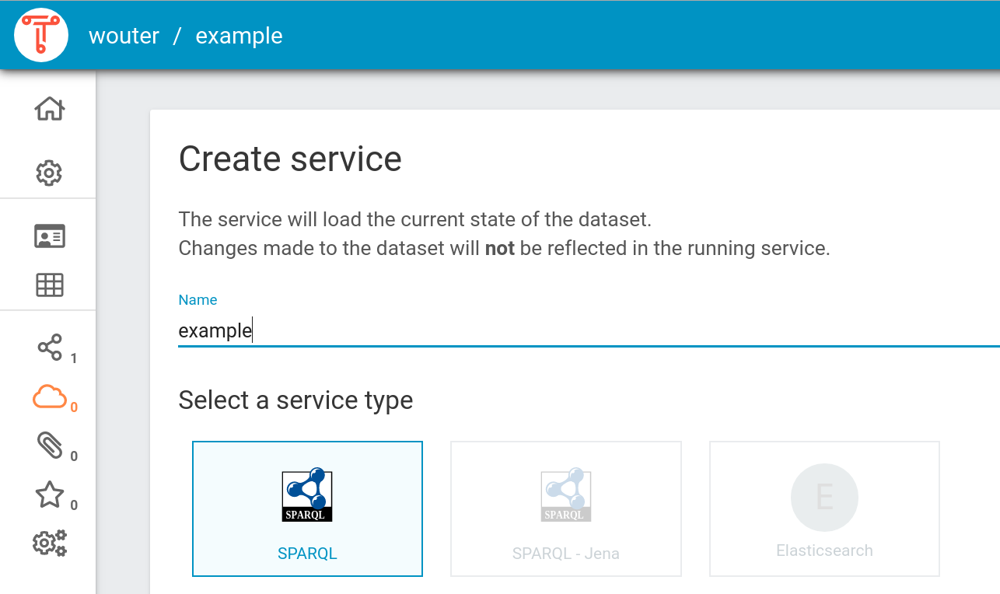
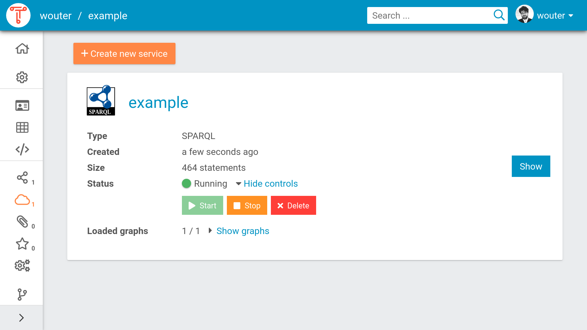
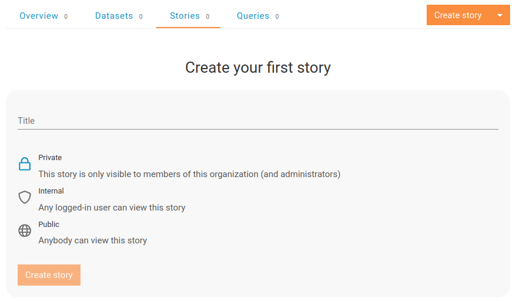
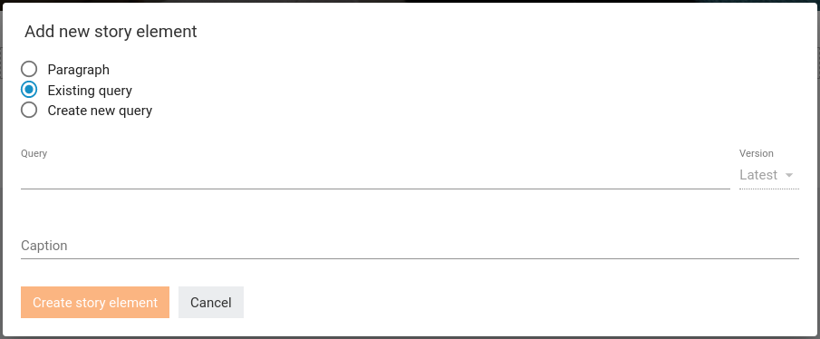

# Introduction

TriplyDB allows you to store, publish, and use Linked Data Knowledge
Graphs. TriplyDB makes it easy to upload Linked Data and expose it
through various APIs (SPARQL, ElasticSeach, LDF, REST). [Read
More](/triplydb)

# Uploading Data

This section explains how to create a Linked Dataset in TriplyDB.

## Creating a new dataset

The following steps allow a new Lined Dataset to be created:

1. Log into a TriplyDB instance.

2. Click the `+` button on the dataset pane that appears on the
   right-hand side of the home screen.

3. This brings up the dialog for creating a new dataset. Enter a
   dataset name that consists of alpha-numeric characters
   (`A-Za-z0-9`) and hyphens (`-`).

4. Optionally, enter a dataset display name. This name will be used
   in the GUI and will be exposed in dataset metadata.

5. Optionally, enter a dataset description. You can use richt text
   formatting by using Markdown. See [our section about
   Markdown](#markdown-support) for details.

6. Optionally, change the access level for the dataset. By default
   this is set to “Private”. See [dataset access
   levels](#access-levels) for more information.




When datasets are Public (see [Access Levels](#access-levels)), they
automatically expose metadata and are automatically crawled and
indexed by popular search engines (see [Metadata](#metadata)).

## Adding data

Once the dataset is created, the “Add data” view is displayed (see
screenshot). In this view data can be added in three ways:

<dl>
  <dt>File upload</dt>
  <dd>Select files from your local machine.  It is also possible to drag-and-drop local files on the cloud icon with the upward poinging arrow.</dd>
  <dt>URL upload</dt>
  <dd>Copy/paste a URL that points to an online RDF file.</dd>
  <dt>Import</dt>
  <dd>Import a dataset that is already published in the same TriplyDB instance.</dd>
</dl>


The “Add data” view is also available for existing datasets:

1. Go to the “Graphs” view by clicking on the graph icon in the
   left-hand sidebar.

2. Click the “Import a new graph” button.

### Adding data: File upload

The file upload feature allows you to upload RDF files from your local
machine. This can be done in either of two ways:

- Click on the cloud icons to open a dialog that allows local RDF
  files from your machine to be selected.

- Drag-and-drop RDF files from your local machine onto the cloud
  icon.

The following RDF serialization formats are currently supported:

| **Serialization Format** | **File extension**     |
| ------------------------ | ---------------------- |
| N-Quads                  | `.nq`                  |
| N-Triples                | `.nt`                  |
| RDF/XML                  | `.rdf`, `.owl`, `.owx` |
| TriG                     | `.trig`                |
| Turtle                   | `.ttl`, `.n3`          |
| JSON-LD                  | `.jsonld`, `.json`     |

Up to 1,000 separate files can be uploaded in one go. It is also
possible to upload compressed files and archives. When the number of
files exceeds 1,000, it is more efficient to combine them in archives
and upload those. This allows an arbitrary number of files to be
uploaded. The following archive/compression formats are currently
supported:

| **Format** | **File extensions** |
| ---------- | ------------------- |
| gzip       | `.gz`               |
| bzip2      | `.bz2`              |
| tar        | `tar`               |
| XZ         | `.xz`               |
| ZIP        | `.zip`              |

### Adding data by URL upload

The second option for adding data is to include it from an online URL
location. This is done by entering the URL inside the “Add data from
a URL” text field.

### Adding data by import

The third option for adding data is to import from datasets that are
published in the same TriplyDB instance. This is done with the “Add
data from an existing dataset” dropdown list (see screenshot).

### Adding malformed data

TriplyDB only allows valid RDF data to be added. If data is malformed,
TriplyDB will show an error message that indicates which part of the
RDF data is malformed (see screenshot). If such malformed data is
encountered, the RDF file must first be corrected and uploaded again.



TriplyDB follows the Linked Data standards strictly. Many triple
stores allow incorrect RDF data to be added. This may seem convenient
during the loading phase, but often results in errors when
standards-compliant tools start using the data.

## Assets: binary data

Not all data can be stores as RDF data. For example images and video
files use a binary format. Such files can also be stored in TriplyDB
and can be integrated into the Knowledge Graph.

# Publishing data

With TriplyDB you can easily make your data available to the outside world.

## Publishing your dataset

You can publish your dataset by setting the visibility to “Public” in
the dataset settings menu. Making a dataset public in TriplyDB has
the following consequences:

1. The dataset can be searched for an visited by anybody on the web.
2. The dataset will be indexed by web search engines such as [Google
   Dataset Search]().
3. Any services that are started for that dataset will be available
   to anybody on the web. This includes [SPARQL](), [text
   search](), and [Linked Data Fragments]().

## Entering metadata

Adding metadata to your datasets is important. This makes it easier
to find your dataset later and also allows search engines and social
media applications to understand your dataset.

Metadata is entered from the dataset settings page, which is accessed
by clicking on the “Dataset settings” (cog icon) option from the
left-hand sidebar (see screenshot).

 The dataset homepage looks empty without metadata. Notice the cog wheel icon, which provides access to the “Dataset settings” page.

The dataset settings page allows the following metadata to be entered:

- The dataset description. This can consist of text with (optional) Markdown formatting.
- The avatar (image) of the dataset.
- The access level of the dataset.
- The topics of the dataset.
- The example resources for the dataset.
- The license of the dataset.

 The dataset settings page allows various forms of dataset metadata to be added.

Within the TriplyDB instance your dataset is now more findable for users. Whenever
a user searches on one of the topics of your dataset, or types in a word that is
present in the description of your dataset, the dataset will be shown as a search
result. The metadata will allow TriplyDB to give a better impression of your dataset
when a user vitits:

 The dataset home page after metadata has been entered.

Search engines and social media applications can recognize the
metadata that is entered for datasets in TriplyDB. The following
screenshot shows the widget created by the Slack chat application upon
entering a link to the dataset. Notice that the chat application
understands metadata properties like title, description, and image.

 Widget created by the Slack chat application upon sharing a link to a dataset in TriplyDB.

## Starting services

By default, datasets in TriplyDB can be queried through [TriplyDB-js](/docs/triplydb-js) as well as through the Linked Data Fragments API.

In order to allow additional query paradigms, specific services can be
started from the “Create service” page. This page is accessed by
clicking on the “Services” icon in the left-hand sidebar.

TriplyDB instances can be configured with different types of services.
The below screenshot shows the “Create service” page for a TriplyDB
instance that allows SPARQL, Jena SPARQL, and ElasticSearch services
to be created.

 Notice that three different types of services can be created.

It is possible to create multiple services for one dataset.

### Existing services

Existing services are displayed on service widgets (see screenshot).
From these widgets, services can be created, deleted, stopped, and
restarted.



Datasets can change whenever a graph is added, deleted or renamed. When this
happens, the data in a service is out of sync with the data in the dataset and
a synchronization button will appear in the service widget. By clicking the
button, the service will be synchronized with the current state of the dataset.

# Viewing Data

TriplyDB offers several ways to explore your datasets.

## Linked Data Browser

The linked data browser offers to traverse the data by focusing on one node
at the time. The node is describe using it's properties, which can be followed
to other nodes in the graph.


## Linked Data Table

The Linked Data Table shows a dataset at the triple level. The first
three columns represent the subject, predicate, and object position of
the triple. The fourth column represents the graph to which the
triple belongs.


The Linked Data Table can be used to perform simple queries by filling
in the subject, predicate, object, and/or graph using the text field.

Terms in the Linked Data Table can be dragged and dropped between
columns. This allows a simple form of graph navigation. For example,
an object term can be dragged to the subject column in order to
show the triples in which that term appears in the subject position.

Queries in the Linked Data Table can also be performed automatically
through the [Statements API]() and the [Triple Pattern Fragments
API](/docs/triply-api#triple-pattern-fragments-tpf).

## SPARQL IDE

When a dataset has a running SPARQL service, the data can be queried
from the SPARQL IDE. The SPARQL IDE is an extended version of the
Open Source [Yasgui](/docs/yasgui) query editor.

### Saving a SPARQL query

It is often useful to save a SPARQL query for later use. This is
achieved by clicking on the save icon in the top-right corner of the
SPARQL Editor. Doing so will create a [Save Query](#saved-queries).

### Sharing a SPARQL query

It is sometimes useful to share a SPARQL query with somebody else, or
to have a cURL command that can be used to run the same SPARQL query
from a command line. This is achieved by clicking on the share icon
in the top-right corner of the SPARQL Editor. This brings us a dialog
from which the SPARQL query can be copied in the following three forms:

1. The URL-encoded SPARQL query. This is a long URL that includes
   the endpoint, the query, and visualization settings. Notice that
   this URL can be quite long for complex queries and/or
   visualizations. Long URLs are not supported by some application
   that cut off a URL after a maximum length (often 1,024
   characters). Use one of the other two options or use [Saved
   Queries]() to avoid such restrictions.

2. A short URL that redirects to the full URL-encoded SPARQL query.

3. A cURL command that can be copy/pasted into a terminal
   application that supports this command. cURL is often used by
   programmers to test HTTP(S) requests.

[Saved Queries]() are a more modern way of sharing SPARQL queries.
They do not have any of the technical limitations that occur with
URL-encoded queries.

## Text Search

When a dataset has a running ElasticSearch service, textual searches
can be performed over the entire dataset. Text Search works like a
search engine and returns any node that contains your search term, or
contains the search term in any of it's properties.

## Insights

The insights page has been developed to give you a succinct overview of the linked data at hand. It holds two views: the class frequency and the
class hierarchy view.

### Class frequency

The class frequency diagram shows how often classes and properties appear in a
graph. The drop-down on the top of the visualization selects the graph for which
the class frequency is drawn.
The visualization shows the 10 most frequent classes in the selected graph. The
exact number of occurrences can be seen when hovering over the bar of a class, also
showing the complete IRI/prefixed IRI. When clicking on the bar of a class the node
will expand and show the 10 most frequent predicates of that class.

### Class hierarchy

The class hierarchy diagram shows the hierarchy of the dataset in three
different visualizations. Each of the diagrams are created by the
`rdfs:subClassOf` relations and the classes in the dataset.
We have three different visualization methods for the classHierarchy:

- Bubbles visualization
- Treemap visualization
- Sunburst visualization

All three visualization are interactive in two ways. It is possible to hover over them, which will show information about the layer the mouse is on, or to click on them,
so the visualization zooms in a one or more layers. For each visualization it
is also possible to zoom out:

- Bubbles visualization: click the outside of the bubble
- Treemap visualization: use the breadcrumbs trail shown above the visualisation
- Sunburst visualization: click the innermost circle of the visualisation

#### When does the class hierarchy show?

**Note that the class hierarchy does not automatically update to reflect changes in the data. When the data has changed, the page must be refreshed.**

- A class only appears in the class hierarchy tab if it has instances (connected to the class via `rdf:type`), or if at least one of it's subclasses appear in the class hierarchy tab.
- The class hierarchy cannot be shown if it contains a cycle, meaning that some class is (indirectly) its own subclass.


# Saved Queries

A Saved Query is a versioned SPARQL query with its own URL. Using this URL,
users are able to view any version of the query and its results. It can also be
used to run the query and retrieve the results from a browser or a program,
removing the hassle of figuring out how to run a SPARQL query.

## How to save a query

There are two ways to create a saved query.
_You need to be logged in and have authorization rights on the dataset to use this feature_

1. When working from the [SPAQRL IDE](#sparql-ide)
2. Using the Saved Queries tab in a dataset

Creating a saved query with the SPARQL IDE is done by writing a query/visualization and hitting the save button 

## Creating a new version

Updating the saved query can be done by clicking a query in the Saved Queries tab and editing the query or the visualization. Hit the save button to save it as a new version.

## Using a saved query

### Sharing a saved query

To share a saved query, for example in Data Stories, you can copy the link that is
used when you open the query in TriplyDB. Let's say you have a query called
`Timelined-Cars-BETA` in the dataset `core` under the account `dbpedia` and you
want to use version 6. Than the following link would be used

```url
https://triplydb.com/DBpedia-association/-/queries/timeline-cars/8
```

If you want to always use the **latest** query, you can simply omit the version
number like so

```url
https://triplydb.com/DBpedia-association/-/queries/timeline-cars
```

### Using a saved query as REST-API (Advanced)

Each TriplyDB instance has a fully RESTful API. The TriplyDB RESTful API is extended for saved SPARQL queries. A saved query can be used as a RESTful API to retrieve data from your linked dataset. The URL next to the keywork `API` is the RESTful API URL and can be used with RESTful API libraries. You can copy the RESTful API by pressing the copy button just behind the URL. Pressing the copy button from the above query will result in the following run url:

```url
https://api.triplydb.com/queries/DBpedia-association/timeline-cars/run
```
When you copy this URL in your browser or fetch the URL with curl you will get an get request to a RESTful API and get a JSON representation of the data in your browser or command window. 

### Metadata links

In the metadata overview there are two links. The first links points to the dataset the query is executed over and when clicking brings you to the dataset homepage.
The second link points to the service the saved query uses. The second link brings you to the services page of the dataset, and from there on you can go to the SPARQL service.

# Data stories
A TriplyDB data story is a way of communicating information about your linked data along with explanatory text while also being able to integrate query results.

## Creating a data story
You can create your own data story via the [stories](https://triplydb.com/me/-/stories) tab on TriplyDB. If this is your first time creating a data story, your view will look something like the image below. If you already are a proud owner of a data story, you will find it here. To create a new one, you can click the orange "Create story" button and you’ll see the same form.



In this form, you can fill in the title and set the access level for a data story. When everything is set, press the "Create story" button.This will take you to a new page where you can customize the data story.

## Editing a data story
As shown in the image below, in the top right corner of the page, there is a menu button. Here you will find the following:
- **Story settings**: Here you can change the title and the access level of your story.
- **Change banner**: Here you can change the banner, just choose an image that you want as your banner (wide images work best).
- **Transfer**: To transfer the story to a different user or organization.
- **Copy**: To copy the story to a different user or organization.
- **Delete**: To delete the story.


In the right lower corner you see a button with a notepad. With this button, you can toggle between the edit view, which allows you to edit the story, and the reader view, which is how readers of your story will perceive this page.


## Adding elements
To create your first element press "+ Add new element". This will open a new form as shown in the images below. Here you can select what kind of  element you want to add to your data story; you’ll have the option to write text, to select an already existing SPARQL query, or even to create a new SPARQL query.

### Existing query
Let’s start by selecting a query for our data story. Maybe you’ve already created one, but if you haven’t, you can select one of the queries available to you. You can search in the Query search bar and select the one you want, for example "our-first-select-query". Optionally you can select the version of the query and set the caption. When everything is set, press "Create story element". And look, we’ve added our first element to our story!



### Paragraph
Data sometimes needs accompanying text to be completely understandable. TriplyDB not only supports writing plain text, but TriplyDB paragraphs are also markdown compliant. The markdown that you’ll add in the paragraph text box will be rendered as HTML and can be previewed. We also support image, and even code blocks with highlighting for the most common linked data and programming languages.


## Sharing and embedding
Before you know it, you will have created your first data story. Congratulations! Now it is time to share it with the world, but don’t forget to set the access level to “public”. Then you have two options:
1. You can simply share the URL.
2. You can embed the data story on your own webpage. Scroll to the end of the story you want to embed and click the “</> Embed” button for a copy-pasteable code snippet.


# Admin tasks

Admin tasks are performed within the admin settings page (accessed by
clicking on the user menu in top-right corner and selecting the “Admin settings”
menu item).

## Create a new user

New users can only be created by administrators by performing the
following steps:

1. Click on the “Admin settings” link in
   the user menu (top-right corner) and click the “Accounts” tab.
   This brings up an overview of all users and organizations on the
   TriplyDB instance.

2. Click the “Add user” button.

3. Fill in the user name and email address of the prospective user.
   The user name must consist of alphanumeric characters (`A-Za-z`)
   and hyphens (`-`).

4. Click the “Add user” button. This sends an account creation
   email to the prospective user, containing a link that allows them
   to log in.

In addition to the above default procedure, the following two options
are provided for user account creation:

- **Temporary account**: By default, user accounts do not expire.
  Sometimes it is useful to create a temporary account by specifying
  a concrete date in the “Account expiration date” widget.

- **Preset password**: By default, a user can set her password after
  logging in for the first time by clicking on the link in the
  account creation email. When a password is entered in the
  “Password” field, the user must enter this password in order to
  log in for the first time.

## Set logos and banner

For changing the logos and the banner follow the next steps:
1. Click on the “Admin settings” link in the user menu (top-right corner) and click the "Settings" tab. This brings up an overview of all the settings an admin can set for the TriplyDB instance.

2. Under "Site logos" and "Site banner" you can upload a site logo (square and landscape) or a banner. Make sure you use SVG files with a maximum size of 5 mb.

## Setting metadata
For changing the metadata follow the next steps:
1. Click on the “Admin settings” link in the user menu (top-right corner) and click the "Settings" tab. This brings up an overview of all the settings an admin can set for the TriplyDB instance.

2. On that page navigate to "Site metadata", it looks as follows:


3. Here you can set the name, tag line, description and welcome text. The name of your website appears in your browser tab. The welcome text appears on the home page of your TriplyDB instance. The tag line and description are for metadata purposes (e.g. findability and website previews).

## Account overview

Go to the “Accounts tab” to receive an overview of all accounts on the
TriplyDB instance.

The type of account can be observed based on the following icons:

| **Icon**              | **Account type** |
| --------------------- | ---------------- |
|  | organization     |
|          | user             |

# Reference

## Access levels

TriplyDB uses the following access levels for datasets, queries, and
stories.

| **Access level** | **Description**                                                                           | **Icon**          |
| ---------------- | ----------------------------------------------------------------------------------------- | ----------------- |
| Private          | The dataset/query/story is only visible to you.                                           |   |
| Internal         | The dataset/query/story is only visible to people who are logged in to the same TriplyDB. |  |
| Public           | The dataset/query/story is vivible to everybody on the Internet.                          |    |

### Access level dependencies

The access levels for datasets, queries, and stories may affect each
other. For example, if a public query references a private dataset,
other users will be able to view the query string, but none of the
query results. TriplyDB always uses the most conservative access
level in such cases, ensuring that information is never exposed
unintentionally.

### Access levels and workflows

These access levels are often used for the following workflow:

- You create a new dataset/query/story starts with access level
  ‘Private’.
- As the dataset/query/story progresses, give it access level
  ‘Internal’ to receive feedback from other users.
- Once the dataset/query/story is ready, give it access level
  ‘Public’ to publish it to the world.

## Markdown support

Triply allows rich text formatting to be used in the following places:

- Dataset description
- Account description
- Saved Query description
- Data Story elements
- Site welcome message

The following Markdown elements are supported:

### Headings

Headings are used to divide a text into different sections. The hash
character (`#`) at the beginning of a line indicates a heading is
used. Multiple hash characters indicate nested headings.

```md
# Heading 1

## Heading 2

### Heading 3

#### Heading 4

##### Heading 5

###### Heading 6
```

### Text styling

| _Style_       | _Syntax_            | _Output_          |
| ------------- | ------------------- | ----------------- |
| Bold          | `**bold**`          | **bold**          |
| Italic        | `_italic_`          | _italic_          |
| Strikethrough | `~~strikethrough~~` | ~~strikethrough~~ |

### Hyperlinks

| _Style_     | _Syntax_                     | _Output_                   |
| ----------- | ---------------------------- | -------------------------- |
| Raw URL     | `<https://triply.cc>`        | <https://triply.cc>        |
| Labeled URL | `[label](https://triply.cc)` | [label](https://triply.cc) |

Notice that URLs can also be relative. This allows you to refer to
other datasets, saved queries, etc. by using relative paths.

### Code

There are options for formatting in-line code as well as multi-line
code blocks.

#### In-line code

Code can also be used in-line with single backticks:

```md
Use `code` inside a sentence.
```

#### Multi-line code blocks

Multi-line code blocks start and end with three consecutive backticks.
The following Markdown denotes two lines of Turtle:

<pre>
```sparql
select * {
  graph ?g {
    ?s ?p ?o.
  }
}
```
</pre>

The above is rendered as follows:

```sparql
select * {
  graph ?g {
    ?s ?p ?o.
  }
}
```

#### Code language

The opening backticks are optionally following by the name of the code
language. The following code languages are supported:

| **Language** | **Syntax**   |
| ------------ | ------------ |
| SPARQL       | `sparql`     |
| Turtle       | `ttl`        |
| TypeScript   | `typescript` |
| R            | `r`          |
| Python       | `python`     |

The other supported languages are: Bash (`bash`), C (`c`), C++
(`cpp`), C# (`csharp`), Extended Backus-Naur Form (`ebnf`), Go (`go`),
Haskell (`haskell`), Java (`java`), JavaScript (`javascript`), LaTeX
(`latex`), Makefile (`makefile`), Markdown (`markdown`), Objective C
(`objectivec`), Pascal (`pascal`), Perl (`perl`), Powershell
(`powershell`), Prolog (`prolog`), Regular Expression (`regex`), Ruby
(`ruby`), Scala (`scala`), SQL (`sql`), Yaml (`yaml`).
