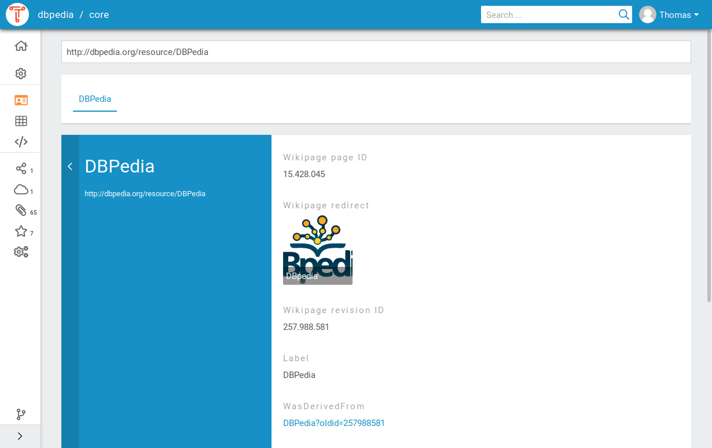

## Introduction

TriplyDB is a new and fast-moving Linked Data Knowledge Graph product.  TriplyDB allows you to easily upload datasets and expose them through multiple APIs (including SPARQL, RESTful, text search, analytics, etc). [Read More](/products/triplydb).

## Uploading Data

This section explains how to create a Linked Dataset in TriplyDB.

### Creating a new dataset

1. Log into a TriplyDB instance.

2. Click the `+` button on the dataset pane that appears on the
   right-hand side of the screen.

3. This brings up the dialog for creating a new dataset. You must
   enter a dataset name that consists of alphanumeric characters
   (`A-Za-z0-9`) and hyphens (`-`).

4. Optionally enter a dataset description. This can be either text
   or Markdown. You can also change the access level of the
   dataset, which is set to “Private” by default.


### Adding data

Once the dataset is created, the “Add data” view is displayed (see
screenshot). In this view data can be added in three ways: file
upload, URL upload, and data import. The following screenshot shows
the “Add data” view, with the three approaches displayed on top of one
another.


#### Adding data by file upload

In this view RDF files can be uploaded, either by
clicking on the cloud icon and selecting files through the “Open file”
dialog, or by dragging-and-dropping files onto the cloud icon. The
following RDF serialization formats are supported:

| Serialization Format | Extensions     |
| -------------------- | -------------- |
| N-Quads 1.1          | `.nq`          |
| N-Triples 1.1        | `.nt`          |
| RDF/XML 1.1          | `.rdf`         |
| TriG                 | `.trig`        |
| Turtle 1.1           | `.ttl`         |
| N3                   | `.n3`          |
| OWL                  | `.owx`, `.owl` |

One or more files can be uploaded. It is also possible to upload
compressed files and archives. When the number of files exceeds
1.000, it is better to upload one archive file that contains them all.
This allows an arbitrary number of files to be uploaded. The following archive/compression formats are supported:

| archive/compression | Extensions    |
| ------------------- | ------------- |
| gzip                | `.gz`         |
| bzip2               | `.bz2`        |
| tar                 | `.xz` , `tar` |
| ZIP                 | `.zip`        |

##### Adding malformed data

TriplyDB only allows valid data to be added. If data is malformed,
TriplyDB will show an error message that indicates which part of the
data is malformed (see screenshot). If such malformed data is
encountered, the RDF file must first be corrected and uploaded again.


#### Adding data by URL upload

The second option for adding data is to include it from an online URL
location. This is done by entering the URL inside the “Add data from
a URL” text field.

#### Adding data by import

The third option for adding data is to import from datasets that are
published in the same TriplyDB instance. This is done with the “Add
data from an existing dataset” dropdown list (see screenshot).

### Using Assets

To expose data with content, such as images, you can upload these as assets to your
dataset. The assets can be referenced in your dataset via their URL.

## Exposing Data

With TriplyDB you can easily make your data available to the outside world.

### Publishing your dataset

You can publish your dataset by simply setting the visibility to `Public` in the settings menu
of your dataset. Not only will this allow anyone to visit your dataset in the TriplyDB instance,
it will also allow your services to be queried by anyone and make your data visible to
search engines for instance.

### Entering metadata

Adding metadata to your datasets is important. This makes it easier
to find your dataset later and also allows search engines and social
media applications to understand your dataset.

Metadata is entered from the dataset settings page, which is accessed
by clicking on the “Dataset settings” (cog icon) option from the
left-hand sidebar (see screenshot).

 The dataset homepage looks empty without metadata. Notice the cog wheel icon, which provides access to the “Dataset settings” page.

The dataset settings page allows the following metadata to be entered:

- The dataset description. This can consist of text with (optional) Markdown formatting.
- The avatar (image) of the dataset.
- The access level of the dataset.
- The topics of the dataset.
- The example resources for the dataset.
- The license of the dataset.

 The dataset settings page allows various forms of dataset metadata to be added.

Within the TriplyDB instance your dataset is now more findable for users. Whenever
a user searches on one of the topics of your dataset, or types in a word that is
present in the description of your dataset, the dataset will be shown as a search
result. The metadata will allow TriplyDB to give a better impression of your dataset
when a user vitits:

 The dataset home page after metadata has been entered.

Search engines and social media applications can recognize the
metadata that is entered for datasets in TriplyDB. The following
screenshot shows the widget created by the Slack chat application upon
entering a link to the dataset. Notice that the chat application
understands metadata properties like title, description, and image.

 Widget created by the Slack chat application upon sharing a link to a dataset in TriplyDB.

### Starting services

By default, datasets in TriplyDB can be queried through the [Triply Client](/docs/triply-client) as well as through the Linked Data Fragments API.

In order to allow additional query paradigms, specific services can be
started from the “Create service” page. This page is accessed by
clicking on the “Services” icon in the left-hand sidebar.

TriplyDB instances can be configured with different types of services.
The below screenshot shows the “Create service” page for a TriplyDB
instance that allows SPARQL, Jena SPARQL, and ElasticSearch services
to be created.

 Notice that three different types of services can be created.

It is possible to create multiple services for one dataset.

#### Existing services

Existing services are displayed on service widgets (see screenshot).
From these widgets, services can be created, deleted, stopped, and
restarted.


Datasets can change whenever a graph is added, deleted or renamed. When this
happens, the data in a service is out of sync with the data in the dataset and
a synchronization button will appear in the service widget. By clicking the
button, the service will be synchronized with the current state of the dataset.

## Viewing Data

TriplyDB offers several ways to explore your datasets.

### Linked Data Browser

The linked data browser offers to traverse the data by focusing on one node
at the time. The node is describe using it's properties, which can be followed
to other nodes in the graph.


### Tabular browser

The tabular browser show the dataset in a table supported by [Triple Pattern Fragments (TPF)](/docs/triply-api#triple-pattern-fragments-tpf).

### SPARQL IDE

When a dataset has a running SPARQL service, the data can be viewed using the
SPARQL IDE. The SPARQL IDE is an extended version of [YASGUI](/docs/yasgui) with
the extended functionality of [saving queries](#saved-queries).

### Text Search

When a dataset has a running ElasticSearch service, Text Search can help you
exploring a dataset. Text Search works like a search engine and returns any node
that contains your search term, or contains the search term in any of it's
properties.

## Saved Queries

A Saved Query is a versioned SPARQL query with its own URL. Using this URL,
users are able to view any version of the query and its results. It can also be
used to run the query and retrieve the results from a browser or a program,
removing the hassle of figuring out how to run a SPARQL query.

### How to save a query

There are two ways to create a saved query.
_You need to be logged in and have authorization rights on the dataset to use this feature_

1. When working from the [SPAQRL IDE](#sparql-ide)
2. Using the Saved Queries tab in a dataset

Creating a saved query with the SPARQL IDE is done by writing a query/visualization and hitting the save button 

### Creating a new version

Updating the saved query can be done by clicking a query in the Saved Queries tab and editing the query or the visualization. Hit the save button to save it as a new version.

### Using a saved query

To use a saved query, for example in Data Stories, you can copy the link that is
used when you open the query in TriplyDB. Let's say you have a query called
`Timelined-Cars-BETA` in the dataset `core` under the account `dbpedia` and you
want to use version 6. Than the following link would be used

```url
https://triplydb.com/dbpedia/core/queries/Timelined-Cars-BETA/6
```

If you want to always use the **latest** query, you can simply omit the version
number like so

```url
https://triplydb.com/dbpedia/core/queries/Timelined-Cars-BETA
```

#### Using a saved query in Data Stories

## Admin tasks

Admin tasks are performed within the admin settings page (accessed by
clicking on the user menu in top-right corner and selecting the “Admin settings”
 menu item).

This brings up the following admin settings page from which admin
tasks can be performed:

 Screenshot of the admin settings page.

### Create a new user

New users can only be created by administrators by performing the
following steps:

1. Click on the “Admin settings” link in
   the user menu (top-right corner) and click the “Accounts” tab.
   This brings up an overview of all users and organizations on the
   TriplyDB instance.

2. Click the “Add user” button.

3. Fill in the user name and email address of the prospective user.
   The user name must consist of alphanumeric characters (`A-Za-z`)
   and hyphens (`-`).

4. Click the “Add user” button. This sends an account creation
   email to the prospective user, containing a link that allows them
   to log in.

In addition to the above default procedure, the following two options
are provided for user account creation:

- **Temporary account**: By default, user accounts do not expire.
  Sometimes it is useful to create a temporary account by specifying
  a concrete date in the “Account expiration date” widget.

- **Preset password**: By default, a user can set her password after
  logging in for the first time by clicking on the link in the
  account creation email. When a password is entered in the
  “Password” field, the user must enter this password in order to
  log in for the first time.

### Account overview

Go to the “Accounts tab” to receive an overview of all accounts on the
TriplyDB instance.

The type of account can be observed based on the following icons:

| _Icon_                     | _Account type_ |
| -------------------------- | -------------- |
|     | organization   |
|               | user           |
