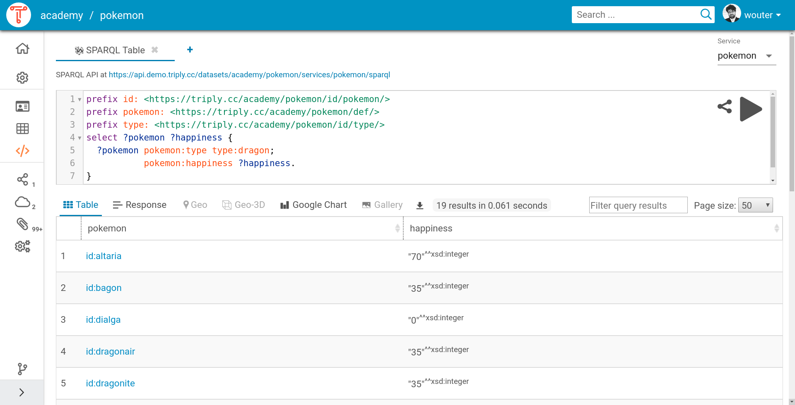

# TriplyDB Documentation

This document describes the TriplyDB product.  This document is a
work-in-process.  Contact
[support@triply.cc](mailto:support@triply.cc) for more information.

## Creating datasets

This section explains how to create a Linked Dataset in TriplyDB.
This includes setting the access level, uploading RDF data, setting
metadata, and starting services.

### Creating a new dataset

  1. Log into a TriplyDB instance.

  2. Click the plus button on the dataset pane that appears on the
     right-hand side of the screen (see screenshot).

  3. This brings up the dialog for creating a new dataset.  You must
     enter a dataset name that consists of alphanumeric characters
     (`A-Za-z0-9`) and hyphens (`-`).

  4. Optionally enter a dataset description.  This can be either test
     or Markdown.  You can also change the access level of the
     dataset, which is set to “Private” by default.

 The “Add dataset” dialog.

### Adding data

Once the dataset is created, the “Add data” view is displayed (see
screenshot).  In this view data can be added in three ways: file
upload, URL upload, and data import.  The following screenshot shows
the “Add data” view, with the three approaches displayed on top of one
another.

 The “Add data” view.

#### Adding data by file upload

In this view RDF files can be uploaded, either by
clicking on the cloud icon and selecting files through the “Open file”
dialog, or by dragging-and-dropping files onto the cloud icon.  The
following RDF serialization formats are supported:

  - N-Quads 1.1, file name extension `nq`.
  - N-Triples 1.1, file name extension `nt`.
  - RDF/XML 1.1, file name extension `rdf`.
  - TriG, file name extension `trig`.
  - Turtle 1.1, file name extension `ttl`.

One or more files can be uploaded.  It is also possible to upload
compressed files and archives.  When the number of files exceeds
1.000, it is better to upload one archive file that contains them all.
This allows an arbitrary number of files to be uploaded.

##### Adding malformed data

TriplyDB only allows valid data to be added.  If data is malformed,
TriplyDB will show an error message that indicates which part of the
data is malformed (see screenshot).  If such malformed data is
encountered, the RDF file must first be corrected and uploaded again.

 Screenshot of an error message indicating syntactically malformed RDF data.

#### Adding data by URL upload

The second option for adding data is to include it from an online URL
location.  This is done by entering the URL inside the “Add data from
a URL” text field.

#### Adding data by import

The third option for adding data is to import from datasets that are
published in the same TriplyDB instance.  This is done with the “Add
data from an existing dataset” dropdown list (see screenshot).

### Entering metadata

Adding metadata to your datasets is important.  This makes it easier
to find your dataset later and also allows search engines and social
media applications to understand your dataset.

Metadata is entered from the dataset settings page, which is accessed
by clicking on the “Dataset settings” (cog icon) option from the
left-hand sidebar (see screenshot).

 The dataset homepage looks empty without metadata.  Notice the cog wheel icon, which provides access to the “Dataset settings” page.

The dataset settings page allows the following metadata to be entered:

  - The dataset description.  This can consist of text with (optional)
    Markdown formatting.
  - The avatar (image) of the dataset.
  - The access level of the dataset.
  - The topics of the dataset.
  - The example resources for the dataset.
  - The license of the dataset.


 The dataset settings page allows valious forms of dataset metadata to be added.


The same dataset looks nicer once metadata has been entered:

 The dataset home page after metadata has been entered.

Search engines and social media applications can recognize the
metadata that is entered for datasets in TriplyDB.  The following
screenshot shows the widget created by the Slack chat application upon
entering a link to the dataset.  Notice that the chay application
understands metadata properties like title, description, and image.

 Widget created by the Slack chat application upon sharing a link to a dataset in TriplyDB.

### Starting services

By default, datasets in TriplyDB can be queried through the [[Triply
Client]] as well as through the Linked Data Fragments API.

In order to allow additional query paradigms, specific services can be
started from the “Create service” page.  This page is accessed by
clicking on the “Services” icon in the left-hand sidebar (see
screenshot).

TriplyDB instances can be configured with different types of services.
The below screenshot shows the “Create service” page for a TriplyDB
instance that allows SPARQL, Jena SPARQL, and ElasticSearch services
to be created.

 The “Create service” page.  Notice that three different types of services can be created.

It is possible to create multiple services for one dataset.

#### Existing services

Existing services are displayed on service widgets (see screenshot).
From these widgets, services can be created, deleted, stopped, and
restarted.

If data is added to and/or remove from the dataset later.  The service
can also be synchronized by pressing the synchronization button that
appears on the service widget.

 An example of a service widget.

## Tabular browser

### Triple Pattern Fragments (TPF)

Triple Pattern Fragments (TPF) is a community standard that allows
individual Linked Datasets to be queries for Triply Patterns (TP), a
subset of the more complex SPARQL query language.  The Triply API
implements [Triple Pattern
Fragments](http://www.hydra-cg.com/spec/latest/triple-pattern-fragments/)
version 2019-01-18 and [Linked Data
Fragments](http://www.hydra-cg.com/spec/latest/linked-data-fragments/)
version 2016-06-05.

The Triple Pattern Fragments (TPF) API is available for all datasets
in Triply and does not require running a dedicated service.

#### URI path

TPF requests are sent to the following URI path:

```none
https://api.INSTANCE/datasets/ACCOUNT/DATATSET/fragments
```

#### Reply format

Since TPF replies distinguish between data and metadata that are
stored in different graphs, it is recommended to request the TriG
content type with the following HTTP request header:

```none
Accept: application/trig
```

#### Query parameters

Triple Pattern Fragments (TPF) uses the following query parameters in
order to retrieve only those triples that adhere to a specified Triple
Pattern:

| *Key*       | *Value*                       | *Purpose*                                                                          |
|-------------+-------------------------------+------------------------------------------------------------------------------------|
| `subject`   | A URL-encoded IRI.            | Only return triples where the given IRI appears in the subject position.           |
| `predicate` | A URL-encoded IRI.            | Only return triples where the given IRI appears in the predicate position.         |
| `object`    | A URL-encoded IRI or literal. | Only return triples where the given IRI or literal appears in the object position. |

#### Example request

```bash
$ curl -G \
       'https://api.demo.triply.cc/datasets/academy/pokemon/fragments' \
       --data-urlencode 'predicate=http://www.w3.org/2000/01/rdf-schema#label' \
       -H 'Accept: application/trig'
```

## SPARQL IDE

This section explains the use of SPARQL in TriplyDB.  It provides
various advanced features for creating, sharing, and visualizing
SPARQL queries and their results.

### SPARQL Editor

#### Supported key combinations

The following table enumerates the key combinations that are supported
by the SPARQL Editor.  We sometimes use the notion of a **group**,
which is either one word (space-delimited sequence of non-space
characters), a sequences of multiple whitespace characters, or one
newline.

| **Key combination** | **Behavior**                                                                                      |
|---------------------+---------------------------------------------------------------------------------------------------|
| `Alt + Left`        | Move the cursor to the beginning of the current line.                                             |
| `Alt + Right`       | Move the cursor to the end of the current line.                                                   |
| `Alt + U`           | Redo the last change within the current selection.                                                |
| `Ctrl + Backspace`  | Delete to the beginning of the group before the cursor.                                           |
| `Ctrl + Delete`     | Delete to the beginning of the group after the cursor.                                            |
| `Ctrl + End`        | Move the cursor to the end of the query.                                                          |
| `Ctrl + Home`       | Move the cursor to the start of the query.                                                        |
| `Ctrl + Left`       | Move the cursor to the left of the group before the cursor.                                       |
| `Ctrl + Right`      | Move the cursor to the right of the group the cursor.                                             |
| `Ctrl + [`          | Decrements the indentation for the current line or the lines involved in the current selection.   |
| `Ctrl + ]`          | Increments the indentation for the current line or the lines involved in the current selection.   |
| `Ctrl + /`          | Toggles on/off the commenting of the current line or the lines involved in the current selection. |
| `Ctrl + A`          | Select the whole query.                                                                           |
| `Ctrl + D`          | Deletes the current line or all lines involved in the current selection.                          |
| `Ctrl + U`          | Undo the last change within the current selection.                                                |
| `Ctrl + Y`          | Redo the last undone edit action.                                                                 |
| `Ctrl + Z`          | Undo the last edit action.                                                                        |
| `Ctrl + Shift + F`  | Auto-formats the whole query or the lines involved in the current selection.                      |
| `Shift + Tab`       | Auto-indents the current line or the lines involved in the current selection.                     |
| `Tab`               | Indents the current line or the lines involved in the current selection.                          |

### SPARQL Templates

SPARQL has standardized capabilities for constructing complex strings
and literals.  This allows human-readable label and HTML widgets to be
generated from within SPARQL.  Unfortunately, the syntax for
constructing such labels and widgets is a bit cumbersome.

For example, the following SPARQL query returns HTML widgets that can
be displayed in a web browser (see [[SPARQL Gallery]]).  It uses the
`concat` function which allows an arbitrary number of string arguments
to be concatenated into one string.  Notice that this requires
extensive quoting for each argument (e.g., `'<h3>'`), as well as
conversions from literals to strings (e.g., `str(?typeName)`).
Finally, in order to return an HTML literal we need to first bind the
concatenated string to some variable `?lex`, and then apply the
`strdt` function in order to construct a literal with datatype IRI
`rdf:HTML`.  You can [try this query
online](https://demo.triply.cc/academy/pokemon/queries/sparql-html).

```sparql
prefix def: <https://demo.triply.cc/academy/pokemon/def/>
prefix foaf: <http://xmlns.com/foaf/0.1/>
prefix rdf: <http://www.w3.org/1999/02/22-rdf-syntax-ns#>
prefix rdfs: <http://www.w3.org/2000/01/rdf-schema#>
select * {
  ?pokemon
    def:cry ?cry;
    def:type/rdfs:label ?typeName;
    foaf:depiction ?image;
    rdfs:label ?name.
  bind(concat('<h3>',str(?typeName),' 》 ',str(?name),'</h3>',
              '',
              '<audio controls src="',str(?cry),'"></audio>') as ?lex)
  bind(strdt(?lex,rdf:HTML) as ?widget)
}
limit 25
```

The SPARQL Editor in TriplyDB supports SPARQL Templates, which makes
it easier to write human-readable labels and HTML widgets.  SPARQL
Templates are strings in which occurrences of `{{x}}` will be replaced
with the to-string converted results of bindings to SPARQL variable
`?x`.

The following example query produces the same result set as the above
one, but allows the entire HTML string to be written at once as a
SPARQL Template.  Notice that this removes the need for concatenating
(`concat/n`), explicit to-string conversion (`str/1`), and also allows
the HTML literal to be constructed more easily (no `strdt/2` needed).
You can [try this query
online](https://demo.triply.cc/academy/pokemon/queries/sparql-templating/2).

```sparql
prefix def: <https://demo.triply.cc/academy/pokemon/def/>
prefix foaf: <http://xmlns.com/foaf/0.1/>
prefix rdf: <http://www.w3.org/1999/02/22-rdf-syntax-ns#>
prefix rdfs: <http://www.w3.org/2000/01/rdf-schema#>
select * {
  ?pokemon
    def:cry ?cry;
    def:type/rdfs:label ?typeName;
    foaf:depiction ?image;
    rdfs:label ?name.
  bind('''
<h3>{{typeName}} 》 {{name}}</h3>

<audio controls src="{{cry}}"></audio>'''^^rdf:HTML as ?widget)
}
limit 25
```

SPARQL Templates can be combined with the [[SPARQL Gallery]] feauture in
order to generate galleries of HTML widgets.

### SPARQL Table

This view allows SPARQL results to be displayed in a table.  Each
column in the table corresponds to a variable that belongs to the
[[outer projection]].  Each row in the table corresponds to one query
result.  Each cell contains an RDF term or `NULL`.

#### Features

In addition to displaying the SPARQL result set, the SPARQL Table has
the following features:

##### Abbreviations

The SPARQL Table uses the prefix declarations in the SPARQL query in
order to abbreviate IRIs that appear in table cells.

##### Filter

By entering a search string into the “Filter query results” field, the
table will only display result rows in which the entered search string
appears.

##### Indices

The first column in the table indicates the index of each row in the
SPARQL result set.

##### Pagination

By default the Table displays at most 50 rows.  This maximum value can
be changed to 10, 100, 1.000, or “All”.

##### Sorting

A sort widget appears to the right of each header label.  By pressing
on the upward pointing arrow of the sort widget, rows will be sorted
based on the lexicographic order of the values within the
corresponding column.  By pressing the downward pointing arrow of the
sort widget, rows will be inversely sorted according to the same
lexicographic order.

#### Example

The following SPARQL query returns a table of Pokémon dragons (column
`pokemon`) and their happiness (column `happiness`).  Notice that the
prefix for `id` is not used in the query, but is used in order to
abbreviate the IRI syntax in the `pokemon` column.  By clicking on the
sort widget next to the `happiness` header, the results can be
(inversely) sorted based on the happiness values.

```sparql
prefix def: <https://demo.triply.cc/academy/pokemon/def/>
prefix id: <https://demo.triply.cc/academy/pokemon/id/pokemon/>
prefix type: <https://triply.cc/academy/pokemon/id/type/>
select ?pokemon ?happiness {
  ?pokemon
    def:type type:dragon;
    def:happiness ?happiness.
}
```
[Run this query online](https://api.demo.triply.cc/s/0lhnUC9v9)

 Screenshot of the SPARQL Table view over the above query.

### SPARQL Gallery

This view allows SPARQL results to be displayed in an HTML gallery.
Each individual result corresponds to one HTML widget.  Widgets are
displayed in rows and columns to make up a widget gallery.

#### Variables

| **Variable name** | **Purpose**                             |
|-------------------+-----------------------------------------|
| `?widget`         | A literal with datatype IRI `rdf:HTML`. |

#### Styling

Sometimes the cards do not have the required size.  In such cases the
following style tweaks can help to make them the right size:

```sparql
bind('''<div style="max-height:unset; width:275px;">
  # The HTML that composes the widget goes here.
</div>'''^^rdf:HTML as ?widget)
```

#### Example

The following SPARQL query binds an HTML string consisting of a header
(`h3`), an image (`img`), and an audio element (`audio`) to the
`?widget` variable.  This results in a gallery with 25 widgets, each
displaying a Pokémon.  (This SPARQL query also uses [[SPARQL
Templates]] in order to simplify its syntax.)  This query can be [run
online](https://demo.triply.cc/academy/pokemon/queries/gallery).

 SPARQL Gallery view of a Pokémon query that uses SPARQL Templating.

```sparql
prefix def: <https://demo.triply.cc/academy/pokemon/def/>
prefix foaf: <http://xmlns.com/foaf/0.1/>
prefix rdf: <http://www.w3.org/1999/02/22-rdf-syntax-ns#>
prefix rdfs: <http://www.w3.org/2000/01/rdf-schema#>
select * {
  ?pokemon a def:Pokemon;
    def:baseAttack ?attack;
    def:baseDefense ?defense;
    def:baseExp ?experience;
    def:baseHP ?health;
    def:baseSpeed ?speed;
    def:cry ?cry;
    def:femaleRatio ?female;
    def:happiness ?happiness;
    def:maleRatio ?male;
    def:name ?name;
    foaf:depiction ?image;
    rdfs:label ?label.
  filter(langmatches(lang(?name),'ja'))
  bind('''
<h2>{{name}} ({{label}})</h2>

<audio controls src="{{cry}}"></audio>
<ul>
  <li>Experience: {{experience}}</li>
  <li>Attack: {{attack}}</li>
  <li>Defense: {{defense}}</li>
  <li>Experience: {{experience}}</li>
  <li>Health: {{health}}</li>
  <li>Female ratio: {{female}}</li>
  <li>Happiness: {{happiness}}</li>
  <li>Male ratio: {{male}}</li>
  <li>Speed: {{speed}}</li>
</ul>'''^^rdf:HTML as ?widget)
}
order by desc(?experience)
limit 20
```

### SPARQL 2D Map

This view allows SPARQL results that contain GeoSPARQL semantics to be
automatically interpreted and displayed on a 2D map.

#### Variables

This view recognizes the following SPARQL variable names:

| **Variable name** | **Purpose**                                                                                                                                                    |
|-------------------+----------------------------------------------------------------------------------------------------------------------------------------------------------------|
| `?x`              | An arbitrary variable name that is bound to literals with datatype IRI `geo:wktLiteral`, and whose name is the prefix of the other variable names in this table. |
| `?xColor`         | The color of the shape bound to `?x`.                                                                                                                          |
| `?xLabel`         | The text or HTML content of popups that appear when clicking the shape bound to `?x`.                                                                          |

##### Color values

Variable `?xColor` can bind values of the following types:

###### CSS color names

See [MDN](https://developer.mozilla.org/en-US/docs/Web/CSS/color_value).

###### RGB color codes

See [MDN](https://developer.mozilla.org/en-US/docs/Web/CSS/color_value).

###### HSL color codes

See [MDN](https://developer.mozilla.org/en-US/docs/Web/CSS/color_value).

###### Gradients

Strings of the form `{{PALETTE}},{{VALUE}}`, where `{{VALUE}}` is a
floating-point number between 0.0 and 1.0 and `{{PALETTE}}` is the
name of a color palette.  The following two libraries define the
supported color palette names:

####### colormap

See [colormap](https://www.npmjs.com/package/colormap).

####### Color Brewer

See [Color Brewer](http://colorbrewer2.org/#type=sequential&scheme=BuGn&n=3)

### SPARQL 3D Map

This view allows SPARQL results that contain GeoSPARQL semantics to be
automatically interpreted and displayed on a 3D map.

This view supports both 3D and 2.5D visualizations, depending on
whether the GeoSPARQL data is stored in native 3D or in 2D:

  - 3D :: This requires shapes to be stored in literals with datatype
          IRI `geo:wktLiteral` that contain three coordinates for each
          point (longitude, latitude, and height).
  - 2.5D :: This only requires shapes to be stored in literals with
            datatype IRI `geo:wktLiteral` that contain two coordinates
            for each point (longitude and latitude).

#### Variables

This view recognizes the following SPARQL variable names:

| **Variable name** | **Purpose**                                                                                                                                                               |
|-------------------+---------------------------------------------------------------------------------------------------------------------------------------------------------------------------|
| `?x`              | An arbitrary variable name that is bound to 2D or 3D literals with datatype IRI `geo:wktLiteral`, and whose name is the prefix of the other variable names in this table. |
| `?xColor`         | The color of the shape bound to `?x`.                                                                                                                                     |
| `?xHeight`        | The height in meters of the 2.5D shape that is based on the 2D shape that is bound to `?x`.  This variable is not needed if data is stored in native 3D.                  |
| `?xLabel`         | The textual or HTML content of the popups that appears when the shape that is bound to `?x` is clicked.                                                                   |
| `?xOffset`        | The height in meters at which the 2.5D shape that is based on the 2D shape that is bound to `?x` starts.  This variable is not needed if data is stored in native 3D.     |

### SPARQL Charts

### TreeMap

The TreeMap view can be used to display hierarchies that are retrieved
using `select` queries.  The result set must consist of the following
columns (in this order):

  - `?node` :: The label of a tree node.
  - `?parent` :: Either the label of the node that is the parent of
                 `?node`, or the value `UNDEF` in case `?node` is the
                 root node.
  - `?size` (optional) :: For leaf nodes, a positive integer
       indicating the relative size of `?node`.
  - `?color` (optional) :: For leaf nodes, a double indicating the
       relative color of `?node`.

Once the TreeMap is drawn it is possible to navigate the tree with the
mouse: left clicking on a node will drill down into the corresponding
subtree; right clicking on a node will move up to the subtree of its
parent node.

Several configuration choices can be made in the configuration dialog,
including the number of levels that is displayed.

*Known Limitations*

### SPARQL Pivot Table
### SPARQL Raw View
## Data Stories

Data Stories allows a sequence of SPARQL queries to be published
within an HTML document.

### Markup language declaration

Data Stories are written in HTML 5.  This is declared at the beginning
of the document:

```html
<!doctype html>
```

### Main natural language declaration

The natural language in which most of the Data Story will be written
is declared in the `lang` attribute of the outer `html` tag:

```html
<html lang="en-us">
  …
</html>
```

Specific (sub)sections of a Data Story that are written in another
main natural language must declare this on the corresponding tag.

### Encoding declaration

Since Data Stories are encoded in UTF-8, this is declared at the
beginning of the `head` content:

```html
<head>
  <meta charset="utf-8">
  …
</head>
```

Placement at the beginning of the `head` is required, since User
Agents may apply limited lookahead in order to determine the document
encoding.  Placing the encoding declaration later in the `head`
content may result in some User Agents not detecting it.

### Metadata

The `author` and `description` meta tags must both be supplied as
children of the `head` tag, and their content must be structured
according to the below template.  The `title` tag must have the same
content as the `description` meta tag.

```html
<head>
  …
  <meta name="author" content="{{FIRST-AUTHOR}}, {{SECOND-AUTHOR}}, …">
  <meta name="description" content="{{INSTANCE}} Data Stories ― {{STORY-TITLE}}">
  <title>{{INSTANCE}} Data Stories ― {{STORY-TITLE}}</title>
  …
</head>
```

### Navigation bar

Data Stories contain a navigation bar that allows users to return to
the Data Stories overview page.

```html
<body class="withNavbar">
  <nav class="navbar fixed-top ">
    <div class="navbar-content">
      <div class="navbar-icon">
        <a class="navbar-brand" href="/">
          
        </a>
      </div>
      <div class="navbar-title">
        <a class="navbar-brand" href="/">{{INSTANCE}} Data Stories</a>
      </div>
    </div>
  </nav>
  …
</body>
```

### External links

Links that appear in the Data Story and that link to other web pages
must be specified in the following way:

```html
<a href="…" rel="noopener noreferrer" target="_blank">…</a>
```

Every link that contains `target="_blank"` is susceptible to reverse
tabnagging, a serious security vulnerability explained in [this
article](https://www.jitbit.com/alexblog/256-targetblank---the-most-underestimated-vulnerability-ever/)

Attribute `rel="noopener"` is a relatively new feature, available
since Chrome 49 (2016-03-02), Firefox 52 (2017-03-07), and Safari 10.1
(2017-03-27).  It is not supported by Microsoft browsers.

In old and/or Microsoft browsers `rel="noreferrer"` can be used to
achieve a similar effect: it prevents the `Referrer` HTTP header from
being sent.

### HTML elements

Data Stories defines the following two HTML elements:

  - `<div class="story">` :: The tag that contains zero or more
       `<query>` tags and that implements the Data Story.

  - `<query>` :: The tag that implements one query within the Data
                 Story.

#### story element

The following attributes are defined on a `<div class="story">`
element:

  - `data-endpoint` :: The URI of the SPARQL endpoint against which
       all queries in the Data Story are executed.

  - `data-output` :: The output format that is used to display SPARQL
                     result sets in.  The following values are
                     supported:

    - `boolean` :: Shows the result of an `ask` query.

    - `error` :: Display the error value.

    - `gallery` :: Shows HTML widgets in card rows.

    - `gchart` :: Shows a UI for selecting numeric properties in order
                  to generate various diagrams.

    - `geo` :: Shows GeoSPARQL results on a 2D map.

    - `geo3d` :: Shows GeoSPARQL results on a 3D map.

    - `pivot` :: Shows a UI for selecting numeric properties in order
                 to generate various diagrams and pivot tables.

    - `raw` :: The textual content of the HTTP reply body. For
               example, the SPARQL result set serialized in XML, JSON,
               or CSV.

    - `table` :: Shows the results in rows of an HTML table.  This is
                 the default value.

#### query element

The following attributes are defined on the `query` element:

  - `data-config-ref="URI"` :: The URI of a saved query in TriplyDB.

  - `data-config="URI"` :: A URI that encodes a query together with
       the configuration of a specific view.  These URIs can be
       created within the SPARQL IDE.

  - `data-endpoint="URI"` :: The URI of the SPARQL endpoint against
       which a particular query is evaluated.  When absent, the value
       of this attribute on the `<div class="story">` tag is used.

  - `data-query-ref="URI"` :: An absolute or relative URI to a file
       that stores a SPARQL query.

  - `data-output="VALUE"` :: The output format that is used to display
       the SPARQL result set.  When absent, the value of this
       attribute on the `<div class="story">` tag is used.  See the
       documentation of the Story element for the supported values.

  - `data-show-query` :: By default, the query editor is hidden.  When
       this attribute is present, the query editor is shown.
## Text search
### Text search GUI
### Text search API

The text search API returns a list of Linked Data entities based on a
supplied text string.  The text string is matched against the text in
literals and IRIs that appear in the Linked Data description of the
returned entities.

The text search API is only available for a dataset after an
ElasticSearch service has been created for that dataset.

#### URI path

Text search requests are sent to the following URI path:

```none
https://api.INSTANCE/datasets/ACCOUNT/DATASET/services/SERVICE/search
```

#### Reply format

The reply format is a JSON object.  Search results are returned in the
JSON array that is stored under key sequence `"hits"/"hits"`.  The
order in which search results appear in the array is meaningful:
better matches appear earlier.

Every search result is represented by a JSON object.  The name of the
Linked Data entity is specified under key sequence `"_id"`.
Properties of the Linked Data entity are stored as IRI keys.  The
values of these properties appear in a JSON array in order to allow
more than one object term per predicate term (as is often the case in
Linked Data).

The following code snippet shows part of the reply for the below
example request.  The reply includes two results for search string
“mew”, returning the Pokémon Mew (higher ranked result) and Mewtwo
(lower ranked result).

```json
{
  "hits": {
    "hits": [
      {
        "_id": "https://triply.cc/academy/pokemon/id/pokemon/mew",
        "http://open vocab org/terms/canonicalUri": [ "http://pokedex.dataincubator.org/pokemon/151" ],
        "https://triply cc/academy/pokemon/def/baseAttack": [ 100 ],
        "https://triply cc/academy/pokemon/def/name": [ "MEW", "MEW", "MEW", "MEW", "MEW", "ミュウ" ],
        …
      },
      {
        "_id": "https://triply.cc/academy/pokemon/id/pokemon/mewtwo",
        "http://open vocab org/terms/canonicalUri": [ "http://pokedex.dataincubator.org/pokemon/150" ],
        "https://triply cc/academy/pokemon/def/baseAttack": [ 110 ],
        "https://triply cc/academy/pokemon/def/name": [ "MEWTU", "MEWTWO", "MEWTWO", "MEWTWO", "MEWTWO", "ミュウツー" ],
        …
      }
    ]
  },
  …
}
```

#### Example

```bash
$ curl 'https://api.demo.triply.cc/datasets/academy/pokemon/services/text/search?query=mew'
```

## REST API
### Datasets

Triply API requests are always directed towards a specific URI path.
URI paths will often have the following form:

```none
https://api.INSTANCE/datasets/ACCOUNT/DATATSET/
```

Upper-case letter words must be replaced by the following values:

  - `INSTANCE` :: The host name of the TriplyDB instance that you want
                  to use.
  - `ACCOUNT` :: The name of a specific user or a specific
                 organization.
  - `DATASET` :: The name of a specific dataset.

Here is an example of an URI path that points to the Triply API for
the Pokémon dataset:

```none
https://api.demo.triply.cc/datasets/academy/pokemon/
```

### Services

Some API requests require the availability of a specific service over
the dataset.  These requests are directed towards an URI path of the
following form:

```none
https://api.INSTANCE/datasets/ACCOUNT/DATASET/services/SERVICE/
```

Upper-case letter words must be replaced by the following values:

  - `SERVICE` :: The name of a specific service that has been started
                 for the corresponding dataset.

  - See the previous section for [[Datasets]] to learn the meaning of
    `INSTANCE`, `ACCOUTN`, and `DATASET`.

Here is an example of an URI path that points to an SPARQL endpoint
over the Pokémon dataset:

```none
https://api.demo.triply.cc/datasets/academy/pokemon/services/pokemon/sparql
```

### Authentication
When a dataset is published publicly, most of the read operation on
that dataset can be performed without authentication.

Write operations and read operations on datasets that are published
internally or privately require authentication.

#### Creating an API token

Authentication is implemented through API tokens.  An API token can be
created within the TriplyDB UI in the following way:

  1. Log into your TriplyDB instance.
  2. Click on the user menu in the top-right corner and click on “User settings”.
  3. Go to the “API tokens” tab.
  4. Click the “Create token” button, enter a description for the
     token (e.g., “test-token”) and select the appropriate access
     rights.
  5. Click on “Create” and copy the created API token (a lengthy
     string of characters).  This string is only shown once, upon
     creation, and must not be shared with others.  (Other users
     can create their own token in the here described way.)

#### Using the API token

API tokens are used by specifying them in an HTTP request header as
follows:

```none
Authorization: Bearer TOKEN
```

In the above, `TOKEN` should be replaced by your personal API token (a
lengthy sequence of characters).  See [[Creating an API token]] for
information on how to create an API token.

## Admin tasks

Admin tasks are performed within the admin settings page.  The
following steps bring up the admin settings page:

  1. In order to perform admin tasks, a user with admin credentials
     must be logged into TriplyDB.  See [[Logging in]] for how to log into
     TriplyDB.

  2. Once an admin is logged in, the admin settings are accessed by
     clicking on the user menu in top-right corner and selecting the
     “Admin settings” menu item.

This brings up the following admin settings page from which admin
tasks can be performed:

 Screenshot of the admin settings page.

### Create a new user

New users can only be created by administrators by performing the
following steps:

  1. Log in as an administrator, click on the “Admin settings” link in
     the user menu (top-right corner) and click the “Accounts” tab.
     This brings up an overview of all users and organizations on the
     TriplyDB instance.

  2. Click the “Add user” button.

  3. Fill in the user name and email address of the prospective user.
     The user name must consist of alphanumeric characters (`A-Za-z`)
     and hyphens (`-`).

  4. Click the “Add user” button.  This sends an account creation
     email to the prospective user, containing a link that allows them
     to log in.

In addition to the above default procedure, the following two options
are provided for user account creation:

  - Temporary account :: By default, user accounts do not expire.
    Sometimes it is useful to create a temporary account by specifying
    a concrete data in the “Account expiration date” widget.

  - Preset password :: By default, a user can set her password after
    logging in for the first time by clicking on the link in the
    account creation email.  When a password is entered in the
    “Password” field, the user must enter this password in order to
    log in for the first time.

### Account overview

Go to the “Accounts tab” to receive an overview of all accounts on the
TriplyDB instance.

```none
The type of account can be observed based on the following icons:

| *Icon* | *Account type* |
|--------+----------------|
|        | organization   |
|        | user           |
```
