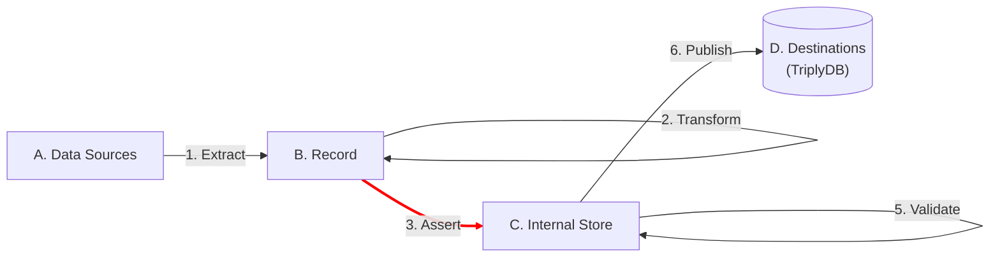

[TOC]

# Assert

The **Assert** step uses data from the Record to add linked data to the Internal Store.

Assertion are statements of fact. In linked data, assertions are commonly called 'triples' or 'quads'. A triple is composed of three parts: a subject term, a predicate term, and an object term. A quad or quadruple also has a fourth graph term.

TriplyETL supports the following languages for making linked data assertions:

- [**JSON-LD**](./json-ld.md) can be used to assert data according to a JSON-LD Context.
- **RATT** contains a core set of TypeScript functions for making linked data assertions:
    - [Term Assertions](./ratt/terms.md): functions that are used to assert terms (IRIs or literals).
    - [Statement Assertions](./ratt/statements.md): functions that are used to assert statements (triples or quads).
- [**RML**](./rml.md) inserts the data that has been transformed (from a non-RDF format into RDF triples) into the store.
- [**XSLT**](./xslt.md) inserts the data that has been transformed (from XML to XML or RDF) using stylesheet parameter in `loadRdf()` function into the store

## Next steps

After linked data has been asserted into the internal store, the following steps can be preformed:

- Step 4. [**Enrich**](../enrich/index.md): improves and extends linked data in the internal store.
- Step 5. [**Validate**](../validate/index.md) ensures that linked data in the internal store meets the specified quality criteria.
- Step 6. [**Publish**](../publish/index.md): takes the linked data from the internal store, and publishes it to a destination such as [TriplyDB](../../triply-db-getting-started/index.md).
