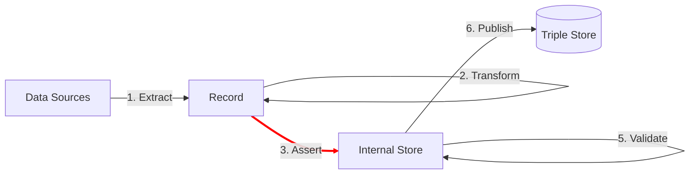

The **Assert** step uses data from the Record to add linked data to the Internal Store.

Assertion are statements of fact.  In linked data, assertions are commonly called 'triples' or 'quads'.  A triple is composed of three parts: a subject term, a predicate term, and an object term.  A quad or quadruple also has a fourth graph term.

TriplyETL supports the following assertion approaches:

- 3A. [**JSON-LD**](/docs/triply-etl/assert/json-ld) can be used to assert data according to a JSON-LD Context.
- 3B. [**RATT**](/docs/triply-etl/assert/ratt) assertions are a core set of TypeScript functions that assert linked data.

### Next steps

After linked data has been asserted into the Internal Store, the following steps can be performend:

- [4. **Enrich**](/docs/triply-etl/enrich/) improves or extends linked data in the Internal Store.
- [5. **Validate**](/docs/triply-etl/validate) ensures that linked data in the Internal Store is correct.
- [6. **Publish**](/docs/triply-etl/publish) makes linked data available in a Triple Store for others to use.
