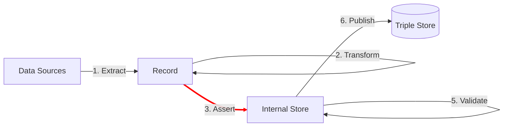

The Assert step uses data from the record to add linked data to the internal store.  Assertion are statements of fact.

Assertions are sometimes called 'triples' in linked data, since they are composed of three parts: subject, predicate, and object.

TriplyETL supports the following assertion approaches:

- [JSON-LD](/docs/triply-etl/assert/json-ld) includes an Expansion algorithm that allows a JSON-LD context to be applied to the record, and it includes a Deserialization algorithm that allows linked data to be generated (= asserted) based on the Expanded record.
- [RATT assertions](/docs/triply-etl/assert/ratt) are a set of commonly used assertion functions.
