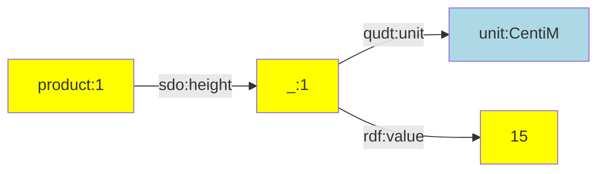
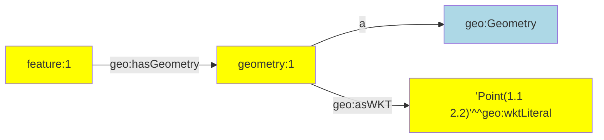
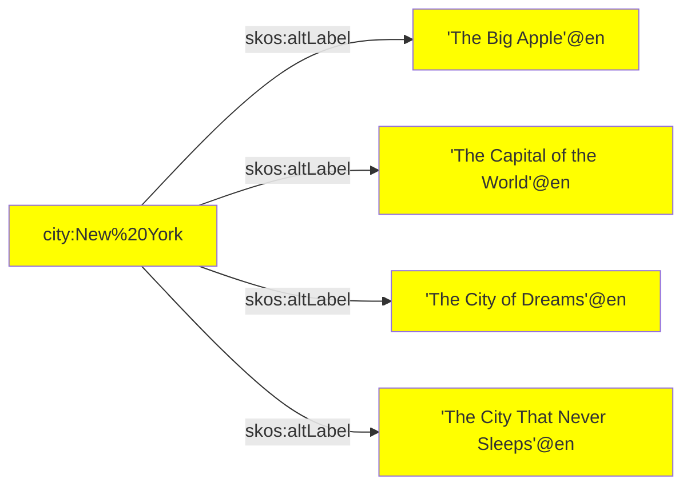
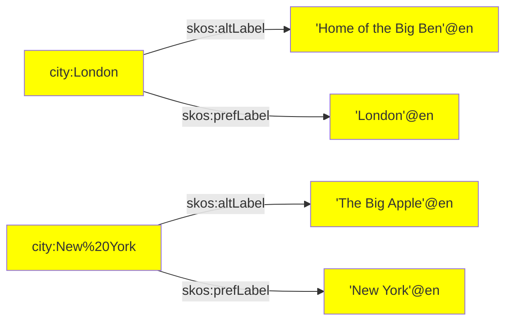

RATT assertions are a set of commonly used assertion functions.

The following assertion functions are available:

| Assertion | Description |
| --------- | ----------- |
| [`iri()`](#iri) | |
| [`iris()`](#iris) | |
| [`literal()`](#literal) | |
| [`literals()`](#literals) | |
| [`nestedPairs()`](#nestedpairs) | makes one or more assertions about a nested node. |
| [`objects()`](#objects) | |
| [`pairs()`](#pairs) | |
| [`quad()`](#quad) | |
| [`quads()`](#quads) | |
| [`triple()`](#triple) | |
| [`tripless()`](#triples) | |


## `iri()` {#iri}

Creates an IRI based on a dynamic key:
- `iri(KEY)` if key has a IRI value.
- `iri(PREFIX, KEY)` if key has a string value that acts as the local name of an IRI.

### How to use

To create an IRI from a prefix and a key that has a string:

1. Choose the `PREFIX` for the IRI that you want to create.
2. Choose the `KEY` that contains the local name (i.e., the part of an IRI that occurs after the last forward slash).
3. Make the following call: `iri(PREFIX, KEY)`

To create an IRI from a key that has an IRI:

1. Make the following call: `iri(KEY)`

### Examples

To create an IRI from `prefix.a` and `someKey`:

```ts
triple(iri(prefix.a, 'someKey'), a, owl.NamedIndividual),
```

To use an IRI stored in `someKey`:

```ts
triple(iri('someKey'), a, owl.NamedIndividual),
```
  
 
 
 ## `nestedPairs()`

This function makes one or more assertions about a nested node.

### Description

Since linked data is composed of triples, more complex n-ary information must often be asserted using a nested node.  Such a nested node can be given a name with [`iri()`](#iri) or [`addIri()`](#addiri).  In some cases, it is inconvenient to come up with a naming scheme for such intermediate nodes.  In such cases a content-based IRI can be generated with [`addHashedIri()`](#addhashediri), or a random IRI can be generated with [`addRandomIri()`](#addrandomiri).  Finally, a random Skolem IRI can be generated with [`addSkolemIri()`](#addskolemiri) to represent a nested node that can be treated as a 'blank node' in linked data.

### Parameters

- `subject` A subject term.  This must be either an [`iri`](#).
- `predicate` A predicate term.  This must be an [`iri`](#).
- `nestedNode` The nested node.  This must be an [`iri`](#).
- `pairs` One or more pairs that make assertions about the nested node.  Every pair consists of a predicate term and an object term (in that order).

### Example: Unit of measure

The following example asserts a value together with a unit of measure.  A well-known Skolem IRI or 'blank node' is used to attach the value and unit to:

```ts
fromJson([{ id: '1', height: 15 }]),
addSkolemIri({
  prefix: prefix.skolem,
  key: '_height',
}),
nestedPairs(iri(prefix.product, 'id'), sdo.height, '_height',
  [qudt.unit, unit.CentiM],
  [rdf.value, 'height'],
),
```

This makes the following linked data assertions:

```ttl
product:1 sdo:height
  [ qudt:unit unit:CentiM;
    rdf:value 15 ].
```

Or diagrammatically:



### Example: Geometry

The following example asserts a GeoSPARQL geometry.  The geometry is created
as a separate node.

```ts
fromJson([{ id: '1', geometry: 'Point(1.1 2.2)' }]),
nestedpairs(iri(prefix.feature, 'id'), geo.hasGeometry, iri(prefix.geometry, 'id'),
  [a, geo.Geometry],
  [geo.asWKT, literal('geometry', geo.wktLiteral)],
),
```

This generates the following linked data, where a well-known Skolem IRI is used for the geometry 'blank node':

```ttl
feature:1 geo:hasGeometry geometry:1.
geometry:1
  a geo:Geometry;
  geo:asWKT 'Point(1.1 2.2)'^^geo:wktLiteral.
```

Or diagrammatically:



The `nestedpairs()` assertion is a shorter notation for the following
sequence of assertions that uses [`triple()`](#triple) and [`pairs()`](#pairs):

```ts
fromJson([{ id: '1', geometry: 'Point(1.1 2.2)' }]),
triple(iri(prefix.feature, 'id'), geo.hasGeometry, iri(prefix.geometry, 'id')),
pairs(iri(prefix.geometry, 'id'),
  [a, geo.Geometry],
  [geo.asWKT, literal('geometry', geo.wktLiteral)],
),
```


## `objects()`

Asserts multiple triples with the same subject term and predicate term.

### Description

This middleware provides shorthand notation for assertions that can also be made with multiple [`triple()`](#triple) invocations.  The notational convenience of this middleware is similar to predicate-object lists in TriG, Turtle, and SPARQL.

### Parameters

- `subject` A subject term.  This must be either an [`iri()`](#iri) or a
[`literal`](#literal).
- `predicate` A predicate term.  This must be an [`iri`](#iri).
- `objects` An array of object terms.  This must be either an [`iri()`](#iri) or a [`literal`](#literal).  Every distinct object term in the array results in a distinct triple assertion.

### Example: Alternative labels

The following snippet asserts multiple alternative labels for a city:

```ts
fromJson([{
   name: 'Ney York',
   alt1: 'The Big Apple',
   alt2: 'The Capital of the World',
   alt3: 'The City of Dreams',
   alt4:  'The City That Never Sleeps',
}]),
objects(iri(prefix.city, 'name'), skos.altLabel, [
  'alt1',
  'alt2',
  'alt3',
  'alt4',
]),
```

This results in the following 4 linked data assertions:

```ttl
city:New%20York
  skos:altLabel
    'The Big Apple'@en.
    'The Capital of the World'@en,
    'The City of Dreams'@en,
    'The City That Never Sleeps'@en.
```

Or diagrammatically:




## `pairs()` {#pairs}

Asserts multiple triples with the same subject term.

### Description

This middleware provides shorthand notation for assertions that can also be made with multiple [`triple()`](#triple) assertions.  The notational convenience of this middleware is similar to predicate lists in TriG, Turtle, and SPARQL.

### Parameters

- `subject` The subject term of the asserted triples.
- `pairs` Zero or more pairs.  Each pair is an array with a predicate
term and an object term (in that order).  Every distinct element in the
`pairs` array results in a distinct triple assertion.

### Example: Alternative and preferred label

The following snippet asserts a preferred label and an alternative label for cities:

```ts
fromJson([
  { name: 'London', alt: 'Home of the Big Ben' },
  { name: 'Ney York', alt: 'The Big Apple' },
]),
pairs(iri(prefix.city, 'name'),
  [skos.prefLabel, literal('name', lang.en)],
  [skos.altLabel, literal('alt', lang.en)],
),
```

This results in the following 4 linked data assertions:

```ttl
city:London
  skos:prefLabel 'London'@en;
  skos:altLabel 'Home of the Big Ben'@en.
city:New%20York
  skos:prefLabel 'New York'@en;
  skos:altLabel 'The Big Apple'@en.
```

Or diagrammatically:




## `quad()` {#quad}

### Description

Assets a quadruple or 'quad', i.e. a statement that consists of a subject
term, a predicate term, an object term, and a graph name.

A quad is a [`triple()`](#triple) with a graph name as its fourth parameter.

### Parameters

- `subject` A subject term.  This must be either an [`iri`](#iri).
- `predicate` A predicate term.  This must be an [`iri`](#iri).
- `object` An object term.  This must be either an [`iri()`](#iri) or a
[`literal`](#literal).
- `graph` A graph name.  This must be an [`iri`](#iri).

### Example: Data and metadata

An ETL may distinguish between data and metadata assertions.  Both may be
placed into distinct graphs.  The following snippet makes one assertion in
a metadata graph and one assertion in a data graph.

```ts
quad(iri(prefix.dataset, 'flowers'), a, dcat.Dataset, graph.metadata),
quad(iri(prefix.flower, '_id'), a, def.Flower, graph.data),
```

### See also

Use [`quads()`](#quads) to make multiple quad assertions.


## `quads()` {#quads}

### Description

Assets multiple quadruples or 'quads', i.e. statements that consists of a subject term, a predicate term, an object term, and a graph name.

A quad is a [`triple()`](#triple) with a graph name as its fourth parameter.

### Parameters

- `subject` A subject term.  This must be either an [`iri()`](#iri) or a
[`literal`](#literal).
- `predicate` A predicate term.  This must be an [`iri()`](#iri).
- `object` An object term.  This must be either an [`iri()`](#iri) or a
[`literal`](#literal).
- `graph` A graph name.  This must be an [`iri()`](#iri).

### Example: Data and metadata

An ETL may distinguish between data and metadata assertions.  Both may be
placed into distinct graphs.  The following snippet makes assertions in a
metadata graph and assertions in a data graph.

```ts
quads(
  [iri(prefix.dataset, 'flowers'), a, dcat.Dataset, graph.metadata],
  ...,
),
quads(
  [iri(prefix.flower, '_id'), a, def.Flower, graph.data],
  ...,
),
```

### See also

Use [`quad()`](#quad) for asserting a single quadruple.


## `triple()` {#triple}

### Description

Assets a triple, i.e. a statement that consists of a subject term, a predicate term, and an object term.

A triple is a sequence of three terms: subject, predicate, and object.  A triple assets a factual statements, claiming that the thing denoted by the subject term and the thing denotes by the object term are related to one another according to the relationship denoted by the predicate term.  A triple is the smallest unit of meaning in linked data.

### Paramters

- `subject` A subject term.  This must be either an [`iri()`](#iri) or a
[`literal()`](#literal).
- `predicate` A predicate term.  This must be an [`iri()`](#iri).
- `object` An object term.  This must be either an [`iri()`](#iri) or a
[`literal()`](#literal).


### Example 1

The following triple asserts that something is a person.  Notice that:
- the subject term is an IRI that is constructed out of an IRI prefix (`prefix.person`) and a key that contains the IRI local name (`'id'`),
- and the predicate and object terms are IRIs that are imported from the vocabulary module.

```ts
triple(iri(prefix.person, 'id'), a, foaf.Person),
```

### Example 2

The following triple asserts that something has an age that is derived from the `'age'` key in the RATT Records.  Notice that:
- the subject term is an IRI that is stored in the `'_person'` key of the RATT Record (possibly created with the [`addIri()`](#addiri) transformation),
- the predicate term is an IRI that is imported from the vocabulary module,
- and the object term is a typed literal with a datatype IRI that is imported from the vocabulary module.

```ts
triple('_person', sdo.numChildren, literal('age', xsd.nonNegativeInteger)),
```


## `triples()` {#triples}

### Description

Asserts multiple triples that belong to the same graph.

It is common for multiple statements to occur in the same graph.  In such cases, it is suboptimal to repeat the graph name for each assertion using the [`quad()`](#quad) middleware.  Instead, it is shorter to specify the graph name once up front, and specify each triple directly afterwards.

This middleware is conceptually similar to graph notation in TriG, where the graph name is specified up front, and all statements within that graph are specified immediately after that:

```trig
graph:flowers {
  id:123 a def:Flower.
}
```

### Parameters

- `graph` A graph name.  This must be an IRI.
- `triples` An array with zero or more triples.  Each triple is represented by an array of 3 terms: a subject term, a predicate term, and an object term (in that order).

### Example

Suppose that we want to distinguish between data and metadata assertions.  We can do so by asserting them in distinct graphs.  The following makes multiple metadata assertions in the metadata graph, followed by multiple data assertions in the data graph.

```ts
triples(graph.metadata, [
  [iri(prefix.dataset, str('flowers')), a, dcat.Dataset],
  ...
]),
triples(graph.data, [
  [iri(prefix.flower, '_id'), a, def.Flower],
  ...
]),
```


## Create statements {#create-statements}

After source data is connected and transformed, the RATT Record is ready to be transformed to linked data.  Linked data statements are assertions or factual statements that consist of 3 terms (triple) or 4 terms (quadruples).


Statements are created with the `triple` function.  Calls to this function are part of the pipeline, and must appear inside the scope of `app.use`.


### Create static statements {#static-assertions}

Static linked data statements are statements that only make use of constant terms (see [working with IRIs](https://triply.cc/docs/ratt-extract#working-with-iris)).  Constant terms are introduced at the beginning of a RATT pipeline, typically prior to the occurrence of the first `app.use` scope.

The following static statements make use of the constant terms introduced in the section on [working with IRIs](https://triply.cc/docs/ratt-extract#working-with-iris).

```ts
app.use(
  // “John is a person.”
  triple(ex.john, a, foaf.Person),
  // “Mary is a person.”
  triple(ex.mary, a, foaf.Person),
)
```


### Create dynamic statements {#dynamic-assertions}

Dynamic statements are statements that are based on some aspect of the source data.

We use the following RATT Record as an example:

| Country     | Inhabitants |
| ----------- | ----------- |
| France      | null        |
| Germany     | 83190556    |
| Netherlands | 17650200    |

We start with creating the prefix and term declarations (see the section on [working with IRIs](https://triply.cc/docs/ratt-extract#working-with-iris) for more information):

```ts
const prefix_base = Ratt.prefixer('https://triplydb.com/Triply/example/')
const prefix = {
  def: Ratt.prefixer(prefix_base('def/')),
  id: Ratt.prefixer(prefix_base('id/')),
  xsd: Ratt.prefixer('http://www.w3.org/2001/XMLSchema#'),
}

const def = {
  Country: prefix.def('Country'),
  name: prefix.def('inhabitants'),
}

const xsd = {
  positiveInteger: prefix.xsd('positiveInteger'),
  string: prefix.xsd('string'),
}


const input_string  = ['Country', 'inhabitants']
```

With these prefix and term constants in place, a dynamic statement is created as follows:

```ts
app.use(
  triple(
    iri('Country', {prefix: prefix.id}),
    def.inhabitants,
    literal('Inhabitants', {datatype: xsd.positiveInteger})),
)
```

Notice the following details:
- `iri` is used to create a dynamic IRI term.
- Arguments `Country` and `Inhabitants` allow values for these keys to be used from processed RATT Records.
- The IRI prefix for the subject term is specified with constant `prefix.id`.
- `literal` is used to create a dynamic literal term.
- For literals a datatype IRI can be specified.  If no datatype IRI is specified then the default IRI is `xsd.string`.

`iri.hashed`can be used instead of `iri` when the ETL has a high number of blank nodes and they need more than one constant as input to hash a unique IRI.

```ts
app.use(
  triple(
    iri.hashed(prefix.id, input_string),
    def.inhabitants,
    mw.toLiteral('Inhabitants', {datatype: xsd.positiveInteger})),
)
```


Notice the following details:
- `input_string` can pass more than one constant to hash a unique IRI term.


#### Static and dynamic triples

Be aware that there are different approaches forstatic* anddynamic* IRIs:

- Static IRIs are created with prefix declarations (example [1a]).
- Dynamic IRIs are created with `iri`,`iri.hashed` and prefix declarations (example [2a]).

```ts
[1a] prefix.id('person')
[2a] iri(prefix.id, 'person'),
[3a] iri.hashed(prefix.id, ['person','age']),

```

Notation [1a] creates thestatic* IRI [1b].  This IRI does not depend on the currently processed RATT record.

Notation [2a] creates thedynamic* IRI in [2b], assuming the `"person"` key contains the value `"John"`.  This IRI depends on the currently processed RATT record.

For a different RATT record, IRI [2c] may be created instead (assuming the `"person"` key contains the value `"Jane"`).

Notation [3a] creates thedynamic* IRI in [3b], assuming the `"person"` key contains the value `"Sam"` and the
`"age"` key contains the value `"30"`. For a different RATT record, IRI [3c] may be created instead (assuming the `"person"` key contains the value `"Roland"` and `"age"` key contains the value `"20"`).

```turtle
[1b] id:person
[2b] id:John
[2c] id:Jane
[3b] id:Sam , age: 30
[3c] id:Sam , age: 20
```


##### When should you use an IRI instead of an URI (which is a literal)?

An IRI is used to identify something, for example the city of Amsterdam. It is expected that accessing it returns linked data. An IRI can be used to make assertions about a subject. On the other hand, a URI is expected to return a non-linked data content, for example an HTML website, and can be used as objects in linked data, for example for inserting further information about the subject resource.
In the example below, the subject IRI is described further by the object's URL.

```sh
<https://dbpedia.org/resource/Amsterdam> rdfs:seeAlso "https://www.iamsterdam.com"^^xsd:anyURI.
```

An IRI can be created with `iri`, while an URI is created by using `literal` .

##### Limitation of `literal`, `iri` and `iri.hashed`

There is a limitation for both `literal`, `iri` and `iri.hashed`. It is not possible to change the value in the record in the `literal`, `iri` and `iri.hashed` middlewares. The value that is at that moment stored in the record for that key, is then added as either an IRI when called with the `iri`/`iri.hashed` function or as a literal when called with the function `literal`.

The limitation is shown in the example below. In the example we want to round the inhabitants number to the nearest thousand. We can not transform this in the `literal` function. Instead we need to add a `change` middleware which will execute the transformation.

```ts
app.use(
  change({
    key: 'Inhabitants',
    type: 'number',
    change: (value) => value/1000
  }),
  triple(
    iri(prefix.id, 'Country'),
    def.name,

    literal('Inhabitants', xsd.positiveInteger)
  ),
)
```
