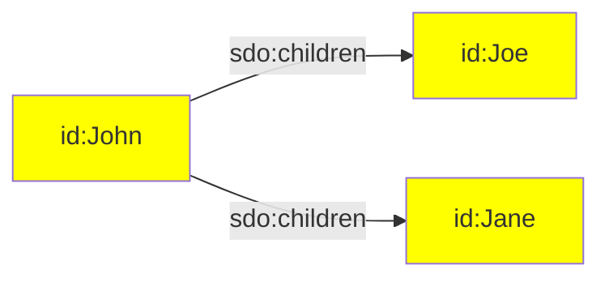
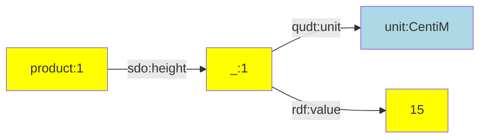
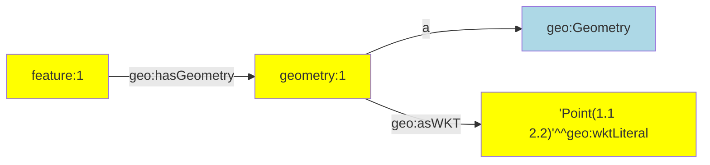
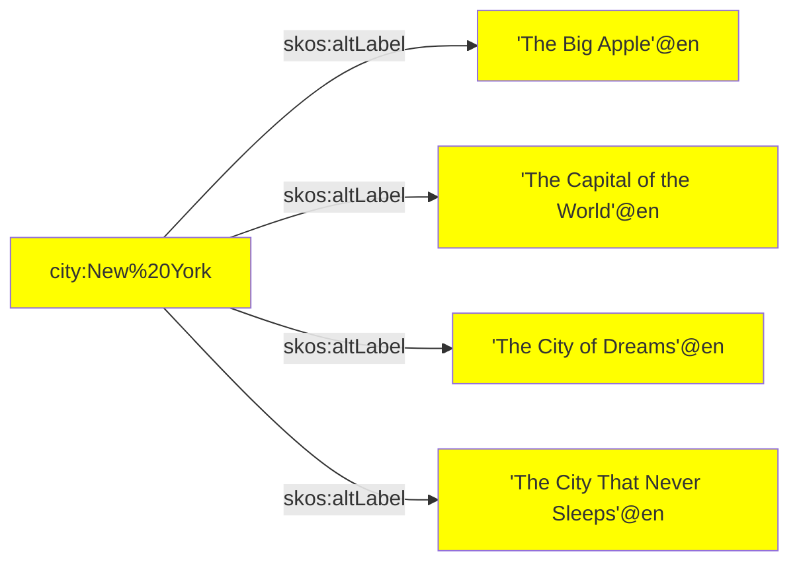
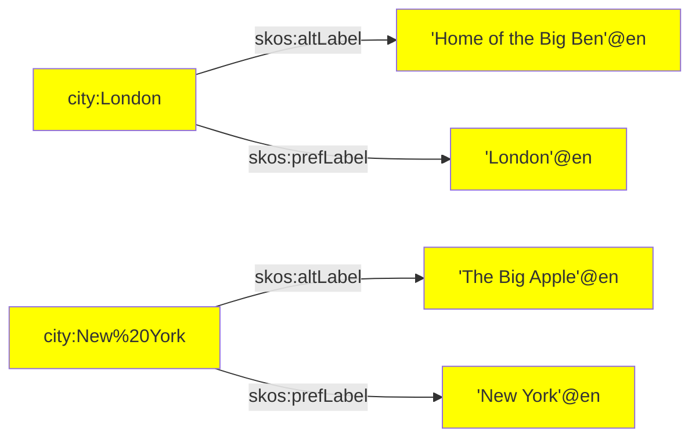

RATT assertions are a core set of TypeScript functions that assert linked data.

The following assertion functions are available:

| Assertion | Description |
| --------- | ----------- |
| [`iri()`](#iri) | Create an IRI term. |
| [`iris()`](#iris) | Creates multiple IRI terms. |
| [`literal()`](#literal) | Creates a literal term. |
| [`literals()`](#literals) | Creates multiple literal terms. |
| [`nestedPairs()`](#nestedpairs) | Creates a nested node with multiple triples that use that node as their subject term. |
| [`objects()`](#objects) | Asserts multiple triples that share the same subject and predicate terms. |
| [`pairs()`](#pairs) | Asserts multiple triples that share the same subject term. |
| [`quad()`](#quad) | Asserts a quadruple. |
| [`quads()`](#quads) | Asserts multiple quadruples. |
| [`str()`](#str) | Creates a static string. |
| [`triple()`](#triple) | Asserts a triple. |
| [`triples()`](#triples) | Asserts multiple triples. |

All RATT assertions can be imported from the RATT library in TriplyETL:

```ts
import { iri, iris, literal, literals, nestedPairs, objects,
         pairs, quad, quads, triple, triples
       } from '@triplyetl/etl/ratt'
```


## `iri()`

To create an IRI from a prefix and a key that has a string:

1. Use a prefix that was declared with [`declarePrefix()`](/docs/triply-etl/declare#declarePrefix).
2. Use a key that contains a local name, i.e., the part of an IRI that occurs after the last forward slash.
3. Make the following call: `iri(PREFIX, KEY)`

To create an IRI from a key that contains a absolute IRI:

1. Make the following call: `iri(KEY)`

#### Examples

The following creates an IRI from `prefix.a` and `someKey`:

```ts
triple(iri(prefix.a, 'someKey'), a, owl.NamedIndividual),
```

The following creates an IRI stored in `someKey`:

```ts
triple(iri('someKey'), a, owl.NamedIndividual),
```

The following creates an IRI from `prefix.a` and a static string ([`str()`](#str)):

```ts
triple(iri(prefix.a, str('b')), a, owl.NamedIndividual),
```


## `iris()`

Created multiple IRI terms.

When the Record contains a key that stores an array of strings, it is possible to create one IRI for every string in that array.  

The following code snippet

```ts
fromJson([{ parent: 'John', children: ['Joe', 'Jane'] }]),
triple(iri(prefix.id, 'parent'), sdo.children, iris(prefix.id, 'children')),
```

This makes the following linked data assertions:

```ttl
id:John sdo:children id:Joe, id:Jane.
```

Or diagrammatically:




## `nestedPairs()`

This function creates a nested node and makes multiple assertions about that node.

Since linked data is composed of triples, more complex n-ary information must often be asserted with one or more nested nodes.  Such nested nodes can be given a name with assertion function [`iri()`](#iri) or transformation function [`addIri()`](/docs/triply-etl/transform/ratt#addiri).

In some cases, it is inconvenient to come up with a naming scheme for intermediate nodes.  In such cases a content-based IRI can be generated with transformation function [`addHashedIri()`](/docs/triply-etl/transform/ratt#addhashediri), or a random IRI can be generated with transformation function [`addRandomIri()`](/docs/triply-etl/transform/ratt#addrandomiri).  Finally, a random Skolem IRI can be generated with transformation function [`addSkolemIri()`](/docs/triply-etl/transform/ratt#addskolemiri) to represent a nested node that can be treated as a 'blank node' in linked data.

#### Parameters

- `subject` A subject term.  This must be either an [`iri`](#).
- `predicate` A predicate term.  This must be an [`iri`](#).
- `nestedNode` The nested node.  This must be an [`iri`](#).
- `pairs` One or more pairs that make assertions about the nested node.  Every pair consists of a predicate term and an object term (in that order).

#### Example: Unit of measure

The following example asserts a value together with a unit of measure.  A well-known Skolem IRI or 'blank node' is used to attach the value and unit to:

```ts
fromJson([{ id: '1', height: 15 }]),
addSkolemIri({
  prefix: prefix.skolem,
  key: '_height',
}),
nestedPairs(iri(prefix.product, 'id'), sdo.height, '_height',
  [qudt.unit, unit.CentiM],
  [rdf.value, 'height'],
),
```

This makes the following linked data assertions:

```ttl
product:1
  sdo:height
    [ qudt:unit unit:CentiM;
      rdf:value 15 ].
```

Or diagrammatically:



#### Example: Geometry

The following example asserts a GeoSPARQL geometry.  The geometry is created
as a separate node.

```ts
fromJson([{ id: '1', geometry: 'Point(1.1 2.2)' }]),
nestedpairs(iri(prefix.feature, 'id'), geo.hasGeometry, iri(prefix.geometry, 'id'),
  [a, geo.Geometry],
  [geo.asWKT, literal('geometry', geo.wktLiteral)],
),
```

This generates the following linked data, where a well-known Skolem IRI is used for the geometry 'blank node':

```ttl
feature:1 geo:hasGeometry geometry:1.
geometry:1
  a geo:Geometry;
  geo:asWKT 'Point(1.1 2.2)'^^geo:wktLiteral.
```

Or diagrammatically:



The `nestedpairs()` assertion is a shorter notation for the following
sequence of assertions that uses [`triple()`](#triple) and [`pairs()`](#pairs):

```ts
fromJson([{ id: '1', geometry: 'Point(1.1 2.2)' }]),
triple(iri(prefix.feature, 'id'), geo.hasGeometry, iri(prefix.geometry, 'id')),
pairs(iri(prefix.geometry, 'id'),
  [a, geo.Geometry],
  [geo.asWKT, literal('geometry', geo.wktLiteral)],
),
```


## `objects()`

Asserts multiple triples that share the same subject term and predicate term.

This function provides a shorthand notation for assertions that can also be made with multiple uses of [`triple()`](#triple).  The notational convenience of this middleware is similar to predicate-object lists in TriG, Turtle, and SPARQL.

#### Parameters

- `subject` A subject term.  This must be either an [`iri()`](#iri) or a
[`literal`](#literal).
- `predicate` A predicate term.  This must be an [`iri`](#iri).
- `objects` An array of object terms.  This must be either an [`iri()`](#iri) or a [`literal`](#literal).  Every distinct object term in the array results in a distinct triple assertion.

#### Example: Alternative labels

The following snippet asserts multiple alternative labels for a city:

```ts
fromJson([{
   name: 'Ney York',
   alt1: 'The Big Apple',
   alt2: 'The Capital of the World',
   alt3: 'The City of Dreams',
   alt4:  'The City That Never Sleeps',
}]),
objects(iri(prefix.city, 'name'), skos.altLabel,
  ['alt1', 'alt2', 'alt3', 'alt4']
),
```

This results in the following 4 linked data assertions:

```ttl
city:New%20York
  skos:altLabel
    'The Big Apple'@en.
    'The Capital of the World'@en,
    'The City of Dreams'@en,
    'The City That Never Sleeps'@en.
```

Or diagrammatically:




## `pairs()`

Asserts multiple triples that share the same subject term.

This function provides a shorthand notation for assertions that can also be made with multiple uses of [`triple()`](#triple).  The notational convenience of this middleware is similar to predicate lists in TriG, Turtle, and SPARQL.

#### Parameters

- `subject` The subject term of the asserted triples.
- `pairs` Zero or more pairs.  Each pair is an array with a predicate
term and an object term (in that order).  Every distinct element in the
`pairs` array results in a distinct triple assertion.

#### Example: Alternative and preferred label

The following snippet asserts a preferred label and an alternative label for cities:

```ts
fromJson([
  { name: 'London', alt: 'Home of the Big Ben' },
  { name: 'Ney York', alt: 'The Big Apple' },
]),
pairs(iri(prefix.city, 'name'),
  [skos.prefLabel, literal('name', lang.en)],
  [skos.altLabel, literal('alt', lang.en)],
),
```

This results in the following 4 linked data assertions:

```ttl
city:London
  skos:prefLabel 'London'@en;
  skos:altLabel 'Home of the Big Ben'@en.
city:New%20York
  skos:prefLabel 'New York'@en;
  skos:altLabel 'The Big Apple'@en.
```

Or diagrammatically:




## `quad()`

Asserts a quadruple or 'quad', i.e. a statement that consists of a subject
term, a predicate term, an object term, and a graph name.

A quad is a [`triple()`](#triple) with a graph name as its fourth parameter.

#### Parameters

- `subject` A subject term.  This must be either an [`iri`](#iri).
- `predicate` A predicate term.  This must be an [`iri`](#iri).
- `object` An object term.  This must be either an [`iri()`](#iri) or a [`literal`](#literal).
- `graph` A graph name.  This must be an [`iri`](#iri).

#### Example: Data and metadata

An ETL may distinguish between data and metadata assertions.  Both may be
placed into distinct graphs.  The following snippet makes one assertion in
a metadata graph and one assertion in a data graph.

```ts
quad(iri(prefix.dataset, 'flowers'), a, dcat.Dataset, graph.metadata),
quad(iri(prefix.flower, '_id'), a, def.Flower, graph.data),
```

#### See also

Use [`quads()`](#quads) to make multiple quad assertions.


## `quads()`

Asserts multiple quadruples or 'quads', i.e. statements that consists of a subject term, a predicate term, an object term, and a graph name.

A quad is a [`triple()`](#triple) with a graph name as its fourth parameter.

#### Parameters

- `subject` A subject term.  This must be either an [`iri()`](#iri) or a [`literal`](#literal).
- `predicate` A predicate term.  This must be an [`iri()`](#iri).
- `object` An object term.  This must be either an [`iri()`](#iri) or a [`literal`](#literal).
- `graph` A graph name.  This must be an [`iri()`](#iri).

#### Example: Data and metadata

An ETL can distinguish between data and metadata assertions.  Both may be
placed into distinct graphs.  The following snippet makes assertions in a
metadata graph and assertions in a data graph.

```ts
quads(
  [iri(prefix.dataset, 'flowers'), a, dcat.Dataset, graph.metadata],
  ...,
),
quads(
  [iri(prefix.flower, '_id'), a, def.Flower, graph.data],
  ...,
),
```

#### See also

Use [`quad()`](#quad) for asserting a single quadruple.


## `str()`

Strings in assertions are typically used to denote keys in the Record.

The string `'abc'` in the following code snippet indicates that the value of key `'abc'` should be used as the local name of the IRI in the subject position and as the lexical form of the literal in the object position:

```ts
triple(iri(prefix.id, 'abc'), rdfs.label, 'abc'),
```

But sometimes we want to assert a static string, i.e. the actual string value `'abc'` instead of the string value stored in a key with that name.  In such cases the string function `str()` can be used.

The following code snippet asserts the IRI `id:abc` and literal `'abc'`:

```ts
triple(iri(prefix.id, str('abc')), rdfs.label, str('abc')),
```


## `triple()`

Asserts a triple, i.e. a statement that consists of a subject term, a predicate term, and an object term.

A triple is a sequence of three terms: subject, predicate, and object.  A triple asserts a factual statement, claiming that the thing denoted by the subject term and the thing denotes by the object term are related to one another according to the relationship denoted by the predicate term.  A triple is the smallest unit of meaning in linked data.

#### Paramters

- `subject` A subject term.  This must be either an [`iri()`](#iri) or a [`literal()`](#literal).
- `predicate` A predicate term.  This must be an [`iri()`](#iri).
- `object` An object term.  This must be either an [`iri()`](#iri) or a [`literal()`](#literal).

#### Example 1

The following triple asserts that something is a person.  Notice that:
- the subject term is an IRI that is constructed out of an IRI prefix (`prefix.person`) and a key that contains the IRI local name (`'id'`),
- and the predicate and object terms are IRIs that are imported from the vocabulary module.

```ts
triple(iri(prefix.person, 'id'), a, foaf.Person),
```

#### Example 2

The following triple asserts that something has an age that is derived from the `'age'` key in the Record.  Notice that:

- the subject term is an IRI that is stored in the `'_person'` key of the Record (possibly created with the [`addIri()`](#addiri) transformation),
- the predicate term is an IRI (`foaf.age`) that is imported from the vocabulary module,
- and the object term is a typed literal with a datatype IRI that is imported from the vocabulary module.

```ts
triple('_person', foaf.age, literal('age', xsd.nonNegativeInteger)),
```


## `triples()`

#### Description

Asserts multiple triples that belong to the same graph.

It is common for multiple statements to occur in the same graph.  In such cases, it is suboptimal to repeat the graph name for each assertion using the [`quad()`](#quad) middleware.  Instead, it is shorter to specify the graph name once up front, and specify each triple directly afterwards.

This middleware is conceptually similar to graph notation in TriG, where the graph name is specified up front, and all statements within that graph are specified immediately after that:

```trig
graph:flowers {
  id:123 a def:Flower.
}
```

#### Parameters

- `graph` A graph name.  This must be an IRI.
- `triples` An array with zero or more triples.  Each triple is represented by an array of 3 terms: a subject term, a predicate term, and an object term (in that order).

#### Example

Suppose that we want to distinguish between data and metadata assertions.  We can do so by asserting them in distinct graphs.  The following makes multiple metadata assertions in the metadata graph, followed by multiple data assertions in the data graph.

```ts
triples(graph.metadata,
  [iri(prefix.dataset, str('flowers')), a, dcat.Dataset],
  ...
),
triples(graph.data,
  [iri(prefix.flower, '_id'), a, def.Flower],
  ...
),
```
