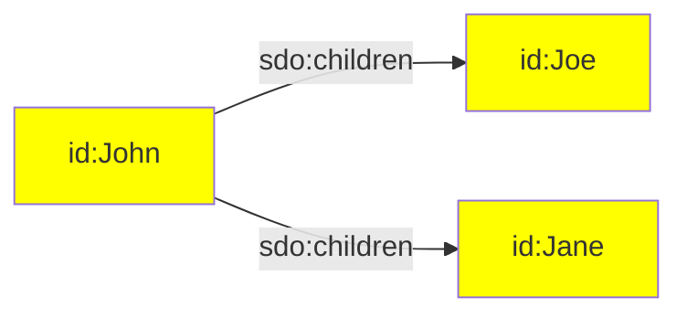
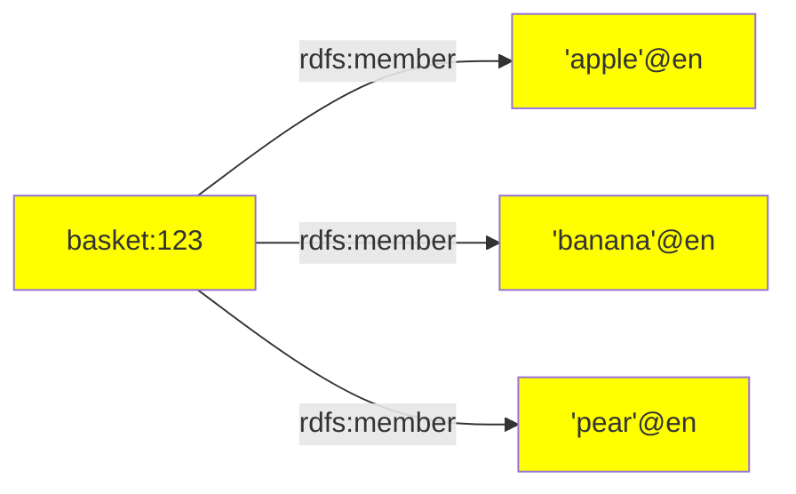
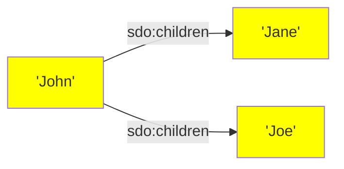
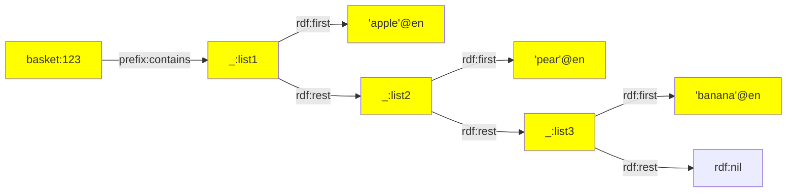
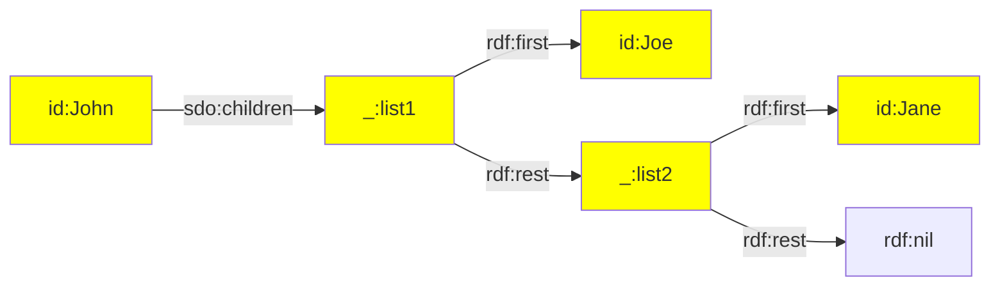
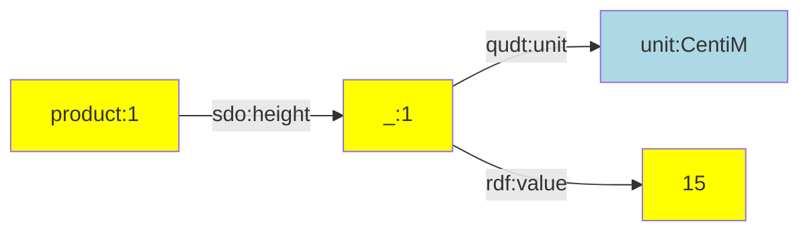
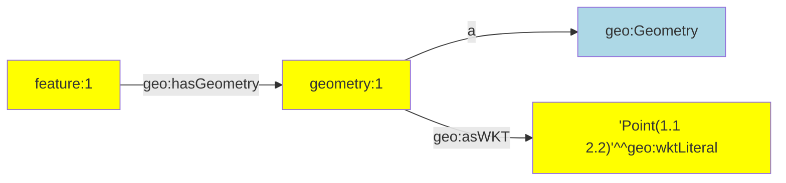
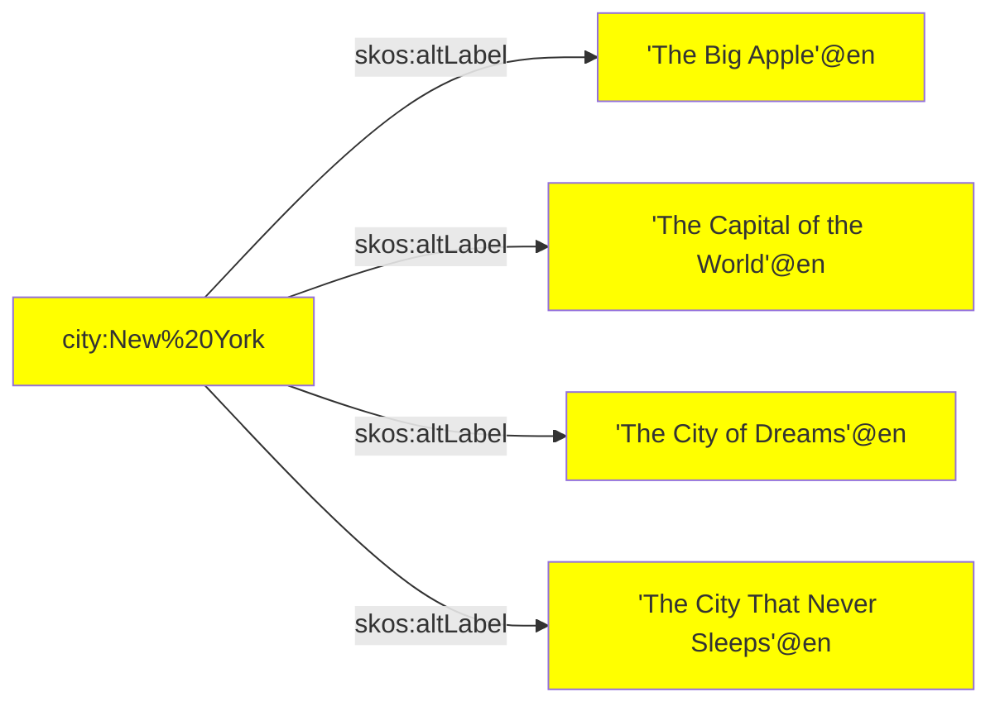
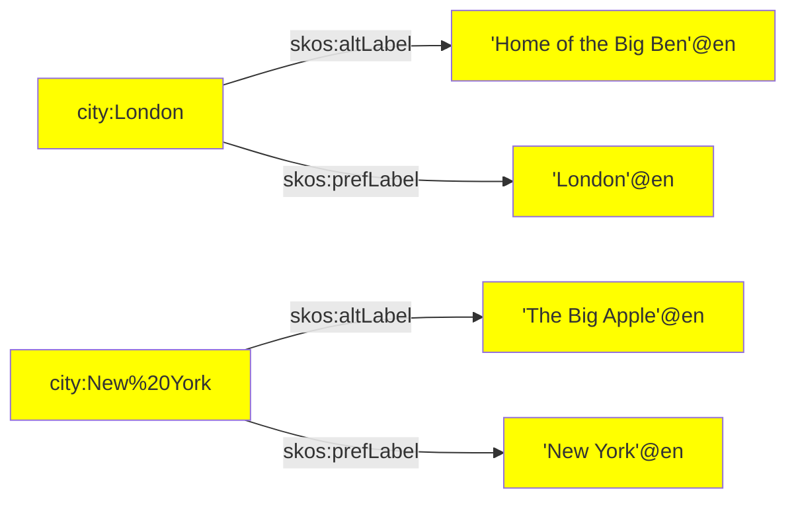

RATT assertions are a core set of TypeScript functions that assert linked data.

# Overview

The following assertion functions are available:

| Assertion | Description |
| --- | --- |
| [iri()](#iri) | Create an IRI term. |
| [iris()](#iris) | Creates multiple IRI terms. |
| [literal()](#literal) | Creates a literal term. |
| [literals()](#literals) | Creates multiple literal terms. |
| [list()](#list) | Creates a list of terms. |
| [nestedPairs()](#nestedpairs) | Creates a nested node with multiple triples that use that node as their subject term. |
| [objects()](#objects) | Asserts multiple triples that share the same subject and predicate terms. |
| [pairs()](#pairs) | Asserts multiple triples that share the same subject term. |
| [quad()](#quad) | Asserts a quadruple. |
| [quads()](#quads) | Asserts multiple quadruples. |
| [str()](#str) | Creates a static string. |
| [triple()](#triple) | Asserts a triple. |
| [triples()](#triples) | Asserts multiple triples. |

All RATT assertions can be imported from the RATT library in TriplyETL:

```ts
import { iri, iris, literal, literals, nestedPairs, objects,
         pairs, quad, quads, triple, triples
       } from '@triplyetl/etl/ratt'
```


# Function `iri()` {#iri}

Asserts an IRI term based on a key and an optional IRI prefix:

- `iri(prefix:PrefixedToIri, content:Key|StaticString)`
- `iri(content:Key|StaticString)`

## Parameters

- `prefix` A prefix that is declared with [declarePrefix()](/docs/triply-etl/declare#declarePrefix).
- `content` Either a key that contains a string value, or a static string. If the `prefix` is used, this content is placed after the prefix (sometimes referred to a the 'local name'). If the `prefix` parameter is not used, the content must specify the full IRI.

## Examples

The following asserts an IRI based on a declared prefix (`prefix.ex`) and a key (`name`):

```ts
triple(iri(prefix.ex, 'name'), a, owl.NamedIndividual),
```

The following asserts an IRI based on a declared prefix (`prefix.ex`) and a static string (see function [str()](#str)):

```ts
triple(iri(prefix.ex, str('bob')), a, owl.NamedIndividual),
```

The following asserts an IRI based on the value stored in key `'url'`. Notice that this value must encode a full absolute IRI.

```ts
fromJson([{ 'url': 'https://example.com/bob' }]),
triple(iri('url'), a, owl.NamedIndividual),
```

## See also

If the same IRI is used in multiple statements, repeating the same assertion multiple times may impose a maintenance burden. In such cases, it is possible to first add the IRI to the record using transformation function [addIri()](/docs/triply-etl/transform/ratt#addIri), and refer to that one IRI in multiple statements.

Use function [iris()](#iris) to create multiple IRIs in one step.


# Function `iris()` {#iris}

Asserts multiple IRIs, one for each entry in an array of strings:

- `iris(prefix:PrefixedToIri, content:Key|Array<StaticString>)`
- `iris(content:Key|Array<StaticString>)`

## Parameters

- `prefix` A prefix that is declared with [declarePrefix()](/docs/triply-etl/declare#declarePrefix).
- `content` Either a key that contains a array of string values, or an array of static strings. If the `prefix` is used, this content is placed after the prefix (sometimes referred to a the 'local name'). If the `prefix` parameter is not used, the content must specify the full IRI.

## Example

The following code snippet asserts one IRI for each entry in record key `'children'`:

```ts
fromJson([{ parent: 'John', children: ['Joe', 'Jane'] }]),
triple(iri(prefix.id, 'parent'), sdo.children, iris(prefix.id, 'children')),
```

This makes the following linked data assertions:

```ttl
id:John sdo:children id:Joe, id:Jane.
```

Or diagrammatically:




# Function `literal()` {#literal}

Asserts a literal term:

- `literal(lexicalForm, languageTagOrDatatype)`

## Parameters

- `lexicalForm` A static string (see function [str()](#str)), or a key that contains a string value.
- `languageTagOrDatatype` A static language tag, or a static datatype IRI, or a key that contains either a language tag or a datatype IRI.

## Examples

The following snippet asserts a language-tagged string:

```ts
triple('city', sdo.name, literal('name', lang.nl)),
```

The following snippet asserts a typed literal:

```ts
triple('city', vocab.population, literal('population', xsd.nonNegativeInteger)),
```

Notice that string literals can be asserted directly; the following two statements make the same assertion:

```ts
triple('city', dct.identifier, literal('id', xsd.string)),
triple('city', dct.identifier, 'id'),
```

These assertions combined can result in the following linked data:

```ttl
id:amsterdam
  sdo:name 'Amsterdam'@nl
  vocab:population '800000'^^xsd:nonNegativeInteger
  dct:identifier '0200'.
```

## See also

If the same literal is used in multiple statements, repeating the same assertion multiple times can impose a maintenance burden. In such cases, it is possible to first add the literal to the record with transformation [addLiteral()](/docs/triply-etl/transform/ratt#addLiteral), and refer to that one literal in multiple statements.

Use assertion [literals()](#literals) to create multiple literals in one step.


# Function `literals()` {#literals}

Asserts multiple literals, one for each given lexical form:

```
literals(lexicalForms, languageTagOrDatatype)
```

When the record contains a key that stores an array, it is possible to create one literal for each value in the array.

## Parameters

- `lexicalForms` A key that stores an array.
- `languageTagOrDatatype` A static language tag, or a static datatype IRI, or a key that stores a language tag or datatype IRI.

## Example: Fruit basket

The following code snippet creates one literal for each value in the array that is stored in the `'contents'` key:

```ts
fromJson([{ id: 123, contents: ['apple', 'pear', 'banana'] }]),
triple(iri(prefix.basket, 'id'), rdfs.member, literals('contents', lang.en)),
```

This makes the following linked data assertions:

```ttl
basket:123 rdfs:member 'apple'@en, 'banana'@en, 'pear'@en.
```

Or diagrammatically:



## Example: Names

String literals can be asserted directly from a key that stores an array of strings.

The following code snippet asserts one string literal for each child:

```ts
fromJson([{ parent: 'John', children: ['Joe', 'Jane'] }]),
triple(iri(prefix.id, 'parent'), sdo.children, 'children'),
```

This makes the following linked data assertions:

```ttl
id:John sdo:children 'Jane', 'Joe'.
```

Or diagrammatically:



Notice that the same could have been achieved with an explicit datatype IRI:

```ts
triple(iri(prefix.id, 'parent'), sdo.children, literals('children', xsd.string)),
```

# Function `list()` {#list}

This function allows us to create ordered closed collections [rdf:List](https://triplydb.com/how-to-model/-/stories/collections) in TriplyETL.

## Parameters

- `prefix` A prefix for linked lists that is declared with [declarePrefix()](/docs/triply-etl/declare#declarePrefix). 
- `listOrReference`  term, literal, key or string or an array of terms/literals/keys/strings

## Example: Fruit basket

The following code snippet creates linked lists (linked by `rdf:rest`), where each value stored in the `'contents'` key is `rdf:first` object:

```ts
fromJson([{ id: 123, contents: ['apple', 'pear', 'banana'] }]),
triple(iri(prefix.basket, 'id'), ex.contains, list(prefix.basket, literals('contents', lang.en)))
```

This makes the following linked data assertions:

```ttl
basket:123 prefix:contains _:list1.

_:list1 rdf:first "apple"@en;
        rdf:rest _:list2.

_:list2 rdf:first "pear"@en;
        rdf:rest _:list3.

_:list3 rdf:first "banana"@en;
        rdf:rest rdf:nil.
```

Or diagrammatically:


Note that the predicate differs from the above example of the [literals()](#function-literals-literals) function. In order to use `list()` middleware we need to be sure that the `rdfs:domain` property of the predicates allows to be of `rdf:List`. 


## Example: Children

The following code snippet creates linked lists (linked by `rdf:rest`), where each value stored in the `'children'` key is `rdf:first` object:

```ts
fromJson([{ parent: 'John', children: ['Joe', 'Jane'] }]),
triple(iri(prefix.id, 'parent'), sdo.children, list(prefix.skolem, iris(prefix.id, 'children'))),
```

This makes the following linked data assertions:

```ttl
id:John sdo:children _:list1.

_:list1 rdf:first id:Joe;
        rdf:rest _:list2.

_:list2 rdf:first id.Jane;
        rdf:rest rdf:nil.
```

Or diagrammatically:



The above diagram can be translated to the statement: "John has two children, where Joe is his first child and Jane is his second child". 

# Function `nestedPairs()` {#nestedPairs}

This function creates a nested node and makes multiple assertions about that node.

Since linked data is composed of triples, more complex n-ary information must often be asserted with one or more nested nodes. Such nested nodes can be given a name with assertion [iri()](#iri) or transformation [addIri()](/docs/triply-etl/transform/ratt#addiri).

## Parameters

- `subject` A subject term. This must be an IRI (see function [iri()](#iri)).
- `predicate` A predicate term. This must be an IRI (see function [iri()](#iri)).
- `nestedNode` The nested node. This must be an IRI (see function [iri()](#iri)).
- `pairs` One or more pairs that make assertions about the nested node. Every pair consists of a predicate term and an object term (in that order).

## Example: Unit of measure

The following example asserts a value together with a unit of measure. A well-known Skolem IRI or 'blank node' is used to attach the value and unit to:

```ts
fromJson([{ id: '1', height: 15 }]),
addSkolemIri({
  prefix: prefix.skolem,
  key: '_height',
}),
nestedPairs(iri(prefix.product, 'id'), sdo.height, '_height',
  [qudt.unit, unit.CentiM],
  [rdf.value, 'height'],
),
```

This makes the following linked data assertions:

```ttl
product:1
  sdo:height
    [ qudt:unit unit:CentiM;
      rdf:value 15 ].
```

Or diagrammatically:



## Example: Geometry

The following example asserts a GeoSPARQL geometry. The geometry is created
as a separate node.

```ts
fromJson([{ id: '1', geometry: 'Point(1.1 2.2)' }]),
nestedpairs(iri(prefix.feature, 'id'), geo.hasGeometry, iri(prefix.geometry, 'id'),
  [a, geo.Geometry],
  [geo.asWKT, literal('geometry', geo.wktLiteral)],
),
```

This generates the following linked data, where a well-known Skolem IRI is used for the geometry 'blank node':

```ttl
feature:1 geo:hasGeometry geometry:1.
geometry:1
  a geo:Geometry;
  geo:asWKT 'Point(1.1 2.2)'^^geo:wktLiteral.
```

Or diagrammatically:



Assertions that use `nestedpairs()` provide a shorter notation for the following sequence of assertions that uses functions [triple()](#triple) and [pairs()](#pairs):

```ts
fromJson([{ id: '1', geometry: 'Point(1.1 2.2)' }]),
triple(iri(prefix.feature, 'id'), geo.hasGeometry, iri(prefix.geometry, 'id')),
pairs(iri(prefix.geometry, 'id'),
  [a, geo.Geometry],
  [geo.asWKT, literal('geometry', geo.wktLiteral)],
),
```

## See also

In some cases, it is inconvenient to come up with a naming scheme for intermediate nodes. In such cases, the following options are available:
- Use transformation [addHashedIri()](/docs/triply-etl/transform/ratt#addhashediri) to create a content-based IRI.
- Use transformation [addRandomIri()](/docs/triply-etl/transform/ratt#addrandomiri) to create a random IRI.
- Use transformation [addSkolemIri()](/docs/triply-etl/transform/ratt#addskolemiri) to create a random Skolem IRI.


# Function `objects()` {#objects}

Asserts multiple triples that share the same subject term and predicate term.

This function provides a shorthand notation for assertions that can also be made with multiple uses of the [triple()](#triple) assertion function. The notational convenience of this middleware is similar to predicate-object lists in TriG, Turtle, and SPARQL.

## Parameters

- `subject` A subject term. This must be either an IRI (see function [iri()](#iri)) or a literal (see function [literal()](#literal)).
- `predicate` A predicate term. This must be an IRI (see function [iri()](#iri)).
- `objects` An array of object terms. This must be either an IRI (see function [iri()](#iri)) or a literal (see function [literal](#literal)). Every distinct object term in the array results in a distinct triple assertion.

## Example: Alternative labels

The following snippet asserts multiple alternative labels for a city:

```ts
fromJson([{
   name: 'Ney York',
   alt1: 'The Big Apple',
   alt2: 'The Capital of the World',
   alt3: 'The City of Dreams',
   alt4:  'The City That Never Sleeps',
}]),
objects(iri(prefix.city, 'name'), skos.altLabel,
  ['alt1', 'alt2', 'alt3', 'alt4']
),
```

This results in the following 4 linked data assertions:

```ttl
city:New%20York
  skos:altLabel
    'The Big Apple'@en.
    'The Capital of the World'@en,
    'The City of Dreams'@en,
    'The City That Never Sleeps'@en.
```

Or diagrammatically:




# Function `pairs()` {#pairs}

Asserts multiple triples that share the same subject term.

This function provides a shorthand notation for assertions that can also be made with multiple uses of assertion [triple()](#triple). The notational convenience of this middleware is similar to predicate lists in TriG, Turtle, and SPARQL.

## Parameters

- `subject` The subject term of the asserted triples.
- `pairs` Zero or more pairs. Each pair is an array with a predicate term and an object term (in that order). Every distinct element in the `pairs` array results in a distinct triple assertion.

## Example: Alternative and preferred label

The following snippet asserts a preferred label and an alternative label for cities:

```ts
fromJson([
  { name: 'London', alt: 'Home of the Big Ben' },
  { name: 'Ney York', alt: 'The Big Apple' },
]),
pairs(iri(prefix.city, 'name'),
  [skos.prefLabel, literal('name', lang.en)],
  [skos.altLabel, literal('alt', lang.en)],
),
```

This results in the following 4 linked data assertions:

```ttl
city:London
  skos:prefLabel 'London'@en;
  skos:altLabel 'Home of the Big Ben'@en.
city:New%20York
  skos:prefLabel 'New York'@en;
  skos:altLabel 'The Big Apple'@en.
```

Or diagrammatically:




# Function `quad()` {#quad}

Asserts a quadruple or 'quad', i.e. a statement that consists of a subject term, a predicate term, an object term, and a graph name.

A quadruple is a triple with a graph name as its fourth parameter.

## Parameters

- `subject` A subject term. This must be an IRI (see function [iri()](#iri)).
- `predicate` A predicate term. This must be an IRI (see function [iri()](#iri)).
- `object` An object term. This must be either an IRI (see function [iri()](#iri)) or a literal (see function [literal()](#literal)).
- `graph` A graph name. This must be an IRI (see function [iri()](#iri)).

## Example: Data and metadata

An ETL may distinguish between data and metadata assertions. Both may be
placed into distinct graphs. The following snippet makes one assertion in
a metadata graph and one assertion in a data graph.

```ts
quad(iri(prefix.dataset, 'flowers'), a, dcat.Dataset, graph.metadata),
quad(iri(prefix.flower, '_id'), a, def.Flower, graph.data),
```

## See also

Use function [quads()](#quads) to make multiple quadruple assertions.


# Function `quads()` {#quads}

Asserts multiple quadruples or 'quads', i.e. statements that consists of a subject term, a predicate term, an object term, and a graph name.

A quadruple is a triple with a graph name as its fourth parameter.

## Parameters

- `subject` A subject term. This must be an IRI (see function [iri()](#iri)).
- `predicate` A predicate term. This must be an IRI (see function [iri()](#iri)).
- `object` An object term. This must be either an IRI (see function [iri()](#iri)) or a literal (see function [literal()](#literal)).
- `graph` A graph name. This must be an IRI (see function [iri()](#iri)).

## Example: Data and metadata

An ETL can distinguish between data and metadata assertions. Both may be
placed into distinct graphs. The following snippet makes assertions in a
metadata graph and assertions in a data graph.

```ts
quads(
  [iri(prefix.dataset, 'flowers'), a, dcat.Dataset, graph.metadata],
  ...,
),
quads(
  [iri(prefix.flower, '_id'), a, def.Flower, graph.data],
  ...,
),
```

## See also

Use function [quad()](#quad) for asserting a single quadruple.


# Function `str()` {#str}

Asserts a static string value.

## When to use

Strings in assertions are typically used to denote keys in the Record. For example, the string `'abc'` in the following code snippet indicates that the value of key `'abc'` should be used as the local name of the IRI in the subject position. The value of key `'abc'` should also be used as the lexical form of the literal in the object position:

```ts
triple(iri(prefix.id, 'abc'), rdfs.label, 'abc'),
```

But sometimes we want to assert a static string, i.e. the actual string value `'abc'` instead of the string value stored in a key with that name. In such cases the string function `str()` can be used.

The following code snippet asserts the IRI `id:abc` and literal `'abc'`:

```ts
triple(iri(prefix.id, str('abc')), rdfs.label, str('abc')),
```


# Function `triple()` {#triple}

Asserts a triple, i.e. a statement that consists of a subject term, a predicate term, and an object term.

A triple is a sequence of three terms: subject, predicate, and object. A triple asserts a factual statement, claiming that the thing denoted by the subject term and the thing denotes by the object term are related to one another according to the relationship denoted by the predicate term. A triple is the smallest unit of meaning in linked data.

## Parameters

- `subject` A subject term. This must be an IRI (see function [iri()](#iri)).
- `predicate` A predicate term. This must be an IRI (see function [iri()](#iri)).
- `object` An object term. This must be either an IRI (see function [iri()](#iri)) or a literal (see function [literal()](#literal)).

## Example 1

The following triple asserts that something is a person. Notice that:
- the subject term is an IRI that is constructed out of an IRI prefix (`prefix.person`) and a key that contains the IRI local name (`'id'`),
- and the predicate and object terms are IRIs that are imported from the vocabulary module.

```ts
triple(iri(prefix.person, 'id'), a, foaf.Person),
```

## Example 2

The following triple asserts that something has an age that is derived from the `'age'` key in the record. Notice that:

- the subject term is an IRI that is stored in the `'_person'` key of the record (possibly created with transformation function [addIri()](#addiri)),
- the predicate term is an IRI (`foaf.age`) that is imported from the vocabulary module,
- and the object term is a typed literal with a datatype IRI that is imported from the vocabulary module.

```ts
triple('_person', foaf.age, literal('age', xsd.nonNegativeInteger)),
```


# Function `triples()` {#triples}

Asserts multiple triples in the same named graph:

- `triples(graph, triples)`

## Parameters

- `graph` A graph name. This must be an IRI (see function [iri()](#iri)).
- `triples` An array of triples. Every triple is represented by an array of 3 terms: subject, predicate, and object.

## When to use

It is common for multiple statements to occur in the same graph. In such cases, it is suboptimal to repeat the graph name for multiple uses of the [quad()](#quad) function. In such cases, it is shorter to use the `triples()` function, where the graph name only needs to be specified once.

## Example

Suppose that we want to distinguish between data and metadata assertions. We can do so by asserting them in distinct graphs. The following makes multiple metadata assertions in the metadata graph, followed by multiple data assertions in the data graph.

```ts
triples(graph.metadata,
  [iri(prefix.dataset, str('flowers')), a, dcat.Dataset],
  ...
),
triples(graph.data,
  [iri(prefix.flower, '_id'), a, def.Flower],
  ...
),
```

## See also

The `triples()` function is conceptually similar to graph notation in the TriG standard. In TriG, the graph name is specified up front, and the triples within that graph are specified immediately afterwards:

```trig
graph:flowers {
  id:123 a def:Flower.
  # other triples go here
}
```

Notice the correspondence with the following code snippet that uses the `triples()` function:

```ts
triples(iri(prefix.ex, 'myGraph'),
  [iri(prefix.ex, 'id'), a, def.Flower)],
  // other triples go here
),
```
