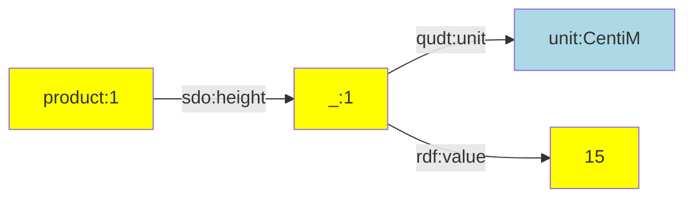
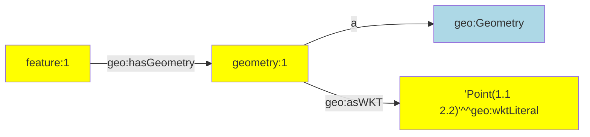
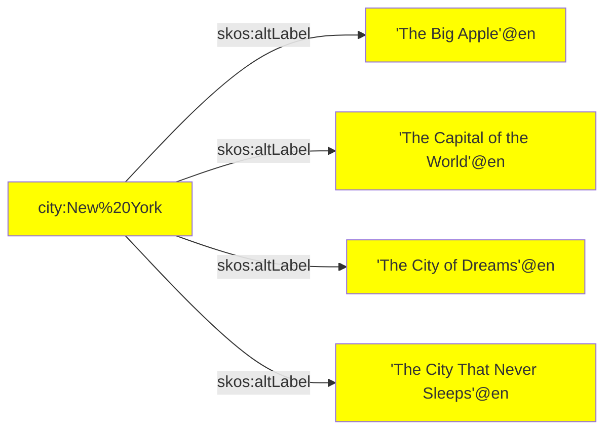
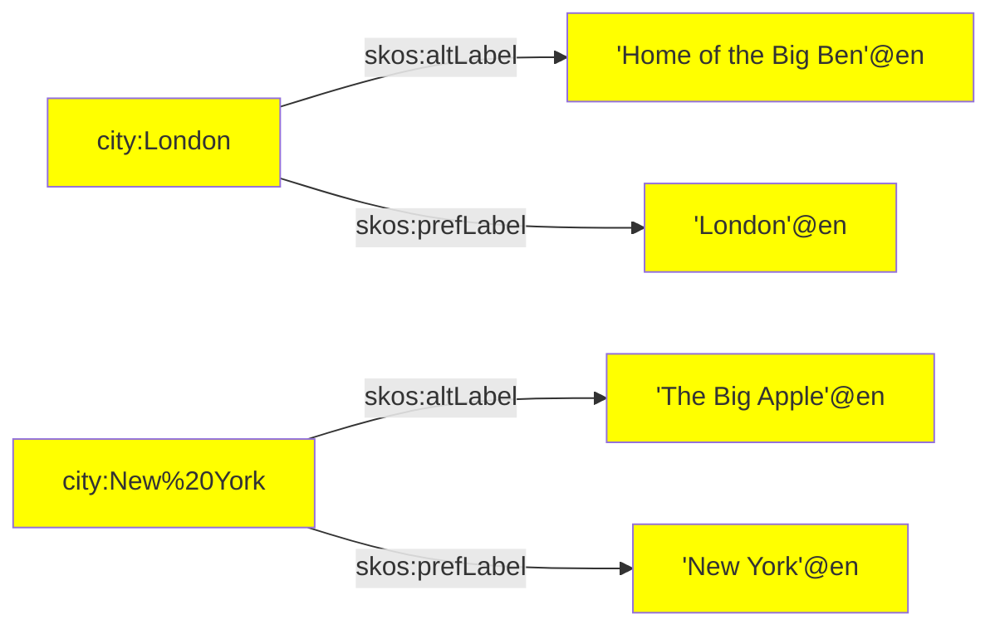

[TOC]

# RATT Statement Assertions

[TOC]

The following statement assertions are available:

| Assertion | Description |
| --- | --- |
| [nestedPairs()](#function-nestedpairs) | Creates a nested node with multiple triples that use that node as their subject term. |
| [objects()](#function-objects) | Asserts multiple triples that share the same subject and predicate terms. |
| [pairs()](#function-pairs) | Asserts multiple triples that share the same subject term. |
| [quad()](#function-quad) | Asserts a quadruple. |
| [quads()](#function-quads) | Asserts multiple quadruples. |
| [triple()](#function-triple) | Asserts a triple. |
| [triples()](#function-triples) | Asserts multiple triples. |

The statement assertions can be imported in the following way:

```ts
import { nestedPairs, objects, pairs, quad, quads,
         triple, triples } from '@triplyetl/etl/ratt'
```


## Function `nestedPairs()`

Creates a nested node and makes multiple assertions about that node.

Since linked data is composed of triples, more complex n-ary information must often be asserted by using a nested node. Nested nodes must be IRIs, so they must be specified with [iri()](../term#function-iri) or [addIri()](../../../transform/ratt#function-addiri).

Signature: `nestedPairs(subject, predicate, nestedNode, pairs...)`

### Parameters

- `subject` A subject term. This must be an IRI (see function [iri()](../term#function-iri)).
- `predicate` A predicate term. This must be an IRI (see function [iri()](../term#function-iri)).
- `nestedNode` The nested node. This must be an IRI (see function [iri()](../term#function-iri)).
- `pairs` One or more pairs that make assertions about the nested node. Every pair consists of a predicate term and an object term (in that order).

### Example: Unit of measure

The following example asserts a value together with a unit of measure. A well-known Skolem IRI or 'blank node' is used to attach the value and unit to:

```ts
fromJson([{ id: '1', height: 15 }]),
addSkolemIri({
  prefix: prefix.skolem,
  key: '_height',
}),
nestedPairs(iri(prefix.product, 'id'), sdo.height, '_height',
  [qudt.unit, unit.CentiM],
  [rdf.value, 'height'],
),
```

This makes the following linked data assertions:

```turtle
product:1
  sdo:height
    [ qudt:unit unit:CentiM;
      rdf:value 15 ].
```

Or diagrammatically:



### Example: Geometry

The following example asserts a GeoSPARQL geometry. The geometry is created
as a separate node.

```ts
fromJson([{ id: '1', geometry: 'Point(1.1 2.2)' }]),
nestedpairs(iri(prefix.feature, 'id'), geo.hasGeometry, iri(prefix.geometry, 'id'),
  [a, geo.Geometry],
  [geo.asWKT, literal('geometry', geo.wktLiteral)],
),
```

This generates the following linked data, where a well-known Skolem IRI is used for the geometry 'blank node':

```turtle
feature:1 geo:hasGeometry geometry:1.
geometry:1
  a geo:Geometry;
  geo:asWKT 'Point(1.1 2.2)'^^geo:wktLiteral.
```

Or diagrammatically:



Assertions that use `nestedpairs()` provide a shorter notation for the following sequence of assertions that uses functions [triple()](#function-triple) and [pairs()](#function-pairs):

```ts
fromJson([{ id: '1', geometry: 'Point(1.1 2.2)' }]),
triple(iri(prefix.feature, 'id'), geo.hasGeometry, iri(prefix.geometry, 'id')),
pairs(iri(prefix.geometry, 'id'),
  [a, geo.Geometry],
  [geo.asWKT, literal('geometry', geo.wktLiteral)],
),
```

### See also

In some cases, it is inconvenient to come up with a naming scheme for intermediate nodes. In such cases, the following options are available:
- Use transformation [addHashedIri()](../../../transform/ratt#function-addhashediri) to create a content-based IRI.
- Use transformation [addRandomIri()](../../../transform/ratt#function-addrandomiri) to create a random IRI.
- Use transformation [addSkolemIri()](../../../transform/ratt#function-addskolemiri) to create a random Skolem IRI.


## Function `objects()`

Asserts multiple triples that share the same subject term and predicate term.

This function provides a shorthand notation for assertions that can also be made with multiple uses of the [triple()](#function-triple) assertion function. The notational convenience of this middleware is similar to predicate-object lists in TriG, Turtle, and SPARQL.

### Parameters

- `subject` A subject term. This must be either an IRI (see function [iri()](../term#function-iri)) or a literal (see function [literal()](../term#function-literal)).
- `predicate` A predicate term. This must be an IRI (see function [iri()](../term#function-iri)).
- `objects` An array of object terms. This must be either an IRI (see function [iri()](../term#function-iri)) or a literal (see function [literal](../term#function-literal)). Every distinct object term in the array results in a distinct triple assertion.

### Example: Alternative labels

The following snippet asserts multiple alternative labels for a city:

```ts
fromJson([{
   name: 'Ney York',
   alt1: 'The Big Apple',
   alt2: 'The Capital of the World',
   alt3: 'The City of Dreams',
   alt4:  'The City That Never Sleeps',
}]),
objects(iri(prefix.city, 'name'), skos.altLabel,
  ['alt1', 'alt2', 'alt3', 'alt4']
),
```

This results in the following 4 linked data assertions:

```turtle
city:New%20York
  skos:altLabel
    'The Big Apple'@en.
    'The Capital of the World'@en,
    'The City of Dreams'@en,
    'The City That Never Sleeps'@en.
```

Or diagrammatically:




## Function `pairs()`

Asserts multiple triples that share the same subject term.

This function provides a shorthand notation for assertions that can also be made with multiple uses of assertion [triple()](#function-triple). The notational convenience of this middleware is similar to predicate lists in TriG, Turtle, and SPARQL.

### Parameters

- `subject` The subject term of the asserted triples.
- `pairs` Zero or more pairs. Each pair is an array with a predicate term and an object term (in that order). Every distinct element in the `pairs` array results in a distinct triple assertion.

### Example: Alternative and preferred label

The following snippet asserts a preferred label and an alternative label for cities:

```ts
fromJson([
  { name: 'London', alt: 'Home of the Big Ben' },
  { name: 'Ney York', alt: 'The Big Apple' },
]),
pairs(iri(prefix.city, 'name'),
  [skos.prefLabel, literal('name', lang.en)],
  [skos.altLabel, literal('alt', lang.en)],
),
```

This results in the following 4 linked data assertions:

```turtle
city:London
  skos:prefLabel 'London'@en;
  skos:altLabel 'Home of the Big Ben'@en.
city:New%20York
  skos:prefLabel 'New York'@en;
  skos:altLabel 'The Big Apple'@en.
```

Or diagrammatically:




## Function `quad()`

Asserts a quadruple or 'quad', i.e. a statement that consists of a subject term, a predicate term, an object term, and a graph name.

A quadruple is a triple with a graph name as its fourth parameter.

### Parameters

- `subject` A subject term. This must be an IRI (see function [iri()](../term#function-iri)).
- `predicate` A predicate term. This must be an IRI (see function [iri()](../term#function-iri)).
- `object` An object term. This must be either an IRI (see function [iri()](../term#function-iri)) or a literal (see function [literal()](../term#function-literal)).
- `graph` A graph name. This must be an IRI (see function [iri()](../term#function-iri)).

### Example: Data and metadata

An ETL may distinguish between data and metadata assertions. Both may be
placed into distinct graphs. The following snippet makes one assertion in
a metadata graph and one assertion in a data graph.

```ts
quad(iri(prefix.dataset, 'flowers'), a, dcat.Dataset, graph.metadata),
quad(iri(prefix.flower, '_id'), a, def.Flower, graph.data),
```

### See also

Use function [quads()](#function-quads) to make multiple quadruple assertions.


## Function `quads()`

Asserts multiple quadruples or 'quads', i.e. statements that consists of a subject term, a predicate term, an object term, and a graph name.

A quadruple is a triple with a graph name as its fourth parameter.

### Parameters

- `subject` A subject term. This must be an IRI (see function [iri()](../term#function-iri)).
- `predicate` A predicate term. This must be an IRI (see function [iri()](../term#function-iri)).
- `object` An object term. This must be either an IRI (see function [iri()](../term#function-iri)) or a literal (see function [literal()](../term#function-literal)).
- `graph` A graph name. This must be an IRI (see function [iri()](../term#function-iri)).

### Example: Data and metadata

An ETL can distinguish between data and metadata assertions. Both may be
placed into distinct graphs. The following snippet makes assertions in a
metadata graph and assertions in a data graph.

```ts
quads(
  [iri(prefix.dataset, 'flowers'), a, dcat.Dataset, graph.metadata],
  ...,
),
quads(
  [iri(prefix.flower, '_id'), a, def.Flower, graph.data],
  ...,
),
```

### See also

Use function [quad()](#function-quad) for asserting a single quadruple.


## Function `triple()`

Asserts a triple, i.e. a statement that consists of a subject term, a predicate term, and an object term.

A triple is a sequence of three terms: subject, predicate, and object. A triple asserts a factual statement, claiming that the thing denoted by the subject term and the thing denotes by the object term are related to one another according to the relationship denoted by the predicate term. A triple is the smallest unit of meaning in linked data.

### Parameters

- `subject` A subject term. This must be an IRI (see function [iri()](../term#function-iri)).
- `predicate` A predicate term. This must be an IRI (see function [iri()](../term#function-iri)).
- `object` An object term. This must be either an IRI (see function [iri()](../term#function-iri)) or a literal (see function [literal()](../term#function-literal)).

### Example 1

The following triple asserts that something is a person. Notice that:
- the subject term is an IRI that is constructed out of an IRI prefix (`prefix.person`) and a key that contains the IRI local name (`'id'`),
- and the predicate and object terms are IRIs that are imported from the vocabulary module.

```ts
triple(iri(prefix.person, 'id'), a, foaf.Person),
```

### Example 2

The following triple asserts that something has an age that is derived from the `'age'` key in the record. Notice that:

- the subject term is an IRI that is stored in the `'_person'` key of the record (possibly created with transformation function [addIri()](../../../transform/ratt#function-addiri)),
- the predicate term is an IRI (`foaf.age`) that is imported from the vocabulary module,
- and the object term is a typed literal with a datatype IRI that is imported from the vocabulary module.

```ts
triple('_person', foaf.age, literal('age', xsd.nonNegativeInteger)),
```


## Function `triples()`

Asserts multiple triples in the same named graph:

- `triples(graph, triples)`

### Parameters

- `graph` A graph name. This must be an IRI (see function [iri()](../term#function-iri)).
- `triples` An array of triples. Every triple is represented by an array of 3 terms: subject, predicate, and object.

### When to use

It is common for multiple statements to occur in the same graph. In such cases, it is suboptimal to repeat the graph name for multiple uses of the [quad()](#function-quad) function. In such cases, it is shorter to use the `triples()` function, where the graph name only needs to be specified once.

### Example

Suppose that we want to distinguish between data and metadata assertions. We can do so by asserting them in distinct graphs. The following makes multiple metadata assertions in the metadata graph, followed by multiple data assertions in the data graph.

```ts
triples(graph.metadata,
  [iri(prefix.dataset, str('flowers')), a, dcat.Dataset],
  ...
),
triples(graph.data,
  [iri(prefix.flower, '_id'), a, def.Flower],
  ...
),
```

### See also

The `triples()` function is conceptually similar to graph notation in the TriG standard. In TriG, the graph name is specified up front, and the triples within that graph are specified immediately afterwards:

```trig
graph:flowers {
  id:123 a def:Flower.
  # other triples go here
}
```

Notice the correspondence with the following code snippet that uses the `triples()` function:

```ts
triples(iri(prefix.ex, 'myGraph'),
  [iri((prefix.ex, 'id'), a, def.Flower)],
  // other triples go here
),
```


## Shorthand notation

Since literals with datatype IRI `xsd:string` are very common, statement assertions allow such literals to be specified without using [`literal()`](../term#function-literal).

For example, the following two triple assertions result in the same linked data:

```ts
triple('person', sdo.name, literal('name', xsd.string)),
triple('person', sdo.name, 'name'),
```

As another example, the following two triple assertions also result in the same linked data:

```ts
triple('person', sdo.name, literal(str('John Doe'), xsd.string)),
triple('person', sdo.name, str('John Doe')),
```
