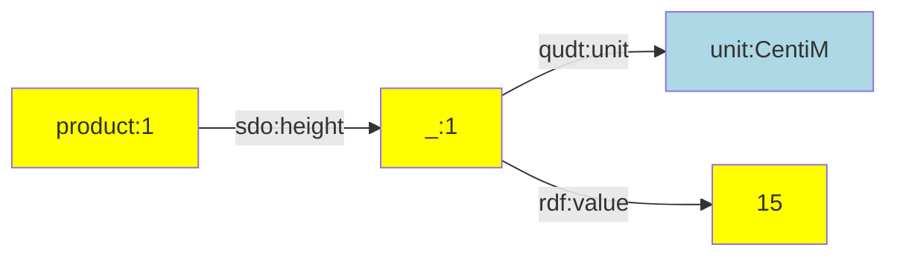
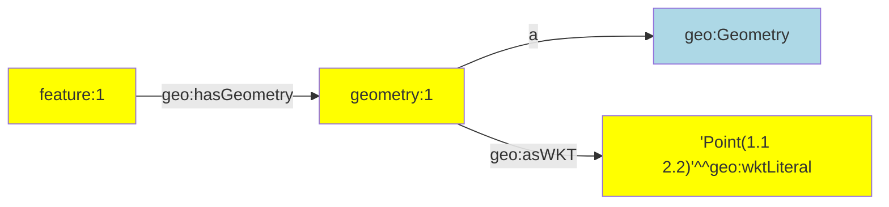
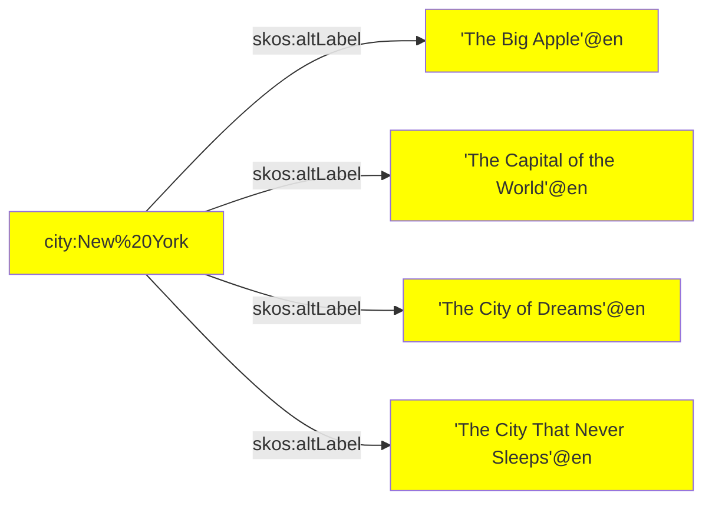
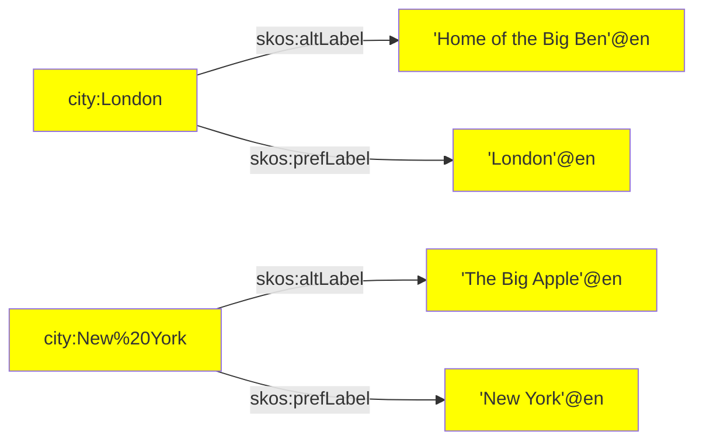

[TOC]

# RATT Statement Assertion

This page documents the functions that make linked data statement assertions (triples and quads).

The statement assertion functions are imported as follows:

```ts
import { nestedPairs, objects, pairs, quad, quads, triple, triples } from '@triplyetl/etl/ratt'
```


## nestedPairs()

Creates a nested node and makes multiple assertions about that node.

Since linked data is composed of triples, more complex n-ary information must often be asserted by using a nested node. Since they must appear in both the subject and object term position, nested nodes are required to be IRIs.


### Signature

This function has the following signature:

```ts
nestedPairs(subject, predicate, ...pairs)                    // [1]
nestedPairs(subject, predicate, nestedNode, ...pairs)        // [2]
nestedPairs(graph, subject, predicate, nestedNode, ...pairs) // [3]
```

When Signature 1 is used, the nested node is automatically generated by TriplyETL. This automatically generated nested node is a Skolem IRI (see the documentation on [Skolem IRIs](../../generic/skolem-iris.md) for more information).

When Signature 2 is used, the nested node must be specified by the user. This allows the nested node to be created in a more structured way, for example by using [iri()](./terms.md#iri), [addIri()](../../transform/ratt.md#addiri), or [addHashedIri()](../../transform/ratt.md#addhashediri).

When Signature 3 is used, a graph name must be specified, resulting in quad statements.


### Parameters

- `graph` is a graph term; this must be an IRI.
- `subject` is a subject term; this must be an IRI.
- `predicate` is a predicate term; this must be an IRI.
- `nestedNode` is the nested node; this must be an IRI.
- `pairs` is one or more pairs that make assertions about the nested node. Every pair consists of a predicate term and an object term (in that order).


### Example: Unit of measure

The following example asserts a value together with a unit of measure. Since Signature 1 is used, a Skolem IRI is used as the nested node.

```ts
fromJson([{ id: '1', height: 15 }]),
nestedPairs(iri(prefix.product, 'id'), sdo.height,
  [qudt.unit, unit.CentiM],
  [rdf.value, 'height'],
),
```

This makes the following linked data assertions:

```turtle
product:1
  sdo:height
    [ qudt:unit unit:CentiM;
      rdf:value 15 ].
```

Or diagrammatically:




### Example: Geometry

The following example asserts a GeoSPARQL geometry. The geometry is created
as a separate node.

```ts
fromJson([{ id: '1', geometry: 'Point(1.1 2.2)' }]),
nestedPairs(iri(prefix.feature, 'id'), geo.hasGeometry, iri(prefix.geometry, 'id'),
  [a, geo.Geometry],
  [geo.asWKT, literal('geometry', geo.wktLiteral)],
),
```

This generates the following linked data:

```turtle
feature:1 geo:hasGeometry geometry:1.
geometry:1
  a geo:Geometry;
  geo:asWKT 'Point(1.1 2.2)'^^geo:wktLiteral.
```

Or diagrammatically:




### Maintenance impact

Every use of `nestedPairs()` can be replaced by multiple uses of other assertion functions, like `triple()`, `quad()`, `pairs()`, and `addSkolemIri()`.

For example, when the geometry example is rewritten to not use `nestedPairs()`, the nested node must be specified twice, which is a maintenance burden:

```ts
fromJson([{ id: '1', geometry: 'Point(1.1 2.2)' }]),
triple(iri(prefix.feature, 'id'), geo.hasGeometry, iri(prefix.geometry, 'id')),
pairs(iri(prefix.geometry, 'id'),
  [a, geo.Geometry],
  [geo.asWKT, literal('geometry', geo.wktLiteral)],
),
```

Notice that the use of `nestedPairs()` results in configuration that is shorter and easier to maintain. For example, `nestedPairs()` does not need to repeat the specification of the nested node `iri(prefix.geometry, 'id')`.


### Relation to standards

The functionality of `nestedPairs()` is similar to anonymous node notation and predicate list notation in the linked data standards TriG, Turtle, and SPARQL.

Notice that the following notation in these standards:

```turtle
feature:id geo:hasGeometry
  [ a geo:Geometry;
    geo:asWKT 'Point(1.1 2.2)'^^geo:wktLiteral ].
```

is structurally similar to the following code snippet that uses `nestedPairs()`:

```ts
nestedPairs(iri(prefix.feature, 'id'), geo.hasGeometry,
  [a, geo.Geometry],
  [geo.asWKT, literal('geometry', geo.wktLiteral)],
),
```


## objects()

Asserts multiple triples that share the same subject and predicate term.


### Signature

This function has the following signature:

```ts
objects(subject, predicate, ...objects)
```


### Parameters

- `subject` is a subject term; this must be an IRI.
- `predicate` is a predicate term; this must be an IRI.
- `objects` is one or more object terms; these must be IRIs and/or literals.


### Example: Alternative labels

The following snippet asserts multiple alternative labels for a city:

```ts
fromJson([{
   name: 'Ney York',
   alt1: 'The Big Apple',
   alt2: 'The Capital of the World',
   alt3: 'The City of Dreams',
   alt4:  'The City That Never Sleeps',
}]),
objects(iri(prefix.city, 'name'), skos.altLabel,
  'alt1',
  'alt2',
  'alt3',
  'alt4',
),
```

This results in the following 4 linked data assertions:

```turtle
city:New%20York
  skos:altLabel
    'The Big Apple'@en.
    'The Capital of the World'@en,
    'The City of Dreams'@en,
    'The City That Never Sleeps'@en.
```

Or diagrammatically:




### Maintenance impact

Every use of `objects()` can be replaced by multiple uses of the [triple()](#triple) assertion function. However, doing so requires the subject and predicate terms to be repeated for each use of `triple()`. This is why the use of `objects()` results in configuration that is shorter and easier to maintain. With the release of 4.0.0 version, it is no longer allowed to have less than 2 objects, otherwise refer to transformation [triple()](#triple).


### Relation to standards

The functionality of `objects()` is similar to predicate-object list notation in the linked data standards TriG, Turtle, and SPARQL.

Notice that the following notation in these standards:

```turtle
city:New%20York skos:altLabel
  'The Big Apple',
  'The Capital of the World',
  'The City of Dreams',
  'The City That Never Sleeps'.
```

is structurally similar to the following code snippet that uses `objects()`:

```ts
objects(iri(prefix.city, 'name'), skos.altLabel,
  'alt1',
  'alt2',
  'alt3',
  'alt4',
),
```


## pairs()

Asserts multiple triples that share the same subject term.


### Signature

This function has the following signature:

```ts
pairs(subject, ...pairs)        // [1]
pairs(graph, subject, ...pairs) // [2]
```

Signature 1 asserts triples, while Signature 2 asserts quads.


### Parameters

- `graph` is a graph term; this must be an IRI
- `subject` is a subject term; this must be an IRI.
- `pairs` is one or more pairs that make assertions about the subject term. Every pair consists of a predicate term and an object term (in that order).


### Example: Alternative and preferred label

The following snippet asserts a preferred label and an alternative label for cities:

```ts
fromJson([
  { name: 'London', alt: 'Home of the Big Ben' },
  { name: 'Ney York', alt: 'The Big Apple' },
]),
pairs(iri(prefix.city, 'name'),
  [skos.prefLabel, literal('name', lang.en)],
  [skos.altLabel, literal('alt', lang.en)],
),
```

This results in the following 4 linked data assertions:

```turtle
city:London
  skos:prefLabel 'London'@en;
  skos:altLabel 'Home of the Big Ben'@en.
city:New%20York
  skos:prefLabel 'New York'@en;
  skos:altLabel 'The Big Apple'@en.
```

Or diagrammatically:




### Maintenance impact

This function provides a shorthand notation for assertions that can also be made with multiple uses of assertion [triple()](#triple).


### Relation to standards

The notational convenience of this middleware is similar to predicate lists in TriG, Turtle, and SPARQL.

Notice that the following notation in these standards:

```turtle
city:New%20York
  skos:prefLabel 'New York'@en;
  skos:altLabel 'The Big Apple'@en.
```

is structurally similar to the following code snippet that uses `pairs()`:

```ts
pairs(iri(prefix.city, 'name'),
  [skos.prefLabel, literal('name', lang.en)],
  [skos.altLabel, literal('alt', lang.en)],
),
```


## quad()

Asserts a linked data statement that consists of four terms: subject, predicate, object, and graph (in that order).

A quadruple or 'quad' is a triple to which a graph name is added.


### Signature

This function has the following signature:

```ts
quad(subject, predicate, object, graph)
```


### Parameters

- `subject` is a subject term; this must be an IRI.
- `predicate` is a predicate term; this must be an IRI.
- `object` is an object term; this must be an IRI or literal.
- `graph` is a graph term; this must be an IRI.


### Example: Data and metadata

A dataset may distinguish between data statements and metadata statements. Such a distinction can be implemented by placing statements into different graphs. The following code snippet makes one statements assertion in a metadata graph and one statement assertion in a data graph:

```ts
quad(iri(prefix.dataset, 'flowers'), a, dcat.Dataset, graph.metadata),
quad(iri(prefix.flower, '_id'), a, def.Flower, graph.data),
```


### See also

Use function [quads()](#quads) to make multiple quad assertions.


## quads()

Asserts multiple linked data statements that consists of four terms: subject, predicate, object, and graph (in that order).

A quadruple or 'quad' is a triple to which a graph name is added.


### Signature

This function has the following signature:

```ts
quads(...quads)
```


### Parameters

- `quads` is one or more quads, represented by arrays that contain four terms: subject, predicate, object, and graph (in that order).


### Example: Data and metadata

An ETL can distinguish between data and metadata assertions. Both may be placed into distinct graphs. The following snippet makes assertions in a metadata graph and assertions in a data graph.

```ts
quads(
  [iri(prefix.dataset, 'flowers'), a, dcat.Dataset, graph.metadata],
  ...,
),
quads(
  [iri(prefix.flower, '_id'), a, def.Flower, graph.data],
  ...,
),
```


### See also

Use function [quad()](#quad) for asserting a single quad.


## triple()

Asserts a linked data statement that consists of three terms: subject, predicate, and object (in that order).

A triple asserts a factual statement, claiming that the thing denoted by the subject term and the thing denotes by the object term are related to one another according to the relationship denoted by the predicate term. A triple is the smallest unit of meaning in linked data.


### Signature

This function has the following signature:

```ts
triple(subject, predicate, object)
```


### Parameters

- `subject` is a subject term; this must be an IRI.
- `predicate` is a predicate term; this must be an IRI.
- `object` is an object term; this must be an IRI or literal.


### Example: 1

The following triple asserts that someone is a person:

```ts
triple(iri(prefix.person, 'id'), a, foaf.Person),
```

The subject term is an IRI that is constructed from an IRI prefix (`prefix.person`) and a key that contains the IRI local name (`'id'`). The predicate and object terms are IRIs that are imported from [external vocabularies](../../generic/declarations.md#external-vocabularies).


### Example: 2

The following triple asserts that someone has an age that is derived from the `'age'` key in the record:

```ts
triple('_person', foaf.age, literal('age', xsd.nonNegativeInteger)),
```

The subject term is an IRI that is stored in the `'_person'` key of the record. This term was created previously, for example by using the [addIri()](../../transform/ratt.md#addiri) function. The predicate term is imported from an [external vocabulary](../../generic/declarations.md#external-vocabularies). The object term is a typed literal that is constructed from a key (`'age'`) that contains the lexical form, and a datatype IRI that is imported from an external vocabulary.


### Example: 3

The following triple uses three static IRIs:

```ts
triple(Iri('https://example.com/id/123'), a, sdo.Product),
```


## triples()

Asserts multiple linked data statements that consists of three terms: subject, predicate, and object (in that order).


### Signature

This function has the following signature:

```ts
triples(graph, ...triples)
```


### Parameters

- `graph` is a graph term; this must be an IRI.
- `triples` is one or more triples, represented by arrays that contain three terms: subject, predicate, and object (in that order).


### Example

Suppose that we want to distinguish between data and metadata assertions. We can do so by asserting them in distinct graphs. The following makes multiple metadata assertions in the metadata graph, followed by multiple data assertions in the data graph.

```ts
triples(graph.metadata,
  [iri(prefix.dataset, str('flowers')), a, dcat.Dataset],
  ...
),
triples(graph.data,
  [iri(prefix.flower, '_id'), a, def.Flower],
  ...
),
```


### Maintenance impact

It is common for multiple statements to occur in the same graph. In such cases, it is position to use the [quad()](#quad) function multiple times, but this requires repeating the graph term. This is why the use of `triples()` results in configuration that is shorter and easier to maintain.


### Relation to standards

The functionality of `triples()` is conceptually similar to graph notation in the linked data standard TriG.

Notice that the following notation in TriG:

```turtle
graph:metadata {
  dataset:flowers a dcat:Dataset.
  ...
}
graph:data {
  flower:123 a def:Flower.
  ...
}
```

is structurally similar to the following code snippet that uses `triples()`:

```ts
triples(graph.metadata,
  [iri(prefix.dataset, str('flowers')), a, dcat.Dataset],
  ...
),
triples(graph.data,
  [iri(prefix.flower, '_id'), a, def.Flower],
  ...
),
```


## Implicit casts

The statement assertion functions use implicit casting from strings to IRIs or literals. The rules for this are as follows:

1. If a string value that encodes a valid IRI is specified in the subject, predicate, or graph position, that string is implicitly cast to an IRI.
2. If a string value is specified in the object position, that string is implicitly cast to a literal.

The following code snippet uses implicit casts for all fours terms in the `quad()` assertion:

```ts
fromJson([{ url: 'https://example.com/123' }]),
quad('url', 'url', 'url', 'url'),
```

This results in the following linked data:

```turtle
<https://example.com/123> {
  <https://example.com/123> <https://example.com/123> 'https://example.com/123'.
}
```

Notice that the code snippet can be rewritten to make use of explicit casts:

```ts
fromJson([{ url: 'https://example.com/123' }]),
quad(iri('url'), iri('url'), literal('url'), iri('url')),
```


### Relation to standards

The functionality of implicit casts for literals is conceptually similar to shorthand notation for `xsd:string` literals in the linked data standards Turtle, TriG, and SPARQL.

Notice that the following notation in Turtle:

```turtle
city:amsterdam dct:identifier '0200'.
```

is structurally similar to the following code snippet that uses an implicit cast for the string literal:

```ts
triple('_city', dct.identifier, 'id'),
```
