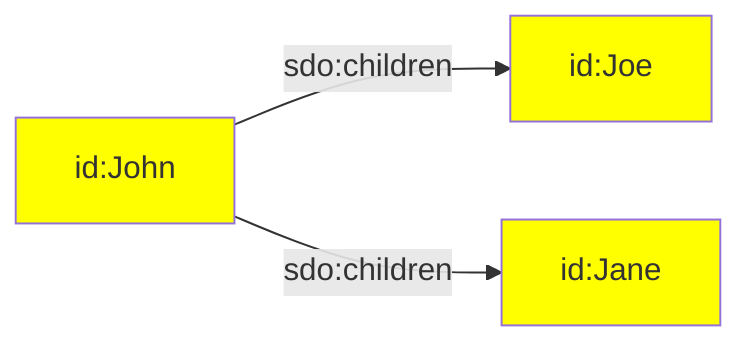
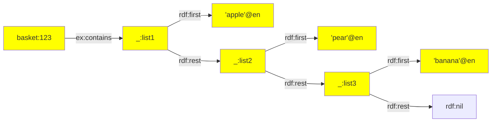
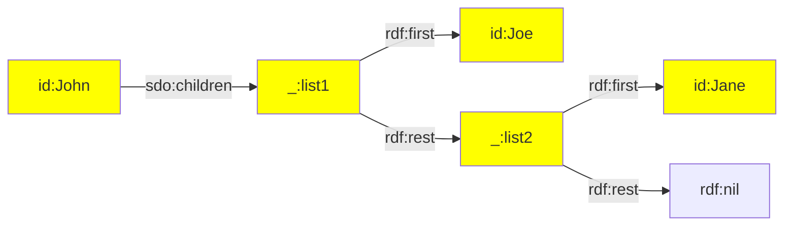
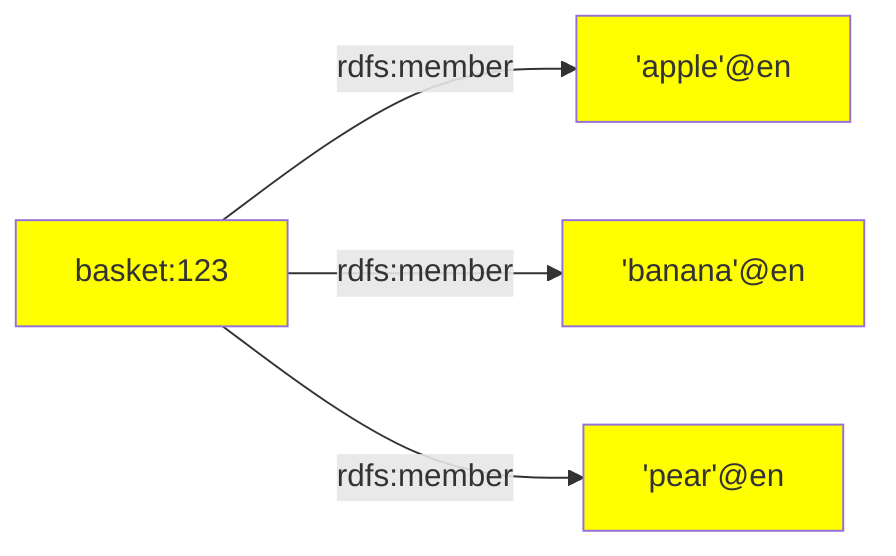
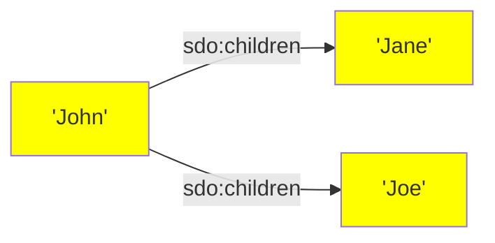

[TOC]

# RATT Term Assertions

The following term assertions are available:

| Assertion | Description |
| --- | --- |
| [iri()](#function-iri) | Creates an IRI term. |
| [iris()](#function-iris) | Creates multiple IRI terms. |
| [list()](#function-list) | Creates a list of terms. |
| [literal()](#function-literal) | Creates a literal term. |
| [literals()](#function-literals) | Creates multiple literal terms. |
| [str()](#function-str) | Creates a static string. |

The term assertions can be imported in the following way:

```ts
import { iri, iris, literal, literals, str } from '@triplyetl/etl/ratt'
```


## Function `iri()`

Creates an IRI term based on a key and an optional IRI prefix:

```ts
iri(prefix: PrefixedToIri, content: Key|StaticString)
iri(content: Key|StaticString)
```

### Parameters

- `prefix` A prefix that is declared with [declarePrefix()](/triply-etl/declare#declarePrefix).
- `content` Either a key that contains a string value, or a static string. If the `prefix` is used, this content is placed after the prefix (sometimes referred to as the 'local name'). If the `prefix` parameter is not used, the content must specify a full IRI.

### Examples

The following asserts an IRI based on a declared prefix (`prefix.ex`) and a key (`name`):

```ts
triple(iri(prefix.ex, 'name'), a, owl.NamedIndividual),
```

The following asserts an IRI based on a declared prefix (`prefix.ex`) and a static string (see function [str()](#function-str)):

```ts
triple(iri(prefix.ex, str('bob')), a, owl.NamedIndividual),
```

The following asserts an IRI based on the value stored in key `'url'`. Notice that this value must encode a full absolute IRI.

```ts
fromJson([{ 'url': 'https://example.com/bob' }]),
triple(iri('url'), a, owl.NamedIndividual),
```

### See also

If the same IRI is used in multiple statements, repeating the same assertion multiple times may impose a maintenance burden. In such cases, it is possible to first add the IRI to the record using transformation function [addIri()](/triply-etl/transform/ratt#function-addiri), and refer to that one IRI in multiple statements.

Use function [iris()](#function-iris) to create multiple IRIs in one step.


## Function `iris()`

Creates multiple IRI terms, one for each entry in an array of strings:

```ts
iris(prefix: PrefixedToIri, content: Key|Array<StaticString>)
iris(content: Key|Array<StaticString>)
```

### Parameters

- `prefix` A prefix that is declared with [declarePrefix()](/triply-etl/declare#declarePrefix).
- `content` Either a key that contains a array of string values, or an array of static strings. If the `prefix` is used, this content is placed after the prefix (sometimes referred to a the 'local name'). If the `prefix` parameter is not used, the content must specify the full IRI.

### Example

The following code snippet asserts one IRI for each entry in record key `'children'`:

```ts
fromJson([{ parent: 'John', children: ['Joe', 'Jane'] }]),
triple(iri(prefix.id, 'parent'), sdo.children, iris(prefix.id, 'children')),
```

This makes the following linked data assertions:

```turtle
id:John sdo:children id:Joe, id:Jane.
```

Or diagrammatically:




# Function `list()`

This function allows us to create ordered closed collections [rdf:List](https://triplydb.com/how-to-model/-/stories/collections) in TriplyETL.
The elements of such collections must be represented using a single-linked list (`rdf:first` and `rdf:rest`). Such collections are closed by the empty list (`rdf:nil`).

## Parameters

- `prefix` A prefix for linked lists that is declared with [declarePrefix()](/triply-etl/declare#declarePrefix). 
- `listOrReference`  term, literal, key or string or an array of terms/literals/keys/strings

## Example: Fruit basket

The following code snippet creates linked lists (linked by `rdf:rest`), where each value stored in the `'contents'` key is `rdf:first` object:

```ts
fromJson([{ id: 123, contents: ['apple', 'pear', 'banana'] }]),
triple(iri(prefix.basket, 'id'), ex.contains, list(prefix.basket, literals('contents', lang.en)))
```

This makes the following linked data assertions:

```ttl
basket:123 prefix:contains _:list1.

_:list1 rdf:first "apple"@en;
        rdf:rest _:list2.

_:list2 rdf:first "pear"@en;
        rdf:rest _:list3.

_:list3 rdf:first "banana"@en;
        rdf:rest rdf:nil.
```

Or diagrammatically:


Note that the predicate differs from the above example of the [literals()](#function-literals) function. In order to use `list()` middleware we need to be sure that the `rdfs:domain` property of the predicates allows to be of `rdf:List`. 

## Example: Children

The following code snippet creates linked lists (linked by `rdf:rest`), where each value stored in the `'children'` key is `rdf:first` object:

```ts
fromJson([{ parent: 'John', children: ['Joe', 'Jane'] }]),
triple(iri(prefix.id, 'parent'), sdo.children, list(prefix.skolem, iris(prefix.id, 'children'))),
```

This makes the following linked data assertions:

```ttl
id:John sdo:children _:list1.

_:list1 rdf:first id:Joe;
        rdf:rest _:list2.

_:list2 rdf:first id.Jane;
        rdf:rest rdf:nil.
```

Or diagrammatically:



The above diagram can be translated to the statement: "John has two children, where Joe is his first child and Jane is his second child". 


## Function `literal()`

Creates a literal term, based on a lexical form and a datatype IRI or language tag:

```ts
literal(lexicalForm: Key|StaticString, languageTagOrDatatype: LanguageTagOrDataType)
```

### Parameters

- `lexicalForm` A static string (see function [str()](#function-str)), or a key that contains a string value.
- `languageTagOrDatatype` A static language tag, or a static datatype IRI, or a key that contains either a language tag or a datatype IRI.

### Examples

The following triple assertion uses a language-tagged string:

```ts
triple('city', sdo.name, literal('name', lang.nl)),
```

The following triple assertion uses a typed literal:

```ts
triple('city', vocab.population, literal('population', xsd.nonNegativeInteger)),
```

Notice that string literals can be asserted directly; the following two statements make the same assertion:

```ts
triple('city', dct.identifier, literal('id', xsd.string)),
triple('city', dct.identifier, 'id'),
```

These assertions combined can result in the following linked data:

```turtle
id:amsterdam
  sdo:name 'Amsterdam'@nl
  vocab:population '800000'^^xsd:nonNegativeInteger
  dct:identifier '0200'.
```

### See also

If the same literal is used in multiple statements, repeating the same assertion multiple times can impose a maintenance burden. In such cases, it is possible to first add the literal to the record with transformation [addLiteral()](/triply-etl/transform/ratt#function-addliteral), and refer to that one literal in multiple statements.

Use assertion [literals()](#function-literals) to create multiple literals in one step.


## Function `literals()`

Creates multiple literals, one for each given lexical form in an array:

```ts
literals(lexicalForms: Key | Array<Key|StaticString>, languageTagOrDatatype: LanguageTagOrDataType)
```

### Parameters

- `lexicalForms` A key that stores an array or an array.
- `languageTagOrDatatype` A language tag or datatype IRI.

String literals can be asserted directly; the following two assertions result in the same linked data:

```ts
triple('blog', sdo.keywords, literal('keywords', xsd.string)),
triple('blog', sdo.keywords, 'keywords'),
```

### Example: Fruit basket

The following code snippet creates one literal for each value in the array that is stored in the `'contents'` key:

```ts
fromJson([{ id: 123, contents: ['apple', 'pear', 'banana'] }]),
triple(iri(prefix.basket, 'id'), rdfs.member, literals('contents', lang.en)),
```

This makes the following linked data assertions:

```turtle
basket:123 rdfs:member 'apple'@en, 'banana'@en, 'pear'@en.
```

Or diagrammatically:



### Example: Names

String literals can be asserted directly from a key that stores an array of strings.

The following code snippet asserts one string literal for each child:

```ts
fromJson([{ parent: 'John', children: ['Joe', 'Jane'] }]),
triple(iri(prefix.id, 'parent'), sdo.children, 'children'),
```

This makes the following linked data assertions:

```turtle
id:John sdo:children 'Jane', 'Joe'.
```

Or diagrammatically:



Notice that the same could have been achieved with an explicit datatype IRI:

```ts
triple(iri(prefix.id, 'parent'), sdo.children, literals('children', xsd.string)),
```


## Function `str()`

Creates a static string.

### When to use

Strings in statement assertions are typically used to denote keys in the record. For example, the string `'abc'` in the following code snippet indicates that the value of key `'abc'` should be used as the local name of the IRI in the subject position. The value of key `'abc'` should also be used as the lexical form of the literal in the object position:

```ts
triple(iri(prefix.id, 'abc'), rdfs.label, 'abc'),
```

But sometimes we want to assert a static string, i.e. the actual string value `'abc'` instead of the string value stored in a key with that name. In such cases the string function `str()` can be used.

The following code snippet asserts the IRI `id:abc` and the literal `'abc'`:

```ts
triple(iri(prefix.id, str('abc')), rdfs.label, str('abc')),
```
