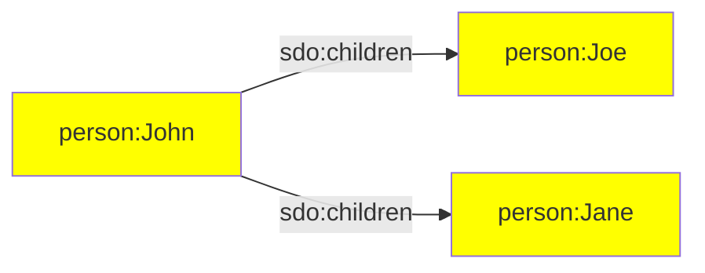
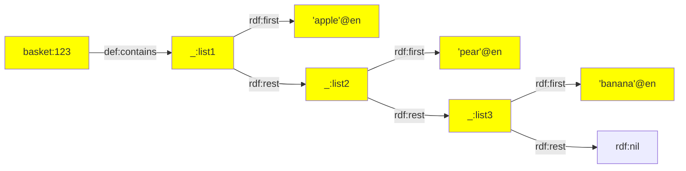
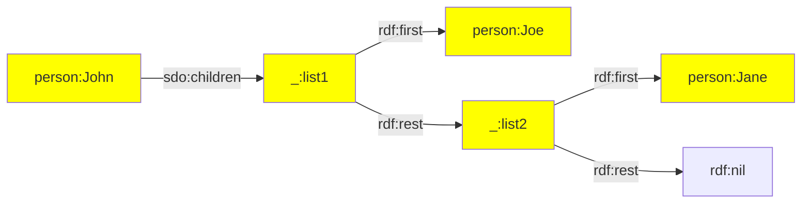
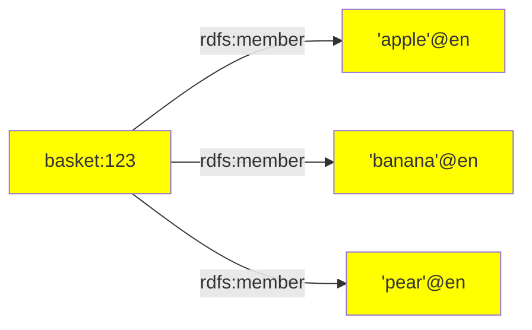
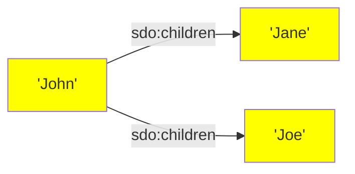

[TOC]

# RATT Term Assertion

This page documents RATT functions that are used to create RDF terms. These RDF terms are used in [statement assertions](./statements.md).

The term assertion functions are imported in the following way:

```ts
import { iri, iris, literal, literals, str } from '@triplyetl/etl/ratt'
```


## Iri() constructor

Creates static IRIs.


### Signature

The signature of this constructor is as follows:

```ts
Iri(string): Iri
```


### Parameters

- `string` is a string that encodes an absolute IRI.

Once an IRI object is constructed, the `concat()` member function can be used to create new IRIs according to the following signature:

```ts
Iri.concat(string): Iri
```


### Example: IRI declaration

The following code snippet creates a static IRI by using the `Iri()` constructor:

```ts
const subject = Iri('https://example.com/123')

etl.use(
  triple(subject, a, sdo.Product),
)
```


### Example: in-line IRI

It is also possible to add the static IRI in-line, without declaring a constant:

```ts
etl.use(
  triple(Iri('https://example.com/123'), a, sdo.Product),
)
```


### Example: IRI concatenation

The following code snippet uses a static IRI that is created by applying the `concat()` member function

```ts
const prefix = Iri('https://example.com/')

etl.use(
  triple(prefix.concat('123'), a, sdo.Product),
)
```


## iri() function

Creates a static or dynamic IRI that can be used in statement assertions.

Notice that this function is more powerful than the [Iri() constructor](#iri-constructor), which can only create static


### Signature

This function has the following signature:

```ts
iri(fullIri)           // 1
iri(prefix, localName) // 2
```

Signature 1 is used to explicitly cast a strings that encodes an absolute IRI to an IRI.

Signature 2 is used to create IRIs based on an IRI prefix and multiple local names.


### Parameters

- `fullIri` is either a key that contains a dynamic string that encodes an absolute IRI, or a static string that encodes an absolute IRI.
- `prefix` is an IRI prefix that is declared with the [Iri() constructor](#iri-constructor).
- `localName` is ither a key that contains a dynamic string, or a static string. This string is used as the local name of the IRI. The local name is suffixed to the given IRI prefix.


### Example: explicit cast to IRI

The following code snippets casts strings that encode IRIs in the source data to subject and object IRIs that are used in triple assertions:

```ts
fromJson([
  { url: 'https://example.com/id/person/Jane' },
  { url: 'https://example.com/id/person/John' },
]),
triple(iri('url'), owl:sameAs, iri('url')),
```

This results in the following linked data:

```turtle
<https://example.com/id/person/Jane> owl:sameAs <https://example.com/id/person/Jane>.
<https://example.com/id/person/John> owl:sameAs <https://example.com/id/person/John>.
```

Notice that the use of `iri()` it is not required in the subject position, but is required in the object position. The following code snippet results in the same linked data, but uses an implicit cast for the subject term:

```ts
fromJson([
  { url: 'https://example.com/id/person/Jane' },
  { url: 'https://example.com/id/person/John' },
]),
triple('url', owl:sameAs, iri('url')),
```

See the section on [automatic casts](./statements.md#automatic-casts) for more information.


### Example: dynamic IRI

The following code snippet asserts an IRI based on a declared prefix (`prefix.ex`) and the string stored in key (`'firstName'`):

```ts
fromJson([{ firstName: 'Jane' }, { firstName: 'John' }]),
triple(iri(prefix.person, 'fistName'), a, sdo.Person),
```

This creates a *dynamic IRI*. This means that the asserted IRI depends on the content of the `'firstName'` key in each record. For the first record, IRI `person:Jane` is created. For the second record, IRI `person:John` is created.


### Example: static IRI

The following asserts an IRI based on a declared prefix (`prefix.ex`) and a static string (see function [str()](#str)):

```ts
triple(iri(prefix.person, str('John')), a, sdo.Person),
```

This creates a *static IRI*. This means that the same IRI is used for each record (always `person:John`).

Notice that the same triple assertion can be made by using the [Iri()](#iri-constructor) instead of the `iri()` function:

```ts
triple(prefix.person.concat('John'), a, sdo.Person),
```


### See also

If the same IRI is used in multiple statements, repeating the same assertion multiple times may impose a maintenance burden. In such cases, it is possible to first add the IRI to the record by using the [addIri()](../../transform/ratt.md#addiri) function, and refer to that one IRI in multiple statement assertions.

Use function [iris()](#iris) to create multiple IRIs at once.


## iris()

Creates multiple dynamic or static IRIs, one for each entry in an array of strings.


### Signature

This function has the following signature:

```ts
iris(fullIris)           // 1
iris(prefix, localNames) // 2
```

Signature 1 is used to explicitly cast strings that encode IRIs to IRIs.

Signature 2 is used to create an IRI based on an IRI prefix and a local name.


### Parameters

- `fullIri` is either a key that contains a dynamic string that encodes an absolute IRI, or a static string that encodes an absolute IRI.
- `prefix` is an IRI prefix that is declared with the [Iri() constructor](#iri-constructor).
- `localNames` is either a key that contains an array of strings, or an array of keys that store dynamic strings and static strings. These string are used as the local names of the IRIs that are created. These local names are suffixed to the given IRI prefix.


### Example

The following code snippet asserts one IRI for each entry in record key `'children'`:

```ts
fromJson([{ parent: 'John', children: ['Joe', 'Jane'] }]),
triple(iri(prefix.person, 'parent'), sdo.children, iris(prefix.person, 'children')),
```

This makes the following linked data assertions:

```turtle
person:John sdo:children person:Joe, person:Jane.
```

Or diagrammatically:




## list()

Creates an RDF collection or singly-linked list (class `rdf:List`).

See the [Triply Data Story about collections](https://triplydb.com/how-to-model/-/stories/collections) for more information.


### Signature

This function has the following signature:

```ts
list(prefix, terms)
```


### Parameters

- `prefix` is an IRI prefix that is declared with the [Iri() constructor](#iri-constructor).
- `terms` is an array of dynamic and/or static terms.


### Example: fruit basket

The following code snippet creates linked lists (linked by `rdf:rest`), where each value stored in the `'contents'` key is `rdf:first` object:

```ts
fromJson([{ id: 123, contents: ['apple', 'pear', 'banana'] }]),
triple(iri(prefix.basket, 'id'), def.contains, list(prefix.basket, literals('contents', lang.en))),
```

This results in the following linked data:

```turtle
basket:123 def:contains ( 'apple'@en 'pear'@en 'banana'@en ).
```

When we do not make use of the collection notation `( ... )`, the asserted linked data looks as follows:

```turtle
basket:123 def:contains _:list1.
_:list1
  rdf:first 'apple'@en;
  rdf:rest _:list2.
_:list2
  rdf:first 'pear'@en;
  rdf:rest _:list3.
_:list3
  rdf:first 'banana'@en;
  rdf:rest rdf:nil.
```

Or diagrammatically:




### Example: children

The following code snippet creates linked lists for the children of every parent:

```ts
fromJson([{ parent: 'John', children: ['Joe', 'Jane'] }]),
triple(iri(prefix.person, 'parent'), sdo.children, list(prefix.skolem, iris(prefix.person, 'children'))),
```

This results in the following linked data:

```turtle
person:John sdo:children _:list1.
_:list1
  rdf:first person:Joe;
  rdf:rest _:list2.
_:list2
  rdf:first person:Jane;
  rdf:rest rdf:nil.
```

Or diagrammatically:



The above diagram can be translated into the statement: "John has two children, where Joe is his first child and Jane is his second child".


### Maintenance impact

Since RDF collections (or single-linked lists) require a large number of triple assertions to establish the structure of the singly-linked list, creating such collections by hand imposes a maintenance risk. It is very easy to forget one link, or to break an existing link later during maintenance. For this reason, it is always better to use the `list()` function in order to assert collections.


### Relation to standards

The functionality of `list()` is similar to the collections notation in the linked data standards TriG, Turtle, and SPARQL.

Notice that the following notation in these standards:

```turtle
person:John sdo:children ( person:Joe person:Jane ).
```

is structurally similar to the following code snippet that uses `list()`:

```ts
triple(iri(prefix.person, str('John')), sdo.children, list(prefix.skolem, [str('Joe'), str('Jane')])),
```


## literal()

Creates a literal term, based on a lexical form and a datatype IRI or language tag.


### Signature

This function has the following signature:

```ts
literal(lexicalForm, languageTagOrDatatype)
```


### Parameters

- `lexicalForm` is a static string (see function [str()](#str)), or a key that contains a dynamic string.
- `languageTagOrDatatype` is a static language tag or datatype IRI, or a key that contains a dynamic language tag or datatype IRI.


### Example: language-tagged string

The following code snippet uses a language-tagged string:

```ts
triple('_city', sdo.name, literal('name', lang.nl)),
```

This results in the following linked data:

```turtle
city:Amsterdam sdo:name 'Amsterdam'@nl.
city:Berlin sdo:name 'Berlijn'@nl.
```

The `lang` object contains declarations for all language tags. See the sector on [language tag declarations](../../generic/declarations.md#language-tag-declarations) for more information.


### Example: typed literal

The following code snippet uses a typed literal:

```ts
triple('_city', vocab.population, literal('population', xsd.nonNegativeInteger)),
```

This results in the following linked data:

```turtle
city:Amsterdam vocab:population '1000000'^^xsd:nonNegativeInteger.
city:Berlin vocab:population '2000000'^^xsd:nonNegativeInteger.
```

New datatype IRIs can be declared and used, and existing datatype IRIs can be reused from external vocabularies. The following code snippet imports four external vocabularies that contain datatype IRIs:

```ts
import { dbt, geo, rdf, xsd } from '@triplyetl/etl/generic'
```

Here is one example of a datatype IRI for each of these four external vocabularies:

- `dbt.kilogram`
- `geo.wktLiteral`
- `rdf.HTML`
- `xsd.dateTime`


### Example: string literal

Statement assertions support [implicit casts](./statements.md#implicit-casts) from strings to string literals. This means that the following code snippet:

```ts
triple('_city', dct.identifier, literal('id', xsd.string)),
triple('_person', sdo.name, literal(str('John Doe'), xsd.string)),
```

can also be expressed with the following code snippet, which does not use `literal()`:

```ts
triple('_city', dct.identifier, 'id'),
triple('_person', sdo.name, str('John Doe')),
```

Both code snippets result in the following linked data:

```turtle
city:amsterdam dct:identifier '0200'.
person:john-doe sdo:name 'John Doe'.
```


### See also

If the same literal is used in multiple statements, repeating the same literal assertion multiple times may impose a maintenance burden. In such cases, it is possible to first add the literal to the record with transformation [addLiteral()](../../transform/ratt.md#addliteral), and refer to that one literal in multiple statements.

If multiple literals with the same language tag or datatype IRI are created, repeating the same language tag or datatype IRI may impose a maintenance burden. In such cases, the [literals()](#literals) assertion function can be sued instead.


## literals()

Creates multiple literals, one for each lexical form that appears in an array.


### Signature

The signature for this function is as follows:

```ts
literals(lexicalForms, languageTagOrDatatype)
```


### Parameters

- `lexicalForms` is an array that contains string values, or a key that stores an array that contains string values.
- `languageTagOrDatatype` is a language tag or datatype IRI.


### Example: fruit basket

The following code snippet creates one literal for each value in the array that is stored in the `'contents'` key:

```ts
fromJson([{ id: 123, contents: ['apple', 'pear', 'banana'] }]),
triple(iri(prefix.basket, 'id'), rdfs.member, literals('contents', lang.en)),
```

This results in the following linked data:

```turtle
basket:123 rdfs:member 'apple'@en, 'banana'@en, 'pear'@en.
```

Or diagrammatically:




### Example: string literals

String literals can be asserted directly from a key that stores an array of strings.

The following code snippet asserts one string literal for each child:

```ts
fromJson([{ parent: 'John', children: ['Joe', 'Jane'] }]),
triple(iri(prefix.person, 'parent'), sdo.children, 'children'),
```

This results in the following linked data assertions:

```turtle
person:John sdo:children 'Jane', 'Joe'.
```

Or diagrammatically:



The same thing can be achieved by specifying an explicit datatype IRI:

```ts
triple(iri(prefix.person, 'parent'), sdo.children, literals('children', xsd.string)),
```


## str()

Creates a `StaticString` value.

RATT uses strings to denote keys in the record. The used string denotes a key that results in *dynamic values*: a value that is different for each record. Sometimes we want to specify a *static string* instead: a string that is the same for each record.

With the `str()` function we indicate that a string **should not** be processed as a key, but should be processed as a regular (static) string value. This is usefull in case we want to provide a regular string to a middleware, and not a key that could relate to the record.


### Signature

This function has the following signature:

```ts
str(string)
```


### Parameters

- `string` is a string value.


### Example

In RATT, strings often denote keys in the record. For example, the string `'abc'` in the following code snippet indicates that the *value* of key `'abc'` should be used as the local name of the IRI in the subject position, and should be used as the lexical form of the literal in the object position:

```ts
triple(iri(prefix.id, 'abc'), rdfs.label, 'abc'),
```

If we want to assert the regular (static) string `'abc'`, we must use the `str()` function. The following code snippet asserts the IRI `id:abc` and the literal `'abc'`:

```ts
triple(iri(prefix.id, str('abc')), rdfs.label, str('abc')),
```

To illustrate the difference between a dynamic string `'key'` and the static string `str('key')` in a more complex usecase, imagine we use the following `ifElse` condition in our ETL:

```ts
  etl.use(

    fromJson([
      { parent: 'John', child: 'Jane', notchild: 'Joe' }, 
      { parent: 'Lisa', child: 'James', notchild: 'Mike' } 
      ]),

    ifElse({
      if: ctx => ctx.getString('parent') === 'John',
      then: triple(iri(prefix.id, 'parent'), sdo.children, iri(prefix.id, 'child'))

    }),
    logQuads()
  )
```

In the context of the first record `{ parent: 'John', child: 'Jane', notchild: 'Joe' }`, we grab the string in the key `parent` for string comparison to the string `'John'`. This value is dynamic and will be `'John'` for the first record (returning `true` for the string comparison) and `Lisa` for the second record (returning `false` for the string comparison).

This results in the created triple:

```nt
<https://example.com/id/John> sdo:children <https://example.com/id/Jane>
```

If we would use `str()` in the `ifElse` for the string comparison, it would statically compare the two strings. This means that in the following example we compare string `'parent' === 'John'`, which will return `false` for each record.

```ts
  ifElse({
      if: ctx => ctx.getString(str('parent')) === 'John',
      then: triple(iri(prefix.id, 'parent'), sdo.children, iri(prefix.id, 'child'))
```

However, if we would change the static string from `str('parent')` to `str('John')`, the string comparison will always return `true` for each record:
```ts
  etl.use(

    fromJson([
      { parent: 'John', child: 'Jane', notchild: 'Joe' }, 
      { parent: 'Lisa', child: 'James', notchild: 'Mike' } 
      ]),

    ifElse({
      if: ctx => ctx.getString(str('John')) === 'John',
      then: triple(iri(prefix.id, 'parent'), sdo.children, iri(prefix.id, 'child'))

    }),
    logQuads()
  )
```
This results in the created triples:

```nt
<https://example.com/id/John> sdo:children <https://example.com/id/Jane>
<https://example.com/id/Lisa> sdo:children <https://example.com/id/James>
```


### Relation to standards

The functionality of `str()` is conceptually similar to the `str` function in SPARQL. In SPARQL, the `str` function is used to explicitly cast IRIs to their string value, and literals to their lexical form.
