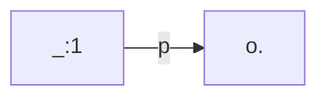
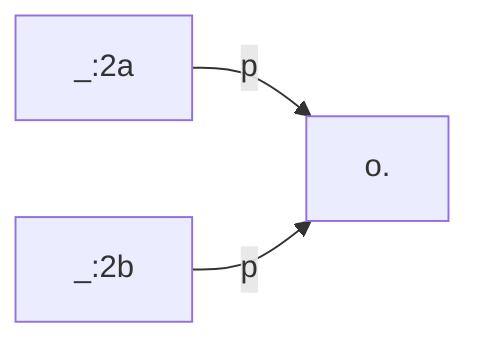

The current version of TriplyETL is **2.0.6**


## Changes in TriplyETL 2.0.6

Release date: 2023-06-07

### [Added] Support for the PREMIS vocabulary

Support was added for the PREMIS 3.0.0 vocabulary. This vocabulary is published by the Library of Congress and can be used to publish metadata about the preservation of digital objects. See the [PREMISE documentation](https://id.loc.gov/ontologies/premis-3-0-0.html) for more information.

The vocabulary can be imported from the 'vocab' module:

```ts
import { premis } from '@triplyetl/etl/vocab'
```

The following code snippet uses the vocabulary to assert that a PREMIS file is stored in a PREMIS storage location:

```ts
pairs(iri(id, 'some-file'),
  [a, premis.File],
  [premis.storedAt, iri(id, 'some-location')],
),
triple(iri(id, 'some-location'), a, premis.StorageLocation),
```

See the documentation about [external vocabulary declarations](/docs/triply-etl/declare#external-vocabularies) for more information.

### [Added] New debug function logMemory()

A new debug function [logMemory()](/docs/triply-etl/debug#logMemory) is added. This function prints an overview of the current memory usage of TriplyETL. This allows users to detect fluctuations in memory consumption inside their pipelines.

See the [debug functions documentation page](/docs/triply-etl/debug#logMemory) for more information.

### [Added] Support for the `ListIdentifiers` verb in the OAI-PMH extractor

The `fromOai()` extractor already supported the `ListRecords` verb. This release adds support for the `ListIdentifiers` verb. The latter allows used to stream through the headers of all records in an OAI-PMG collection, without requiring the full record (i.e. body) to be retrieved as well.

See the [fromOai()](/docs/triply-etl/extract/formats#fromOai) documentation for more information.


## Changes in TriplyETL 2.0.5

Release date: 2023-05-25

### [Changed] New default engine for SPARQL Construct

The default engine for evaluating SPARQL Construct queries (function [construct()](/docs/triply-etl/enrich/sparql)) has changed from Comunica to Speedy. Speedy is a new SPARQL implementation that is developed by Triply; Comunica is an open source engine that is developed by the open source community. Since SPARQL is a standardized query language, this change should not cause a difference in behavior for your ETL pipelines.

In the unexpected case where an ETL pipeline *is* negatively affected by this change, the old situation can be restored by explicitly configuring the Comunica engine:

```ts
import { construct } from '@triplyetl/etl/sparql'

construct(Source.TriplyDb.query('my-query'), { sparqlEngine: 'comunica' }),
```

The benefit of switching to the Speedy engine is that this engine is expected to be faster for most queries. Overall, this change will therefore result in speed improvements for your TriplyETL pipelines.

### [Added] New CLI tool for comparing graphs

The new CLI tool [compare](/docs/triply-etl/cli#tools-compare) allows graph comparison to be performed from the command-line. This uses the same algorithm that is used by the [compareGraphs()](/docs/triply-etl/validate/graph-comparison) validator function.

## Bug fixes

This release includes the following bug fixes:

- `fromXlsx()` did not perform trailing whitespace trimming for cell value.
- When a SHACL result was printed, an incorrect message about a faulty SHACL model would be shown.
- Some RDF processors did not handle empty RDF inputs correctly.


# Changes in TriplyETL 2.0.4

Release date: 2023-05-11

## [Enhanced] Better output for checking graph isomorphism

Before this release, when two graphs were not isomorph and their difference consisted of a mapping from blank nodes onto blank nodes exclusively, an empty difference message was communicated.

From this release onwards, the difference message is non-empty, and specifically indicates the difference between the non-isomorphic graphs.

The following snippet should emit a non-empty difference:

```ts
import { Etl, Source, compareGraphs, loadRdf } from "@triplyetl/etl/generic"

export default async function (): Promise<Etl> {
  const etl = new Etl()
  etl.use(
    loadRdf(
      Source.string('base <https://triply.cc/> <g> { []<p><o> }'),
      { contentType: 'application/trig' }
    ),
    compareGraphs(
      Source.string('base <https://triply.cc/> <g> { [] <p><o>. []<p><o>. }'),
      { contentType: 'application/trig' }
    ),
  )
  return etl
}
```

Notice that the two TriG snippets are not isomorphic:



and



It is possible to map `_:2a` and `_:2b` onto `_:1`, but there is no mapping that works the other way round.


## Changes in TriplyETL 2.0.3

Release date: 2023-05-10

### Bug fixes

This release includes the following bug fixes:

- Error location information is not shown in TriplyETL Runner.
- Issue when a URL data source (`Source.url()`) includes an HTTP body.


## Changes in TriplyETL 2.0.2

Release date: 2023-05-09

### [Changed] Debug functions move to a new module

Before this release, debug functions like `logRecord()` and `startTrace()` were part of the RATT module. Since debug functions are generic / not RATT-specific, they were moved into a new module.

Function are imported from this new module in the following way:

```ts
import { logRecord, traceEnd, traceStart } from '@triplyetl/etl/debug'
```

### Bug fixes

This release includes the following bug fixes:

- Dynamic import bug on windows.
- Error reporting issues due to ESM imports.


# Changes in TriplyETL 2.0.1
