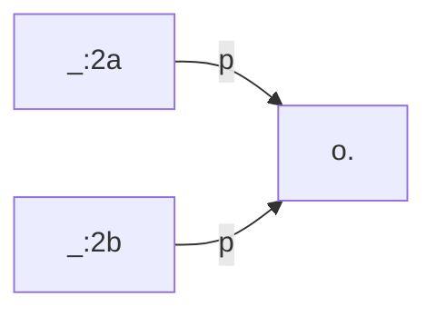

[TOC]

# Changelog

The current version of TriplyETL is **3.0.0**

You can use this changelog to perform a safe update from an older version of TriplyETL to a newer one. See the documentation for [Upgrading TriplyETL repositories](../cli) for the advised approach, and how the changelog factors into that.

## TriplyETL 3.0.0 

Release dates: 2023-10-12 

### [Added] Support for the `SPARQL Select` and `SPARQL Ask` queries
The extractors [fromCsv()](../extract/formats/#extractor-fromcsv), [fromJson()](../extract/formats/#extractor-fromjson), [fromTsv()](../extract/formats/#extractor-fromtsv) and [fromXml()](../extract/formats/#extractor-fromxml) now support [SPARQL Select](../extract/types/#sparql-select-queries) queries.
The extractors [fromJson()](../extract/formats/#extractor-fromjson) and [fromXml()](../extract/formats/#extractor-fromxml) also support [SPARQL Ask](../extract/types/#sparql-ask-queries) queries. 

The example below hows how to use a SPARQL ask query in the `fromJson()` extractor:

```ts
fromJson(Source.TriplyDb.query('account', 'query-name', { triplyDb: { url: 'https://api.triplydb.com' } }))
```
### [Added] [RDF mapping language](https://rml.io/docs/rml/introduction/) (RML) for transformations
TriplyETL supports transformations using [RDF mapping language](https://rml.io/docs/rml/introduction/) (RML). To see how this works, please refer to our documentation about RML, available [here](../rml).

### [Enhanced] Simplified usage of [nestedPairs()](../assert/ratt/statement/#function-nestedpairs) Middleware
 The [nestedPairs()](../assert/ratt/statement/#function-nestedpairs) middleware can be used without providing the subject node that connects the pairs to the object/predicate. This will automatically create a skolem-iri for the subject:

```ts
nestedPairs(S, P, [a, sdo.Person])
```

For example:

```ts
fromJson([{ id: '1', height: 15 }]),
addSkolemIri({
  prefix: prefix.skolem,
  key: '_height',
}),
nestedPairs(iri(prefix.product, 'id'), sdo.height,
  [qudt.unit, unit.CentiM],
  [rdf.value, 'height'],
),
```

Will result in the following linked data assertions:

```ts
product:1
  sdo:height
    [ qudt:unit unit:CentiM;
      rdf:value 15 ].
```

### [Changed] Automatic prefix handling in TriplyDB using [toRdf()](../publish/#local-data-destinations)
Manually specified and standard prefixes are automatically added to TriplyDB when [toRdf()](../publish/#local-data-destinations) is used. The middleware `uploadPrefixes()` is removed.


### [Changed] New approach to prefix handling in TriplyETL 
Prefixes are no longer defined as function that concatenates a value to an Iri. The Iri is a new type of Object in TriplyETL, that has a `concat()` method which allows you to add a value to the first part of an Iri. For example:

```ts
const baseIri = Iri('https://example.com/')
const prefixId = baseIri.concat('id/')
const johnDoe = prefixId.concat('john-doe')
```  

### [Changed] New package `@triplyetl/vocabularies` 

The vocabularies and languages are no longer part of `@triplyetl/etl` package. A new module has been released: `@triplyetl/vocabularies`:  

Individual vocabularies like `rdf` and `schema.org` can be imported in the following way:

```ts
import { a, rdf, sdo } from '@triplyetl/vocabularies'
```

To import all vocabularies, use:

```ts
import * as vocab from "@triplyetl/vocabularies"
```

Some vocabularies are too large to include, but they can still be used like this:

```ts 
import { aat } from '@triplyetl/vocabularies'
const moustache = aat.concat('300379271')
```

or

```ts
import { aat } from '@triplyetl/vocabularies'
addIri({prefix: aat, content: str('300379271'), key: 'moustache'})
```

**To use the RATT `lang` tools**:
	 
Import `languages`:

```ts
import { languages } from '@triplyetl/vocabularies'
```
Import `languages` and `region`:

```ts
import { region, language } from '@triplyetl/vocabularies'

const nl_BE = language.nl.addRegion(region.BE)
``` 

### [Changed] RDF serialization parsing with [loadRdf()](../extract/formats/#function-loadrdf) 
The [loadRdf()](../extract/formats/#function-loadrdf) middleware is able to parse known RDF serilaizations (`Turtle`, `TriG`, `N-Triples`, `N-Quads`) provided as a string without specifying mimetype.

```ts
const data = Source.string('...')
loadRdf(data)
```

### [Changed] Extended log and terminal output for ETL debugging 
The output of the logfile and terminal output is changed. It contains more information to help users debugging ETL's. The format of time representation is now `H:i:s.u` where:  

   -  **H**: 24-hour format of an hour with leading zeros	(00 through 23)  
   - **i**: Minutes with leading zeros	(00 to 59)  
   - **s**: Seconds with leading zeros (00 through 59)  
   - **u**: Microseconds (example: 654321)  

### [Changed] [toRdf()](../publish/#local-data-destinations) for account-based token access
The [toRdf()](../publish/#local-data-destinations) middleware now accepts `"me"` as account name based on the token.
Below are some examples of this being used.

```ts
toTriplyDb({account: "me", dataset: "myDataset"})
``` 
```ts
loadRdf(Source.TriplyDb.rdf("me", datasetName))
```
```ts
Destination.TriplyDb.rdf("me", datasetName)
```

 

### [Changed] Relocation middleware: `resetStore()` and `randomKey()` 
The `resetStore()` middleware is now moved from `ratt` to the `generic` namespace . The `randomKey()` middleware moved from `generic` to `ratt`.  

### [Changed] Record selection with `--offset` and `--limit`
 You can now use `--offset` and `--limit` instead of `--from-record-id` and `--head`, e.g. `LIMIT=1 OFFSET=8 npx etl`.  The old arguments can still be used for backwards compatibility.

### [Changed] Removal `mapQuads()` middleware
The middleware `mapQuads()` is removed.  

### [Changed] Warning for old Node.JS versions
If the users Node.JS version is older that the recommended version (currently \>=18.0.0) a warning is shown.  

### [Changed] SHACL Validation Engine 
A SHACL Validation Engine improved performance. 
 
### [Changed] [XSLT Processing](../xslt) support in [fromXml()](../extract/formats/#extractor-fromxml) and [loadRdf()](../extract/formats/#function-loadrdf) middlewares
We support XSLT processing in the [fromXml()](../extract/formats/#extractor-fromxml) and [loadRdf()](../extract/formats/#function-loadrdf) middlewares by providing an optional `Source.file()` to the `stylesheet` parameter.

Example of usage in `fromXml()`:

```ts
fromXml(Source.file(XMLFile), {
        selectors: "rdf:RDF.sdo:Person",
        stylesheet: Source.file(XSLTStylesheet),
      }),
```
Example of usage in `loadRdf()`:

```ts
loadRdf(Source.file(XMLFile), {
        contentType: "application/rdf+xml",
        stylesheet: Source.file(XSLTStylesheet),
      }),
```

### [Changed] Trace for large records
A new flag now bypasses generating the trace for very large records: `---skip-error-trace`. Thus, no trace file is created.

### [Changed] Transition to in-memory engine Speedy
[Comunica](https://comunica.dev) is no longer part of TriplyETL, the in-memory engine is now Triply's Speedy.

### [Changed] Developer notes 

Developer notes:    
 - Switched from `yarn` to `npm`.  
 - Removes some unused packages and types.    
 - Most @ts-ignore / @ts-expect-error derictives have been removed and fixed.    


### Bug fixes    

This release includes the following bug fixes:

- Report which file contains errors when multiple files are used in [fromCsv()](../extract/formats/#extractor-fromcsv), [fromTsv()](../extract/formats/#extractor-fromtsv) and [fromXml()](../extract/formats/#extractor-fromxml)  middleware.

- When a WKT point is created with the `addPoint()` function, and the CRS parameter is not specified, the CRS <http://www.opengis.net/def/crs/OGC/1.3/CRS84> is used.

- We can use an API Token from the `.env` file and a TriplyDB instance URL in the function call (e.g. `loadRdf(Source.TriplyDb.rdf('test',{triplyDb:{url:'https://api.triplydb.com'}}))`). An error is thrown if the decoded token information conflicts with the provided arguments.

- Communicate non-success HTTP status codes.

- Adds better metadata in ETL logs: 

 - TriplyETL version
 - Node.js version
 - DTAP mode
 - Start date/time
 - End date/time

- Disable support for multiple [Extractors](../extract/formats/). 

- Fixes out-of-memory issue when using SHACL validation. 

## TriplyETL 2.0.7 through 2.0.19

Release dates: 2023-06-17 through 2023-09-29

### Bug fixes
The following bugs have been fixed:

- Processing an Excel sheet with [fromXml()](../extract/formats#extractor-fromxml) would sometimes consume too much memory.

- Several installation issues on Windows have been resolved.

- The `async-saxophone` library for XML processing was adjusted to support the current LTS version of Node.js (v18).


## TriplyETL 2.0.6

Release date: 2023-06-07

### [Added] Support for the PREMIS vocabulary

Support was added for the PREMIS 3.0.0 vocabulary. This vocabulary is published by the Library of Congress and can be used to publish metadata about the preservation of digital objects. See the [PREMIS documentation](https://id.loc.gov/ontologies/premis-3-0-0.html) for more information.

The vocabulary can be imported from the 'vocab' module:

```ts
import { premis } from '@triplyetl/vocabularies'
```

The following code snippet uses the vocabulary to assert that a PREMIS file is stored in a PREMIS storage location:

```ts
pairs(iri(id, 'some-file'),
  [a, premis.File],
  [premis.storedAt, iri(id, 'some-location')],
),
triple(iri(id, 'some-location'), a, premis.StorageLocation),
```

See the documentation about [external vocabulary declarations](../declare#external-vocabularies) for more information.

### [Added] New debug function logMemory()
A new debug function [logMemory()](../debug#function-logmemory) is added. This function prints an overview of the current memory usage of TriplyETL. This allows users to detect fluctuations in memory consumption inside their pipelines.

See the [debug functions documentation page](../debug) for more information.

### [Added] Support for the `ListIdentifiers` verb in the OAI-PMH extractor

The `fromOai()` extractor already supported the `ListRecords` verb. This release adds support for the `ListIdentifiers` verb. The latter allows used to stream through the headers of all records in an OAI-PMG collection, without requiring the full record (i.e. body) to be retrieved as well.

See the [fromOai()](../extract/formats#extractor-fromoai) documentation for more information.


## TriplyETL 2.0.5

Release date: 2023-05-25

### [Changed] New default engine for SPARQL Construct

The default engine for evaluating SPARQL Construct queries (function [construct()](../enrich/sparql)) has changed from Comunica to Speedy. Speedy is a new SPARQL implementation that is developed by Triply; Comunica is an open source engine that is developed by the open source community. Since SPARQL is a standardized query language, this change should not cause a difference in behavior for your ETL pipelines.

In the unexpected case where an ETL pipeline *is* negatively affected by this change, the old situation can be restored by explicitly configuring the Comunica engine:

```ts
import { construct } from '@triplyetl/etl/sparql'

construct(Source.TriplyDb.query('my-query'), { sparqlEngine: 'comunica' }),
```

The benefit of switching to the Speedy engine is that this engine is expected to be faster for most queries. Overall, this change will therefore result in speed improvements for your TriplyETL pipelines.


### [Added] New CLI tool for comparing graphs

The new CLI tool [compare](../cli#tools-compare) allows graph comparison to be performed from the command-line. This uses the same algorithm that is used by the [compareGraphs()](../validate/graph-comparison) validator function.

### Bug fixes

This release includes the following bug fixes:

- [fromXlsx()](../extract/formats/#extractor-fromxlsx) did not remove trailing whitespace in cell values.

- When a SHACL result was printed, an incorrect message about a faulty SHACL model would be shown.

- Some RDF processors did not handle empty RDF inputs correctly.


## TriplyETL 2.0.4

Release date: 2023-05-11


### [Enhanced] Better output for checking graph isomorphism

Before this release, when two graphs were not isomorph and their difference consisted of a mapping from blank nodes onto blank nodes exclusively, an empty difference message was communicated.

From this release onwards, the difference message is non-empty, and specifically indicates the difference between the non-isomorphic graphs.

The following snippet should emit a non-empty difference:

```ts
import { Etl, Source, compareGraphs, loadRdf } from "@triplyetl/etl/generic"

export default async function (): Promise<Etl> {
  const etl = new Etl()
  etl.use(
    loadRdf(
      Source.string('base <https://triply.cc/> <g> { []<p><o> }'),
      { contentType: 'application/trig' }
    ),
    compareGraphs(
      Source.string('base <https://triply.cc/> <g> { [] <p><o>. []<p><o>. }'),
      { contentType: 'application/trig' }
    ),
  )
  return etl
}
```

Notice that the two TriG snippets are not isomorphic:


and



It is possible to map `_:2a` and `_:2b` onto `_:1`, but there is no mapping that works the other way round.


## TriplyETL 2.0.3

Release date: 2023-05-10

### Bug fixes

This release includes the following bug fixes:

- Error location information is not shown in TriplyETL Runner.

- Issue when a URL data source (`Source.url()`) includes an HTTP body.


## TriplyETL 2.0.2

Release date: 2023-05-09

### Bug fixes

This release fixes bugs related to the recent switch from CommonJS to ESM:

- Dynamic import bug on Windows.

- Error reporting issues due to ESM imports.


## TriplyETL 2.0.1

Release date: 2023-05-03

### [Added] Timeout flag for TriplyETL Runner

The TriplyETL Runner is the CLI tool that is used to run ETL pipelines. Starting with this version, you can specify a `--timeout` flag when using the TriplyETL Runner.

When the indicated timeout is reached before the pipeline finishes, the TriplyETL Runner will gracefully terminate the ETL by acting as if there are no more incoming records.

See the [TriplyETL Runner documentation page](../cli#set-a-timeout) for more information.


## TriplyETL 2.0.0

Release date: 2023-05-01


### [Changed] Modules infrastructure moves from CommonJS to ESM

Before this release, TriplyETL used CommonJS modules to modularize its functionality into different components. Starting in this release, ECMAScript Modules (ESM) are used to modularize TriplyETL functionality into different modules.

ESM is a more modern approach for modularizing ECMAScript (JavaScript, TypeScript, and Node.js) code. While CommonJS imports are evaluated at runtime, ESM imports are evaluated at compile time. TriplyETL users benefit from this change, since error messages related to module imports will be detected much earlier in the development process.

All documentation examples were update to use ESM syntax for module imports, for example:

```ts
import { logRecord } from '@triplyetl/etl/debug'
```

### [Changed] Debug functions move to a new module

Before this release, debug functions like `logRecord()` and `startTrace()` were part of the RATT module. Since debug functions are generic / not RATT-specific, they were moved into a new module.

Function are imported from this new module in the following way:

```ts
import { logRecord, traceEnd, traceStart } from '@triplyetl/etl/debug'
```


### [Enhanced] Better error messages when things go wrong

This release introduces a new approach for communicating errors back to the user. When TriplyETL functionality detects an error condition, a unified 'trace middleware' is now used to retrieve information from the environment in which the error occurred. This information is then printed to the error output stream for communication with the user.

### Bug fixes
The following bug fixes are included in this release:

- Incorrect behavior of the [_switch() control function](../control#switch-between-different-cases-_switch).

- The [fromOai() extractor](../extract/formats#extractor-fromoai) now communicates clearer when the accessed OAI-PMH endpoint encounters any issues.

- When a key with a NULL value was accessed, the name of the key is now included in the error message.


## TriplyETL 1.0.x

TriplyETL 1.0.0 was released on 2023-03-20.
