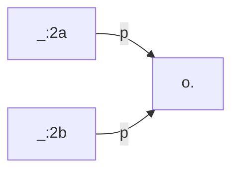

# Changelog

The current version of TriplyETL is **2.0.19**

You can use this changelog to perform a safe update from an older version of TriplyETL to a newer one. See the documentation for [Upgrading TriplyETL repositories](/triply-etl/cli) for the advised approach, and how the changelog factors into that.

## TriplyETL 3.0.0 

Release dates: 2023-10-11 

### Feature 
- The middlewares [fromCsv()](/triply-etl/extract/formats/#extractor-fromcsv), [fromJson()](/triply-etl/extract/formats/#extractor-fromjson), [fromTsv()](/triply-etl/extract/formats/#extractor-fromtsv) and [fromXml()](/triply-etl/extract/formats/#extractor-fromxml) now supports TriplyDB `select` and `ask` queries.


-  It is now possible to validate and publish a TriplyDB dataset to the (Dutch) [NDE Termennetwerk](https://datasetregister.netwerkdigitaalerfgoed.nl):
    - Instantiate the NDE Class by providing it with the ETL object: 
```ts
const nde = new NDEDatasetRegister({et;, accountName, datasetname})`
```
  - Validate  dataset: `nde.validate()`
  - Submit a dataset: `nde.submit()`

 - The `nestedPairs()` middleware can be used without providing the subject node that connects the pairs to the object/predicate. The following is valid: 
```ts
nestedPairs(S, P, [a, sdo.Person])
```
When used like this, the middleware will automatically create a skolem-iri.


- TriplyETL supports transformations using RDF mapping language.
- Prefixes (manually added and standard) are automatically added to TriplyDb when `toRdf()` is used. The middleware `uploadPrefixes()` is removed.
- Extra override for `nestedPairs()`: we accept calling this middleware without an object (=subject for the nested triples). When ommitted, a skolem iri is used.


### [Changed]
- Generating the trace, especially the part that creates a diff for the record takes too long for very large records. A new flag now lets you bypass this feature: `---skip-error-trace`. Using this flag means no trace file is created.
- The `loadRdf()` middleware now assumes the data provided is parsable using one of the known RDF serilaizations (Turtle, TriG, n-triples, n-quads) by assuming the simple RDF parses should be used if mimetype is 'text/plain' (e.g. when you provide a simple `Source.string()`). This is similair to how it used to work before we accepted other RDF sources (e.g. RDFa). For those more advanced use, the mimetype is still required as argument.
- The logfile produced by an ETL provides better and more detailed feedback. We also no longer use human friendly time representations, but exact times are now used.
- The `toRdf()` middleware now accepts "me" as account name, resulting in the user defined by the token.
- The `resetStore()` middleware is now moved to the `generic` namespace (used to be `ratt`), the `randomKey()` middleware moved from `genertic` to `ratt`.

- You can now use `--offset` and `--limit` instead of `--from-record-id` and `--head`.  The old arguments can still be used for backwards compatibility. The `--head` and `--limit` options can also be provided when using environment variables with the same name in capitals, e.g. `LIMIT=1 OFFSET=8 npx etl`.
- Middleware `mapQuads()` is removed.
- A warning is now shown if the users Node.JS version is older that the recommendend version (currently \>=18.0.0).

- The output of the logfile and terminal output has been changed. It now contains more information to help users debugging ETL's. We also do not use human readable text for elapsed time anymore, it causes confusion and rounding issues. We now use `H:i:s.u` where:
    - **H**: 24-hour format of an hour with leading zeros	(00 through 23)
    - **i**: Minutes with leading zeros	(00 to 59)
    - **s**: Seconds with leading zeros (00 through 59)
    - **u**: Microseconds (example: 654321)

- A new SHACL Validation Engine is used, it is much faster than the previous version.
- The `shacl.validate()` middleware has changed: TODO
- Some commands from the `tools` script (`npx tools`) were removed since they are not ETL related and considered too dangerous:
    - deleteDatasets
    - deleteQueries
    - deleteGraphs
- We now support XSLT processing in the `fromXML()` and `loadRdf()` middleware by providing an optional `Source.file()` to the `stylesheet` parameter that uses an XSL-XML Stylesheet.

- The vocabularies and languages are no longer part of `@triplyetl/etl package`. A new module has been released: `@triplyetl/vocabularies`:
  
        1\. Individual imports:

```ts
import { a, rdf, sdo } from '@triplyetl/vocabularies'
```
#
    - Import all vocabularies (e.g. for `vocab.sdo.name'`):
        - Old:

```ts
import * as vocab from "@triplyetl/vocabularies"
```

   - To use a `prefixer` function (e.g. `aat(123456)`) (note that the name has changed from `prefix` to `prefixer`):
      - Old:

```ts
import { prefix } from '@triplyetl/etl/vocab'` => `prefix.aat('300379271')
```

      - New:

```ts 
import { prefixer } from '@triplyetl/etl/vocab'` => `prefixer.aat('300379271')
```

   - To get a Iri from a specific prefix:
      - Old:

```ts
import { prefix } from '@triplyetl/etl/vocab'` => `prefix.skos('')
```

      - New:

```ts
import { prefix } from '@triplyetl/etl/vocab'` => `prefix.skos
```

   - To use the RATT `lang` tools
      - The old `lang` code only had a very limited amount of languages defined, the new version has almost evry language known.
      - Old: 

```ts 
import { lang } from '@triplyetl/etl/vocab/index.js'
```

      - New: 

```ts
import { languages } from '@triplyetl/vocabularies'
```

      - Another example:

```ts
import { region, language } from '@triplyetl/vocabularies'; const nl_BE = language.nl.addRegion(region.BE)
``` 

- A new way of dealing with prefixes has been introduced: we no longer define prefixes as function that can concat a value to an Iri and return an Iri, but the Iri is a new type of Object in TriplyETL. The main function still is `declarePrefix()` which is now a wrapper for `new Iri(...)`. The new iri object has a `concat()` method which allows you to add a value to the first part of an Iri. The result is a new Iri. You can do 
```ts
const johnDoe = declarePrefix('http://ex.com/').concat('John').concat('/Doe')
```

(= http://ex.com/John/Doe). All Iri's can be used in asserting new statements.
- Developers notes:
    - switched from `yarn` to `npm`.
    - removes some unused packages and types
    - most @ts-ignore / @ts-expect-error derictives have been removed and fixed

### Bug fixes
- Report which file contains errors when multiple files are used in `fromCsv()`, `fromTsv()` and `fromXml()` middleware.

- When a WKT point is created with the `addPoint()` function, and the CRS parameter is not specified, the CRS <http://www.opengis.net/def/crs/OGC/1.3/CRS84> is now used.
- When an API Token and a TriplyDB instance URL are both configured, one in the normal way of tokens (`.env`) and one in the function call (e.g. `loadRdf(Source.TriplyDb.rdf('test', { triplyDb: { url: 'https://api.triplydb.com' } }))`), the arguments were not merged, that is the token was not used. Note that with this fix it can happen that the decoded token information conflicts with the provided arguments. An error is thrown if this is the case.

- Communicate non-success HTTP status codes 
- Adds better metadata in ETL logs 
- Disable support for multiple extractors 
- Fixes out-of-memory issue when using SHACL validation 

## TriplyETL 2.0.7 through 2.0.19

Release dates: 2023-06-17 through 2023-09-29

The following bugs have been fixed:

- Processing an Excel sheet with [fromXml()](/triply-etl/extract/formats#extractor-fromxml) would sometimes consume too much memory.
- Several installation issues on Windows have been resolved.
- The `async-saxophone` library for XML processing was adjusted to support the current LTS version of Node.js (v18).


## TriplyETL 2.0.6

Release date: 2023-06-07

### [Added] Support for the PREMIS vocabulary

Support was added for the PREMIS 3.0.0 vocabulary. This vocabulary is published by the Library of Congress and can be used to publish metadata about the preservation of digital objects. See the [PREMIS documentation](https://id.loc.gov/ontologies/premis-3-0-0.html) for more information.

The vocabulary can be imported from the 'vocab' module:

```ts
import { premis } from '@triplyetl/etl/vocab'
```

The following code snippet uses the vocabulary to assert that a PREMIS file is stored in a PREMIS storage location:

```ts
pairs(iri(id, 'some-file'),
  [a, premis.File],
  [premis.storedAt, iri(id, 'some-location')],
),
triple(iri(id, 'some-location'), a, premis.StorageLocation),
```

See the documentation about [external vocabulary declarations](/triply-etl/declare#external-vocabularies) for more information.

### [Added] New debug function logMemory()

A new debug function [logMemory()](/triply-etl/debug#function-logmemory) is added. This function prints an overview of the current memory usage of TriplyETL. This allows users to detect fluctuations in memory consumption inside their pipelines.

See the [debug functions documentation page](/triply-etl/debug) for more information.

### [Added] Support for the `ListIdentifiers` verb in the OAI-PMH extractor

The `fromOai()` extractor already supported the `ListRecords` verb. This release adds support for the `ListIdentifiers` verb. The latter allows used to stream through the headers of all records in an OAI-PMG collection, without requiring the full record (i.e. body) to be retrieved as well.

See the [fromOai()](/triply-etl/extract/formats#extractor-fromoai) documentation for more information.


## Changelog for TriplyETL 2.0.5

Release date: 2023-05-25

### [Changed] New default engine for SPARQL Construct

The default engine for evaluating SPARQL Construct queries (function [construct()](/triply-etl/enrich/sparql)) has changed from Comunica to Speedy. Speedy is a new SPARQL implementation that is developed by Triply; Comunica is an open source engine that is developed by the open source community. Since SPARQL is a standardized query language, this change should not cause a difference in behavior for your ETL pipelines.

In the unexpected case where an ETL pipeline *is* negatively affected by this change, the old situation can be restored by explicitly configuring the Comunica engine:

```ts
import { construct } from '@triplyetl/etl/sparql'

construct(Source.TriplyDb.query('my-query'), { sparqlEngine: 'comunica' }),
```

The benefit of switching to the Speedy engine is that this engine is expected to be faster for most queries. Overall, this change will therefore result in speed improvements for your TriplyETL pipelines.

### [Added] New CLI tool for comparing graphs

The new CLI tool [compare](/triply-etl/cli#tools-compare) allows graph comparison to be performed from the command-line. This uses the same algorithm that is used by the [compareGraphs()](/triply-etl/validate/graph-comparison) validator function.

### Bug fixes

This release includes the following bug fixes:

- `fromXlsx()` did not remove trailing whitespace in cell values.
- When a SHACL result was printed, an incorrect message about a faulty SHACL model would be shown.
- Some RDF processors did not handle empty RDF inputs correctly.


## Changelog for TriplyETL 2.0.4

Release date: 2023-05-11

### [Enhanced] Better output for checking graph isomorphism

Before this release, when two graphs were not isomorph and their difference consisted of a mapping from blank nodes onto blank nodes exclusively, an empty difference message was communicated.

From this release onwards, the difference message is non-empty, and specifically indicates the difference between the non-isomorphic graphs.

The following snippet should emit a non-empty difference:

```ts
import { Etl, Source, compareGraphs, loadRdf } from "@triplyetl/etl/generic"

export default async function (): Promise<Etl> {
  const etl = new Etl()
  etl.use(
    loadRdf(
      Source.string('base <https://triply.cc/> <g> { []<p><o> }'),
      { contentType: 'application/trig' }
    ),
    compareGraphs(
      Source.string('base <https://triply.cc/> <g> { [] <p><o>. []<p><o>. }'),
      { contentType: 'application/trig' }
    ),
  )
  return etl
}
```

Notice that the two TriG snippets are not isomorphic:


and



It is possible to map `_:2a` and `_:2b` onto `_:1`, but there is no mapping that works the other way round.


## Changelog for TriplyETL 2.0.3

Release date: 2023-05-10

### Bug fixes

This release includes the following bug fixes:

- Error location information is not shown in TriplyETL Runner.
- Issue when a URL data source (`Source.url()`) includes an HTTP body.


## Changelog for TriplyETL 2.0.2

Release date: 2023-05-09

### Bug fixes

This release fixes bugs related to the recent switch from CommonJS to ESM:

- Dynamic import bug on Windows.
- Error reporting issues due to ESM imports.


## Changelog for TriplyETL 2.0.1

Release date: 2023-05-03

### [Added] Timeout flag for TriplyETL Runner

The TriplyETL Runner is the CLI tool that is used to run ETL pipelines. Starting with this version, you can specify a `--timeout` flag when using the TriplyETL Runner.

When the indicated timeout is reached before the pipeline finishes, the TriplyETL Runner will gracefully terminate the ETL by acting as if there are no more incoming records.

See the [TriplyETL Runner documentation page](/triply-etl/cli#set-a-timeout) for more information.


## Changelog for TriplyETL 2.0.0

Release date: 2023-05-01

### [Changed] Modules infrastructure moves from CommonJS to ESM

Before this release, TriplyETL used CommonJS modules to modularize its functionality into different components. Starting in this release, ECMAScript Modules (ESM) are used to modularize TriplyETL functionality into different modules.

ESM is a more modern approach for modularizing ECMAScript (JavaScript, TypeScript, and Node.js) code. While CommonJS imports are evaluated at runtime, ESM imports are evaluated at compile time. TriplyETL users benefit from this change, since error messages related to module imports will be detected much earlier in the development process.

All documentation examples were update to use ESM syntax for module imports, for example:

```ts
import { logRecord } from '@triplyetl/etl/debug'
```

### [Changed] Debug functions move to a new module

Before this release, debug functions like `logRecord()` and `startTrace()` were part of the RATT module. Since debug functions are generic / not RATT-specific, they were moved into a new module.

Function are imported from this new module in the following way:

```ts
import { logRecord, traceEnd, traceStart } from '@triplyetl/etl/debug'
```

### [Enhanced] Better error messages when things go wrong

This release introduces a new approach for communicating errors back to the user. When TriplyETL functionality detects an error condition, a unified 'trace middleware' is now used to retrieve information from the environment in which the error occurred. This information is then printed to the error output stream for communication with the user.

### Bug fixes

The following bug fixes are included in this release:

- Incorrect behavior of the [_switch() control function](/triply-etl/control#switch-between-different-cases-_switch).
- The [fromOai() extractor](/triply-etl/extract/formats#extractor-fromoai) now communicates clearer when the accessed OAI-PMH endpoint encounters any issues.
- When a key with a NULL value was accessed, the name of the key is now included in the error message.


## TriplyETL 1.0.x

TriplyETL 1.0.0 was released on 2023-03-20.
