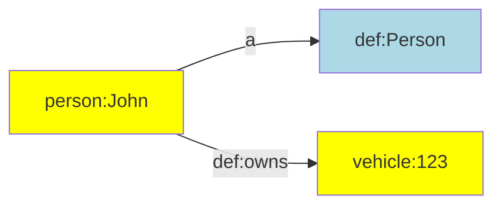

[TOC]

# Declare

Declarations introduce constants that you can use in the rest of your ETL configuration.


## Overview

TriplyETL supports the following kinds of declarations:

- [Declare](#declare)
  - [Overview](#overview)
  - [Prefix declarations](#prefix-declarations)
  - [External prefix declarations](#external-prefix-declarations)
  - [Vocabulary declarations](#vocabulary-declarations)
  - [External vocabularies](#external-vocabularies)
  - [Custom abbreviations](#custom-abbreviations)
  - [Instance declarations](#instance-declarations)
  - [Graph name declarations](#graph-name-declarations)
  - [Language declarations](#language-declarations)
  - [Geospatial declarations](#geospatial-declarations)
  - [Supported vocabularies](#supported-vocabularies)

Declaration functions and objects are found in the following two modules:


```ts
import { declarePrefix } from '@triplyetl/etl/generic'
import { prefix } from '@triplyetl/etl/vocab'
```


## Prefix declarations

Linked data uses IRIs for uniquely identifying most data items. Since IRIs can be long and complex, it is a best practice to declare short aliases that can be used to abbreviate them. Such aliases are introduced in prefix declarations.

The function for declaring prefixes can be imported from the generic TriplyETL library:

```ts
import { declarePrefix } from '@triplyetl/etl/generic'
```

The following function introduces `ALIAS` as shorthandnotation for `IRI_PREFIX`:

```ts
const base = declarePrefix('https://example.com/')
```

Once an alias has been declared, future declarations can make use of that alias to extend it:

```ts
const id = declarePrefix(base('id/'))
```

Notice that it is common practice to end every IRI prefix in a forward slash.

It is common to make declarations for the full IRI strategy in one place, with an intent to reuse them through the ETL configuration. To distinguish prefix declarations from other declarations, it is best practice to put all prefix declaration that will be used in transformations and assertions into an single object called `prefix`:

```ts
const base = declarePrefix('https://example.com/')
const id = declarePrefix(base('id/'))
const prefix = {
  person: declarePrefix(id('person/')),
  def: declarePrefix(base('model/def/')),
  vehicle: declarePrefix(id('vehicle/')),
}
```

Notice that `base` and `id` are not intended to be used in transformations or assertions, but are only used to declare other prefixes that are used.

With the above declarations in place, the following IRI assertion can be made:

```ts
iri(prefix.person, 'name')
iri(prefix.person, str('John')),
iri(prefix.vehicle, 'id')
iri(prefix.vehicle, str('123')),
```

See assertion functions [iri()](../assert/ratt/term/#function-iri) and [str()](../assert/ratt/term#function-str) for more information.


## External prefix declarations

In linked data, it is common to reuse existing vocabularies and datasets. TriplyETL allows you to use popular namespaces from predefined prefix declarations.

Popular namespaces are imported from the vocabulary library:

```ts
import { prefix } from '@triplyetl/etl/vocab'
```

For example, you can use the prefix declaration for DBpedia resources as follows:

```ts
iri(prefix.dbr, 'cityName')
```

This may create IRIs like the following:

```turtle
http://dbpedia.org/resource/Amsterdam
http://dbpedia.org/resource/Berlin
```

You can use the prefix declaration for XML Schema Datatypes as follows:

```ts
literal('cityName', xsd.string)
```

This may create literals like the following:

```turtle
'Amsterdam'^^xsd:string
'Berlin'^^xsd:string
```


## Vocabulary declarations

Vocabularies are collections of IRIs that have the same namespace. The namespace can be declared with a prefix (see [Prefix declarations](#prefix-declarations)). We use the following prefix declaration as the namespace for our vocabulary:

```ts
const base = declarePrefix('https://example.com/')
const prefix = {
  def: declarePrefix(base('model/def/')),
}
```

Individual terms in the vocabulary can be declared by using the declaration of the namespace as a function:

```ts
prefix.def('Person')
prefix.def('Vehicle')
prefix.def('knows')
prefix.def('owns')
```

These are equivalent to the following full IRIs:

```iri
https://example.com/model/def/Person
https://example.com/model/def/Vehicle
https://example.com/model/def/knows
https://example.com/model/def/owns
```

It is best practice to place IRI terms that belong to the same vocabulary or namespace in an object:

```ts
const def = {
  Person: prefix.def('Person'),
  Vehicle: prefix.def('Vehicle'),
  knows: prefix.def('knows'),
  owns: prefix.def('owns'),
}
```

With the above declarations in place, we can now make the following assertions:

```ts
pairs(iri(prefix.person, 'name'),
  [a, def.Person],
  [def.owns, iri(prefix.vehicle, 'id')],
),
```

This results in the following linked data:

```turtle
person:John
  a def:Person;
  def:owns vehicle:123.
```

Or diagrammatically:




## External vocabularies

In linked data, it is common to reuse existing vocabularies. Popular vocabularies can be imported from the TriplyETL vocabulary library:

```ts
import { a, foaf, owl, premis } from '@triplyetl/etl/vocab'
```

This allows you to make the following assertions:

```ts
triple(foaf.Person, a, owl.Class),
```

This results in the following linked data:

```turtle
foaf:Person a owl:Class.
```

Notice that the notation in TriplyETL comes very close to the notation in Turtle/TriG/SPARQL that is familiar to linked data users.

The following code snippet uses the specialized PREMIS 3.0.0 vocabulary. This vocabulary is published by the Library of Congress and is used to publish metadata about the preservation of digital objects. The following code snippet asserts that a PREMIS file is stored in a PREMIS storage location:

```ts
pairs(iri(id, 'some-file'),
  [a, premis.File],
  [premis.storedAt, iri(id, 'some-location')],
),
triple(iri(id, 'some-location'), a, premis.StorageLocation),
```


## Custom abbreviations

The custom abbreviation `a` is available in the popular Turtle/TriG/SPARQL languages. TriplyETL allows you to introduce this custom abbreviation from the vocabulary library:

```ts
import { a } from '@triplyetl/etl/vocab'
```

In Turtle/TriG syntax this abbreviation is only allowed to be used in the predicate position. This restriction is not enforced in TriplyETL, where you can use the `a` abbreviation in the subject, predicate, object, and even graph position.

You can introduce your own custom abbreviations as needed. For example, the following code snippet introduces `is_a` as a custom abbreviation for the IRI `rdfs:subClassOf`:

```ts
import { foaf, rdfs } from '@triplyetl/etl/vocab'
const is_a = rdfs.subClassOf
```

This allows you to write the following assertion:

```ts
triple(foaf.Person, is_a, foaf.Agent),
```

This may make assertions more readable for users from certain domains. For example, "is a" is a commonly use phrase [in many other modeling languages](https://en.wikipedia.org/wiki/Is-a) to denote the subsumption relation.


## Instance declarations

The same approach that is used for [vocabulary declarations](#vocabulary-declarations) can also be used for instance declarations.

The following example introduces constants for individual persons:

```ts
const person = {
  jane: prefix.person('Jane'),
  john: prefix.person('John'),
  mary: prefix.person('Mary'),
}
```

Instance declarations are used in assertions similar to how vocabulary declarations as used:

```ts
triple(person.john, def.knows, person.mary),
```


## Graph name declarations

A linked dataset contains one or more graphs. Each graph can be given a name. It is common practice to declare a fixed set of graph names that will be used throughout the TriplyETL configuration.

The following code snippet declares graph names for graphs that store metadata, model, and instances:

```ts
import { declarePrefix } from '@triplyetl/etl/generic'

const id = declarePrefix('https://example.com/id/')
const prefix = {
  graph: declarePrefix(id('graph/')),
}

const graph = {
  metadata: prefix.graph('metadata'),
  model: prefix.graph('model'),
  instances: prefix.graph('instances'),
}
```

The declared graph names can now be used in assertions:

```ts
triples(graph.metadata,
  ['_dataset', a, dcat.Dataset],
  ['_dataset', rdfs.label, str('My Dataset')],
),
```

See assertion function [triples()](../assert/ratt/statement#function-triples) for more information.


## Language declarations

Commonly used language tags can be imported in the following way:

```ts
import { lang } from '@triplyetl/etl/vocab'
```

These language declarations can be used to add language-tagged strings to the Record:

```ts
addLiteral({
  content: 'label',
  languageTag: lang.fr,
  key: '_languageTaggedString',
}),
```

Or they can be used to directly assert language-tagged strings in the Internal Store:

```ts
triple('_city', rdfs.label, literal('label', lang.fr)),
```

See transformation function [addLiteral()](../transform/ratt#function-addliteral) and assertion function [literal()](../assert/ratt/term#function-literal) for more information.


## Geospatial declarations

IRIs that denote commonly used coordinate reference systems can be imported from the `epsg` object:

```ts
import { geojsonToWkt } from '@triplyetl/etl/ratt'
import { epsg } from '@triplyetl/etl/vocab'
```

Such IRIs that denote coordinate reference systems can be used in several geospatial functions, for example in transformation function [geojsonToWkt()](../transform/ratt#function-geojsontowkt):

```ts
geojsonToWkt({
  content: 'geojson',
  crs: epsg[28992],
  key: '_wkt',
}),
```

## Supported vocabularies

While any vocabulary can be used in TriplyETL, the following list of commonly used vocabularies have out-of-the-box support.

| Name | Version | Use cases | Description |
| --- | --- | --- | --- |
| Argument Model Ontology (AMO) | 1.0 | Fake news detection, argumentation structure | An ontology for describing argumentation according to Toulmin's argumentation model. |
| Bibliographic Ontology Specification (BIBO) | no version | Libraries, citation graphs, bibliography | The Bibliographic Ontology Specification provides main concepts and properties for describing citations and bibliographic references (i.e. quotes, books, articles, etc) on the Semantic Web. |
| Building Topology Ontology (BOT) | 0.3.2 | Buildings | The Building Topology Ontology (BOT) is a minimal ontology for describing the core topological concepts of a building.|
| Brick: A uniform metadata schema for buildings | no version | Buildings | Brick is an open-source effort to standardize semantic descriptions of the physical, logical and virtual assets in buildings and the relationships between them. |
| Cultural Heritage Ontology (CEO) | 1.41 | Cultural heritage | The CEO is the complete semantic representation of the logical data models CHO and KENNIS from the data layer of the RCE. |
| Conceptual Reference Model (CRM) | 7.1.2 | Cultural heritage | The CIDOC Conceptual Reference Model (CRM) provides definitions and a formal structure for describing the implicit and explicit concepts and relationships used in cultural heritage documentation. |
| CRM Digital | no version | Digitization products | An ontology and RDF Schema to encode metadata about the steps and methods of production (“provenance”) of digitization products and synthetic digital representations such as 2D, 3D or even animated Models created by various technologies.  Its distinct features compared to competitive models is the complete inclusion of the initial physical measurement processes and their parameters. |
| Conceptual Reference Model (CRM) - PC | no version | Cultural heritage | CIDOC CRM v7.1.2 module for the implementation of properties of properties in RDFs. |
| DBpedia Ontology | 1.0.0 | DBpedia | Ontology for DBpedia |
| Data Catalog Vocabulary (DCAT) | 2.0.0 | Data catalogs, datasets | DCAT is an RDF vocabulary designed to facilitate interoperability between data catalogs published on the Web. | 
| Dublin Core Type Vocabulary | 2012-06-14 | Classes | The DCMI Type Vocabulary was created in 2001.  It defines classes for basic types of thing that can be described using DCMI metadata terms. |
| Dublin Core Terms | 1.1.0 | Metadata terms | This document is an up-to-date specification of all metadata terms maintained by the Dublin Core Metadata Initiative, including properties, vocabulary encoding schemes, syntax encoding schemes, and classes. |
| Document Elements Ontology (DEO) | 2015-07-03 | Rhetorical elements within documents | DEO, The Discourse Elements Ontology, is an ontology written in OWL 2 DL that provides a structured vocabulary for rhetorical elements within documents (e.g. Introduction, Discussion, Acknowledgements, Reference List, Figures, Appendix), enabling these to be described in RDF.  It uses some of the rhetorical block elements from the SALT Rhetorical Ontology and the Ontology of Rhetorical Blocks. |
| Document Components Ontology (DoCo) | 1.3.0 | Document components | The Document Components Ontology (DoCO) in an ontology that provides a structured vocabulary written of document components, both structural (e.g., block, inline, paragraph, section, chapter) and rhetorical (e.g., introduction, discussion, acknowledgements, reference list, figure, appendix). |
| ERA Vocabulary | 2022-02-02 | Railway infrastructure | Vocabulary defined by the European Union Agency for Railways to describe the concepts and relationships related to the European railway infrastructure and the vehicles authorized to operate over it. |
| FRBR-aligned Bibliographic Ontology (FaBiO) | no version | Publishing, bibliography, textual publications| An ontology for recording and publishing on the Semantic Web descriptions of entities that are published or potentially publishable, and that contain or are referred to by bibliographic references, or entities used to define such bibliographic references. |
| Friend of a Friend (FOAF) | 0.1.0 | People, information | FOAF is a project devoted to linking people and information using the Web.  Regardless of whether information is in people's heads, in physical or digital documents, or in the form of factual data, it can be linked.  FOAF integrates three kinds of network: social networks of human collaboration, friendship and association; representational networks that describe a simplified view of a cartoon universe in factual terms, and information networks that use Web-based linking to share independently published descriptions of this inter-connected world.  FOAF does not compete with socially-oriented Web sites; rather it provides an approach in which different sites can tell different parts of the larger story, and by which users can retain some control over their information in a non-proprietary format. |
| Functional Requirements for Bibliographic Records (FRBR) | 2005-08-10 | Bibliography | This vocabulary is an expression in RDF of the concepts and relations described in the IFLA report on the Functional Requirements for Bibliographic Records (FRBR). |
| GeoSPARQL | 1.0 | Geospatial data | The OGC GeoSPARQL standard supports representing and querying geospatial data on the Semantic Web.  GeoSPARQL defines a vocabulary for representing geospatial data in RDF, and it defines an extension to the SPARQL query language for processing geospatial data.  In addition, GeoSPARQL is designed to accommodate systems based on qualitative spatial reasoning and systems based on quantitative spatial computations. |
| Geography Markup Language (GML) Encoding Standard | 3.2.1 | Geography | XML grammar for expressing geographical features.  GML serves as a modeling language for geographic systems as well as an open interchange format for geographic transactions on the Internet. |
| Getty Vocabulary Program (GVP) | 3.3.0 | Classes, properties and values in GVP LOD | The GVP Ontology defines classes, properties and values ([`skos:Concept`](https://triplydb.com/w3c/skos/table?subject=http%3A%2F%2Fwww.w3.org%2F2004%2F02%2Fskos%2Fcore%23Concept)s) used in GVP LOD. |
| Linked Art | no version | Cultural heritage | Linked Art describes cultural heritage resources, with a focus on artworks and museum-oriented activities. It defines common patterns and terms to ensure that the resulting data can be easily used and is based on real-world data and use cases. |
| Metagegevens voor duurzaam toegankelijke overheidsinformatie (MDTO) | 1.0 | Government information | MDTO (Metadata for sustainably accessible government information) is a standard for recording and exchanging unambiguous metadata to enable the sustainable accessibility of government information. |
| Organization ontology | 0.8.0 | Organizational structures | Vocabulary for describing organizational structures, specializable to a broad variety of types of organization. |
| Web Ontology Language (OWL) | 2.0.0 | Things, groups of things, and relations between things | Language (OWL) is a Semantic Web language designed to represent rich and complex knowledge about things, groups of things, and relations between things. |
| Person Name Vocabulary (PNV) | 1.1 | Persons' names | The Person Name Vocabulary (PNV) is an RDF vocabulary and data model for persons' names. It is applicable to many datasets in which persons are described, as it accommodates different levels of data granularity. It furthermore allows for easy alignment of name elements, including idiosyncratic ones, such as family name prefixes and patronymics, with standard vocabularies such as Schema.org, FOAF, DBpedia and Wikidata, thus guaranteeing optimal data interoperability. |
| PREMIS 3 Ontology | 3.0.0 | Digital objects | Ontology for PREMIS 3, the international standard for metadata to support the preservation of digital objects and ensure their long-term usability. |
| PROV Ontology (PROV-O) | no version | Provenance information | The PROV Ontology (PROV-O) expresses the [PROV Data Model](http://www.w3.org/TR/2013/REC-prov-dm-20130430/) using the OWL2 Web Ontology Language (OWL2).  It provides a set of classes, properties, and restrictions that can be used to represent and interchange provenance information generated in different systems and under different contexts.  It can also be specialized to create new classes and properties to model provenance information for different applications and domains. |
| Data Cube Vocabulary | 0.2 | Statistical data, multi-dimensional data sets| There are many situations where it would be useful to be able to publish multi-dimensional data, such as statistics, on the web in such a way that it can be linked to related data sets and concepts.  The Data Cube vocabulary provides a means to do this using the W3C [RDF](http://www.w3.org/TR/REC-rdf-syntax/) (Resource Description Framework) standard.  The model underpinning the Data Cube vocabulary is compatible with the cube model that underlies [SDMX](http://sdmx.org/) (Statistical Data and Metadata eXchange), an ISO standard for exchanging and sharing statistical data and metadata among organizations.  The Data Cube vocabulary is a core foundation which supports extension vocabularies to enable publication of other aspects of statistical data flows or other multi-dimensional data sets. |
| Quantities, Units, Dimensions and Types (QUDT) | 2.1.2 | Physical quantities, units of measure, dimensions | The QUDT, or “Quantity, Unit, Dimension and Type” schema defines the base classes properties, and restrictions used for modeling physical quantities, units of measure, and their dimensions in various measurement systems. |
| RDA element sets: Agent properties | 1.0.0 | RDA Agent | The Agent properties element set consists of properties representing attributes and relationships of the RDA *Agent*, *Collective Agent*, *Person*, *Family*, and *Corporate Body* entities. |
| RDA element sets: Classes | 1.0.0 | Classes representing the RDA entities | The Classes element set consists of classes representing the RDA entities, including RDA Entity, Work, Expression, Manifestation, Item, Agent, Collective Agent, Person, Family, Corporate Body, Nomen, Place, and Timespan. |
| RDA Content Type | 1.0.0 | Content | A categorization reflecting the fundamental form of communication in which the content is expressed and the human sense through which it is intended to be perceived. |
| RDA Carrier Type | 1.0.0 | Carrier | A categorization reflecting the format of the storage medium and housing of a carrier in combination with the type of intermediation device required to view, play, run, etc., the content of a resource. |  
| RDA Element Sets: Expression Properties | 1.0.0 | RDA Expression properties | The Expression properties element set consists of properties representing attributes and relationships of the RDA *Expression* entity. |
| RDA element sets: Item properties | 5.0.12 | RDA Item | The Item properties element set consists of properties representing attributes and relationships of the RDA *Item* entity. |
| RDA Element Sets: Manifestation Properties | 1.0.0 | RDA Manifestation | The Manifestation properties element set consists of properties representing attributes and relationships of the RDA *Manifestation* entity. |
| RDA Media Type | 1.0.0 | Media type  | A categorization reflecting the general type of intermediation device required to view, play, run, etc., the content of a resource. |
| RDA element sets: Nomen properties | 1.0.0 | RDA Nomen | The Nomen properties element set consists of properties representing attributes and relationships of the RDA *Nomen* entity. |
| RDA element sets: Place properties | 1.0.0 | RDA Place | The Place properties element set consists of properties representing attributes and relationships of the RDA *Place* entity. |
| RDA element sets: Timespan properties | 1.0.0 | RDA Timespan | The Expression properties element set consists of properties representing attributes and relationships of the RDA *Timespan* entity. |
| RDA element sets: Unconstrained properties | 1.0.0 |Properties of all RDA entities | The Unconstrained properties element set consists of properties representing the elements of all of the RDA entities.  Each property in the element set has semantics which are independent of the LRM model and has no specified domain or range. |
| RDA element sets: Work properties | 1.0.0 | RDA Work | The Work properties element set consists of properties representing attributes and relationships of the RDA *Work* entity. |
| RDA element sets: Entity properties | 1.0.0 | RDA Entity | The RDA Entity properties element set consists of properties representing elements of the RDA *Entity* entity. |
| Resource Description Framework (RDF) | 1.1.0 | RDF | This is the RDF Schema for the RDF vocabulary terms in the RDF Namespace, defined in RDF Concepts. |
| RDF Schema | 1.1.0 | Data-modelling vocabulary for RDF data | RDF Schema provides a data-modelling vocabulary for RDF data.  RDF Schema is an extension of the basic RDF vocabulary. |
| MARC Code List for Relators Scheme | 2017-09-07 | Relator terms | Relator terms and their associated codes designate the relationship between a name and a bibliographic resource.  The relator codes are three-character lowercase alphabetic strings that serve as identifiers.  Either the term or the code may be used as controlled values. |
| Records in Contexts Ontology (ICA RiC-O) | 0.2 | Archives | RiC-O (Records in Contexts-Ontology) is an OWL ontology for describing archival record resources. As the second part of Records in Contexts standard, it is a formal representation of Records in Contexts Conceptual Model (RiC-CM). |
| Reconstructions and Observations in Archival Resources (ROAR) | 0.1 | Archives | Ontology to describe person, location etc. observations in archival resources. One or multiple observations can be bundled into a reconstruction that combines complementary (or sometimes conflicting) information from the observation(s) so that a single entity is reconstructed out of several entity observations from one or multiple sources. |
| Schema.org | 22.0 | Collection of shared vocabularies | The Schema.org vocabulary, including the core vocabulary and all domain-specific layers. |
| Shapes Constraint Language (SHACL) | 1.0.0 | Validation of RDF graphs | SHACL Shapes Constraint Language is a language for validating RDF graphs against a set of conditions.  These conditions are provided as shapes and other constructs expressed in the form of an RDF graph.  RDF graphs that are used in this manner are called “shapes graphs” in SHACL and the RDF graphs that are validated against a shapes graph are called “data graphs”.  As SHACL shape graphs are used to validate that data graphs satisfy a set of conditions they can also be viewed as a description of the data graphs that do satisfy these conditions.  Such descriptions may be used for a variety of purposes beside validation, including user interface building, code generation and data integration. |
| Simple Knowledge Organization System (SKOS) | 1.2.0 | Knowledge organization systems | The Simple Knowledge Organization System (SKOS) is a common data model for sharing and linking knowledge organization systems via the Semantic Web. |
| Simple Knowledge Organization System eXtension for Labels | 1.4.0 | Labels | SKOS-XL defines an extension for the Simple Knowledge Organization System, providing additional support for describing and linking lexical entities. |
| SPARQL Service Description | 1.1 | SPARQL | SPARQL Service Description |
| Time Ontology | 1.0.0 | Temporal properties | OWL-Time is an OWL-2 DL ontology of temporal concepts, for describing the temporal properties of resources in the world or described in Web pages.  The ontology provides a vocabulary for expressing facts about topological (ordering) relations among instants and intervals, together with information about durations, and about temporal position including date-time information.  Time positions and durations may be expressed using either the conventional (Gregorian) calendar and clock, or using another temporal reference system such as Unix-time, geologic time, or different calendars. |
| All Units Ontology | 2.1.2 | Units of measure | Standard units of measure for all units. |
| Vocabulary for Annotating Vocabulary Descriptions (VANN) | 1.0.0 | Annotation | A vocabulary for annotating descriptions of vocabularies with examples and usage notes. |
| Vocabulary of Interlinked Datasets (VoID) | 1.0.0 | Metadata about RDF datasets | VoID is an RDF Schema vocabulary for expressing metadata about RDF datasets.  It is intended as a bridge between the publishers and users of RDF data, with applications ranging from data discovery to cataloging and archiving of datasets. |
| WGS84 Geo Positioning | 1.22.0 | Latitude, longitude and altitude | A vocabulary for representing latitude, longitude and altitude information in the WGS84 geodetic reference datum.  WGS stands for the World Geodetic Survey. |
