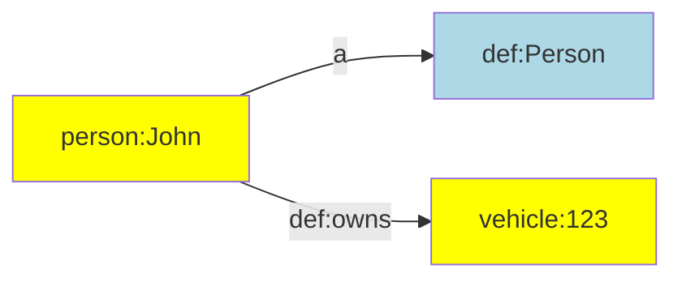

This page documents how you can declare prefixes, graph names, vocabulary terms, and constants that you can use in the rest of your ETL configuration.


## Prefix declarations

Linked data uses IRIs for uniquely identifying most data items. Since IRIs can be long and complex, it is a best practice to declare short aliases that can be used to abbreviate them. Such aliases are introduced in prefix declarations.

The function for declaring prefixes can be imported from the generic TriplyETL library:

```ts
import { declarePrefix } from '@triplyetl/etl/generic'
```

The following function introduces `ALIAS` as shorthandnotation for `IRI_PREFIX`:

```ts
const base = declarePrefix('https://example.com/')
```

Once an alias has been declared, future declarations can make use of that alias to extend it:

```ts
const id = declarePrefix(base('id/'))
```

Notice that it is common practice to end every IRI prefix in a forward slash.

It is common to make declarations for the full IRI strategy in one place, with an intent to reuse them through the ETL configuration. To distinguish prefix declarations from other declarations, it is best practice to put all prefix declaration that will be used in transformations and assertions into an single object called `prefix`:

```ts
const base = declarePrefix('https://example.com/')
const id = declarePrefix(base('id/'))
const prefix = {
  person: declarePrefix(id('person/')),
  def: declarePrefix(base('model/def/')),
  vehicle: declarePrefix(id('vehicle/')),
}
```

Notice that `base` and `id` are not intended to be used in transformations or assertions, but are only used to declare other prefixes that are used.

With the above declarations in place, the following IRI assertion can be made:

```ts
iri(prefix.person, 'name')
iri(prefix.person, str('John')),
iri(prefix.vehicle, 'id')
iri(prefix.vehicle, str('123')),
```

See assertion functions [iri()](/docs/triply-etl/assert/ratt#iri) and [str()](/docs/triply-etl/assert/ratt#str) for more information.


### External prefix declarations

In linked data it is common to reuse existing vocabularies and datasets. TriplyETL allows you to use popular namespaces from predefined prefix declarations.

Popular namespaces are imported from the vocabulary library:

```ts
import { prefix } from '@triplyetl/etl/vocab'
```

For example, you can use the prefix declaration for DBpedia resources as follows:

```ts
iri(prefix.dbr, 'cityName'),
```

This may create IRIs like the following:

```iri
http://dbpedia.org/resource/Amsterdam
http://dbpedia.org/resource/Berlin
```


### Vocabulary declarations

Vocabularies are collections of IRIs that have the same namespace. The namespace can be declared with a prefix (see [Prefix declarations](#prefix-declarations)). We use the following prefix declaration as the namespace for our vocabulary:

```ts
const base = declarePrefix('https://example.com/')
const prefix = {
  def: declarePrefix(base('model/def/')),
}
```

Individual terms in the vocabulary can be declared by using the declaration of the namespace as a function:

```ts
prefix.def('Person')
prefix.def('Vehicle')
prefix.def('knows')
prefix.def('owns')
```

These are equivalent to the following full IRIs:

```iri
https://example.com/model/def/Person
https://example.com/model/def/Vehicle
https://example.com/model/def/knows
https://example.com/model/def/owns
```

It is best practice to place IRI terms that belong to the same vocabulary or namespace in an object:

```ts
const def = {
  Person: prefix.def('Person'),
  Vehicle: prefix.def('Vehicle'),
  knows: prefix.def('knows'),
  owns: prefix.def('owns'),
}
```

With the above declarations in place, we can now make the following assertions:

```ts
pairs(iri(prefix.person, 'name'),
  [a, def.Person],
  [def.owns, iri(prefix.vehicle, 'id')],
),
```

This results in the following linked data:

```ttl
person:John
  a def:Person;
  def:owns vehicle:123.
```

Or diagrammatically:




### External vocabulary declarations

In linked data it is common to reuse existing vocabularies. Popular vocabularies can be imported from the TriplyETL vocabulary library:

```ts
import { a, foaf, owl } from '@triplyetl/etl/vocab'
```

This allows you to make the following assertions:

```ts
triple(foaf.Person, a, owl.Class),
```

This results in the following linked data:

```turtle
foaf:Person a owl:Class.
```

Notice that the notation in TriplyETL comes very close to the notation in Turtle/TriG/SPARQL that is familiar to linked data users.


### Custom abbreviations

The custom abbreviation `a` is available in the popular Turtle/TriG/SPARQL languages. TriplyETL allows you to introduce this custom abbreviation from the vocabulary library:

```ts
import { a } from '@triplyetl/etl/vocab'
```

In Turtle/TriG syntax this abbreviation is only allowed to be used in the predicate position. This restriction is not enforced in TriplyETL, where you can use the `a` abbreviation in the subject, predicate, object, and even graph position.

You can introduce your own custom abbreviations as needed. For example, the following code snippet introduces `is_a` as a custom abbreviation for the IRI `rdfs:subClassOf`:

```ts
import { foaf, rdfs } from '@triplyetl/etl/vocab'
const is_a = rdfs.subClassOf
```

This allows you to write the following assertion:

```ts
triple(foaf.Person, is_a, foaf.Agent),
```

This may make assertions more readable for users from certain domains. For example, "is a" is a commonly use phrase [in many other modeling languages](https://en.wikipedia.org/wiki/Is-a) to denote the subsumption relation.


### Instance declarations

The same approach that is used for [vocabulary declarations](#vocabulary-declarations) can also be used for instance declarations.

The following example introduces constants for individual persons:

```ts
const person = {
  jane: prefix.person('Jane'),
  john: prefix.person('John'),
  mary: prefix.person('Mary'),
}
```

Instance declarations are used in assertions similar to how vocabulary declarations as used:

```ts
triple(person.john, def.knows, person.mary),
```


### Graph name declarations

A linked dataset contains one or more graphs. Each graph can be given a name. It is common practice to declare a fixed set of graph names that will be used throughout the TriplyETL configuration.

The following code snippet declares graph names for graphs that store metadata, model, and instances:

```ts
import { declarePrefix } from '@triplyetl/etl/generic'

const id = declarePrefix('https://example.com/id/')
const prefix = {
  graph: declarePrefix(id('graph/')),
}

const graph = {
  metadata: prefix.graph('metadata'),
  model: prefix.graph('model'),
  instances: prefix.graph('instances'),
}
```

The declared graph names can now be used in assertions:

```ts
triples(graph.metadata,
  ['_dataset', a, dcat.Dataset],
  ['_dataset', rdfs.label, str('My Dataset')],
),
```

See assertion function [triples()](/docs/triply-etl/assert/ratt#triples) for more information.


# Language declarations

Commonly used language tags can be imported in the following way:

```ts
import { lang } from '@triplyetl/etl/vocab'
```

These language declarations can be used to add language-tagged strings to the Record:

```ts
addLiteral({
  content: 'label',
  languageTag: lang.fr,
  key: '_languageTaggedString',
}),
```

Or they can be used to directly assert language-tagged strings in the Internal Store:

```ts
triple('_city', rdfs.label, literal('label', lang.fr)),
```

See transformation function [addLiteral()](/docs/triply-etl/transform#addliteral) and assertion function [literal()](/docs/triply-etl/assert#literal) for more information.


# Geospatial declarations

IRIs that denote commonly used coordinate reference systems can be imported from the `epsg` object:

```ts
import { geojsonToWkt } from '@triplyetl/etl/ratt'
import { epsg } from '@triplyetl/etl/vocab'
```

Such IRIs that denote coordinate reference systems can be used in several geospatial functions, for example in transformation function [geojsonToWkt()](/docs/triply-etl/transform/ratt#geojsontowkt):

```ts
geojsonToWkt({
  content: 'geojson',
  crs: epsg[28992],
  key: '_wkt',
}),
```
