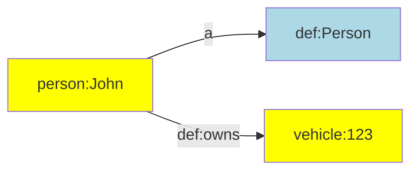

This page documents how you can declare prefixes, graph names, vocabulary terms, and constants that you can use in the rest of your ETL configuration.


# Prefix declarations {#declarePrefix}

Linked data uses IRIs for uniquely identifying most data items. Since IRIs can be long and complex, it is a best practice to declare short aliases that can be used to abbreviate them. Such aliases are introduced in prefix declarations.

The function for declaring prefixes can be imported from the generic TriplyETL library:

```ts
import { declarePrefix } from '@triplyetl/etl/generic'
```

The following function introduces `ALIAS` as shorthandnotation for `IRI_PREFIX`:

```ts
const base = declarePrefix('https://example.com/')
```

Once an alias has been declared, future declarations can make use of that alias to extend it:

```ts
const id = declarePrefix(base('id/'))
```

Notice that it is common practice to end every IRI prefix in a forward slash.

It is common to make declarations for the full IRI strategy in one place, with an intent to reuse them through the ETL configuration. To distinguish prefix declarations from other declarations, it is best practice to put all prefix declaration that will be used in transformations and assertions into an single object called `prefix`:

```ts
const base = declarePrefix('https://example.com/')
const id = declarePrefix(base('id/'))
const prefix = {
  person: declarePrefix(id('person/')),
  def: declarePrefix(base('model/def/')),
  vehicle: declarePrefix(id('vehicle/')),
}
```

Notice that `base` and `id` are not intended to be used in transformations or assertions, but are only used to declare other prefixes that are used.

With the above declarations in place, the following IRI assertion can be made:

```ts
iri(prefix.person, 'name')
iri(prefix.person, str('John')),
iri(prefix.vehicle, 'id')
iri(prefix.vehicle, str('123')),
```

See assertion functions [iri()](/docs/triply-etl/assert/ratt#iri) and [str()](/docs/triply-etl/assert/ratt#str) for more information.


# External prefix declarations

In linked data, it is common to reuse existing vocabularies and datasets. TriplyETL allows you to use popular namespaces from predefined prefix declarations.

Popular namespaces are imported from the vocabulary library:

```ts
import { prefix } from '@triplyetl/etl/vocab'
```

For example, you can use the prefix declaration for DBpedia resources as follows:

```ts
iri(prefix.dbr, 'cityName')
```

This may create IRIs like the following:

```turtle
http://dbpedia.org/resource/Amsterdam
http://dbpedia.org/resource/Berlin
```

You can use the prefix declaration for XML Schema Datatypes as follows:

```ts
literal('cityName', xsd.string)
```

This may create literals like the following:

```turtle
'Amsterdam'^^xsd:string
'Berlin'^^xsd:string
```


# Vocabulary declarations {#vocabulary}

Vocabularies are collections of IRIs that have the same namespace. The namespace can be declared with a prefix (see [Prefix declarations](#prefix-declarations)). We use the following prefix declaration as the namespace for our vocabulary:

```ts
const base = declarePrefix('https://example.com/')
const prefix = {
  def: declarePrefix(base('model/def/')),
}
```

Individual terms in the vocabulary can be declared by using the declaration of the namespace as a function:

```ts
prefix.def('Person')
prefix.def('Vehicle')
prefix.def('knows')
prefix.def('owns')
```

These are equivalent to the following full IRIs:

```iri
https://example.com/model/def/Person
https://example.com/model/def/Vehicle
https://example.com/model/def/knows
https://example.com/model/def/owns
```

It is best practice to place IRI terms that belong to the same vocabulary or namespace in an object:

```ts
const def = {
  Person: prefix.def('Person'),
  Vehicle: prefix.def('Vehicle'),
  knows: prefix.def('knows'),
  owns: prefix.def('owns'),
}
```

With the above declarations in place, we can now make the following assertions:

```ts
pairs(iri(prefix.person, 'name'),
  [a, def.Person],
  [def.owns, iri(prefix.vehicle, 'id')],
),
```

This results in the following linked data:

```ttl
person:John
  a def:Person;
  def:owns vehicle:123.
```

Or diagrammatically:




# External vocabularies {#external-vocabularies}

In linked data, it is common to reuse existing vocabularies. Popular vocabularies can be imported from the TriplyETL vocabulary library:

```ts
import { a, foaf, owl, premis } from '@triplyetl/etl/vocab'
```

This allows you to make the following assertions:

```ts
triple(foaf.Person, a, owl.Class),
```

This results in the following linked data:

```turtle
foaf:Person a owl:Class.
```

Notice that the notation in TriplyETL comes very close to the notation in Turtle/TriG/SPARQL that is familiar to linked data users.

The following code snippet uses the specialized PREMIS 3.0.0 vocabulary. This vocabulary is published by the Library of Congress and is used to publish metadata about the preservation of digital objects. The following code snippet asserts that a PREMIS file is stored in a PREMIS storage location:

```ts
pairs(iri(id, 'some-file'),
  [a, premis.File],
  [premis.storedAt, iri(id, 'some-location')],
),
triple(iri(id, 'some-location'), a, premis.StorageLocation),
```


# Custom abbreviations

The custom abbreviation `a` is available in the popular Turtle/TriG/SPARQL languages. TriplyETL allows you to introduce this custom abbreviation from the vocabulary library:

```ts
import { a } from '@triplyetl/etl/vocab'
```

In Turtle/TriG syntax this abbreviation is only allowed to be used in the predicate position. This restriction is not enforced in TriplyETL, where you can use the `a` abbreviation in the subject, predicate, object, and even graph position.

You can introduce your own custom abbreviations as needed. For example, the following code snippet introduces `is_a` as a custom abbreviation for the IRI `rdfs:subClassOf`:

```ts
import { foaf, rdfs } from '@triplyetl/etl/vocab'
const is_a = rdfs.subClassOf
```

This allows you to write the following assertion:

```ts
triple(foaf.Person, is_a, foaf.Agent),
```

This may make assertions more readable for users from certain domains. For example, "is a" is a commonly use phrase [in many other modeling languages](https://en.wikipedia.org/wiki/Is-a) to denote the subsumption relation.


# Instance declarations

The same approach that is used for [vocabulary declarations](#vocabulary-declarations) can also be used for instance declarations.

The following example introduces constants for individual persons:

```ts
const person = {
  jane: prefix.person('Jane'),
  john: prefix.person('John'),
  mary: prefix.person('Mary'),
}
```

Instance declarations are used in assertions similar to how vocabulary declarations as used:

```ts
triple(person.john, def.knows, person.mary),
```


# Graph name declarations

A linked dataset contains one or more graphs. Each graph can be given a name. It is common practice to declare a fixed set of graph names that will be used throughout the TriplyETL configuration.

The following code snippet declares graph names for graphs that store metadata, model, and instances:

```ts
import { declarePrefix } from '@triplyetl/etl/generic'

const id = declarePrefix('https://example.com/id/')
const prefix = {
  graph: declarePrefix(id('graph/')),
}

const graph = {
  metadata: prefix.graph('metadata'),
  model: prefix.graph('model'),
  instances: prefix.graph('instances'),
}
```

The declared graph names can now be used in assertions:

```ts
triples(graph.metadata,
  ['_dataset', a, dcat.Dataset],
  ['_dataset', rdfs.label, str('My Dataset')],
),
```

See assertion function [triples()](/docs/triply-etl/assert/ratt#triples) for more information.


# Language declarations

Commonly used language tags can be imported in the following way:

```ts
import { lang } from '@triplyetl/etl/vocab'
```

These language declarations can be used to add language-tagged strings to the Record:

```ts
addLiteral({
  content: 'label',
  languageTag: lang.fr,
  key: '_languageTaggedString',
}),
```

Or they can be used to directly assert language-tagged strings in the Internal Store:

```ts
triple('_city', rdfs.label, literal('label', lang.fr)),
```

See transformation function [addLiteral()](/docs/triply-etl/transform#addliteral) and assertion function [literal()](/docs/triply-etl/assert#literal) for more information.


# Geospatial declarations

IRIs that denote commonly used coordinate reference systems can be imported from the `epsg` object:

```ts
import { geojsonToWkt } from '@triplyetl/etl/ratt'
import { epsg } from '@triplyetl/etl/vocab'
```

Such IRIs that denote coordinate reference systems can be used in several geospatial functions, for example in transformation function [geojsonToWkt()](/docs/triply-etl/transform/ratt#geojsontowkt):

```ts
geojsonToWkt({
  content: 'geojson',
  crs: epsg[28992],
  key: '_wkt',
}),
```

# Supported vocabularies
Below is a list of vocabularies, currently supported in TriplyETL/vocabularies

| Name | Version | Use cases | Description |
| --- | --- | --- | --- |
| Argument Model Ontology (AMO) | 1.0 | Fake news detection, argumentation structure | An ontology for describing argumentation according to Toulmin's argumentation model. |
| Bibliographic Ontology Specification (BIBO) | no version | Libraries, citation graphs, bibliography | The Bibliographic Ontology Specification provides main concepts and properties for describing citations and bibliographic references (i.e. quotes, books, articles, etc) on the Semantic Web. |
| Building Topology Ontology (BOT) | 0.3.2 | Buildings | The Building Topology Ontology (BOT) is a minimal ontology for describing the core topological concepts of a building.|
| Brick: A uniform metadata schema for buildings | no version | Buildings | Brick is an open-source effort to standardize semantic descriptions of the physical, logical and virtual assets in buildings and the relationships between them. |
| Cultural Heritage Ontology (CEO) | 1.41 | Cultural heritage | The CEO is the complete semantic representation of the logical data models CHO and KENNIS from the data layer of the RCE. |
| Conceptual Reference Model (CRM) | 7.1.2 | Cultural heritage | The CIDOC Conceptual Reference Model (CRM) provides definitions and a formal structure for describing the implicit and explicit concepts and relationships used in cultural heritage documentation. |
| CRM Digital | no version | digitization products | An ontology and RDF Schema to encode metadata about the steps and methods of production (“provenance”) of digitization products and synthetic digital representations such as 2D, 3D or even animated Models created by various technologies.  Its distinct features compared to competitive models is the complete inclusion of the initial physical measurement processes and their parameters. |
| DBpedia Ontology | 1.0.0 | DBpedia | Ontology for DBpedia |
| Data Catalog Vocabulary (DCAT) | 2.0.0 | data catalogs, datasets | DCAT is an RDF vocabulary designed to facilitate interoperability between data catalogs published on the Web. | 
| Dublin Core Type Vocabulary | 2012-06-14 | classes | The DCMI Type Vocabulary was created in 2001.  It defines classes for basic types of thing that can be described using DCMI metadata terms. |
| Dublin Core Terms | 1.1.0 | metadata terms | This document is an up-to-date specification of all metadata terms maintained by the Dublin Core Metadata Initiative, including properties, vocabulary encoding schemes, syntax encoding schemes, and classes. |
| Document Components Ontology (DoCo) | 1.3.0 | document components | The Document Components Ontology (DoCO) in an ontology that provides a structured vocabulary written of document components, both structural (e.g., block, inline, paragraph, section, chapter) and rhetorical (e.g., introduction, discussion, acknowledgements, reference list, figure, appendix). |
| ERA Vocabulary | 2022-02-02 | railway infrastructure | Vocabulary defined by the European Union Agency for Railways to describe the concepts and relationships related to the European railway infrastructure and the vehicles authorized to operate over it. |
| FRBR-aligned Bibliographic Ontology (FaBiO) | no version | publishing, bibliography, textual publications| An ontology for recording and publishing on the Semantic Web descriptions of entities that are published or potentially publishable, and that contain or are referred to by bibliographic references, or entities used to define such bibliographic references. |
| Friend of a Friend (FOAF) | 0.1.0 | people, information | FOAF is a project devoted to linking people and information using the Web.  Regardless of whether information is in people's heads, in physical or digital documents, or in the form of factual data, it can be linked.  FOAF integrates three kinds of network: social networks of human collaboration, friendship and association; representational networks that describe a simplified view of a cartoon universe in factual terms, and information networks that use Web-based linking to share independently published descriptions of this inter-connected world.  FOAF does not compete with socially-oriented Web sites; rather it provides an approach in which different sites can tell different parts of the larger story, and by which users can retain some control over their information in a non-proprietary format. |
| Functional Requirements for Bibliographic Records (FRBR) | 2005-08-10 | bibliography | This vocabulary is an expression in RDF of the concepts and relations described in the IFLA report on the Functional Requirements for Bibliographic Records (FRBR). |
| GeoSPARQL | no version | geospatial data | The OGC GeoSPARQL standard supports representing and querying geospatial data on the Semantic Web.  GeoSPARQL defines a vocabulary for representing geospatial data in RDF, and it defines an extension to the SPARQL query language for processing geospatial data.  In addition, GeoSPARQL is designed to accommodate systems based on qualitative spatial reasoning and systems based on quantitative spatial computations. |
| Geography Markup Language (GML) Encoding Standard | 3.2.1 | geography | XML grammar for expressing geographical features.  GML serves as a modeling language for geographic systems as well as an open interchange format for geographic transactions on the Internet. |
| Getty Vocabulary Program (GVP) | 3.3.0 | 

