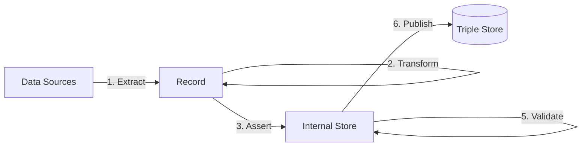

The **Enrich** step uses linked data that is asserted in the Internal Store to derive new linked data.

If you do not have linked data in your internal store yet, then first perform one of the following steps:
- **1. Extract** allows you to load linked data into your internal store directly, using the [loadRdf()](/docs/triply-etl/extract/formats#loadRdf) function.
- [3. **Assert**](/docs/triply-etl/assert) uses entries from your record to make linked data assertions into your internal store.

TriplyETL supports the following enrichment approaches:

- 4A. [**SHACL Rules**](/docs/triply-etl/enrich/shacl) are able to apply SPARQL Ask and Construct queries to the internal store.
- 4B. [**SPARQL Update**](/docs/triply-etl/enrich/sparql) allows linked data to be added to and deleted from the internal store.
