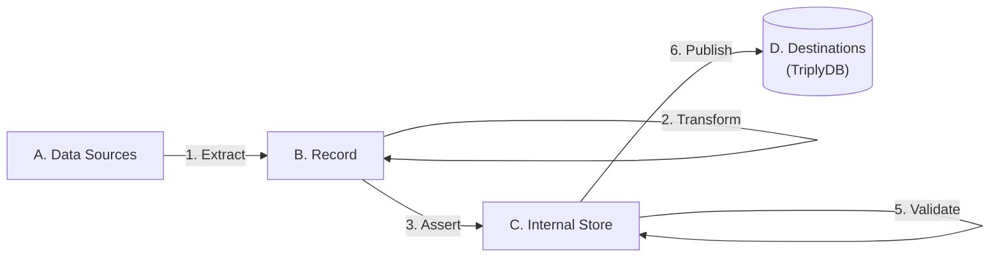

[TOC]

# Enrich

The **Enrich** step uses linked data that is asserted in the [internal store](../generic/internal-store.md) to derive new linked data.

TriplyETL supports the following languages for making enrichments:

- [**SHACL Rules**](./shacl.md) are able to apply SPARQL Ask and Construct queries to the internal store.
- [**SPARQL Construct**](./sparql/construct.md) allows linked data to be added to the internal store.
- [**SPARQL Update**](./sparql/update.md) allows linked data to be added to and deleted from the internal store.

## See also

If you have not loaded any linked data in your Internal Store yet, use one of the following approaches to do so:

- [loadRdf()](../extract/rdf.md)
- [JSON-LD Expansion](../assert/json-ld.md)
- The RATT [statement assertion](../assert/ratt/statements.md) functions.
