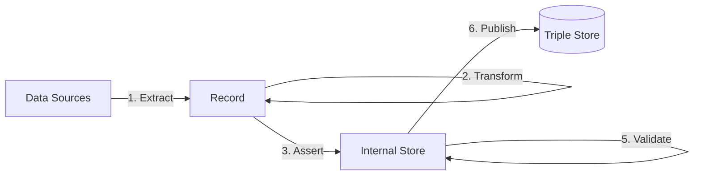

[TOC]

# Enrich

The **Enrich** step uses linked data that is asserted in the Internal Store to derive new linked data.

## Overview

TriplyETL supports the following enrichment approaches:

- 4A. [**SHACL Rules**](shacl) are able to apply SPARQL Ask and Construct queries to the internal store.
- 4B. [**SPARQL Construct and SPARQL Update**](sparql) allow linked data to be added to and deleted from the internal store.

## See also

If you have not loaded any linked data in your Internal Store yet, use one of the following approaches to do so:

- [loadRdf()](../extract/formats#function-loadrdf)
- [JSON-LD Expansion](../assert/json-ld/index.md)
- The RATT [statement assertion](../assert/ratt/statement.md) functions.
