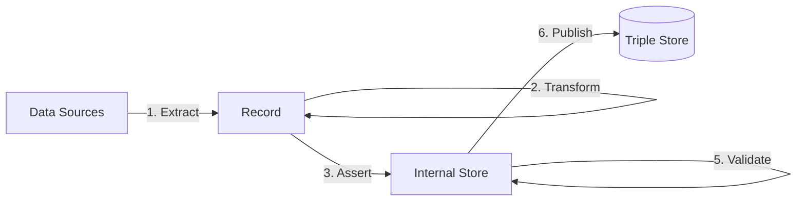

The Enrich step uses linked data that is asserted in the internal store (see [Assert](/docs/triply-etl/assert/overview)) to derive new linked data.

TriplyETL supports the following enrichment approaches:

- [SHACL Rules](/docs/triply-etl/enrich/shacl) are able to apply SPARQL Ask and Construct queries to the internal store.
- [SPARQL Update](/docs/triply-etl/enrich/sparql) allows linked data to be added to and deleted from the internal store.
