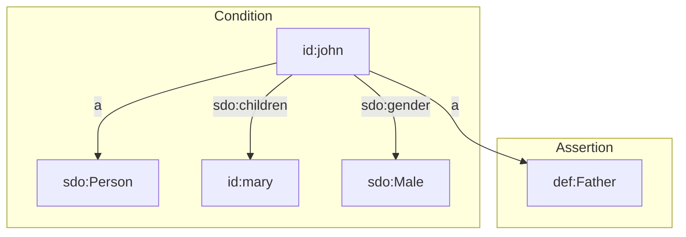

SHACL Rules allow new data to be asserted based on existing data patterns. This makes them a great approach for data enrichment. Since SHACL Rules can be defined as part of the data model, it is one of the best approaches for creating and maintaining business rules in complex domains.

SHACL Rules are applied to the linked data that is currently present in the internal store. The order in which rules are evaluated can be specified in terms of dynamic preconditions, or in terms of a predefined order.

The SHACL Rules engine in TriplyETL processes rules iteratively. This supports rules whose execution depends on the outcome of other rules. Triply observes that this iterative functionality is often necessary for complex production systems in which SHACL Rules are applied.

See the [enrichment step overview page](/docs/triply-etl/enrich) for other enrichment approaches.

## Prerequisites

SHACL Rules can be used when the following preconditions are met:

1. A data model that uses SHACL Rules.
2. Some data must be asserted in the internal store. If your internal store is still empty, you can read [the Assert documentation](/docs/triply-etl/assert) on how to add assertions to that store.

The function for executing SHACL Rules is imported as follows:

```ts
import { executeRules } from '@triplyetl/etl/shacl'
```

TriplyETL supports two kinds of SHACL Rules: Triple Rules and SPARQL Rules. The rest of this page describes two complete examples of the use of SHACL Rules: the first one uses Triple Rules, and the second uses SPARQL Rules.

## A complete example with Triple Rules

This section describes a complete example that makes use of Triple Rules. These are SHACL Rules that assert exactly one triple. Every rule that can be implemented with Triple Rules can also be implemented with SPARQL Rules, but Triple Rules sometimes simpler to use, since they do not require knowledge of the SPARQL language.

### Step 1: Load instance data {#stepA1}

We first need to load some instance data, so that we can apply a rule and enrich the loaded data with some new data. We use linked data assertions that state that John is a person, who has a child (Mary), and whose gender is male:

```turtle
base <https://triplydb.com/>
prefix sdo: <https://schema.org/>
<john>
  a sdo:Person;
  sdo:children <mary>;
  sdo:gender sdo:Male.
```

Applying our knowledge of the world, we can deduce from that instance data that John is also a father. This can also be expressed in linked data:

```turtle
base <https://triplydb.com/>
<john> a <Father>.
```

When we make this deduction, we are applying a (possibly implicit) rule. When we try to make the rule that we have applied explicit, we discover that a rule has the following two components:

- The **condition** is are the criteria that must be met in order for the rule to become applicable. In our example, we must have instance data about a person. That person must have at least one child. That person must be male. Notice that the condition can be made arbitrarily complex: we can add more criteria like age, nationality, etc. if we wanted to.
- The **assertion** is the new data that we can add to our internal store. In our example, this is the assertion that John is a father.

We can show this principle in a diagram, where *condition* and *assertion* contain the two components of the rule:



### Step 2. Formulate the SHACL rule {#stepA2}

In Step 1 we applied a rule to the instance John. But our dataset may contain information about many other people too: people with or without children, people with different genders, etc.

Suppose our dataset contains information about Peter, who has two children and has the male gender. We can apply the same rule to deduce that Peter is also a father.

When we apply the same rule to an arbitrary number of instances, we are applying a principle called 'generalization'. We replace information about instance like 'John' and 'Peter' with a generic class such as 'Person'.

When we think about it, the generalized rule that we have applied to John and Peter, and that we can apply to any number of individuals, is as follows:

> Persons with at least one child and the male gender, are fathers.

We can formalize this general rule in the following SHACL snippet:

```turtle
base <https://triplydb.com/>
prefix rdf: <http://www.w3.org/1999/02/22-rdf-syntax-ns#>
prefix sdo: <https://schema.org/>
prefix sh: <http://www.w3.org/ns/shacl#>
<Person>
  sh:targetClass sdo:Person;
  sh:rule
    [ a sh:TripleRule;
      sh:condition
        [ sh:property
            [ sh:path sdo:children;
              sh:minCount 1 ] ];
      sh:condition
        [ sh:property
            [ sh:path sdo:gender;
              sh:hasValue sdo:Male ] ];
      sh:subject sh:this;
      sh:predicate rdf:type;
      sh:object <Father> ].
```

Notice the following details:
- The rule only applies to persons, i.e. instance of the class `sdo:Person`. This is expressed by the `sh:targetClass` property.
- The first condition of the rule is that the person must have at least one child. This is expressed by `sh:condition` and `sh:minCount`.
- The second condition of the rule is that the gender of the person is male. This is expressed by `sh:condition` and `sh:hasValue`.
- The assertion is that the person is a father. Since we use a Triple Rule, this is expressed by the properties `sh:subject`, `sh:predicate`, and `sh:object`.
- Notice that the term `sh:this` is used to refer to individuals for whom all conditions are met (in our example: John).

### Step 3: Write and run the script

We can store the instance data (i.e., the first linked data snippet in [Step 1](#stepA1)) in a file called `instances.trig`, and we can store the model (i.e., the linked data snippet in [Step 2](#stepA2)) in a file called `model.trig`.

We then need the following TriplyETL script to (1) load the instance data, (2) execute the rules specified in the model, and (3) print the contents of the internal store to standard output:

```ts
import { logQuads } from '@triplyetl/etl/debug'
import { Etl, Source, loadRdf } from '@triplyetl/etl/generic'
import { executeRules } from '@triplyetl/etl/shacl'

export default async function (): Promise<Etl> {
  const etl = new Etl()
  etl.use(
    loadRdf(Source.file('instances.trig')),
    executeRules(Source.file('rules.trig')),
    logQuads(),
  )
  return etl
}
```

When we run this script (command `npx etl`), the following linked data is logged to standard output:

```turtle
<john>
  a sdo:Person, <Father>;
  sdo:children <mary>;
  sdo:gender sdo:Male.
```

Notice that the fatherhood assertion was correctly added to the internal store, based on the SHACL rule in the data model.

## A complete example with SPARQL Rules

This section describes a complete example that makes use of SPARQL Rules. These are SHACL Rules that assert an arbitrary number of triples. Every rule that can be implemented with Triple Rules, can also be implemented with SPARQL Rules.

We use the same instance data as in [Step 1 of the Triple Rules example](#stepA1).

We formalize the general rule that was formalized in [Step 2 of the Triple Rules example](#stepA2) as follows:

```turtle
base <https://triplydb.com/>
prefix sdo: <https://schema.org/>
prefix sh: <http://www.w3.org/ns/shacl#>
<Person>
  sh:targetClass sdo:Person;
  sh:rule
    [ a sh:SPARQLRule;
      sh:construct '''
base <https://triplydb.com/>
prefix sdo: <https://schema.org/>
construct {
  $this a <Father>.
} where {
  $this
    sdo:children [];
    sdo:gender sdo:Male.
}''' ].
```

Notice the following details:
- The two conditions are specified in the Where-clause.
- The assertion is specified in the Construct-clause.
- The SPARQL Construct query uses triple quoted literals notation (`'''...'''`), which allows newlines to appear without escaping in linked data.
- The SPARQL variable `$this` has special meaning: it binds to the targets of the SHACL node shape (i.e. instances of `sdo:Person`).

The TriplyETL script is identical to the one used in the Triple Rules example:

```ts
import { logQuads } from '@triplyetl/etl/debug'
import { Etl, Source, loadRdf } from '@triplyetl/etl/generic'
import { executeRules } from '@triplyetl/etl/shacl'

export default async function (): Promise<Etl> {
  const etl = new Etl()
  etl.use(
    loadRdf(Source.file('instances.trig')),
    executeRules(Source.file('rules.trig')),
    logQuads(),
  )
  return etl
}
```

When we run this script (command `npx etl`), the linked data results are also the same:

```turtle
<john>
  a sdo:Person, <Father>;
  sdo:children <mary>;
  sdo:gender sdo:Male.
```

Notice that the fatherhood assertion was correctly added to the internal store, based on the SHACL rule in the data model.

## Another example using SPARQL Rules

In this example, we start out with a data source that is not linked data:

```json
{ "age": 20, "name": "ann" },
{ "age": 12, "name": "peter" },
```

We use the [fromJson()](/docs/triply-etl/extract/formats#fromJson) extractor and specify the source data [inline](/docs/triply-etl/extract/types#inline-json). We use RATT assertion function [pairs()](/docs/triply-etl/assert/ratt#pairs) to add linked data to the internal store.

```ts
import { logQuads } from '@triplyetl/etl/debug'
import { Etl, Source, declarePrefix, fromJson } from '@triplyetl/etl/generic'
import { iri, pairs } from '@triplyetl/etl/ratt'
import { executeRules } from '@triplyetl/etl/shacl'
import { a, foaf } from '@triplyetl/etl/vocab'

const id = declarePrefix('https://triplydb.com/')

export default async function (): Promise<Etl> {
  const etl = new Etl()
  etl.use(
    fromJson([
      { age: 20, name: 'ann' },
      { age: 12, name: 'peter' },
    ]),
    pairs(iri(id, 'name'),
      [a, foaf.Person],
      [foaf.age, 'age'],
    ),
    executeRules(Source.file('model.trig')),
    logQuads(),
  )
  return etl
}
```

The model (file `model.trig`) makes use of a SPARQL Rule, to assert that persons who are at least 18 years old are adults:

```turtle
base <https://triplydb.com/>
prefix foaf: <http://xmlns.com/foaf/0.1/>
prefix sh: <http://www.w3.org/ns/shacl#>

<Person>
  sh:targetClass foaf:Person;
  sh:rule
    [ a sh:SPARQLRule;
      sh:prefixes <>;
      sh:construct '''
construct {
  $this a ex:Adult.
} where {
  $this foaf:age ?age.
  filter(?age >= 18)
}''' ].
```

Notice that the SPARQL query string (the value of `sh:construct`) does not declare the `ex:` and `foaf:` prefixes. Instead, the rule refers to generic declarations (with property `sh:prefixes`) that occur later in the `model.trig` file:

```turtle
<>
  sh:declare
    [ sh:namespace <https://triplydb.com/>;
      sh:prefix 'ex' ],
    [ sh:namespace <http://xmlns.com/foaf/0.1/>;
      sh:prefix 'foaf' ].
```

This notation allows the same prefix declarations to be reused by an arbitrary number of SPARQL Rules.
