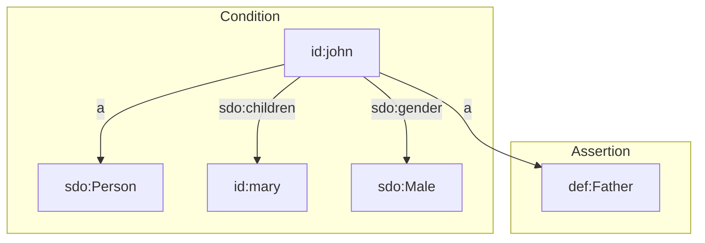

SHACL Rules allow new data to be asserted based on existing data patterns. This makes them a great approach for data enrichment. Since SHACL Rules can be defined as part of the data model, it is one of the best approaches for creating and maintaining business rules in complex domains.

SHACL Rules are applied to the linked data that is currently present in the internal store. The order in which rules are evaluated can be specified in terms of preconditions and/or in terms of a predefined order.

The SHACL Rules engine in TriplyETL processed rules iteratively. This allows the specification of rules that depend on the outcome of other rules. Triply observes that this iterative functionality is necessary in many domains where SHACL Rules are applied.

## How to write SHACL Rules?

TriplyETL supports two kinds of SHACL Rules: Triple Rules and SPARQL Rules.

To better illustrate the concept, let's consider a scenario where we have data on vehicles, including the triple that specifies their top speed. Now, imagine we want to add additional information to our dataset, specifically identifying cars with a top speed greater than 100 as "fast cars." The most straightforward approach to accomplish this is by utilizing triple rules.

In the following examples, in the SHACL file we define a class and node shape named `ex:Vehicle`, representing vehicles within our dataset. The node shape already includes the property `ex:topSpeed` in the internal store. However, if a vehicle's top speed exceeds 100 (as indicated by `sh:minExclusive 100`), we aim to enhance it by adding an extra property, `ex:isFast`, with the value of "true" represented as a boolean. As mentioned above, we can do this by either using `Triple rules` or `SPARQL rules`

## A simple use case

The follow linked data snippet states that John is a male who has a child:

```turtle
prefix def: <https://triplydb.com/Triply/example/model/def/>
prefix id: <https://triplydb.com/Triply/example/id/>
prefix sdo: <https://schema.org/>

id:john
  a sdo:Person;
  sdo:children id:mary;
  sdo:gender sdo:Male.
```

From this we can deduce that John is a father:

```turtle
prefix def: <https://triplydb.com/Triply/example/model/def/>
prefix id: <https://triplydb.com/Triply/example/id/>

id:john a def:Father.
```

We can show this in a diagram, where the *condition* is the the graph pattern that must be present, in order for the *assertion* to be added:



## Formulating a Triple Rule

We can encode the deduction illustrated in the previous section in a SHACL Triple Rule.

We start with some prefix declarations:

```turtle 
prefix def: <https://triplydb.com/Triply/example/model/def/>
prefix rdf: <http://www.w3.org/1999/02/22-rdf-syntax-ns#>
prefix rule: <https://triplydb.com/Triply/example/model/rule/>
prefix sdo: <https://schema.org/>
prefix sh: <http://www.w3.org/ns/shacl#>
prefix shp: <https://triplydb.com/Triply/example/model/shp/>
```

We then need to create a SHACL node shape that targets all instances of `sdo:Person`, including John:

```turtle 
shp:Person
  a sh:NodeShape;
  sh:rule rule:Person_father;
  sh:targetClass sdo:Person.
```

Lastly, we encode the rule that deduces fatherhood:

```turtle
rule:Person_father
  a sh:TripleRule;
  # Condition
  sh:condition
    [ sh:property
        [ sh:path sdo:children;
          sh:minCount 1 ] ];
  sh:condition
    [ sh:property
        [ sh:path sdo:gender;
          sh:hasValue sdo:Male ] ];
  # Assertion
  sh:subject sh:this;
  sh:predicate rdf:type;
  sh:object def:Father.
```

Notice the following details:
- `a sh:TripleRule` indicates that this is a Triple Rule (and not a SPARQL Rule).
- `sh:condition` is used to specify the conditions that must be met in order for the rule to be executed. In the case of multiple conditions, *all* conditions must be satisfied in order to execute the rule.
- `sh:subject`, `sh:predicate`, and `sh:object` are used to specify one single triple that is asserted when the rule executes. This is an inherent limitation of Triple Rules. If you need to assert more than one triple in one rule, you must use a SPARQL Rule instead.
- `sh:this` is a  special value that denotes the targeted term. In our example, the targeted term is `id:john`.

We store the instance data snippet in a file called `instances.trig` and the SHACL snippet in a file called `rules.trig`. We then write the following TriplyETL script in a file called `main.ts`:

```ts
import { logQuads } from "@triplyetl/etl/debug"
import { Etl, Source, loadRdf } from "@triplyetl/etl/generic"
import { executeRules } from "@triplyetl/etl/shacl"

export default async function (): Promise<Etl> {
  const etl = new Etl()
  etl.use(
    loadRdf(Source.file('instances.trig')),
    executeRules(Source.file('rules.trig')),
    logQuads(),
  )
  return etl
}
```

When this script is run with the `npx etl` command, the following linked data is logged to standard output:

```
graph:default {
  id:john a sdo:Person, def:Father;
    sdo:children id:mary;
    sdo:gender sdo:Male.
}
```

Notice that the fatherhood was correctly deduced and asserted by TriplyETL.

### Using `SPARQL Rules`:

```code
prefix foaf: <http://xmlns.com/foaf/0.1/>
prefix rdf:  <http://www.w3.org/1999/02/22-rdf-syntax-ns#>
prefix sh:   <http://www.w3.org/ns/shacl#>
prefix shp:  <https://triplydb.com/Triply/example/model/shp/>
prefix xsd:  <http://www.w3.org/2001/XMLSchema#>

shp:PersonShape
    a sh:NodeShape;
    sh:targetClass foaf:Person;
    sh:property [
        sh:path foaf:age;
        sh:datatype xsd:integer;
        sh:minCount 1;
        sh:maxCount 1;
    ].

shp:PersonRulesShape
    a sh:NodeShape;
    sh:targetClass foaf:Person;
    sh:rule [
        a sh:SPARQLRule;
        sh:prefixes foaf: ;
        sh:construct """
            CONSTRUCT {
                ?this ex:isAdult 'true' .
            }
            WHERE {
                ?this foaf:age ?age .
                FILTER(xsd:integer(?age) > 18)
            }
        """ ;
        sh:condition shp:PersonShape;
    ] .
```

To understand what's happening, let's break down each property within the rule:

- `a sh:NodeShape` indicates that `shp:PersonRulesShape` is an instance of `sh:NodeShape`, which is the SHACL class representing a shape.
- `sh:targetClass foaf:Person` specifies that the shape is applicable to instances of the `foaf:Person` class. It defines the class of the individuals to which the rule applies.
- `sh:rule` defines the rule itself. It is a nested structure representing a rule attached to the shape.

- `a sh:SPARQLRule` Here we specify the type of our rule, either `TripleRule` or `SPARQLRule`. In this case, the type is `SPARQLRule`, since we are using SPARQL pattern.

- `sh:prefixes foaf:` defines the prefixes used within the SPARQL `CONSTRUCT` and `FILTER` clauses. In this case, it sets the prefix `foaf:` for the FOAF namespace.

- `sh:construct` specifies the `CONSTRUCT` query pattern of the rule. It describes the triples that should be created as a result of applying the rule.

- The `CONSTRUCT` clause within the construct pattern states that for each matched triple pattern, a new triple will be created with `?this` (the subject of the matched triple) as the subject, `ex:isAdult` as the predicate, and `'true'` as the object.

- The `WHERE` clause contains the pattern matching condition for the rule. It specifies that for each instance (`?this`), there should exist a triple with `foaf:age` as the predicate and `?age` as the object. Additionally, a filter condition is applied using `FILTER` to ensure that only instances with an age greater than 18 are considered.

- `sh:condition shp:PersonShape` states that the rule is conditioned on the shape `shp:PersonShape`. It means the rule will only be applied to instances conforming to the `shp:PersonShape`.
## How to use SHACL Rules in your ETL?

### Prerequisites

To incorporate and use SHACL Rules in your ETL process, these preconditions have to be met:

1. Include the library `@triplyetl/etl/shacl` in your ETL project:
   
```code
import { executeRules } from '@triplyetl/etl/shacl'
```

2. Call the `executeRules()` function.

By including the mentioned library and invoking the `executeRules()` function, you can effectively invoke and apply SHACL Rules within your ETL workflow.

### A complete example

To demonstrate the use of the `executeRules()` function with SHACL Rules, we employ the following complete TriplyETL script. As the SHACL Information model, along with the SHACL Rules, is relatively compact, it is embedded within the function through the [string source type](/docs/triply-etl/extract/types/#strings). In the case of larger models, it is advisable to store them in a distinct file or within a TriplyDB graph or asset.


```ts
import { Etl, Source, declarePrefix, fromJson, toTriplyDb } from "@triplyetl/etl/generic"
import { iri, pairs } from "@triplyetl/etl/ratt"
import { executeRules } from '@triplyetl/etl/shacl'
import { a, foaf } from "@triplyetl/etl/vocab"

const prefix = {
  id: declarePrefix('https://triplydb.com/Triply/example/id/'),
}

export default async function (): Promise<Etl> {
  const etl = new Etl()
  etl.use(
    fromJson([{ age: 'twenty', id: '1' }]),
    pairs(iri(prefix.id, 'id'),
      [a, foaf.Person],
      [foaf.age, 'age'],
    ),
    executeRules(Source.string(`
      prefix foaf: <http://xmlns.com/foaf/0.1/>
      prefix rdf:  <http://www.w3.org/1999/02/22-rdf-syntax-ns#>
      prefix sh:   <http://www.w3.org/ns/shacl#>
      prefix shp:  <https://triplydb.com/Triply/example/model/shp/>
      prefix xsd:  <http://www.w3.org/2001/XMLSchema#>

      shp:Person
        a sh:NodeShape;
        sh:closed true;
        sh:ignoredProperties ( rdf:type );
        sh:property shp:Person_age;
        sh:targetClass foaf:Person.

      shp:Person_age
        a sh:PropertyShape;
        sh:datatype xsd:nonNegativeInteger;
        sh:maxCount 1;
        sh:minCount 1;
        sh:path foaf:age.

      sh:rule [
        a sh:TripleRule ;
        sh:subject sh:this ;
        sh:predicate ex:isAdult ;
        sh:object "true"^^xsd:boolean ;
        sh:condition foaf:Person ;
        sh:condition [
            sh:property [
                sh:path foaf:age ;
                sh:minExclusive 18 ;
            ] ;
        ] ;
    ] .`
    )),
    toTriplyDb({ dataset: 'test' }),
  )
  return etl
}
```
### Source data

In our example we are using the following source data that records the age of a person:

```code
{
  "age": "twenty",
  "id":  "id"
}
```
In our example the data source is [inline JSON](/docs/triply-etl/extract/types#inline-json), but notice that any source format could have been used:

```code
fromJson([{ age: 'twenty', id: '1' }]),
```


### Target data without `executeRules()` function

Based on the source data in Step 1, without `executeRules()` function we would publish the following linked data in TriplyDB:

```code
id:1
  a foaf:Person;
  foaf:age 'twenty'.
```

### Target data with `executeRules()` function

By applying the `executeRules()` function, an additional triple would be added to the data since the person in the Source data satisfies the condition of being over 18 years old. Consequently, the updated data in TriplyDB would appear as:

```code
id:1
  a foaf:Person;
  foaf:age 'twenty';
  ex:isAdult 'true'.
```