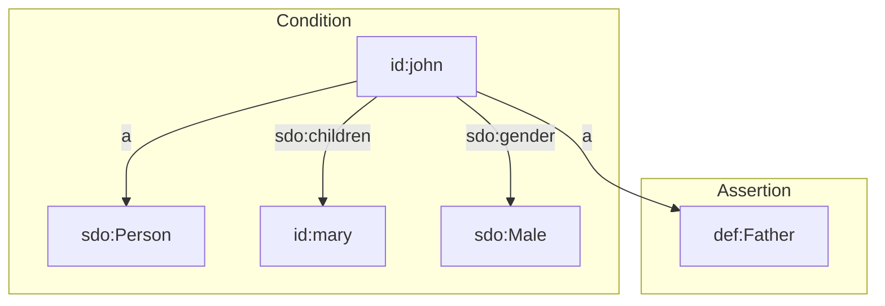

[TOC]

# Triple Rules

Triple Rules are a form of [SHACL Rules](./index.md). Triple Rules can only assert one single triple, but they are relatively easy to learn and apply. Triple Rules have the following benefits and downsides.

Benefits:

- Simple to use if you are familiar with RDF.
- Does not require knowledge of the SPARQL language.
- Integrated with the information model.
- Reflection: the rule can itself be queried as RDF.
- Reflection: the rule can use the prefix declarations that occur in the serialization format of the information model in which it appears (e.g. TriG, Turtle).

Downsides:

- Can only assert one single triple.
- Cannot use the prefix declarations that are represented in the information model (using `sh:namespace` and `sh:prefix`).

The rest of this page describes a complete example that uses Triple Rules.


## Example: Deducing fatherhood

This section describes a full example of a Triple Rule that can deduce that somebody is a father, based on other facts that are known about the person.


### Step 1: Load instance data

We first need to load some instance data, so that we can apply a rule and enrich the loaded data with some new data. We start with linked data assertions that state that John is a male who has a child (Mary):

```turtle
base <https://triplydb.com/>
prefix sdo: <https://schema.org/>

<john>
  a sdo:Person;
  sdo:children <mary>;
  sdo:gender sdo:Male.
```

Applying our knowledge of the world, we as humans can deduce that John is also a father. This deduction can also be expressed in linked data:

```turtle
base <https://triplydb.com/>

<john> a <Father>.
```

When we make this deduction, we are applying a (possibly implicit) rule. When we try to make the rule that we have applied explicit, we discover that a rule has the following two components:

- The **condition** is the criterion that must be met in order for the rule to become applicable. In our example, we must have instance data about a person. That person must have at least one child, and that person must be male. Notice that the condition can be made arbitrarily complex: we can add more criteria like age, nationality, etc. if we wanted to.

- The **assertion** is the new data that we can add to our internal store. In our example, this is the assertion that John is a father.

We can show this principle in a diagram, where *condition* and *assertion* contain the two components of the rule:




### Step 2. Formulate the SHACL rule

In Step 1 we applied a rule to the instance John. But our dataset may contain information about other people too: people with or without children, people with different genders, etc.

Suppose our dataset contains information about Peter, who has two children and has the male gender. We can apply the same rule to deduce that Peter is also a father.

When we apply the same rule to an arbitrary number of instances, we are applying a principle called 'generalization'. We replace information about instances like 'John' and 'Peter' with a generic class such as 'Person'.

When we think about it, the generalized rule that we have applied to John and Peter, and that we can apply to any number of individuals, runs as follows:

> Persons with at least one child and the male gender, are fathers.

We can formalize this generalized rule in the following SHACL snippet:

```turtle
base <https://triplydb.com/>
prefix rdf: <http://www.w3.org/1999/02/22-rdf-syntax-ns#>
prefix sdo: <https://schema.org/>
prefix sh: <http://www.w3.org/ns/shacl#>

<Person>
  sh:targetClass sdo:Person;
  sh:rule
    [ a sh:TripleRule;
      sh:condition
        [ sh:property
            [ sh:path sdo:children;
              sh:minCount 1 ] ],
        [ sh:property
            [ sh:path sdo:gender;
              sh:hasValue sdo:Male ] ];
      sh:subject sh:this;
      sh:predicate rdf:type;
      sh:object <Father> ].
```

Notice the following details:

- The rule only applies to persons, i.e. instances of the class `sdo:Person`. This is expressed by the `sh:targetClass` property.

- The first condition of the rule is that the person must have at least one child. This is expressed by `sh:condition` and `sh:minCount`.

- The second condition of the rule is that the gender of the person is male. This is expressed by `sh:condition` and `sh:hasValue`.

- The assertion is that the person is a father. Since we use a Triple Rule, this is expressed by the properties `sh:subject`, `sh:predicate`, and `sh:object`.

- Notice that the term `sh:this` is used to refer to individuals for whom all conditions are met (in our example: John).


### Step 3: Write and run the script

The following script is completely self-contained. By copy/pasting it into TriplyETL, you can execute the rule over the instance data, and deduce the fact that John is a father.

Notice that the script includes the following components:

  1. Load the instance data from [Step 1](#step-1-load-instance-data) with [loadRdf()](../../extract/rdf.md).
  2. Execute the rule from [Step 2](#step-2-formulate-the-shacl-rule) with [executeRules()](./index.md).
  3. Print the contents of the internal store with [logQuads()](../../generic/debug.md#function-logquads).

```ts
import { logQuads } from '@triplyetl/etl/debug'
import { Etl, Source, loadRdf } from '@triplyetl/etl/generic'
import { executeRules } from '@triplyetl/etl/shacl'

export default async function (): Promise<Etl> {
  const etl = new Etl()
  etl.use(
    loadRdf(Source.string(`
      base <https://triplydb.com/>
      prefix sdo: <https://schema.org/>
      <john>
        a sdo:Person;
        sdo:children <mary>;
        sdo:gender sdo:Male.`)),
    executeRules(Source.string(`
      base <https://triplydb.com/>
      prefix rdf: <http://www.w3.org/1999/02/22-rdf-syntax-ns#>
      prefix sdo: <https://schema.org/>
      prefix sh: <http://www.w3.org/ns/shacl#>
      <Person>
        sh:targetClass sdo:Person;
        sh:rule
          [ a sh:TripleRule;
            sh:condition
              [ sh:property
                  [ sh:path sdo:children;
                    sh:minCount 1 ] ],
              [ sh:property
                  [ sh:path sdo:gender;
                    sh:hasValue sdo:Male ] ];
            sh:subject sh:this;
            sh:predicate rdf:type;
            sh:object <Father> ].`)),
    logQuads(),
  )
  return etl
}
```

When we run this script (command `npx etl`), the following linked data is printed:

```turtle
<john>
  a
    sdo:Person,
    <Father>;
  sdo:children <mary>;
  sdo:gender sdo:Male.
```

Notice that the fatherhood assertion was correctly added to the internal store, based on the Triple Rule in the data model.


### Step 4: Using files (optional)

The script in [Step 3](#step-3-write-and-run-the-script) includes both the instance data and the information model as inline strings, using [Source.string()](../../sources/inline-strings.md). This is great for creating a self-contained example, but not realistic when the number of rules increases.

We therefore show the same script after these inline components have been stored in separate files:

- The instance data is stored in file `static/instances.trig`.
- The information model is stored in file `static/model.trig`.

Now the instance data and information model can be edited in their own files, and the script stays concise:

```ts
import { logQuads } from '@triplyetl/etl/debug'
import { Etl, Source, loadRdf } from '@triplyetl/etl/generic'
import { executeRules } from '@triplyetl/etl/shacl'

export default async function (): Promise<Etl> {
  const etl = new Etl()
  etl.use(
    loadRdf(Source.file('static/instances.trig')),
    executeRules(Source.file('static/model.trig')),
    logQuads(),
  )
  return etl
}
```


## See also

- Use [SPARQL Rules](./sparql-rules.md) for rules that are more complex and that cannot be expressed by Triple Rules.
- Triple Rules are a form of [SHACL Rules](./index.md). SHACL Rules are documented in the [SHACL Advanced Features Working Group Note](https://www.w3.org/TR/shacl-af).
- SHACL Rules are a form of data enrichment. Go to the [enrichment overview page](./index.md) for information about other enrichment approaches.
