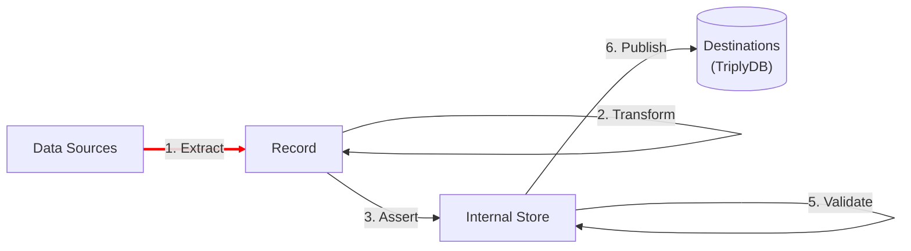

[TOC]

# Extract

The **Extract** step is the first step in any TriplyETL pipeline. It is indicated by the red arrow in the following diagram:

In the Extract step, one or more [extractors](./index.md) are used to create a stream of [records](../generic/record.md) from  a [data source](../sources/index.md). The basic structure of every record in is the same: it does not matter which extractor or which source is used.

## Overview

The following pages cover the Extract step in more detail:

- Extractors are functions that extract a stream of records from a data source in a specific data format. TriplyETL provides one extractor function for each supported data format:

    - [CSV](./csv.md) or Comma-Separated Values
    - [JSON](./json.md) or JavaScript Object Notation
    - [OAI-PMH](./oai-pmh.md) or Open Archives Initiative Protocol for Metadata Harvesting
    - [Postgres](./postgres.md) for PostgreSQL Query & Postgres API Options
    - [RDF](./rdf.md) for Resource Description Format
    - [Shapefile](./shapefile.md) for ESRI Shapefiles
    - [TSV](./tsv.md) for Tab-Separated Values
    - [XLSX](./xlsx.md) for Microsoft Excel
    - [XML](./xml.md) for XML Markup Language

- The [**Record**](../generic/record.md) is an internal representation for records from data sources. This representation is the same, regardless of the extractor/source combination that is used.

## Next steps

The Extract step results in a stream of [records](../generic/record.md) that can be processed in the following steps:

- Step 2 [**Transform**](../transform/index.md) cleans, combines, and extends data in the [record](../generic/record.md).
- Step 3 [**Assert**](../assert/index.md) uses data from the [record](../generic/record.md) to make linked data assertions in the [internal store](../generic/internal-store.md).
