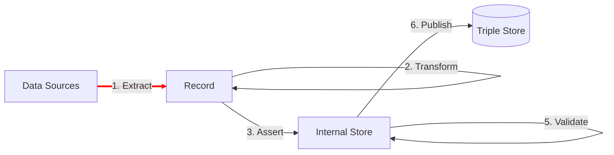

[TOC]

# Extract

The **Extract** step is the first step in any TriplyETL pipeline.  It extracts data in different formats and from different source types.  Examples of data formats are 'Microsoft Excel' and 'JSON'.  Examples of source types are 'file' or 'URL'.  Source data are represented in a uniform Record.

## Overview

The following pages cover the Extract step in detail:

- 1A. [**Data Formats**](/triply-etl/extract/formats) gives an overview of the data formats that are supported by TriplyETL.
- 1B. [**Source Types**](/triply-etl/extract/types) given an overview of the source types that are supported by TriplyETL
- 1C. [**Record**](/triply-etl/extract/record) documents the basic structure of every record in TriplyETL.

## Next steps

The Extract step results in a stream of records.  The basic structure of every Record in TriplyETL is the same.  It does not matter which data format or which source type is used.  Once a stream of Records is generated, the following steps document how data from those records can be used:

- [2. **Transform**](/triply-etl/transform) are applied to the Record to change its contents.
- [3. **Assert**](/triply-etl/assert) use data from the Record to generate linked data in the Internal Store.
