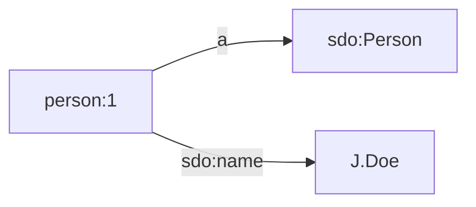
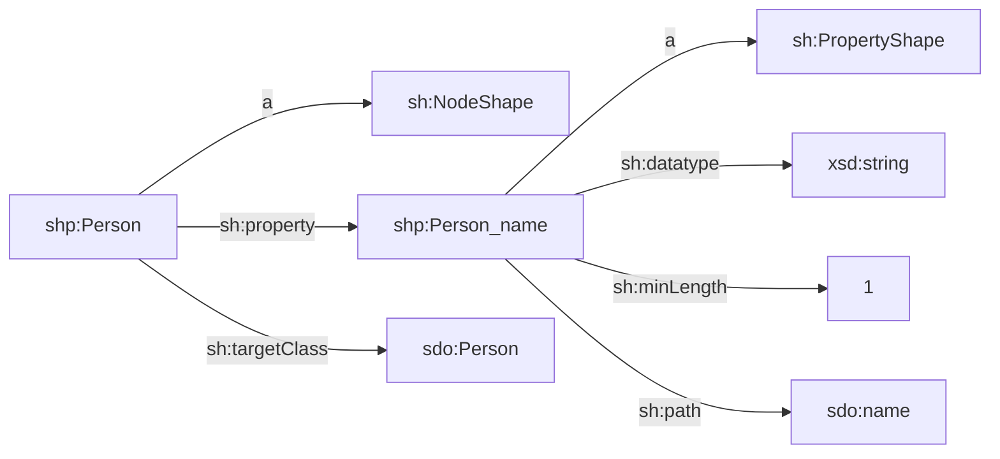

This page documents the different source types that you can use in TriplyETL:

| Source type                             | Description                                |
| --------------------------------------- | ------------------------------------------ |
| [Inline JSON](#inline-json)             | A JSON object or an array of JSON objects. |
| [Strings](#strings)                     | A string serialization of data.            |
| [Local files](#local-files)             | One or more local files that contain data. |
| [Online files or APIs](#online)         | One or more online files that contain data. This includes data from API requests. |
| [TriplyDB assets](#triplydb-assets)     | One or more files stored in TriplyDB ('Assets'). |
| [TriplyDB datasets](#triplydb-datasets) | One or more linked datasets stored in TriplyDB. |
| [TriplyDB queries](#triplydb-queries)   | One or more saved queries in TriplyDB that return data. |


## Inline JSON

In the "Getting Started" section we saw that JSON source data was specified in-line:

```ts
fromJson([
  { id: '123', name: 'John' },
  { id: '456', name: 'Jane' },
]),
```

This works because TriplyETL configurations are implemented in TypeScript, and JSON object can be specified inside TypeScript.  This makes JSON the only source format that can be specified in such a native way inside TriplyETL.

In documentation, we often use in-line JSON sources since it makes code snippets self-contained without having to rely on external data sources such as files.  In production systems such in-line JSON sources are almost never used.


## Strings

String sources are similar to inline JSON, since they can be specified as part of the TriplyETL configuration.  String sources are currently supported by the `fromJson()` source connector, the `loadRdf()` function, and the `validateShacl()` function (see [Validation](/docs/triply-etl/validation)).

The following snippet loads triples into the internal RDF store of TriplyETL:

```ts
loadRdf(Etl.Source.string(`
prefix person: <https://example.com/id/person/>
prefix sdo:    <https://schema.org/>

person:1
  a sdo:Person;
  sdo:name 'J. Doe'.`)),
```

This loads the following triples:



The following example makes RDF source data available to the `validateShacl()` function:

```ts
validateShacl(Etl.Source.string(`
prefix sh:  <http://www.w3.org/ns/shacl#>
prefix shp: <https://example.com/model/shp/>
prefix sdo: <https://schema.org/>

shp:Person
  a sh:NodeShape;
  sh:property shp:Person_name;
  sh:targetClass sdo:Person.

shp:Person_name
  a sh:PropertyShape;
  sh:datatype xsd:string;
  sh:minLength 1;
  sh:path sdo:name.`))
```

This makes the following linked data SHACL specification available:



The following example makes a string source available to the `fromJson()` source connector:

```ts
fromJson(Ratt.Source.string(`
[
  { id: '123', name: 'John' },
  { id: '456', name: 'Jane' }
]`)),
```

Notice that the [inline JSON](#inline-json) source is often a more intuitive specification format for the `fromJson()` source connector than its corresponding string source.


## Local files

While [inline JSON](#inline-json) and [string sources](#strings) are mostly used for small examples, local files are somewhat more widely used.

The following snippet uses a JSON source that is stored in a local file:

```ts
fromJson(Etl.Source.file('./static/example.json')),
```

It is possible to specify an arbitrary number of local files by using array notation:

```ts
fromJson(Etl.Source.file([
  './static/data-001.json',
  './static/data-002.json',
  ...,
  './static/data-999.json',
])),
```

Notice that local files typically not used in production systems, since it is difficult to guarantee that all project partners have exactly the same local files on their computer.  The use of local files that are outdated or only present on the laptop of a colleague that is on holiday are often a good reason to use other source kinds instead.


## Online files or APIs {#online}

The following snippet connects to a JSON source that is stored in a publicly accessible location (URL) on the Internet:

```ts
fromJson(Etl.Source.url('https://somewhere.com/example.json')),
```

If needed, you can configure details about how the HTTP request should be made made.  You can the options that are supported by the [node-fetch library](https://github.com/node-fetch/node-fetch#options) for this.

For example, the following requests private data that uses basic authentication with username/password access:

```ts
fromJson(Etl.Source.url(
  'https://somewhere.com/example.json',
  {
    request: {
      headers: {
        Authorization: `Basic ${username}:${password}`
      }
    }
  }
)),
```

Notice that these HTTP configuring details make it possible to use online APIs as well.  For example, an online API may require specifying a token or other input values in the request body or in specific headers.  Also things like a page number and/or page size may be specified in this way.  However, if you connect to a popular online API, it is often better to use a dedicated connector (e.g. [OAI-PMH](#oai-pmh)).

Online files are typically not used in production pipelines, because the availability of such Internet resources is often outside of the control of the project partners.  Internet resources that are not maintained by the project partners may also be subject to content-wise changes over time, which may affect the production pipeline.

If the project controls the Internet resource, then these risks are smaller.  But at that point it is even better to upload the online files as [TriplyDB asset](#triplydb-assets) for additional benefits such as access controls.

### Raw SPARQL endpoints

A specific kind of online API is a raw SPARQL endpoint.  Unfortunately, raw SPARQL endpoints lack several features that are essential for use in production systems:
- secure access control
- pagination
- reliable retrieval of large resultsets
- API variables
- versioning

These features are all supported by [TriplyDB queries](#triplydb-queries).  It is therefore simpler and safer to use TriplyDB queries.  Still, when used outside of production systems, raw SPARQL endpoints can still be used as regular web APIs.

The following code snippet issues a raw SPARQL query against a public SPARQL endpoint.
Since we specified CSV as the result set format (Media Type `text/csv`), the resultset can be accessed as any other CSV source:

```typescript
fromCsv(
  Etl.Source.url(
    'https://dbpedia.org/sparql',
    {
      request: {
        headers: {
          accept: 'text/csv',
          'content-type': 'application/query-string',
        },
        body: 'select * { ?s ?p ?o. } limit 1',
        method: 'POST',
      },
    }
  )
)
```


## TriplyDB assets {#triplydb-assets}

Assets are a core feature of TriplyDB.  Assets allow arbitrary files to be stored in the context of a linked dataset.  A typical use case for assets is to upload (new versions of) source files.  The TriplyETL pipeline can pick the latest versions of these source files and publish the resulting linked data in the the same dataset.

The following snippet uses a JSON source that is stored in a TriplyDB asset:

```ts
fromJson(
  Etl.Source.TriplyDb.asset(
    'some-account',
    'some-dataset',
    { name: 'example.json' }
  )
),
```

As with other TriplyDB sources, the account name is optional.  When omitted, the user account that is associated with the current API Token is used:

```ts
loadRdf(Etl.Source.TriplyDb.rdf('my-dataset', { name: 'example.json' })),
```

As with other TriplyDB sources, multiple assets can be specified:

```ts
fromCsv([
  Etl.Source.TriplyDb.asset('my-dataset', { name: 'table1.csv' }),
  Etl.Source.TriplyDb.asset('my-dataset', { name: 'table2.csv' }),
]),
```

### Filtering

If the asset name is omitted, *all* assets are returned.  This is often unpractical, since only some assets must be processed.  For example, if a dataset has PDF and JSON assets, only the latter should be processed by the `fromJson()` source connector.

For such use cases the `filter` option can be used instead of the `name` option.  The `filter` option takes a TypeScript function that maps assets names onto Boolean values (true or false).  Only the assets for which the function returns truth are included.

The following snippet processes all and only assets whose name ends in `.json`:

```ts
fromJson(
  Etl.Source.TriplyDb.asset(
    'my-dataset',
    { filter: name => name.endsWith('json') }
  )
),
```

### Versioning

It is possible to upload new versions of an existing TriplyDB asset.  When no specific version is specified, a TriplyETL pipeline will use the latest version automatically.  In order to use a specific version, the `version` option can be set to a version number.

The following snippet uses a specific version of an asset:

```ts
fromJson(
  Etl.Source.TriplyDb.asset(
    'some-account',
    'some-dataset',
    { name: 'example.json', assetVersion: 2 }
  )
),
```

### Access

Since TriplyDB assets are part of a TriplyDB dataset:
- they are accessible under the same access level as the rest of the dataset, and
- they are accessible with the same API Token that allows linked data to be published in that dataset.

Notice that this makes it *easier* and *safer* to deal with source data that is not public.  When private data is retrieved from [online files or APIs](#online), authorization information must be configured at the HTTP level.  This is possible but cumbersome.  And, depending on the authentication approach, it is required to create a new API Token and securely configure that in addition to the TriplyDB API Token.

Notice that access also is more *transparent* when TriplyDB assets are used.  All and only collaborators that have access to the TriplyDB dataset also have access to the source data.  It is clear for all collaborators which source files should be used, and which versions are available.  This is more transparent than having to share (multiple versions of) source files over email or by other indirect means.

### TriplyDB instance {#triplyDb-option}

By default, assets are loaded from the TriplyDB instance that is associated with the currently used API Token.  In some situations it is useful to connect to a linked dataset from a different TriplyDB instance.  This can be configured with the `triplyDb` option.

The following snippet loads the OWL vocabulary from TriplyDB.com.  Notice that the URL of the API must be specified; this is different from the URL of the web-based GUI.

```ts
loadRdf(
  Etl.Source.TriplyDb.rdf(
    'w3c',
    'owl',
    { triplyDb: { url: 'https://triplydb.com' } }
  )
),
```

If an asset is part of a non-public dataset, specifying the URL is insufficient.  In such cases an API Token from this other TriplyDB instance must be created and configured using the `token` option in combination with the `url` option.

### Compression

Source data is often text-based.  This means that such source data can often be compressed to minimize storage space and/or Internet bandwidth.

TriplyETL provides automatic support for the GNU zip (file name extension `*.gz`) compression format.

The following snippet uses a TriplyDB assets that was compressed with GNU zip (file extension `*.gz`):

```ts
fromCsv(
  Etl.Source.TriplyDb.asset(
    'my-dataset',
    { name: 'example.csv.gz' }
  )
),
```


## TriplyDB datasets

Datasets in TriplyDB store linked data in one or more graphs.  Such datasets can be loaded as a TriplyETL source.  The following snippet loads a dataset from TriplyDB into the internal RDF store of TriplyETL:

```ts
loadRdf(Etl.Source.TriplyDb.rdf('my-account', 'my-dataset')),
```

As with other TriplyDB sources, the account name is optional.  When omitted, a dataset from the user account that is associated with the current API Token is used:

```ts
loadRdf(Etl.Source.TriplyDb.rdf('my-dataset')),
```

### Graphs option

By default, all graphs from a linked dataset are loaded.  It is possible to specify a only those graphs that should be loaded.  The following snippet only loads the data model, but not the instance data:

```ts
loadRdf(
  Etl.Source.TriplyDb.rdf(
    'my-account',
    'my-dataset',
    { graphs: ['https://example.com/id/graph/model'] }
  )
),
```

### TriplyDB instance

The `triplyDb` option can be used to specify that a linked dataset from a different TriplyDB instance should be used.  This option works in the same way as for TriplyDB assets: [link](#triplydb-option)


## TriplyDB queries

Saved SPARQL queries in TriplyDB can be used as data sources.  SPARQL queries are very powerful data sources, since they allow complex filters to be expressed.  There are 4 SPARQL query forms, with different source connectors that can process their results:

| Query form         | Source connector          |
| ------------------ | ------------------------- |
| SPARQL `ask`       | [`fromJson()`](#fromJson), [`fromXml()`](#fromXml) |
| SPARQL `construct` | [`loadRdf()`](#loadRdf) |
| SPARQL `describe`  | [`loadRdf()`](#loadRdf) |
| SPARQL `select`    | [`fromCsv()`](#fromCsv), [`fromJson()`](#fromJson), [`fromTsv()`](@fromTsv), [`fromXml()`](#fromXml) |

SPARQL `ask` queries expose JSON or XML.  The following snippet connects to the XML results of an `ask` query in TriplyDB:

```ts
fromXml(Source.TriplyDb.query('my-account', 'my-ask-query')),
```

SPARQL `construct` and `describe` queries both emit linked data (RDF).  This allows them to be used with the `loadRdf()` function.  The following snippet loads the results of a SPARQL query into the internal RDF store of TriplyETL:

```ts
loadRdf(Etl.Source.TriplyDb.query('my-account', 'my-construct-query')),
```

SPARQL `select` queries expose CSV, JSON, TSV, and XML.  This allows them to be used with these four corresponding source connectors.  For example, the following snippet connects to the table returned by a TriplyDB `select` query:

```ts
fromCsv(Etl.Source.TriplyDb.query('my-account', 'my-select-query')),
```

As with other TriplyDB sources, the account name is optional.  When omitted, the user account that is associated with the current API Token is used:

```ts
loadRdf(Etl.Source.TriplyDb.query('my-construct-query')),
```

### Versioning

In production systems, applications must be able to choose whether they want to use the latest version of a query (acceptance mode), or whether they want to use a specific recent version (production mode), or whether they want to use a specific older version (legacy mode).

Versioning is supported by TriplyDB saved queries.  When no specific version is specified, a TriplyETL pipeline will use the latest version of a query automatically.  In order to use a specific version, the `version` option can be set to a version number.

The following snippet uses a specific version of a query:

```ts
fromJson(Etl.Source.TriplyDb.query('my-query', { version: 2 })),
```

Not specifying the `version` option automatically uses the latest version.

### API variables

In production systems, applications often need to request distinct information based on a limited set of input variables.  This is supported in TriplyDB saved queries which API variables.  API variables ensure that the query string is parameterized correctly, while adhering to the RDF and SPARQL standards.

The following example binds the `?country` variable inside the query string to literal `'Holland'`.  This allows the results for Holland to be returned:

```ts
fromCsv(
  Etl.Source.TriplyDb.query(
    'information-about-countries',
    {
      variables: {
        country: 'Holland'
      }
    }
  )
),
```

<!--
#### Dynamic API variables

In [the previous section](#api-variables) the value `'Holland'` for the API variable `country` was known at the time of writing the TriplyETL configuration.  But what do we do if the requested country is not known at the time of writing, but depends on data that is read/transformed during the execution of the TriplyETL pipeline?

In such cases we can use the following [custom middleware](/docs/triply-etl/custom-middlewares) to run the SPARQL query:

```ts
etl.use(
  async (context, next) => {
    const api_variables = {
      country: context.getString('COUNTRY')
    }
    const myQuery = await account.getQuery('my-query')
    for await (const statement of myQuery.results(api_variables).statements()) {
      statement.graph = graph('enrichment')
      context.store.addQuad(statement)
    }
    return next()
  }),
```

In the above example, different countries are specified by data values that are read dynamically from the `COUNTRY` key.  This key can be a column in a table, or an element in XML, or some other dynamic data location, depending on the RATT source that is used.

The following line is used to configure the graph where the results from the queries are stored:

```typescript
statement.graph = graph('enrichment')
```
-->

### Pagination

When a bare SPARQL endpoint is queried as an [online API](#online), there are sometimes issues with retrieving the full resultset for larger queries.  With TriplyDB saved queries, the process of obtaining all results is abstracted away from the user, with the TriplyETL source performing multiple requests in the background as needed.

### Result graph

It is often useful to store the results of SPARQL `construct` and `describe` queries in a specific graph.  For example, when internal data is enriched with external sources, it is often useful to store the external enrichments in a separate graph.  Another example is the use of a query that applies RDF(S) and/or OWL reasoning.  In such cases the results of the reasoner may be stored in a specific graph.

The following snippet stores the results of the specified `construct` query in a special enrichment graph:

```typescript
loadRdf(
  Etl.Source.TriplyDb.query('my-query', { toGraph: graph.enrichment })
)
```

This snippet assumes that the graph names have been declared (see [Delcarations](/docs/triply-etl/declarations#graphs)).

#### TriplyDB instance

The `triplyDb` option can be used to specify that a query from a different TriplyDB instance should be used.  This option works in the same way as for TriplyDB assets: [link](#triplydb-option)
