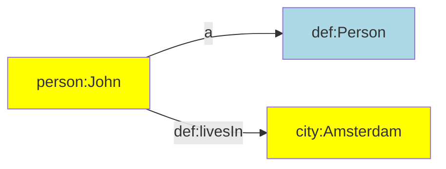
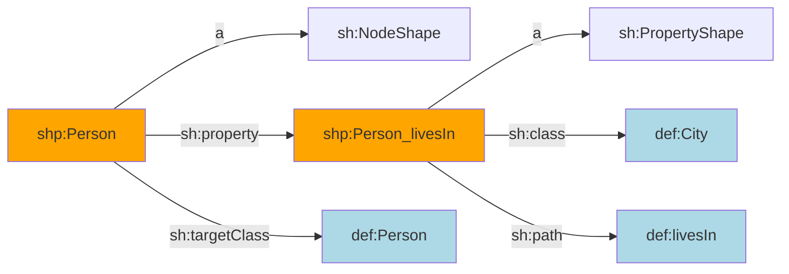

[TOC]

# Declarations

This page documents the declaration functionalities that are supported by TriplyETL.


## Introduction

This section explains what declarations are, and what are the benefits of using them.


### What is a declaration?

A declarations introduces a constant that can be (re)used throughout the rest of the ETL configuration. This is best shown through an example.

The following code snippet asserts that John Doe is a person. It uses the following components that probably occur multiple times in the same ETL configuration:

- The namespace for this dataset is `<https://triplydb.com/my-account/my-dataset/>`.
- The IRI for each person in the dataset starts with `<https://triplydb.com/my-account/my-dataset/id/person/>`.
- The IRI `<http://www.w3.org/1999/02/22-rdf-syntax-ns#type>` is used by the external RDF vocabulary to relate instances to their class.
- The IRI `<http://xmlns.com/foaf/0.1/Person>` is used by the external FOAF vocabulary to denote the set of all persons.

```ts
triple(
  iri('https://triplydb.com/my-account/my-dataset/id/person/john-doe'),
  iri('http://www.w3.org/1999/02/22-rdf-syntax-ns#type'),
  iri('http://xmlns.com/foaf/0.1/Person')
),
```

By using declarations, we can use constants to abbreviate the components that occur many times. This results in the following, identical assertion:

```ts
triple(iri(prefix.person, str('john-doe')), a, foaf.Person),
```


### Why use declarations?

The use of declarations has the following benefits:

1. **Readability**: Shorter expressions are easier to read. See the example from [the previous subsection](#what-is-a-declaration) for an example.
2. **Modularity**: By putting all declarations in one place, it is easy to include them into multiple places in the ETL configuration.
3. **Maintenance**: A configuration change that is made in a declaration immediately becomes available to all the locations in which it is used. This makes it easy to update things like namespaces, that would be cumbersome and error-prone to change in each location of use.
4. **Editor support**: Declarations support auto-complete functionality in text editors. When documentation is included, this is shown alongside the declarations in text editors.


### How to import declaration functionality?

Declaration objects are found in the following modules:

```ts
import { Iri } from '@triplyetl/etl/generic'
import { sdo, owl, sh, skos } from '@triplyetl/etl/vocab'
```


## Base IRI declaration

Within one dataset, it is common for the majority of IRIs to share the same IRI prefix or 'namespace'. It is convenient to declare this shared IRI prefix or namespace once, and use it throughout the rest of the ETL. This most broadly shared IRI prefix is called the *base IRI*.

In TriplyETL, the base IRI is declared in the following way:

```ts
const baseIri = Iri('https://triplydb.com/triply/iris/')
```

Notice that the base IRI that is declared above, is also the location where the dataset that uses this base IRI can be found: <https://triplydb.com/triply/iris/>. This is the *dereferencing principle* of linked data: IRIs are used for both naming ánd locating data.


## Prefix declarations

Linked data uses IRIs for uniquely identifying most data items. Since IRIs can be long and complex, it is common to declare shorter aliases that can be used to abbreviate them. Such aliases are introduced in *prefix declarations*.


### Individual prefix declarations

A new prefix declaration is created by using the `concat()` member function on an existing `IRI` object. The `concat()` function specifies the string that is added to the existing IRI. The added string must meet the syntactic criteria for the *path segment* component in IRI syntax (see [RFC 3987](https://datatracker.ietf.org/doc/html/rfc3987#section-2.2) for the official syntax). It is common practice to end the added string with a forward slash, which ends a path segment in IRI syntax.

Prefix declarations are often based off of the [base IRI](#base-iri-declaration), since that is the prefix IRI that is shared by most IRIs in a dataset.

#### Example

The following code snippet declares a base IRI, and then adds the following two prefix declarations:

1. Alias `prefix_id` abbreviates IRI `<https://triplydb.com/my-account/my-dataset/id/>`, which is used by all IRIs that denote instances.
2. Alias `prefix_model` abbreviates IRI `<https://triplydb.com/my-account/my-dataset/model/>`, which is used by all IRIs that are used in the data model.

```ts
import { Iri } from '@triplyetl/etl/generic'

const baseIri = Iri('https://triplydb.com/my-account/my-dataset/')
const prefix_id = baseIri.concat('id/')
const prefix_model = baseIri.concat('model/')
```


### Prefix declaration tree / IRI strategy

It is common to declare the base IRI declaration and all prefix declarations in one single spot. This consolidates the full *IRI strategy* for a dataset in one place. This is easy for documentation purposes, since all project members can see the full set of IRI prefixes in one place. And this supports optimal reuse of these declarations throughout the ETL configuration.

IRI prefixes form a *tree*:

- The *root* of the tree is the base IRI.
- The *internal nodes* of the tree are prefix declarations that are extended by some other prefix declaration.
- The *external nodes* or *leaves* of the tree are prefix declarations that are not extended by another prefix declaration.

It is common to declare the leaves of the IRI prefix tree in an object, since such an object can be conveniently used to make term assertions throughout the ETL.

#### Example

The following code snippet gives an example of such an IRI prefix tree, where:

- The base IRI is `<https://triplydb.com/my-account/my-dataset/>`.
- The internal nodes are the base IRI, `prefix_id`, and `prefix_model`.
- The leaves are the three prefix declarations that appear in the `prefix` object.

```ts
import { Iri } from '@triplyetl/etl/generic'

const baseIri = Iri('https://triplydb.com/my-account/my-dataset/')
const prefix_id = baseIri.concat('id/')
const prefix_model = baseIri.concat('model/')
const prefix = {
  city: prefix_id.concat('city/'),
  def: prefix_model.concat('def/'),
  person: prefix_id.concat('person/'),
}
```

With the above declarations in place, the following IRI term assertions can be made (see the [iri()](../assert/ratt/terms.md#iri-function) function for more information):

```ts
iri(prefix.city, 'name')
iri(prefix.city, str('Amsterdam')),
iri(prefix.def, str('livesIn')),
iri(prefix.person, 'first name')
iri(prefix.person, str('John')),
```

Static terms can also be expressed with the `concat()` member function:

```ts
prefix.city.concat('Amsterdam')
prefix.def.concat('livesIn')
prefix.person.concat('John')
```

The following statement assertion can be made (see the [triple()](../assert/ratt/statements.md#triple) function for more information). Notice that it is possible to mix (dynamic and static) `iri()` term assertions with IRIs created with `concat()`:

```ts
triple(
  iri(prefix.person, 'first name'),
  iri(prefix.def, str('livesIn')),
  prefix.city.concat('Amsterdam')
),
```

The statement assertion results in the following linked data:

```turtle
<https://triplydb.com/my-account/my-dataset/id/person/John>
<https://triplydb.com/my-account/my-dataset/model/def/livesIn>
<https://triplydb.com/my-account/my-dataset/id/city/Amsterdam>
.
```


<!--
## External prefix declarations

In linked data, it is common to reuse existing vocabularies and datasets. TriplyETL allows you to use popular namespaces from predefined prefix declarations.

Popular namespaces are imported from the vocabulary library:

```ts
import { prefix } from '@triplyetl/etl/vocab'
```

For example, you can use the prefix declaration for DBpedia resources as follows:

```ts
iri(prefix.dbr, 'cityName')
```

This may create IRIs like the following:

```turtle
http://dbpedia.org/resource/Amsterdam
http://dbpedia.org/resource/Berlin
```

You can use the prefix declaration for XML Schema Datatypes as follows:

```ts
literal('cityName', xsd.string)
```

This may create literals like the following:

```turtle
'Amsterdam'^^xsd:string
'Berlin'^^xsd:string
```
-->


## Term declarations

When a term is used in multiple places in the ETL configuration, it is often better to declare it first and (re)use it later. This ensures that changes to the term are applied in every location of use.

We will use the following prefix declaration tree in our examples:

```ts
import { Iri } from '@triplyetl/etl/generic'

const baseIri = Iri('https://triplydb.com/my-account/my-dataset/')
const prefix_id = baseIri.concat('id/')
const prefix_model = baseIri.concat('model/')
const prefix = {
  city: prefix_id.concat('city/'),
  con: prefix_model.concat('con/'),
  def: prefix_model.concat('def/'),
  graph: prefix_id.concat('graph/')),
  person: prefix_id.concat('person/'),
  shp: prefix_model.concat('shp/'),
}
```


### Concept term declarations

Concepts are expressed in linked data with SKOS. Concepts are often (re)used in multiple places, and they often form a fixed collection. This makes terms that denote concepts eligible for a term declaration object.

The following code snippet declares the terms that denote concepts:

```ts
const concept = {
  animal: prefix.con.concat('animal'),
  mammal: prefix.con.concat('mammal'),
}
```

This object can be used through the ETL configuration. For example in the following statement assertion:

```ts
triple(concept.mammal, skos.broader, concept.animal),
```


### Vocabulary term declarations

Classes and properties are expressed in linked data with RDFS/OWL. Classes and properties are often (re)used in multiple places, and they often form a fixed vocabulary. This makes terms that denote classes or properties eligible for a term declaration object.

The following code snippet declares the terms that denote classes and properties:

```ts
const def = {
  City: prefix.def.concat('City'),
  Person: prefix.def.concat('Person'),
  livesIn: prefix.def.concat('livesIn'),
}
```

Vocabulary term declarations can be used in statement assertions, for example:

```ts
triple(iri(prefix.city, 'name'), a, def.City),
pairs(iri(prefix.person, 'first name'),
  [a, def.Person],
  [def.livesIn, iri(prefix.city, 'name')],
),
```

This results in the following linked data:

```turtle
city:Amsterdam a def:City.
person:John
  a def:Person;
  def:livesIn city:Amsterdam.
```

Or diagrammatically:




### Shape term declarations

Shapes are expressed in linked data with SHACL. shapes are often (re)used in multiple places, and they often form a fixed vocabulary. This makes terms that denote shapes eligible for a term declaration object.

The following code snippet declares the terms that denote shapes:

```ts
const shp = {
  City: prefix.shp.concat('City'),
  Person: prefix.shp.concat('Person'),
  Person_livesIn: prefix.shp.concat('livesIn'),
}
```

This object can be used through the ETL configuration. For example in the following statement assertions:

```ts
pairs(shp.Person,
  [a, sh.NodeShape],
  [sh.property, shp.Person_livesIn],
  [sh.targetClass, def.Person],
),
pairs(shp.Person_livesIn,
  [a, sh.PropertyShape],
  [sh.class, def.City],
  [sh.path, def:livesIn],
),
```

This results in the following linked data:

```turtle
shp:Person
  a sh:NodeShape;
  sh:property shp:Person_livesIn;
  sh:targetClass def:Person.
shp:Person_livesIn
  a sh:PropertyShape;
  sh:class def:City;
  sh:path def:livesIn.
```

Or diagrammatically:




### Individual term declarations

Individuals are instances of classes. For example, John Doe is an individual of class `def:Person`; Amsterdam is an individual of class `def:City`. If terms that denote individuals are used multiple times in an ETL configuration, term declarations may be introduced for them.

The following code snippet declares the terms that denote individual persons:

```ts
const person = {
  jane: prefix.person('Jane'),
  john: prefix.person('John'),
  mary: prefix.person('Mary'),
}
```

Instance term declarations can be used in statement assertions, for example:

```ts
triple(person.john, foaf.knows, person.mary),
```

This results in the following linked data:

```turtle
person:john foaf:knows person:mary.
```


### Graph name declarations

Linked data statements belong to graphs. Graphs are denoted by graph names. For example, a graph name may denote a graph that contains metadata statements, while another graph name may denote a graph that contains instance data. If graph names are used multiple times in an ETL configuration, term declarations may be introduced for them.

The following code snippet declares three graph names:

```ts
const graph = {
  metadata: prefix.graph.concat('metadata'),
  model: prefix.graph.concat('model'),
  instances: prefix.graph.concat('instances'),
}
```

The declared graph names can now be used in statement assertions:

```ts
triples(graph.metadata,
  ['_dataset', a, dcat.Dataset],
  ['_dataset', rdfs.label, str('My Dataset')],
),
```


## External vocabularies

In linked data, it is common to reuse existing vocabularies. Popular vocabularies can be imported from the TriplyETL vocabulary library. See the [table of currently supported vocabularies](./vocabularies.md) for a full overview.

The following example imports three vocabularies (FOAF, OWL, PREMIS):

```ts
import { foaf, owl, premis } from '@triplyetl/etl/vocab'
```

This allows you to make the following statement assertion:

```ts
triple(foaf.Person, a, owl.Class),
```

Notice that the notation in TriplyETL comes very close to the notation in the standardized linked data syntax for Turtle, TriG, and SPARQL. For the example above:

```turtle
foaf:Person a owl:Class.
```


### Example: Using the PREMIS external vocabulary

The following code snippet uses the external PREMIS vocabulary. This vocabulary is published by the Library of Congress and is used to publish metadata about the preservation of digital objects. The following code snippet asserts that a PREMIS file is stored in a PREMIS storage location:

```ts
pairs(iri(prefix.file, 'File ID'),
  [a, premis.File],
  [premis.storedAt, iri(prefix.location, 'Location ID')],
),
triple(iri(prefix.location, 'Location ID'), a, premis.StorageLocation),
```


## Language tag declarations

Linked data includes support for *language-tagged strings*. These are literals that specify a string value and a code that denotes the natural language in which that string value should be interpreted.

The natural language tags follow a syntax that is standardized in [RFC 5646](https://datatracker.ietf.org/doc/html/rfc5646), and must occur in the Language Subtag Registry that is maintained by IANA.

TriplyETL includes declarations for these natural language tags. They can be imported as follows:

```ts
import { language } from '@triplyetl/etl/vocab'
```

Language tag declaration can be used in [literal()](../assert/ratt/terms.md) term assertions:

```ts
literal(str('Nederland'), language.nl)
literal(str('Netherlangs'), language.en)
```

Language tag declarations can also be used in [addLiteral()](../transform/ratt.md#addliteral) transformations:

```ts
addLiteral({
  content: 'label',
  languageTag: lang.fr,
  key: '_languageTaggedString',
}),
```


## Shorthand declarations

Shorthands are convenient names that stand for commonly used IRIs. There is one standard shorthand (`a`), and TriplyETL allows other shorthands to be declared as needed.


### The standard shorthand

The standardized linked data syntax for Turtle, TriG, and SPARQL allow the shorthand `a` to be used to stand for the `rdf:type` property. TriplyETL supports this standard shorthand, which can be imported from the vocabulary library:

```ts
import { a } from '@triplyetl/etl/vocab'
```

In the standardized linked data syntax for Turtle, TriG and SPARQL, this shorthand can only be used in the predicate position. This restriction is not enforced in TriplyETL, where the `a` shorthand can be used in the subject, predicate, object, and even graph position.

#### Example

The following code snippet makes a true statement assertion, while using the stands shorthand twice:

```ts
triple(a, a, rdf.Property),
```

This results in the following linked data:

```turtle
rdf:type a rdf:Property.
```


### User-defined shorthands

TriplyETL allows the introduction of arbitrary, user-defined shorthands. User-defined shorthands can make linked data assertions in the ETL configuration more readable for users from certain domains. For example, "is a" is a commonly used phrase [in many modeling languages](https://en.wikipedia.org/wiki/Is-a) to denote the subsumption relation.

#### Example

The following code snippet declares `is_a` as a user-defined shorthand for the `rdfs:subClassOf` property (which is the subsumption relation in linked data):

```ts
import { foaf, rdfs } from '@triplyetl/etl/vocab'
const is_a = rdfs.subClassOf
```

This declaration is used in the following statement assertion:

```ts
triple(foaf.Person, is_a, foaf.Agent),
```

This results in the following linked data:

```turtle
foaf:Person rdfs:subClassOf foaf:Agent.
```


## Geospatial declarations

TriplyETL includes declarations for geospatial coordinate reference systems. These are identified by EPSG codes, and can imported as follows:

```ts
import { epsg } from '@triplyetl/etl/vocab'
```

EPSG codes can be used in geospatial transformation functions like [geojsonToWkt()](../transform/ratt.md#geojsontowkt):

```ts
geojsonToWkt({
  content: 'geojson',
  crs: epsg[28992],
  key: '_wkt',
}),
```
