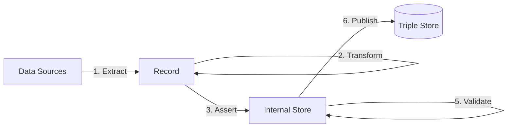

# TriplyETL Overview
TriplyETL allows you to create and maintain production-grade linked data pipelines.

- [Getting Started](getting-started) explains how you can use TriplyETL for the first time.
- [CLI](cli) explains the commands that you can use to manually create, run, and maintain ETL pipelines.
- [Changelog](changelog) documents the changes introduced by each TriplyETL version.
- [Maintenance](maintenance) explains how you can perform updates and configure pipeline automation.

TriplyETL uses the following unique approach:

This approach consists of the following steps (see diagram):

- Step 1 [**Extract**](extract) extracts data records from one or more data sources.
- Step 2 [**Transform**](transform) cleans, combines, and extends data in the Record representation.
- Step 3 [**Assert**](assert) uses data from the Record to generate linked data assertions.
- Step 4 [**Enrich**](enrich) improves or extends linked data in the Internal Store.
- Step 5 [**Validate**](validate) ensures that linked data in the Internal Store is correct.
- Step 6 [**Publish**](publish) makes linked data available in a Triple Store for others to use.

In addition, the following things are used throughout the 6 TriplyETL steps:

- [**Declarations**](declare) introduce constants that you can reuse throughout your TriplyETL configuration.
- [**Control structures**](control) make parts of the TriplyETL configuration optional or repeating (loops).
- [**Debug functions**](debug) allow you to gain insight in TriplyETL internals for the purpose of finding issues and performing maintenance.

TriplyETL uses the following data environments (see diagram):

- The **Data Sources** are used as the input to the pipeline.
- The **Record** provides a uniform format for data from any source system.
- The **Internal Store** holds linked data that is generated inside the pipeline.
- The **Triple Store** is where the results of the pipeline are stored.

<!-- TODO
## Reference

The following pages document all TriplyETL features and configuration options:

- [**Source Connectors**](source-connectors) allows your TriplyETL pipeline to connect to a large number of source systems: relational databases, APIs, spreadsheets, etc.
- [**Declarations**](declarations) allow you to declare and later reuse commonly uses IRI prefixes, graph names, etc.
- Paradigms: TriplyETL supports multiple parasigms for *transforming* source data and *asserting* linked data.
- [**Transformations**](transformations)
  - [**JSON-LD**](transformations/jsonld) Transform records with JSON-LD Frames, assert linked data usong JSON-LD Expansion and Deserialization.
  - [**RATT**](transformations/ratt) RDF All The Things
    - [**Assertions**](transformations/ratt/assertions)
    - [**Transformations**](transformations/ratt/transformations)
  - [**SHACL**](transformations/shacl) Generate additional linked data by applying SHACL Rules.
  - [**SPARQL**](transformations/sparql) Transform from and to linked data (graph-to-graph) with SPARQL Construct and SPARQL Update.
- [**Publication**](publication) allow you to store the output of your TriplyETL pipeline in a data catalog.
- [**Validation**](validation) ensures that data generated by your TriplyETL pipeline conforms to your data model.
  - [**Graph Comparison**](validation/graph-comparison)
  - [**SHACL Validation**](validation/shacl)
- [**Control Structures**](control-structures)
- [**Debugging**](debugging)
- [**Production Systems**](production-systems) allows your TriplyETL pipelines to run in the four DTAP environments that are commonly used in production systems: Development, Testing, Acceptance, and Production.

    - [**Frames**](transformations/jsonld/frames) Transform source data records by applying one or more JSON-LD Frames.
    - [**Expansion**](transformations/jsonld/expansion) Assert linked data by applying JSON-LD Expansion to source data records.
    - [**Tree-shaped data**](transformations/ratt/tree-shaped-data)
    - [**Numeric data**](transformations/ratt/numeric-data)
  - [**RML**](transformations/rml) Perform transformations and assertions with RML.
-->

## Why TriplyETL?

TriplyETL has the following core features, that set it apart from other data pipeline products:

- **Backend-agnostic**: TriplyETL supports a large number of data source formats and types. Source data is processed in a unified record. This decouples configuration from source format specific. In TriplyETL, changing the source system often only requires changing the extractor.
- **Multi-paradigm**: TriplyETL supports all major paradigms for transforming and asserting linked data: SPARQL, SHACL, RML (TBA), JSON-LD (TBA), and RDF All The Things (RATT).  You can also write your own transformations in TypeScript for optimal extensibility.
- **Scalable**: TriplyETL processes data in a stream of self-contained records.  This allows TriplyETL pipelines to run in parallel, ensuring a high pipeline throughput.
- **Standards-compliant**: TriplyETL implements the latest versions of the linked data standards and best practices: RDF 1.1, SHACL Core, SHACL Advanced, XML Schema Datatypes 1.1, IETF RFC3987 (IRIs), IETF RFC5646 (Language Tags), SPARQL 1.1 Query Languahge, SPARQL 1.1 Update, SPARQL 1.1 Federation, N-Triples 1.1, N-Quads 1.1, Turtle 1.1, TriG 1.1, RDF/XML 1.1, JSON-LD 1.1 (TBA), JSON-LD Framing (TBA), and JSON-LD Algorithms (TBA).
- **High Quality**: The output of TriplyETL pipelines is automatically validated against the specified data model, and/or against a set of preconfigured 'gold records'.
- **Production-grade**: TriplyETL pipelines run in GitLab CI/CD, and support the four DTAP environments that are often used in production systems: Development, Testing, Acceptance, Production.
